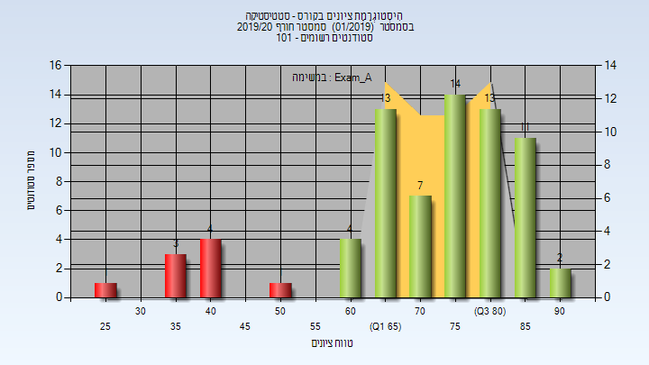

# 00140003 - סטטיסטיקה

**הערה**: מאגר ההיסטוגרמות הוקם עבור [CheeseFork](https://cheesefork.cf/), כלי בניית מערכת שעות עבור סטודנטים בטכניון. באתר בו אתם גולשים ניתן לעיין בהיסטוגרמות, אך הדרך היותר נוחה היא לעיין בהיסטוגרמות, ובמידע נוסף כגון חוות דעת של סטודנטים, באתר CheeseFork.

* [חורף 2024-2025](#202401)
  * [מבחן מועד א'](#202401-Exam_A)
  * [סופי מועד א'](#202401-Final_A)
  * [מבחן מועד ב'](#202401-Exam_B)
  * [סופי מועד ב'](#202401-Final_B)
  * [סופי](#202401-Finals)
* [אביב 2024](#202302)
  * [מבחן מועד א'](#202302-Exam_A)
  * [סופי מועד א'](#202302-Final_A)
  * [מבחן מועד ב'](#202302-Exam_B)
  * [סופי מועד ב'](#202302-Final_B)
  * [סופי](#202302-Finals)
* [חורף 2023-2024](#202301)
  * [מבחן מועד א'](#202301-Exam_A)
  * [סופי מועד א'](#202301-Final_A)
  * [מבחן מועד ב'](#202301-Exam_B)
  * [סופי מועד ב'](#202301-Final_B)
  * [סופי](#202301-Finals)
* [אביב 2023](#202202)
  * [מבחן מועד א'](#202202-Exam_A)
  * [סופי מועד א'](#202202-Final_A)
  * [מבחן מועד ב'](#202202-Exam_B)
  * [סופי מועד ב'](#202202-Final_B)
  * [סופי](#202202-Finals)
* [חורף 2022-2023](#202201)
  * [מבחן מועד א'](#202201-Exam_A)
  * [סופי מועד א'](#202201-Final_A)
  * [מבחן מועד ב'](#202201-Exam_B)
  * [סופי מועד ב'](#202201-Final_B)
  * [סופי](#202201-Finals)
* [אביב 2022](#202102)
  * [מבחן מועד א'](#202102-Exam_A)
  * [סופי מועד א'](#202102-Final_A)
  * [מבחן מועד ב'](#202102-Exam_B)
  * [סופי מועד ב'](#202102-Final_B)
  * [סופי](#202102-Finals)
* [חורף 2021-2022](#202101)
  * [מבחן מועד א'](#202101-Exam_A)
  * [סופי מועד א'](#202101-Final_A)
  * [מבחן מועד ב'](#202101-Exam_B)
  * [סופי מועד ב'](#202101-Final_B)
  * [סופי](#202101-Finals)
* [אביב 2021](#202002)
  * [סופי מועד א'](#202002-Final_A)
  * [מבחן מועד ב'](#202002-Exam_B)
  * [סופי מועד ב'](#202002-Final_B)
  * [סופי](#202002-Finals)
* [חורף 2020-2021](#202001)
  * [מבחן מועד א'](#202001-Exam_A)
  * [סופי מועד א'](#202001-Final_A)
  * [מבחן מועד ב'](#202001-Exam_B)
  * [סופי מועד ב'](#202001-Final_B)
  * [סופי](#202001-Finals)
* [אביב 2020](#201902)
  * [מבחן מועד א'](#201902-Exam_A)
  * [סופי מועד א'](#201902-Final_A)
  * [מבחן מועד ב'](#201902-Exam_B)
  * [סופי מועד ב'](#201902-Final_B)
  * [סופי](#201902-Finals)
* [חורף 2019-2020](#201901)
  * [מבחן מועד א'](#201901-Exam_A)
  * [סופי מועד א'](#201901-Final_A)
  * [מבחן מועד ב'](#201901-Exam_B)
  * [סופי מועד ב'](#201901-Final_B)
  * [סופי](#201901-Finals)
* [אביב 2019](#201802)
  * [מבחן מועד א'](#201802-Exam_A)
  * [סופי מועד א'](#201802-Final_A)
  * [מבחן מועד ב'](#201802-Exam_B)
  * [סופי מועד ב'](#201802-Final_B)
  * [סופי](#201802-Finals)
* [חורף 2018-2019](#201801)
  * [מבחן מועד א'](#201801-Exam_A)
  * [סופי מועד א'](#201801-Final_A)
  * [מבחן מועד ב'](#201801-Exam_B)
  * [סופי מועד ב'](#201801-Final_B)
  * [סופי](#201801-Finals)
* [אביב 2018](#201702)
  * [סופי מועד א'](#201702-Final_A)
  * [סופי מועד ב'](#201702-Final_B)
  * [סופי](#201702-Finals)
* [חורף 2017-2018](#201701)
  * [מבחן מועד א'](#201701-Exam_A)
  * [סופי מועד א'](#201701-Final_A)
  * [סופי מועד ב'](#201701-Final_B)
  * [סופי](#201701-Finals)
* [אביב 2017](#201602)
  * [סופי מועד א'](#201602-Final_A)
  * [סופי מועד ב'](#201602-Final_B)
  * [סופי](#201602-Finals)
* [חורף 2016-2017](#201601)
  * [מבחן מועד א'](#201601-Exam_A)
  * [סופי מועד א'](#201601-Final_A)
  * [מבחן מועד ב'](#201601-Exam_B)
  * [סופי מועד ב'](#201601-Final_B)
  * [סופי](#201601-Finals)
* [חורף 2015-2016](#201501)
  * [סופי מועד א'](#201501-Final_A)
  * [סופי מועד ב'](#201501-Final_B)
  * [סופי](#201501-Finals)
* [קיץ 2015](#201403)
  * [סופי](#201403-Finals)
* [אביב 2015](#201402)
  * [מבחן מועד א'](#201402-Exam_A)
  * [סופי מועד א'](#201402-Final_A)
  * [סופי מועד ב'](#201402-Final_B)
  * [סופי](#201402-Finals)
* [חורף 2014-2015](#201401)
  * [סופי](#201401-Finals)

<h2 id="202401">חורף 2024-2025</h2>

| איש סגל | תפקיד |
| ---- | ---- |
| פישביין ברק | מרצה - אחראי מקצוע |
| פלדמן אלון | מתרגל |
| מזקבנסקי מריהב | מרצה |
| רגב אמיר | מרצה |

<h3 id="202401-Exam_A">מבחן מועד א'</h3>

| סטודנטים | עברו/נכשלו | אחוז עוברים | ציון מינימלי | ציון מקסימלי | ממוצע | חציון |
| ---- | ---- | ---- | ---- | ---- | ---- | ---- |
| 138 | 120/18 | 87 | 16 | 91 | 67.551 | 69 |

<h3 id="202401-Final_A">סופי מועד א'</h3>

| סטודנטים | עברו/נכשלו | אחוז עוברים | ציון מינימלי | ציון מקסימלי | ממוצע | חציון |
| ---- | ---- | ---- | ---- | ---- | ---- | ---- |
| 143 | 131/12 | 92 | 16 | 93 | 75.294 | 77 |

<h3 id="202401-Exam_B">מבחן מועד ב'</h3>

| סטודנטים | עברו/נכשלו | אחוז עוברים | ציון מינימלי | ציון מקסימלי | ממוצע | חציון |
| ---- | ---- | ---- | ---- | ---- | ---- | ---- |
| 42 | 38/4 | 90 | 31 | 91 | 69.833 | 71.5 |

<h3 id="202401-Final_B">סופי מועד ב'</h3>

| סטודנטים | עברו/נכשלו | אחוז עוברים | ציון מינימלי | ציון מקסימלי | ממוצע | חציון |
| ---- | ---- | ---- | ---- | ---- | ---- | ---- |
| 42 | 38/4 | 90 | 31 | 94 | 74.952 | 77 |

<h3 id="202401-Finals">סופי</h3>

| סטודנטים | עברו/נכשלו | אחוז עוברים | ציון מינימלי | ציון מקסימלי | ממוצע | חציון |
| ---- | ---- | ---- | ---- | ---- | ---- | ---- |
| 182 | 162/20 | 89 | 16 | 95 | 77.237 | 78 |

<h2 id="202302">אביב 2024</h2>

| איש סגל | תפקיד |
| ---- | ---- |
| פלדמן אלון | מתרגל |
| פישביין ברק | מרצה - אחראי מקצוע |
| צעירי קובלר קרן | סגל מנהלי - עם הרשאות מרצה אחראי |
| מלכה אופירה | סגל מנהלי - עם הרשאות מרצה אחראי |

<h3 id="202302-Exam_A">מבחן מועד א'</h3>

| סטודנטים | עברו/נכשלו | אחוז עוברים | ציון מינימלי | ציון מקסימלי | ממוצע | חציון |
| ---- | ---- | ---- | ---- | ---- | ---- | ---- |
| 43 | 42/1 | 98 | 33 | 94 | 77.535 | 79 |

<h3 id="202302-Final_A">סופי מועד א'</h3>

| סטודנטים | עברו/נכשלו | אחוז עוברים | ציון מינימלי | ציון מקסימלי | ממוצע | חציון |
| ---- | ---- | ---- | ---- | ---- | ---- | ---- |
| 62 | 59/3 | 95 | 26 | 96 | 79.952 | 83.5 |

<h3 id="202302-Exam_B">מבחן מועד ב'</h3>

| סטודנטים | עברו/נכשלו | אחוז עוברים | ציון מינימלי | ציון מקסימלי | ממוצע | חציון |
| ---- | ---- | ---- | ---- | ---- | ---- | ---- |
| 37 | 35/2 | 95 | 41 | 97 | 73.595 | 72 |

<h3 id="202302-Final_B">סופי מועד ב'</h3>

| סטודנטים | עברו/נכשלו | אחוז עוברים | ציון מינימלי | ציון מקסימלי | ממוצע | חציון |
| ---- | ---- | ---- | ---- | ---- | ---- | ---- |
| 37 | 35/2 | 95 | 41 | 98 | 78.027 | 80 |

<h3 id="202302-Finals">סופי</h3>

| סטודנטים | עברו/נכשלו | אחוז עוברים | ציון מינימלי | ציון מקסימלי | ממוצע | חציון |
| ---- | ---- | ---- | ---- | ---- | ---- | ---- |
| 97 | 93/4 | 96 | 26 | 98 | 79.835 | 82 |

<h2 id="202301">חורף 2023-2024</h2>

| איש סגל | תפקיד |
| ---- | ---- |
| פלדמן אלון | מתרגל |
| פישביין ברק | מרצה - אחראי מקצוע |
| מלכה אופירה | סגל מנהלי - עם הרשאות מרצה אחראי |
| קובלר קרן | סגל מנהלי - עם הרשאות מרצה אחראי |

<h3 id="202301-Exam_A">מבחן מועד א'</h3>

| סטודנטים | עברו/נכשלו | אחוז עוברים | ציון מינימלי | ציון מקסימלי | ממוצע | חציון |
| ---- | ---- | ---- | ---- | ---- | ---- | ---- |
| 40 | 34/6 | 85 | 10 | 102 | 71.7 | 74.5 |

<h3 id="202301-Final_A">סופי מועד א'</h3>

| סטודנטים | עברו/נכשלו | אחוז עוברים | ציון מינימלי | ציון מקסימלי | ממוצע | חציון |
| ---- | ---- | ---- | ---- | ---- | ---- | ---- |
| 40 | 35/5 | 88 | 10 | 100 | 73.771 | 76.721 |

<h3 id="202301-Exam_B">מבחן מועד ב'</h3>

| סטודנטים | עברו/נכשלו | אחוז עוברים | ציון מינימלי | ציון מקסימלי | ממוצע | חציון |
| ---- | ---- | ---- | ---- | ---- | ---- | ---- |
| 21 | 20/1 | 95 | 18 | 98 | 62.429 | 56 |

<h3 id="202301-Final_B">סופי מועד ב'</h3>

| סטודנטים | עברו/נכשלו | אחוז עוברים | ציון מינימלי | ציון מקסימלי | ממוצע | חציון |
| ---- | ---- | ---- | ---- | ---- | ---- | ---- |
| 21 | 20/1 | 95 | 18 | 98.464 | 64.116 | 62.464 |

<h3 id="202301-Finals">סופי</h3>

| סטודנטים | עברו/נכשלו | אחוז עוברים | ציון מינימלי | ציון מקסימלי | ממוצע | חציון |
| ---- | ---- | ---- | ---- | ---- | ---- | ---- |
| 54 | 52/2 | 96 | 18 | 100 | 74.019 | 74 |

<h2 id="202202">אביב 2023</h2>

| איש סגל | תפקיד |
| ---- | ---- |
| פישביין ברק | מרצה - אחראי מקצוע |
| קובלר קרן | סגל מנהלי - עם הרשאות מרצה אחראי |
| מלכה אופירה | סגל מנהלי - עם הרשאות מרצה אחראי |

<h3 id="202202-Exam_A">מבחן מועד א'</h3>

| סטודנטים | עברו/נכשלו | אחוז עוברים | ציון מינימלי | ציון מקסימלי | ממוצע | חציון |
| ---- | ---- | ---- | ---- | ---- | ---- | ---- |
| 116 | 91/25 | 78 | 27 | 94 | 68.517 | 69.5 |

<h3 id="202202-Final_A">סופי מועד א'</h3>

| סטודנטים | עברו/נכשלו | אחוז עוברים | ציון מינימלי | ציון מקסימלי | ממוצע | חציון |
| ---- | ---- | ---- | ---- | ---- | ---- | ---- |
| 116 | 98/18 | 84 | 27 | 95.26 | 73.79 | 77.147 |

<h3 id="202202-Exam_B">מבחן מועד ב'</h3>

| סטודנטים | עברו/נכשלו | אחוז עוברים | ציון מינימלי | ציון מקסימלי | ממוצע | חציון |
| ---- | ---- | ---- | ---- | ---- | ---- | ---- |
| 51 | 46/5 | 90 | 29 | 97 | 76.569 | 81 |

<h3 id="202202-Final_B">סופי מועד ב'</h3>

| סטודנטים | עברו/נכשלו | אחוז עוברים | ציון מינימלי | ציון מקסימלי | ממוצע | חציון |
| ---- | ---- | ---- | ---- | ---- | ---- | ---- |
| 51 | 47/4 | 92 | 29 | 97.9 | 80.293 | 85.214 |

<h3 id="202202-Finals">סופי</h3>

| סטודנטים | עברו/נכשלו | אחוז עוברים | ציון מינימלי | ציון מקסימלי | ממוצע | חציון |
| ---- | ---- | ---- | ---- | ---- | ---- | ---- |
| 149 | 146/3 | 98 | 27 | 98 | 82.065 | 84.5 |

<h2 id="202201">חורף 2022-2023</h2>

| איש סגל | תפקיד |
| ---- | ---- |
| פישביין ברק | מרצה - אחראי מקצוע |
| מלכה אופירה | סגל מנהלי - עם הרשאות מרצה אחראי |
| קובלר קרן | סגל מנהלי - עם הרשאות מרצה אחראי |

<h3 id="202201-Exam_A">מבחן מועד א'</h3>

| סטודנטים | עברו/נכשלו | אחוז עוברים | ציון מינימלי | ציון מקסימלי | ממוצע | חציון |
| ---- | ---- | ---- | ---- | ---- | ---- | ---- |
| 54 | 45/9 | 83 | 28 | 95 | 65.481 | 64.5 |

<h3 id="202201-Final_A">סופי מועד א'</h3>

| סטודנטים | עברו/נכשלו | אחוז עוברים | ציון מינימלי | ציון מקסימלי | ממוצע | חציון |
| ---- | ---- | ---- | ---- | ---- | ---- | ---- |
| 54 | 45/9 | 83 | 28 | 96.156 | 70.034 | 71.0725 |

<h3 id="202201-Exam_B">מבחן מועד ב'</h3>

| סטודנטים | עברו/נכשלו | אחוז עוברים | ציון מינימלי | ציון מקסימלי | ממוצע | חציון |
| ---- | ---- | ---- | ---- | ---- | ---- | ---- |
| 41 | 30/11 | 73 | 8 | 90 | 62.902 | 71 |

<h3 id="202201-Final_B">סופי מועד ב'</h3>

| סטודנטים | עברו/נכשלו | אחוז עוברים | ציון מינימלי | ציון מקסימלי | ממוצע | חציון |
| ---- | ---- | ---- | ---- | ---- | ---- | ---- |
| 41 | 30/11 | 73 | 8 | 91.733 | 65.962 | 75.514 |

<h3 id="202201-Finals">סופי</h3>

| סטודנטים | עברו/נכשלו | אחוז עוברים | ציון מינימלי | ציון מקסימלי | ממוצע | חציון |
| ---- | ---- | ---- | ---- | ---- | ---- | ---- |
| 79 | 69/10 | 87 | 8 | 96 | 72.544 | 77 |

<h2 id="202102">אביב 2022</h2>

| איש סגל | תפקיד |
| ---- | ---- |
| פישביין ברק | מרצה - אחראי מקצוע |
| מלכה אופירה | סגל מנהלי - עם הרשאות מרצה אחראי |
| קובלר קרן | סגל מנהלי - עם הרשאות מרצה אחראי |

<h3 id="202102-Exam_A">מבחן מועד א'</h3>

| סטודנטים | עברו/נכשלו | אחוז עוברים | ציון מינימלי | ציון מקסימלי | ממוצע | חציון |
| ---- | ---- | ---- | ---- | ---- | ---- | ---- |
| 117 | 109/8 | 93 | 37 | 100 | 79.838 | 83 |

<h3 id="202102-Final_A">סופי מועד א'</h3>

| סטודנטים | עברו/נכשלו | אחוז עוברים | ציון מינימלי | ציון מקסימלי | ממוצע | חציון |
| ---- | ---- | ---- | ---- | ---- | ---- | ---- |
| 158 | 112/46 | 71 | 0 | 100 | 61.434 | 80.1645 |

<h3 id="202102-Exam_B">מבחן מועד ב'</h3>

| סטודנטים | עברו/נכשלו | אחוז עוברים | ציון מינימלי | ציון מקסימלי | ממוצע | חציון |
| ---- | ---- | ---- | ---- | ---- | ---- | ---- |
| 39 | 34/5 | 87 | 33 | 98 | 71.795 | 72 |

<h3 id="202102-Final_B">סופי מועד ב'</h3>

| סטודנטים | עברו/נכשלו | אחוז עוברים | ציון מינימלי | ציון מקסימלי | ממוצע | חציון |
| ---- | ---- | ---- | ---- | ---- | ---- | ---- |
| 39 | 34/5 | 87 | 33 | 98.467 | 75.6 | 77.195 |

<h3 id="202102-Finals">סופי</h3>

| סטודנטים | עברו/נכשלו | אחוז עוברים | ציון מינימלי | ציון מקסימלי | ממוצע | חציון |
| ---- | ---- | ---- | ---- | ---- | ---- | ---- |
| 149 | 144/5 | 97 | 33 | 100 | 83.188 | 86 |

<h2 id="202101">חורף 2021-2022</h2>

| איש סגל | תפקיד |
| ---- | ---- |
| פישביין ברק | מרצה - אחראי מקצוע |
| מלכה אופירה | סגל מנהלי - עם הרשאות מרצה אחראי |
| קובלר קרן | סגל מנהלי - עם הרשאות מרצה אחראי |

<h3 id="202101-Exam_A">מבחן מועד א'</h3>

| סטודנטים | עברו/נכשלו | אחוז עוברים | ציון מינימלי | ציון מקסימלי | ממוצע | חציון |
| ---- | ---- | ---- | ---- | ---- | ---- | ---- |
| 56 | 46/10 | 82 | 35 | 98 | 73.125 | 76 |

<h3 id="202101-Final_A">סופי מועד א'</h3>

| סטודנטים | עברו/נכשלו | אחוז עוברים | ציון מינימלי | ציון מקסימלי | ממוצע | חציון |
| ---- | ---- | ---- | ---- | ---- | ---- | ---- |
| 56 | 49/7 | 88 | 35 | 98.514 | 77.976 | 83.2 |

<h3 id="202101-Exam_B">מבחן מועד ב'</h3>

| סטודנטים | עברו/נכשלו | אחוז עוברים | ציון מינימלי | ציון מקסימלי | ממוצע | חציון |
| ---- | ---- | ---- | ---- | ---- | ---- | ---- |
| 25 | 23/2 | 92 | 30 | 89.443 | 71.368 | 74.162 |

<h3 id="202101-Final_B">סופי מועד ב'</h3>

| סטודנטים | עברו/נכשלו | אחוז עוברים | ציון מינימלי | ציון מקסימלי | ממוצע | חציון |
| ---- | ---- | ---- | ---- | ---- | ---- | ---- |
| 25 | 23/2 | 92 | 30 | 92.61 | 75.159 | 79.561 |

<h3 id="202101-Finals">סופי</h3>

| סטודנטים | עברו/נכשלו | אחוז עוברים | ציון מינימלי | ציון מקסימלי | ממוצע | חציון |
| ---- | ---- | ---- | ---- | ---- | ---- | ---- |
| 84 | 79/5 | 94 | 1 | 99 | 77.893 | 82 |

<h2 id="202002">אביב 2021</h2>

| איש סגל | תפקיד |
| ---- | ---- |
| פישביין ברק | מרצה - אחראי מקצוע |
| קובלר קרן | סגל מנהלי - עם הרשאות מרצה אחראי |
| מלכה אופירה | סגל מנהלי - עם הרשאות מרצה אחראי |

<h3 id="202002-Final_A">סופי מועד א'</h3>

| סטודנטים | עברו/נכשלו | אחוז עוברים | ציון מינימלי | ציון מקסימלי | ממוצע | חציון |
| ---- | ---- | ---- | ---- | ---- | ---- | ---- |
| 101 | 91/10 | 90 | 35 | 100 | 79.041 | 81.35 |

<h3 id="202002-Exam_B">מבחן מועד ב'</h3>

| סטודנטים | עברו/נכשלו | אחוז עוברים | ציון מינימלי | ציון מקסימלי | ממוצע | חציון |
| ---- | ---- | ---- | ---- | ---- | ---- | ---- |
| 30 | 17/13 | 57 | 14 | 95 | 56.767 | 58 |

<h3 id="202002-Final_B">סופי מועד ב'</h3>

| סטודנטים | עברו/נכשלו | אחוז עוברים | ציון מינימלי | ציון מקסימלי | ממוצע | חציון |
| ---- | ---- | ---- | ---- | ---- | ---- | ---- |
| 30 | 18/12 | 60 | 14 | 95 | 58.269 | 59.965 |

<h3 id="202002-Finals">סופי</h3>

| סטודנטים | עברו/נכשלו | אחוז עוברים | ציון מינימלי | ציון מקסימלי | ממוצע | חציון |
| ---- | ---- | ---- | ---- | ---- | ---- | ---- |
| 120 | 106/14 | 88 | 14 | 100 | 76.525 | 80 |

<h2 id="202001">חורף 2020-2021</h2>

| איש סגל | תפקיד |
| ---- | ---- |
| פישביין ברק | מרצה - אחראי מקצוע |
| קובלר קרן | סגל מנהלי - עם הרשאות מרצה אחראי |
| מלכה אופירה | סגל מנהלי - עם הרשאות מרצה אחראי |

<h3 id="202001-Exam_A">מבחן מועד א'</h3>

| סטודנטים | עברו/נכשלו | אחוז עוברים | ציון מינימלי | ציון מקסימלי | ממוצע | חציון |
| ---- | ---- | ---- | ---- | ---- | ---- | ---- |
| 87 | 86/1 | 99 | 39 | 98 | 80.851 | 82 |

<h3 id="202001-Final_A">סופי מועד א'</h3>

| סטודנטים | עברו/נכשלו | אחוז עוברים | ציון מינימלי | ציון מקסימלי | ממוצע | חציון |
| ---- | ---- | ---- | ---- | ---- | ---- | ---- |
| 87 | 84/3 | 97 | 39 | 99 | 85.149 | 87 |

<h3 id="202001-Exam_B">מבחן מועד ב'</h3>

| סטודנטים | עברו/נכשלו | אחוז עוברים | ציון מינימלי | ציון מקסימלי | ממוצע | חציון |
| ---- | ---- | ---- | ---- | ---- | ---- | ---- |
| 36 | 32/4 | 89 | 3.917 | 90.207 | 72.815 | 76.2785 |

<h3 id="202001-Final_B">סופי מועד ב'</h3>

| סטודנטים | עברו/נכשלו | אחוז עוברים | ציון מינימלי | ציון מקסימלי | ממוצע | חציון |
| ---- | ---- | ---- | ---- | ---- | ---- | ---- |
| 36 | 34/2 | 94 | 3.917 | 93.145 | 77.872 | 82.2905 |

<h3 id="202001-Finals">סופי</h3>

| סטודנטים | עברו/נכשלו | אחוז עוברים | ציון מינימלי | ציון מקסימלי | ממוצע | חציון |
| ---- | ---- | ---- | ---- | ---- | ---- | ---- |
| 119 | 118/1 | 99 | 49 | 99 | 84.966 | 86 |

<h2 id="201902">אביב 2020</h2>

| איש סגל | תפקיד |
| ---- | ---- |
| פישביין ברק | מרצה - אחראי מקצוע |
| מלכה אופירה | סגל מנהלי - עם הרשאות מרצה אחראי |
| קובלר קרן | סגל מנהלי - עם הרשאות מרצה אחראי |

<h3 id="201902-Exam_A">מבחן מועד א'</h3>

| סטודנטים | עברו/נכשלו | אחוז עוברים | ציון מינימלי | ציון מקסימלי | ממוצע | חציון |
| ---- | ---- | ---- | ---- | ---- | ---- | ---- |
| 100 | 80/20 | 80 | 37.5 | 86.25 | 65.238 | 65 |

<h3 id="201902-Final_A">סופי מועד א'</h3>

| סטודנטים | עברו/נכשלו | אחוז עוברים | ציון מינימלי | ציון מקסימלי | ממוצע | חציון |
| ---- | ---- | ---- | ---- | ---- | ---- | ---- |
| 100 | 88/12 | 88 | 37.5 | 90.375 | 72.482 | 74.625 |

<h3 id="201902-Exam_B">מבחן מועד ב'</h3>

| סטודנטים | עברו/נכשלו | אחוז עוברים | ציון מינימלי | ציון מקסימלי | ממוצע | חציון |
| ---- | ---- | ---- | ---- | ---- | ---- | ---- |
| 59 | 49/10 | 83 | 42.5 | 80 | 62.924 | 65 |

<h3 id="201902-Final_B">סופי מועד ב'</h3>

| סטודנטים | עברו/נכשלו | אחוז עוברים | ציון מינימלי | ציון מקסימלי | ממוצע | חציון |
| ---- | ---- | ---- | ---- | ---- | ---- | ---- |
| 59 | 52/7 | 88 | 42.5 | 85.27 | 69.321 | 71.375 |

<h3 id="201902-Finals">סופי</h3>

| סטודנטים | עברו/נכשלו | אחוז עוברים | ציון מינימלי | ציון מקסימלי | ממוצע | חציון |
| ---- | ---- | ---- | ---- | ---- | ---- | ---- |
| 147 | 141/6 | 96 | 43 | 93 | 74.592 | 76 |

<h2 id="201901">חורף 2019-2020</h2>

| איש סגל | תפקיד |
| ---- | ---- |
| רגב אמיר | מרצה - אחראי מקצוע |
| פישביין ברק | מרצה |

<h3 id="201901-Exam_A">מבחן מועד א'</h3>

| סטודנטים | עברו/נכשלו | אחוז עוברים | ציון מינימלי | ציון מקסימלי | ממוצע | חציון |
| ---- | ---- | ---- | ---- | ---- | ---- | ---- |
| 73 | 64/9 | 88 | 29 | 93.6 | 72.702 | 75.967 |

<h3 id="201901-Final_A">סופי מועד א'</h3>

| סטודנטים | עברו/נכשלו | אחוז עוברים | ציון מינימלי | ציון מקסימלי | ממוצע | חציון |
| ---- | ---- | ---- | ---- | ---- | ---- | ---- |
| 73 | 65/8 | 89 | 29 | 95.52 | 78.551 | 82.64 |

<h3 id="201901-Exam_B">מבחן מועד ב'</h3>

| סטודנטים | עברו/נכשלו | אחוז עוברים | ציון מינימלי | ציון מקסימלי | ממוצע | חציון |
| ---- | ---- | ---- | ---- | ---- | ---- | ---- |
| 20 | 14/6 | 70 | 41 | 89 | 66.55 | 72.5 |

<h3 id="201901-Final_B">סופי מועד ב'</h3>

| סטודנטים | עברו/נכשלו | אחוז עוברים | ציון מינימלי | ציון מקסימלי | ממוצע | חציון |
| ---- | ---- | ---- | ---- | ---- | ---- | ---- |
| 20 | 18/2 | 90 | 41 | 91.2 | 71.293 | 77.5 |

<h3 id="201901-Finals">סופי</h3>

| סטודנטים | עברו/נכשלו | אחוז עוברים | ציון מינימלי | ציון מקסימלי | ממוצע | חציון |
| ---- | ---- | ---- | ---- | ---- | ---- | ---- |
| 88 | 84/4 | 95 | 29 | 96 | 80.602 | 83 |

<h2 id="201802">אביב 2019</h2>

| איש סגל | תפקיד |
| ---- | ---- |
| פישביין ברק | מרצה - אחראי מקצוע |

<h3 id="201802-Exam_A">מבחן מועד א'</h3>

| סטודנטים | עברו/נכשלו | אחוז עוברים | ציון מינימלי | ציון מקסימלי | ממוצע | חציון |
| ---- | ---- | ---- | ---- | ---- | ---- | ---- |
| 124 | 104/20 | 84 | 9 | 100 | 71.298 | 74 |

<h3 id="201802-Final_A">סופי מועד א'</h3>

| סטודנטים | עברו/נכשלו | אחוז עוברים | ציון מינימלי | ציון מקסימלי | ממוצע | חציון |
| ---- | ---- | ---- | ---- | ---- | ---- | ---- |
| 125 | 109/16 | 87 | 0 | 100 | 76.575 | 81.8 |

<h3 id="201802-Exam_B">מבחן מועד ב'</h3>

| סטודנטים | עברו/נכשלו | אחוז עוברים | ציון מינימלי | ציון מקסימלי | ממוצע | חציון |
| ---- | ---- | ---- | ---- | ---- | ---- | ---- |
| 31 | 24/7 | 77 | 40 | 88 | 64.419 | 62 |

<h3 id="201802-Final_B">סופי מועד ב'</h3>

| סטודנטים | עברו/נכשלו | אחוז עוברים | ציון מינימלי | ציון מקסימלי | ממוצע | חציון |
| ---- | ---- | ---- | ---- | ---- | ---- | ---- |
| 31 | 27/4 | 87 | 37.8 | 91.6 | 71.201 | 73.28 |

<h3 id="201802-Finals">סופי</h3>

| סטודנטים | עברו/נכשלו | אחוז עוברים | ציון מינימלי | ציון מקסימלי | ממוצע | חציון |
| ---- | ---- | ---- | ---- | ---- | ---- | ---- |
| 141 | 136/5 | 96 | 38 | 100 | 80.064 | 82 |

<h2 id="201801">חורף 2018-2019</h2>

| איש סגל | תפקיד |
| ---- | ---- |
| רגב אמיר | מרצה - אחראי מקצוע |

<h3 id="201801-Exam_A">מבחן מועד א'</h3>

| סטודנטים | עברו/נכשלו | אחוז עוברים | ציון מינימלי | ציון מקסימלי | ממוצע | חציון |
| ---- | ---- | ---- | ---- | ---- | ---- | ---- |
| 64 | 51/13 | 80 | 43 | 101 | 67.312 | 66 |

<h3 id="201801-Final_A">סופי מועד א'</h3>

| סטודנטים | עברו/נכשלו | אחוז עוברים | ציון מינימלי | ציון מקסימלי | ממוצע | חציון |
| ---- | ---- | ---- | ---- | ---- | ---- | ---- |
| 64 | 60/4 | 94 | 35 | 100 | 74.73 | 74.1 |

<h3 id="201801-Exam_B">מבחן מועד ב'</h3>

| סטודנטים | עברו/נכשלו | אחוז עוברים | ציון מינימלי | ציון מקסימלי | ממוצע | חציון |
| ---- | ---- | ---- | ---- | ---- | ---- | ---- |
| 39 | 25/14 | 64 | 37 | 97 | 65.385 | 61 |

<h3 id="201801-Final_B">סופי מועד ב'</h3>

| סטודנטים | עברו/נכשלו | אחוז עוברים | ציון מינימלי | ציון מקסימלי | ממוצע | חציון |
| ---- | ---- | ---- | ---- | ---- | ---- | ---- |
| 39 | 31/8 | 79 | 37 | 95.9 | 70.432 | 69.05 |

<h3 id="201801-Finals">סופי</h3>

| סטודנטים | עברו/נכשלו | אחוז עוברים | ציון מינימלי | ציון מקסימלי | ממוצע | חציון |
| ---- | ---- | ---- | ---- | ---- | ---- | ---- |
| 99 | 92/7 | 93 | 37 | 100 | 75.818 | 77 |

<h2 id="201702">אביב 2018</h2>

| איש סגל | תפקיד |
| ---- | ---- |
| פישביין ברק | מרצה - אחראי מקצוע |
| חן שמעון | מתרגל |

<h3 id="201702-Final_A">סופי מועד א'</h3>

| סטודנטים | עברו/נכשלו | אחוז עוברים | ציון מינימלי | ציון מקסימלי | ממוצע | חציון |
| ---- | ---- | ---- | ---- | ---- | ---- | ---- |
| 158 | 152/6 | 96 | 22 | 100 | 81.057 | 84 |

<h3 id="201702-Final_B">סופי מועד ב'</h3>

| סטודנטים | עברו/נכשלו | אחוז עוברים | ציון מינימלי | ציון מקסימלי | ממוצע | חציון |
| ---- | ---- | ---- | ---- | ---- | ---- | ---- |
| 18 | 14/4 | 78 | 31 | 92 | 68.222 | 73 |

<h3 id="201702-Finals">סופי</h3>

| סטודנטים | עברו/נכשלו | אחוז עוברים | ציון מינימלי | ציון מקסימלי | ממוצע | חציון |
| ---- | ---- | ---- | ---- | ---- | ---- | ---- |
| 188 | 185/3 | 98 | 28 | 100 | 81.181 | 82 |

<h2 id="201701">חורף 2017-2018</h2>

| איש סגל | תפקיד |
| ---- | ---- |
| פישביין ברק | מרצה - אחראי מקצוע |
| חן שמעון | מתרגל - עם הרשאות מרצה אחראי |

<h3 id="201701-Exam_A">מבחן מועד א'</h3>

| סטודנטים | עברו/נכשלו | אחוז עוברים | ציון מינימלי | ציון מקסימלי | ממוצע | חציון |
| ---- | ---- | ---- | ---- | ---- | ---- | ---- |
| 84 | 69/15 | 82 | 0 | 96 | 68.202 | 72.5 |

<h3 id="201701-Final_A">סופי מועד א'</h3>

| סטודנטים | עברו/נכשלו | אחוז עוברים | ציון מינימלי | ציון מקסימלי | ממוצע | חציון |
| ---- | ---- | ---- | ---- | ---- | ---- | ---- |
| 84 | 74/10 | 88 | 0 | 97 | 75.774 | 82 |

<h3 id="201701-Final_B">סופי מועד ב'</h3>

| סטודנטים | עברו/נכשלו | אחוז עוברים | ציון מינימלי | ציון מקסימלי | ממוצע | חציון |
| ---- | ---- | ---- | ---- | ---- | ---- | ---- |
| 22 | 17/5 | 77 | 0 | 97 | 64.318 | 76 |

<h3 id="201701-Finals">סופי</h3>

| סטודנטים | עברו/נכשלו | אחוז עוברים | ציון מינימלי | ציון מקסימלי | ממוצע | חציון |
| ---- | ---- | ---- | ---- | ---- | ---- | ---- |
| 98 | 97/1 | 99 | 32 | 97 | 81 | 83 |

<h2 id="201602">אביב 2017</h2>

| איש סגל | תפקיד |
| ---- | ---- |
| פישביין ברק | מרצה - אחראי מקצוע |
| חן שמעון | מתרגל |

<h3 id="201602-Final_A">סופי מועד א'</h3>

| סטודנטים | עברו/נכשלו | אחוז עוברים | ציון מינימלי | ציון מקסימלי | ממוצע | חציון |
| ---- | ---- | ---- | ---- | ---- | ---- | ---- |
| 149 | 110/39 | 74 | 6 | 97 | 67.423 | 75 |

<h3 id="201602-Final_B">סופי מועד ב'</h3>

| סטודנטים | עברו/נכשלו | אחוז עוברים | ציון מינימלי | ציון מקסימלי | ממוצע | חציון |
| ---- | ---- | ---- | ---- | ---- | ---- | ---- |
| 48 | 43/5 | 90 | 33 | 88 | 71 | 75 |

<h3 id="201602-Finals">סופי</h3>

| סטודנטים | עברו/נכשלו | אחוז עוברים | ציון מינימלי | ציון מקסימלי | ממוצע | חציון |
| ---- | ---- | ---- | ---- | ---- | ---- | ---- |
| 161 | 151/10 | 94 | 6 | 97 | 75.124 | 78 |

<h2 id="201601">חורף 2016-2017</h2>

| איש סגל | תפקיד |
| ---- | ---- |
| פישביין ברק | מרצה - אחראי מקצוע |
| חן שמעון | מתרגל - עם הרשאות מרצה אחראי |

<h3 id="201601-Exam_A">מבחן מועד א'</h3>

| סטודנטים | עברו/נכשלו | אחוז עוברים | ציון מינימלי | ציון מקסימלי | ממוצע | חציון |
| ---- | ---- | ---- | ---- | ---- | ---- | ---- |
| 72 | 55/17 | 76 | 0 | 94 | 64.931 | 67 |

<h3 id="201601-Final_A">סופי מועד א'</h3>

| סטודנטים | עברו/נכשלו | אחוז עוברים | ציון מינימלי | ציון מקסימלי | ממוצע | חציון |
| ---- | ---- | ---- | ---- | ---- | ---- | ---- |
| 72 | 69/3 | 96 | 28.586 | 95.15 | 75.798 | 78.4715 |

<h3 id="201601-Exam_B">מבחן מועד ב'</h3>

| סטודנטים | עברו/נכשלו | אחוז עוברים | ציון מינימלי | ציון מקסימלי | ממוצע | חציון |
| ---- | ---- | ---- | ---- | ---- | ---- | ---- |
| 30 | 22/8 | 73 | 32 | 99 | 69.367 | 66 |

<h3 id="201601-Final_B">סופי מועד ב'</h3>

| סטודנטים | עברו/נכשלו | אחוז עוברים | ציון מינימלי | ציון מקסימלי | ממוצע | חציון |
| ---- | ---- | ---- | ---- | ---- | ---- | ---- |
| 30 | 25/5 | 83 | 32 | 99 | 74.4 | 75 |

<h3 id="201601-Finals">סופי</h3>

| סטודנטים | עברו/נכשלו | אחוז עוברים | ציון מינימלי | ציון מקסימלי | ממוצע | חציון |
| ---- | ---- | ---- | ---- | ---- | ---- | ---- |
| 83 | 79/4 | 95 | 32 | 99 | 78.928 | 81 |

<h2 id="201501">חורף 2015-2016</h2>

| איש סגל | תפקיד |
| ---- | ---- |
| פישביין ברק | מרצה - אחראי מקצוע |

<h3 id="201501-Final_A">סופי מועד א'</h3>

| סטודנטים | עברו/נכשלו | אחוז עוברים | ציון מינימלי | ציון מקסימלי | ממוצע | חציון |
| ---- | ---- | ---- | ---- | ---- | ---- | ---- |
| 103 | 89/14 | 86 | 17 | 98 | 72.01 | 75 |

<h3 id="201501-Final_B">סופי מועד ב'</h3>

| סטודנטים | עברו/נכשלו | אחוז עוברים | ציון מינימלי | ציון מקסימלי | ממוצע | חציון |
| ---- | ---- | ---- | ---- | ---- | ---- | ---- |
| 59 | 53/6 | 90 | 30 | 98 | 70.051 | 72 |

<h3 id="201501-Finals">סופי</h3>

| סטודנטים | עברו/נכשלו | אחוז עוברים | ציון מינימלי | ציון מקסימלי | ממוצע | חציון |
| ---- | ---- | ---- | ---- | ---- | ---- | ---- |
| 139 | 136/3 | 98 | 41 | 98 | 76.051 | 76 |

<h2 id="201403">קיץ 2015</h2>

| איש סגל | תפקיד |
| ---- | ---- |
| לוין אלה | מרצה - אחראי מקצוע |
| וידר ציפורה | סגל מנהלי - עם הרשאות מרצה אחראי |
| קובלר קרן | סגל מנהלי - עם הרשאות מרצה אחראי |

<h3 id="201403-Finals">סופי</h3>

| סטודנטים | עברו/נכשלו | אחוז עוברים | ציון מינימלי | ציון מקסימלי | ממוצע | חציון |
| ---- | ---- | ---- | ---- | ---- | ---- | ---- |
| 20 | 19/1 | 95 | 43 | 92 | 76.5 | 81 |

<h2 id="201402">אביב 2015</h2>

| איש סגל | תפקיד |
| ---- | ---- |
| פישביין ברק | מרצה - אחראי מקצוע |

<h3 id="201402-Exam_A">מבחן מועד א'</h3>

| סטודנטים | עברו/נכשלו | אחוז עוברים | ציון מינימלי | ציון מקסימלי | ממוצע | חציון |
| ---- | ---- | ---- | ---- | ---- | ---- | ---- |
| 105 | 94/11 | 90 | 38 | 94 | 70.69 | 72.5 |

<h3 id="201402-Final_A">סופי מועד א'</h3>

| סטודנטים | עברו/נכשלו | אחוז עוברים | ציון מינימלי | ציון מקסימלי | ממוצע | חציון |
| ---- | ---- | ---- | ---- | ---- | ---- | ---- |
| 105 | 97/8 | 92 | 38 | 96 | 78.752 | 81 |

<h3 id="201402-Final_B">סופי מועד ב'</h3>

| סטודנטים | עברו/נכשלו | אחוז עוברים | ציון מינימלי | ציון מקסימלי | ממוצע | חציון |
| ---- | ---- | ---- | ---- | ---- | ---- | ---- |
| 61 | 51/10 | 84 | 15 | 94 | 72.098 | 76 |

<h3 id="201402-Finals">סופי</h3>

| סטודנטים | עברו/נכשלו | אחוז עוברים | ציון מינימלי | ציון מקסימלי | ממוצע | חציון |
| ---- | ---- | ---- | ---- | ---- | ---- | ---- |
| 181 | 174/7 | 96 | 15 | 96 | 79.326 | 81 |

<h2 id="201401">חורף 2014-2015</h2>

| איש סגל | תפקיד |
| ---- | ---- |
| פישביין ברק | מרצה - אחראי מקצוע |

<h3 id="201401-Finals">סופי</h3>

| סטודנטים | עברו/נכשלו | אחוז עוברים | ציון מינימלי | ציון מקסימלי | ממוצע | חציון |
| ---- | ---- | ---- | ---- | ---- | ---- | ---- |
| 203 | 193/10 | 95 | 28 | 98 | 74.872 | 77 |

