# 00140005 - מעבדה הנדסית

**הערה**: מאגר ההיסטוגרמות הוקם עבור [CheeseFork](https://cheesefork.cf/), כלי בניית מערכת שעות עבור סטודנטים בטכניון. באתר בו אתם גולשים ניתן לעיין בהיסטוגרמות, אך הדרך היותר נוחה היא לעיין בהיסטוגרמות, ובמידע נוסף כגון חוות דעת של סטודנטים, באתר CheeseFork.

* [חורף 2024-2025](#202401)
  * [מבחן מועד א'](#202401-Exam_A)
  * [סופי מועד א'](#202401-Final_A)
* [חורף 2023-2024](#202301)
  * [סופי מועד א'](#202301-Final_A)
  * [סופי](#202301-Finals)
* [קיץ 2023](#202203)
  * [סופי מועד א'](#202203-Final_A)
  * [סופי](#202203-Finals)
* [אביב 2023](#202202)
  * [סופי מועד א'](#202202-Final_A)
  * [סופי](#202202-Finals)
* [חורף 2022-2023](#202201)
  * [סופי מועד א'](#202201-Final_A)
  * [סופי](#202201-Finals)
* [קיץ 2022](#202103)
  * [סופי מועד א'](#202103-Final_A)
  * [סופי](#202103-Finals)
* [אביב 2022](#202102)
  * [סופי מועד א'](#202102-Final_A)
  * [סופי](#202102-Finals)
* [חורף 2021-2022](#202101)
  * [סופי מועד א'](#202101-Final_A)
  * [סופי](#202101-Finals)
* [קיץ 2021](#202003)
  * [סופי מועד ב'](#202003-Final_B)
  * [סופי](#202003-Finals)
* [אביב 2021](#202002)
  * [סופי מועד א'](#202002-Final_A)
  * [סופי](#202002-Finals)
* [חורף 2020-2021](#202001)
  * [סופי מועד א'](#202001-Final_A)
  * [סופי מועד ב'](#202001-Final_B)
  * [סופי](#202001-Finals)
* [קיץ 2020](#201903)
  * [סופי מועד א'](#201903-Final_A)
  * [סופי](#201903-Finals)
* [אביב 2020](#201902)
  * [סופי מועד א'](#201902-Final_A)
  * [סופי](#201902-Finals)
* [חורף 2019-2020](#201901)
  * [סופי מועד א'](#201901-Final_A)
  * [סופי](#201901-Finals)
* [קיץ 2019](#201803)
  * [סופי מועד א'](#201803-Final_A)
  * [סופי](#201803-Finals)
* [אביב 2019](#201802)
  * [סופי מועד א'](#201802-Final_A)
  * [סופי](#201802-Finals)
* [חורף 2018-2019](#201801)
  * [סופי מועד א'](#201801-Final_A)
  * [סופי](#201801-Finals)
* [אביב 2018](#201702)
  * [סופי מועד א'](#201702-Final_A)
  * [סופי](#201702-Finals)
* [חורף 2017-2018](#201701)
  * [סופי מועד א'](#201701-Final_A)
  * [סופי](#201701-Finals)
* [קיץ 2017](#201603)
  * [סופי מועד א'](#201603-Final_A)
  * [סופי](#201603-Finals)
* [חורף 2016-2017](#201601)
  * [סופי מועד א'](#201601-Final_A)
  * [סופי](#201601-Finals)

<h2 id="202401">חורף 2024-2025</h2>

| איש סגל | תפקיד |
| ---- | ---- |
| ז'וטובסקי סמיון | מרצה - אחראי מקצוע |
| שביט שרית | סגל מנהלי - עם הרשאות מרצה אחראי |

<h3 id="202401-Exam_A">מבחן מועד א'</h3>

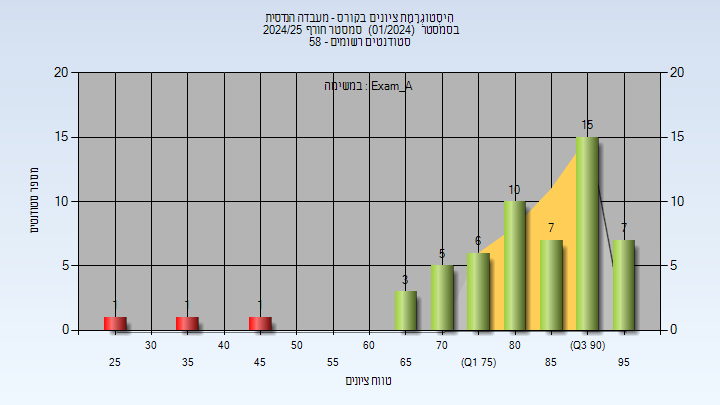

| סטודנטים | עברו/נכשלו | אחוז עוברים | ציון מינימלי | ציון מקסימלי | ממוצע | חציון |
| ---- | ---- | ---- | ---- | ---- | ---- | ---- |
| 56 | 53/3 | 95 | 26 | 97 | 82.679 | 85 |

<h3 id="202401-Final_A">סופי מועד א'</h3>

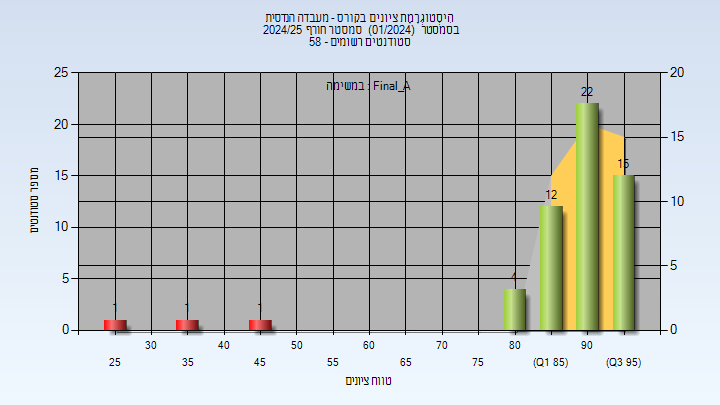

| סטודנטים | עברו/נכשלו | אחוז עוברים | ציון מינימלי | ציון מקסימלי | ממוצע | חציון |
| ---- | ---- | ---- | ---- | ---- | ---- | ---- |
| 56 | 53/3 | 95 | 26 | 98 | 88.663 | 92 |

<h2 id="202301">חורף 2023-2024</h2>

| איש סגל | תפקיד |
| ---- | ---- |
| ז'וטובסקי סמיון | מרצה - אחראי מקצוע |
| לוינסקי יעל | סגל מנהלי - עם הרשאות מרצה אחראי |
| שביט שרית | סגל מנהלי - עם הרשאות מרצה אחראי |
| צאצאשוילי תמי | סגל מנהלי - עם הרשאות מרצה אחראי |
| בן-סימון ציפורה | סגל מנהלי - עם הרשאות מרצה אחראי |

<h3 id="202301-Final_A">סופי מועד א'</h3>

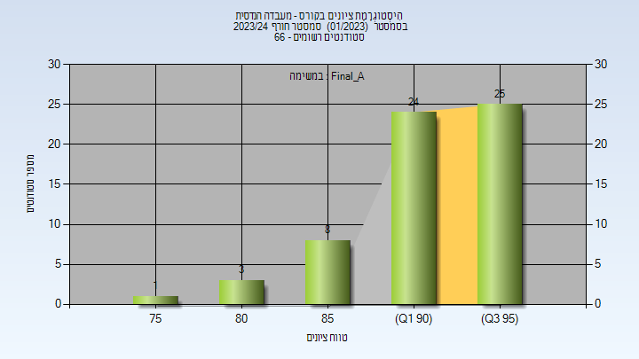

| סטודנטים | עברו/נכשלו | אחוז עוברים | ציון מינימלי | ציון מקסימלי | ממוצע | חציון |
| ---- | ---- | ---- | ---- | ---- | ---- | ---- |
| 61 | 61/0 | 100 | 79 | 98 | 92.738 | 94 |

<h3 id="202301-Finals">סופי</h3>

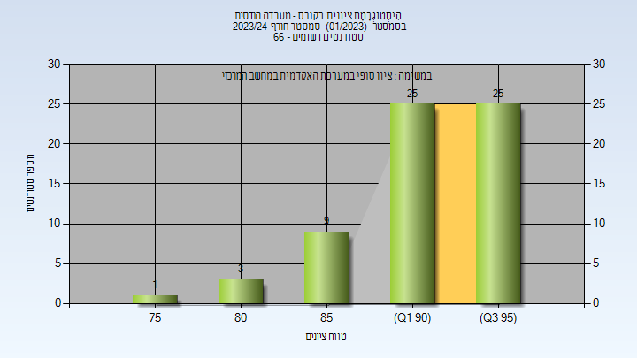

| סטודנטים | עברו/נכשלו | אחוז עוברים | ציון מינימלי | ציון מקסימלי | ממוצע | חציון |
| ---- | ---- | ---- | ---- | ---- | ---- | ---- |
| 63 | 63/0 | 100 | 79 | 98 | 92.683 | 94 |

<h2 id="202203">קיץ 2023</h2>

| איש סגל | תפקיד |
| ---- | ---- |
| ז'וטובסקי סמיון | מרצה - אחראי מקצוע |
| שביט שרית | סגל מנהלי - עם הרשאות מרצה אחראי |
| צאצאשוילי תמי | סגל מנהלי - עם הרשאות מרצה אחראי |

<h3 id="202203-Final_A">סופי מועד א'</h3>

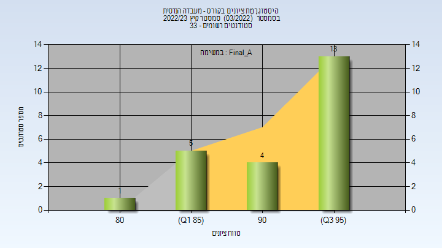

| סטודנטים | עברו/נכשלו | אחוז עוברים | ציון מינימלי | ציון מקסימלי | ממוצע | חציון |
| ---- | ---- | ---- | ---- | ---- | ---- | ---- |
| 23 | 23/0 | 100 | 81 | 99 | 92.957 | 95 |

<h3 id="202203-Finals">סופי</h3>

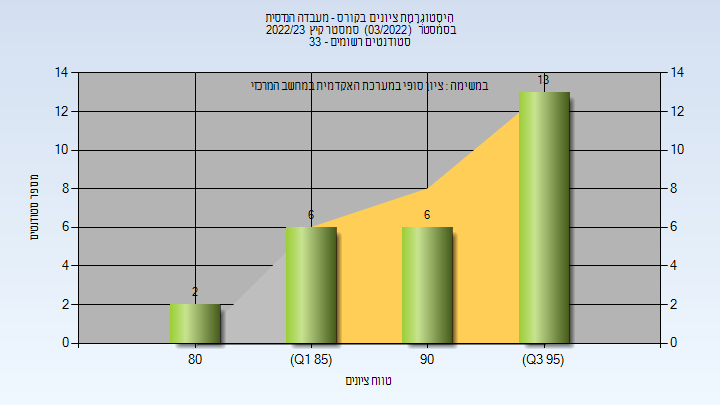

| סטודנטים | עברו/נכשלו | אחוז עוברים | ציון מינימלי | ציון מקסימלי | ממוצע | חציון |
| ---- | ---- | ---- | ---- | ---- | ---- | ---- |
| 27 | 27/0 | 100 | 81 | 99 | 92.519 | 93 |

<h2 id="202202">אביב 2023</h2>

| איש סגל | תפקיד |
| ---- | ---- |
| ז'וטובסקי סמיון | מרצה - אחראי מקצוע |
| צאצאשוילי תמי | סגל מנהלי - עם הרשאות מרצה אחראי |
| בן-סימון ציפורה | סגל מנהלי - עם הרשאות מרצה אחראי |
| שביט שרית | סגל מנהלי - עם הרשאות מרצה אחראי |
| לוינסקי יעל | סגל מנהלי - עם הרשאות מרצה אחראי |

<h3 id="202202-Final_A">סופי מועד א'</h3>

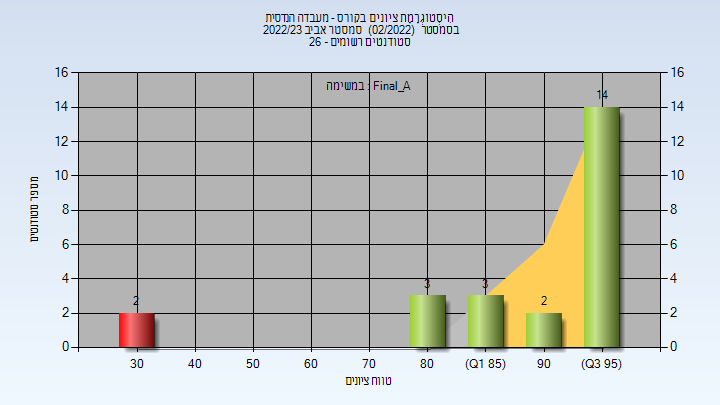

| סטודנטים | עברו/נכשלו | אחוז עוברים | ציון מינימלי | ציון מקסימלי | ממוצע | חציון |
| ---- | ---- | ---- | ---- | ---- | ---- | ---- |
| 24 | 22/2 | 92 | 30 | 98 | 88.042 | 95.5 |

<h3 id="202202-Finals">סופי</h3>

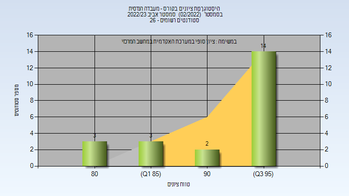

| סטודנטים | עברו/נכשלו | אחוז עוברים | ציון מינימלי | ציון מקסימלי | ממוצע | חציון |
| ---- | ---- | ---- | ---- | ---- | ---- | ---- |
| 22 | 22/0 | 100 | 83 | 98 | 93.227 | 96 |

<h2 id="202201">חורף 2022-2023</h2>

| איש סגל | תפקיד |
| ---- | ---- |
| ז'וטובסקי סמיון | מרצה - אחראי מקצוע |
| צאצאשוילי תמי | סגל מנהלי - עם הרשאות מרצה אחראי |
| בן-סימון ציפורה | סגל מנהלי - עם הרשאות מרצה אחראי |
| שביט שרית | סגל מנהלי - עם הרשאות מרצה אחראי |
| לוינסקי יעל | סגל מנהלי - עם הרשאות מרצה אחראי |

<h3 id="202201-Final_A">סופי מועד א'</h3>

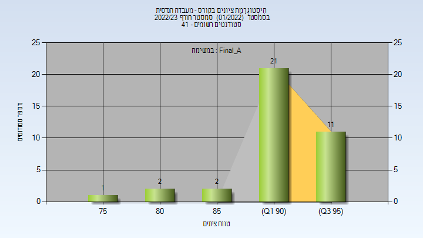

| סטודנטים | עברו/נכשלו | אחוז עוברים | ציון מינימלי | ציון מקסימלי | ממוצע | חציון |
| ---- | ---- | ---- | ---- | ---- | ---- | ---- |
| 37 | 37/0 | 100 | 77 | 98 | 91.784 | 93 |

<h3 id="202201-Finals">סופי</h3>

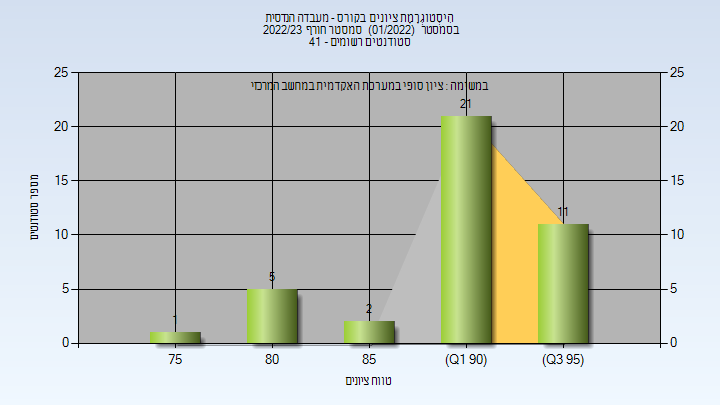

| סטודנטים | עברו/נכשלו | אחוז עוברים | ציון מינימלי | ציון מקסימלי | ממוצע | חציון |
| ---- | ---- | ---- | ---- | ---- | ---- | ---- |
| 40 | 40/0 | 100 | 77 | 98 | 90.925 | 92 |

<h2 id="202103">קיץ 2022</h2>

| איש סגל | תפקיד |
| ---- | ---- |
| ז'וטובסקי סמיון | מרצה - אחראי מקצוע |
| צאצאשוילי תמי | סגל מנהלי - עם הרשאות מרצה אחראי |
| לוינסקי יעל | סגל מנהלי - עם הרשאות מרצה אחראי |
| שביט שרית | סגל מנהלי - עם הרשאות מרצה אחראי |

<h3 id="202103-Final_A">סופי מועד א'</h3>

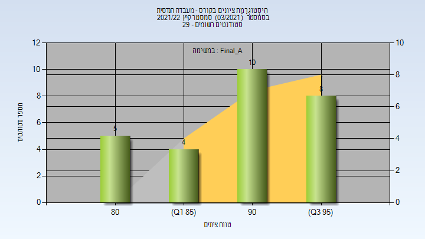

| סטודנטים | עברו/נכשלו | אחוז עוברים | ציון מינימלי | ציון מקסימלי | ממוצע | חציון |
| ---- | ---- | ---- | ---- | ---- | ---- | ---- |
| 27 | 27/0 | 100 | 82 | 99 | 91.222 | 92 |

<h3 id="202103-Finals">סופי</h3>

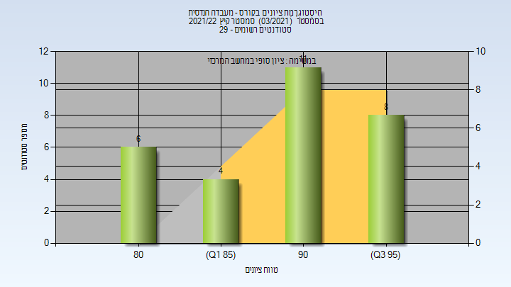

| סטודנטים | עברו/נכשלו | אחוז עוברים | ציון מינימלי | ציון מקסימלי | ממוצע | חציון |
| ---- | ---- | ---- | ---- | ---- | ---- | ---- |
| 29 | 29/0 | 100 | 82 | 99 | 91.034 | 92 |

<h2 id="202102">אביב 2022</h2>

| איש סגל | תפקיד |
| ---- | ---- |
| ז'וטובסקי סמיון | מרצה - אחראי מקצוע |
| בן-סימון ציפורה | סגל מנהלי - עם הרשאות מרצה אחראי |
| צאצאשוילי תמי | סגל מנהלי - עם הרשאות מרצה אחראי |
| לוינסקי יעל | סגל מנהלי - עם הרשאות מרצה אחראי |
| שביט שרית | סגל מנהלי - עם הרשאות מרצה אחראי |

<h3 id="202102-Final_A">סופי מועד א'</h3>

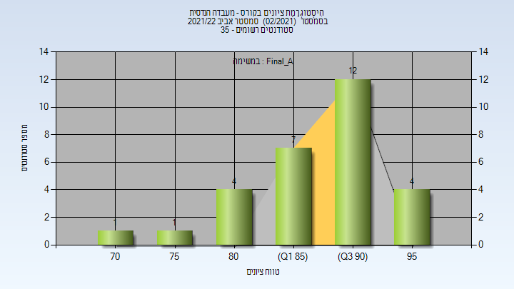

| סטודנטים | עברו/נכשלו | אחוז עוברים | ציון מינימלי | ציון מקסימלי | ממוצע | חציון |
| ---- | ---- | ---- | ---- | ---- | ---- | ---- |
| 29 | 29/0 | 100 | 70 | 98 | 88.862 | 90 |

<h3 id="202102-Finals">סופי</h3>

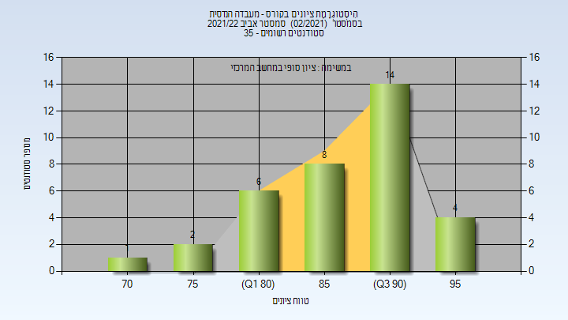

| סטודנטים | עברו/נכשלו | אחוז עוברים | ציון מינימלי | ציון מקסימלי | ממוצע | חציון |
| ---- | ---- | ---- | ---- | ---- | ---- | ---- |
| 35 | 35/0 | 100 | 70 | 98 | 88.2 | 89 |

<h2 id="202101">חורף 2021-2022</h2>

| איש סגל | תפקיד |
| ---- | ---- |
| ז'וטובסקי סמיון | מרצה - אחראי מקצוע |
| לוינסקי יעל | סגל מנהלי - עם הרשאות מרצה אחראי |
| בן-סימון ציפורה | סגל מנהלי - עם הרשאות מרצה אחראי |
| שביט שרית | סגל מנהלי - עם הרשאות מרצה אחראי |
| צאצאשוילי תמי | סגל מנהלי - עם הרשאות מרצה אחראי |

<h3 id="202101-Final_A">סופי מועד א'</h3>

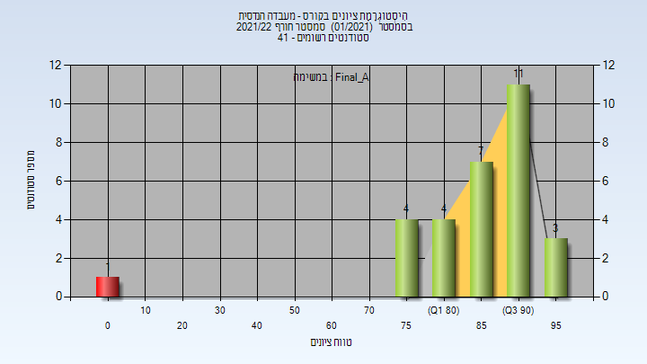

| סטודנטים | עברו/נכשלו | אחוז עוברים | ציון מינימלי | ציון מקסימלי | ממוצע | חציון |
| ---- | ---- | ---- | ---- | ---- | ---- | ---- |
| 30 | 29/1 | 97 | 0 | 96 | 84.662 | 87.5 |

<h3 id="202101-Finals">סופי</h3>

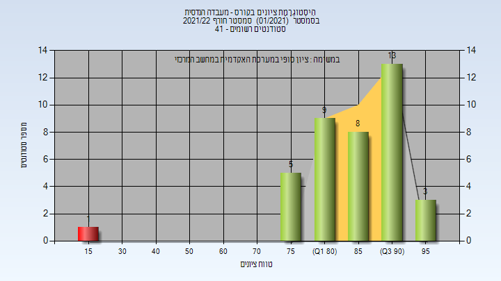

| סטודנטים | עברו/נכשלו | אחוז עוברים | ציון מינימלי | ציון מקסימלי | ממוצע | חציון |
| ---- | ---- | ---- | ---- | ---- | ---- | ---- |
| 39 | 38/1 | 97 | 19 | 96 | 84.974 | 86 |

<h2 id="202003">קיץ 2021</h2>

| איש סגל | תפקיד |
| ---- | ---- |
| סבח אדם | מרצה - אחראי מקצוע |
| שביט שרית | סגל מנהלי - עם הרשאות מרצה אחראי |
| לוינסקי יעל | סגל מנהלי - עם הרשאות מרצה אחראי |
| צאצאשוילי תמי | סגל מנהלי - עם הרשאות מרצה אחראי |
| בן-סימון ציפורה | סגל מנהלי - עם הרשאות מרצה אחראי |

<h3 id="202003-Final_B">סופי מועד ב'</h3>

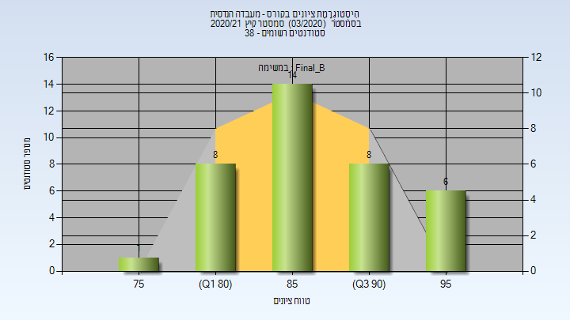

| סטודנטים | עברו/נכשלו | אחוז עוברים | ציון מינימלי | ציון מקסימלי | ממוצע | חציון |
| ---- | ---- | ---- | ---- | ---- | ---- | ---- |
| 37 | 37/0 | 100 | 79.417 | 98.8 | 88.742 | 88.65 |

<h3 id="202003-Finals">סופי</h3>

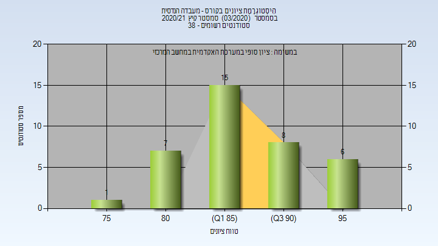

| סטודנטים | עברו/נכשלו | אחוז עוברים | ציון מינימלי | ציון מקסימלי | ממוצע | חציון |
| ---- | ---- | ---- | ---- | ---- | ---- | ---- |
| 37 | 37/0 | 100 | 79 | 99 | 88.757 | 89 |

<h2 id="202002">אביב 2021</h2>

| איש סגל | תפקיד |
| ---- | ---- |
| ז'וטובסקי סמיון | מרצה - אחראי מקצוע |
| צאצאשוילי תמי | סגל מנהלי - עם הרשאות מרצה אחראי |
| בן-סימון ציפורה | סגל מנהלי - עם הרשאות מרצה אחראי |
| בלסברג עליזה | סגל מנהלי - עם הרשאות מרצה אחראי |
| לוינסקי יעל | סגל מנהלי - עם הרשאות מרצה אחראי |
| שביט שרית | סגל מנהלי - עם הרשאות מרצה אחראי |

<h3 id="202002-Final_A">סופי מועד א'</h3>

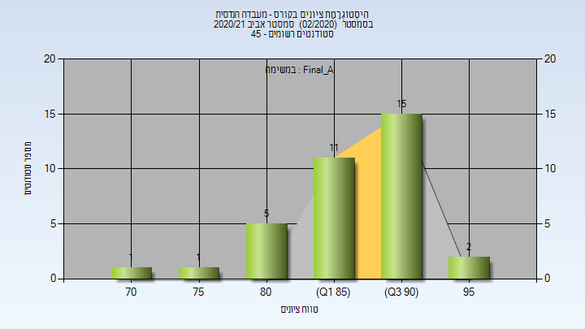

| סטודנטים | עברו/נכשלו | אחוז עוברים | ציון מינימלי | ציון מקסימלי | ממוצע | חציון |
| ---- | ---- | ---- | ---- | ---- | ---- | ---- |
| 35 | 35/0 | 100 | 73.567 | 97.717 | 89.229 | 89.533 |

<h3 id="202002-Finals">סופי</h3>

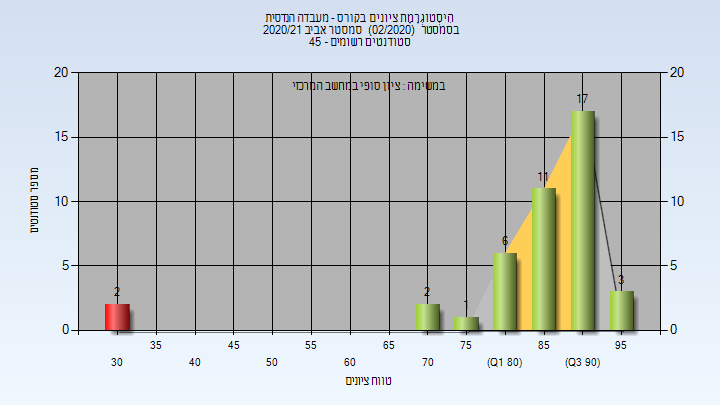

| סטודנטים | עברו/נכשלו | אחוז עוברים | ציון מינימלי | ציון מקסימלי | ממוצע | חציון |
| ---- | ---- | ---- | ---- | ---- | ---- | ---- |
| 42 | 40/2 | 95 | 32 | 98 | 85.714 | 89 |

<h2 id="202001">חורף 2020-2021</h2>

| איש סגל | תפקיד |
| ---- | ---- |
| ז'וטובסקי סמיון | מרצה - אחראי מקצוע |
| צאצאשוילי תמי | סגל מנהלי - עם הרשאות מרצה אחראי |
| שביט שרית | סגל מנהלי - עם הרשאות מרצה אחראי |

<h3 id="202001-Final_A">סופי מועד א'</h3>

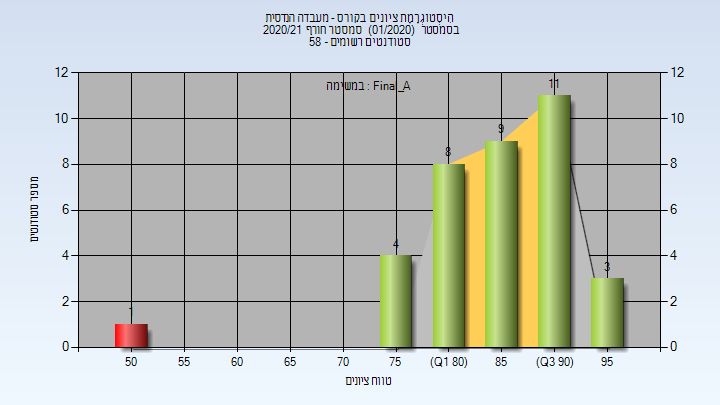

| סטודנטים | עברו/נכשלו | אחוז עוברים | ציון מינימלי | ציון מקסימלי | ממוצע | חציון |
| ---- | ---- | ---- | ---- | ---- | ---- | ---- |
| 36 | 35/1 | 97 | 50 | 99 | 86.194 | 87.5 |

<h3 id="202001-Final_B">סופי מועד ב'</h3>

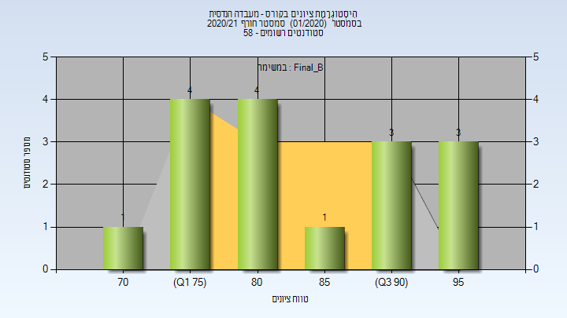

| סטודנטים | עברו/נכשלו | אחוז עוברים | ציון מינימלי | ציון מקסימלי | ממוצע | חציון |
| ---- | ---- | ---- | ---- | ---- | ---- | ---- |
| 16 | 16/0 | 100 | 73 | 95 | 85.25 | 83.5 |

<h3 id="202001-Finals">סופי</h3>

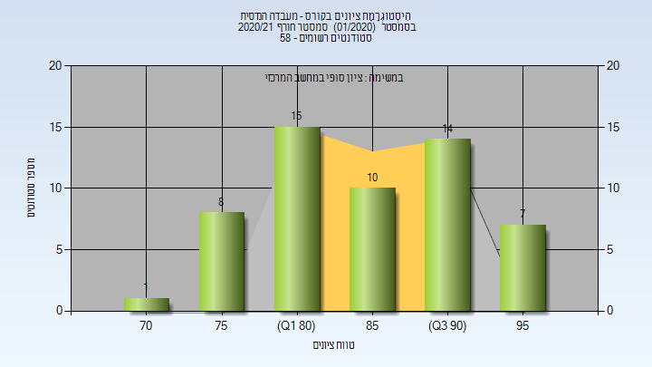

| סטודנטים | עברו/נכשלו | אחוז עוברים | ציון מינימלי | ציון מקסימלי | ממוצע | חציון |
| ---- | ---- | ---- | ---- | ---- | ---- | ---- |
| 55 | 55/0 | 100 | 73 | 99 | 86.418 | 86 |

<h2 id="201903">קיץ 2020</h2>

| איש סגל | תפקיד |
| ---- | ---- |
| נחום שי | מרצה - אחראי מקצוע |
| שביט שרית | סגל מנהלי - עם הרשאות מרצה אחראי |
| צאצאשוילי תמי | סגל מנהלי - עם הרשאות מרצה אחראי |

<h3 id="201903-Final_A">סופי מועד א'</h3>

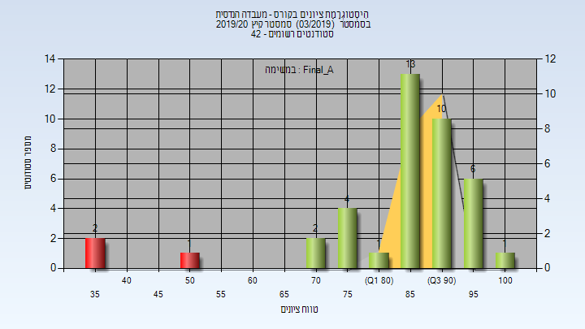

| סטודנטים | עברו/נכשלו | אחוז עוברים | ציון מינימלי | ציון מקסימלי | ממוצע | חציון |
| ---- | ---- | ---- | ---- | ---- | ---- | ---- |
| 40 | 37/3 | 92 | 37 | 100 | 84.974 | 89.3335 |

<h3 id="201903-Finals">סופי</h3>

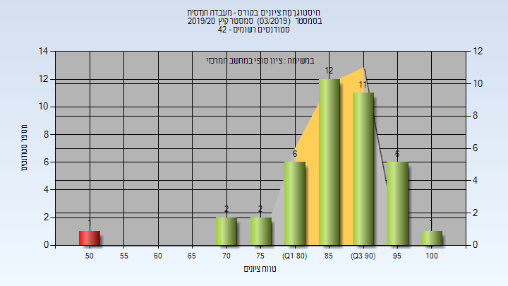

| סטודנטים | עברו/נכשלו | אחוז עוברים | ציון מינימלי | ציון מקסימלי | ממוצע | חציון |
| ---- | ---- | ---- | ---- | ---- | ---- | ---- |
| 41 | 40/1 | 98 | 51 | 100 | 87.122 | 89 |

<h2 id="201902">אביב 2020</h2>

| איש סגל | תפקיד |
| ---- | ---- |
| ז'וטובסקי סמיון | מרצה - אחראי מקצוע |
| שביט שרית | סגל מנהלי - עם הרשאות מרצה אחראי |
| צאצאשוילי תמי | סגל מנהלי - עם הרשאות מרצה אחראי |

<h3 id="201902-Final_A">סופי מועד א'</h3>

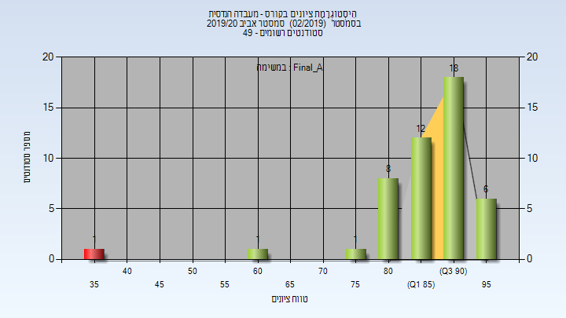

| סטודנטים | עברו/נכשלו | אחוז עוברים | ציון מינימלי | ציון מקסימלי | ממוצע | חציון |
| ---- | ---- | ---- | ---- | ---- | ---- | ---- |
| 47 | 46/1 | 98 | 39 | 97 | 87.591 | 89 |

<h3 id="201902-Finals">סופי</h3>

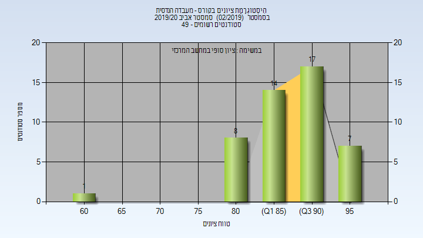

| סטודנטים | עברו/נכשלו | אחוז עוברים | ציון מינימלי | ציון מקסימלי | ממוצע | חציון |
| ---- | ---- | ---- | ---- | ---- | ---- | ---- |
| 47 | 47/0 | 100 | 64 | 97 | 88.723 | 89 |

<h2 id="201901">חורף 2019-2020</h2>

| איש סגל | תפקיד |
| ---- | ---- |
| ז'וטובסקי סמיון | מרצה - אחראי מקצוע |
| צאצאשוילי תמי | סגל מנהלי - עם הרשאות מרצה אחראי |
| שביט שרית | סגל מנהלי - עם הרשאות מרצה אחראי |

<h3 id="201901-Final_A">סופי מועד א'</h3>

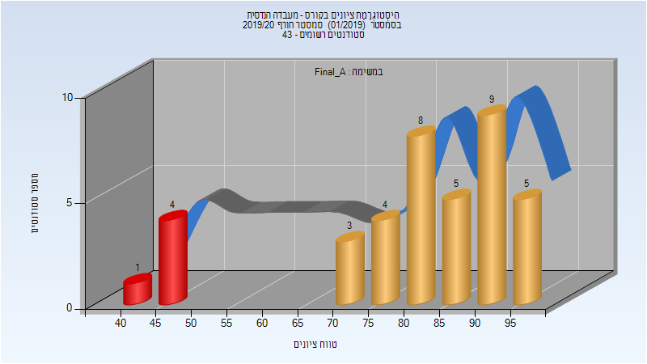

| סטודנטים | עברו/נכשלו | אחוז עוברים | ציון מינימלי | ציון מקסימלי | ממוצע | חציון |
| ---- | ---- | ---- | ---- | ---- | ---- | ---- |
| 39 | 34/5 | 87 | 42 | 96 | 80.718 | 84 |

<h3 id="201901-Finals">סופי</h3>

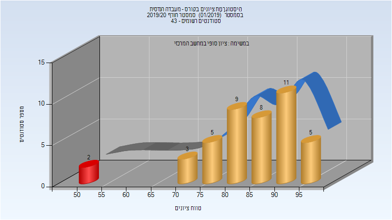

| סטודנטים | עברו/נכשלו | אחוז עוברים | ציון מינימלי | ציון מקסימלי | ממוצע | חציון |
| ---- | ---- | ---- | ---- | ---- | ---- | ---- |
| 43 | 41/2 | 95 | 52 | 96 | 84.233 | 86 |

<h2 id="201803">קיץ 2019</h2>

| איש סגל | תפקיד |
| ---- | ---- |
| נחום שי | מרצה - אחראי מקצוע |
| שביט שרית | סגל מנהלי - עם הרשאות מרצה אחראי |
| צאצאשוילי תמי | סגל מנהלי - עם הרשאות מרצה אחראי |

<h3 id="201803-Final_A">סופי מועד א'</h3>

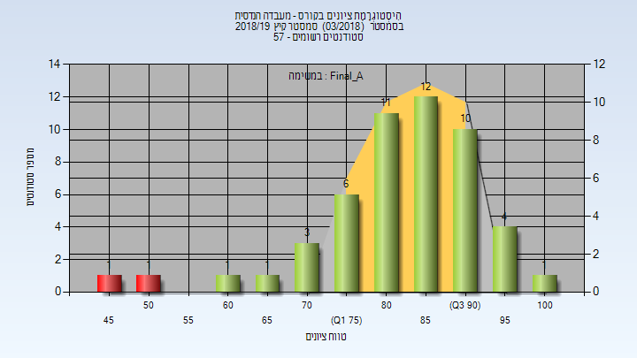

| סטודנטים | עברו/נכשלו | אחוז עוברים | ציון מינימלי | ציון מקסימלי | ממוצע | חציון |
| ---- | ---- | ---- | ---- | ---- | ---- | ---- |
| 51 | 49/2 | 96 | 46 | 100 | 83.92 | 85.35 |

<h3 id="201803-Finals">סופי</h3>

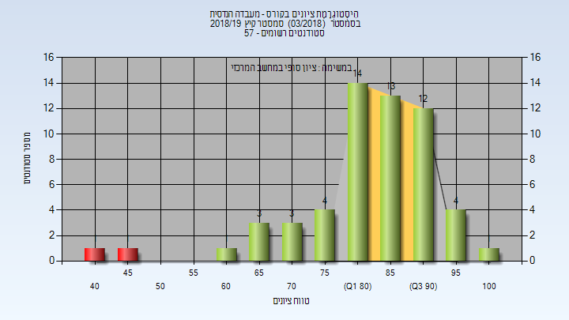

| סטודנטים | עברו/נכשלו | אחוז עוברים | ציון מינימלי | ציון מקסימלי | ממוצע | חציון |
| ---- | ---- | ---- | ---- | ---- | ---- | ---- |
| 57 | 55/2 | 96 | 44 | 100 | 83.053 | 85 |

<h2 id="201802">אביב 2019</h2>

| איש סגל | תפקיד |
| ---- | ---- |
| ז'וטובסקי סמיון | מרצה - אחראי מקצוע |

<h3 id="201802-Final_A">סופי מועד א'</h3>

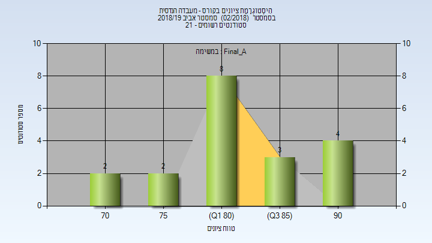

| סטודנטים | עברו/נכשלו | אחוז עוברים | ציון מינימלי | ציון מקסימלי | ממוצע | חציון |
| ---- | ---- | ---- | ---- | ---- | ---- | ---- |
| 19 | 19/0 | 100 | 72 | 94 | 83.316 | 83 |

<h3 id="201802-Finals">סופי</h3>

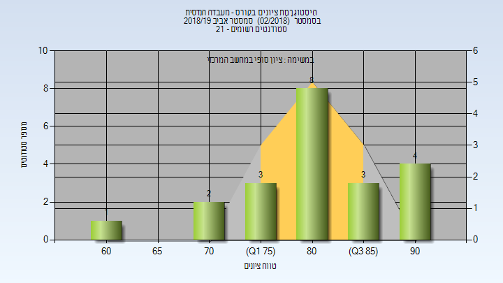

| סטודנטים | עברו/נכשלו | אחוז עוברים | ציון מינימלי | ציון מקסימלי | ממוצע | חציון |
| ---- | ---- | ---- | ---- | ---- | ---- | ---- |
| 21 | 21/0 | 100 | 60 | 94 | 81.905 | 83 |

<h2 id="201801">חורף 2018-2019</h2>

| איש סגל | תפקיד |
| ---- | ---- |
| ז'וטובסקי סמיון | מרצה - אחראי מקצוע |
| צאצאשוילי תמי | סגל מנהלי - עם הרשאות מרצה אחראי |
| שביט שרית | סגל מנהלי - עם הרשאות מרצה אחראי |

<h3 id="201801-Final_A">סופי מועד א'</h3>

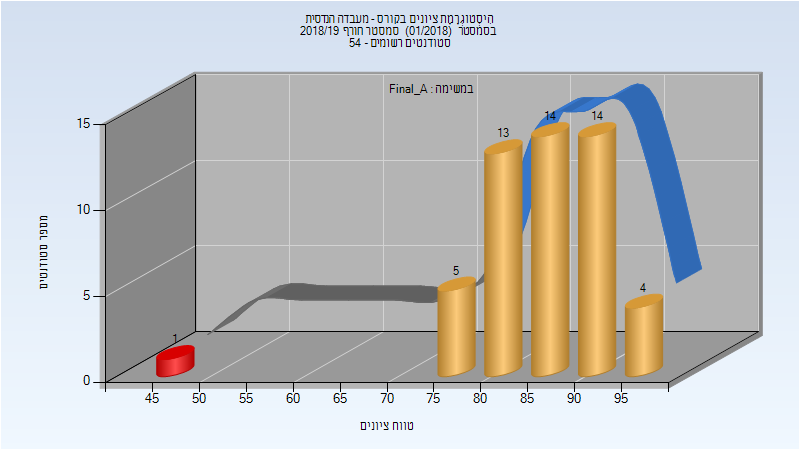

| סטודנטים | עברו/נכשלו | אחוז עוברים | ציון מינימלי | ציון מקסימלי | ממוצע | חציון |
| ---- | ---- | ---- | ---- | ---- | ---- | ---- |
| 51 | 50/1 | 98 | 49 | 96 | 86.157 | 87 |

<h3 id="201801-Finals">סופי</h3>

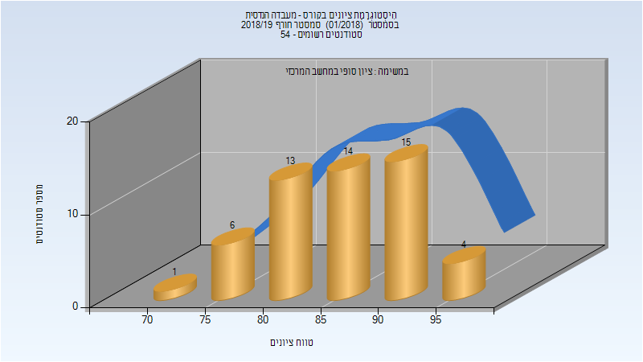

| סטודנטים | עברו/נכשלו | אחוז עוברים | ציון מינימלי | ציון מקסימלי | ממוצע | חציון |
| ---- | ---- | ---- | ---- | ---- | ---- | ---- |
| 53 | 53/0 | 100 | 74 | 96 | 86.566 | 87 |

<h2 id="201702">אביב 2018</h2>

| איש סגל | תפקיד |
| ---- | ---- |
| ז'וטובסקי סמיון | מרצה - אחראי מקצוע |

<h3 id="201702-Final_A">סופי מועד א'</h3>

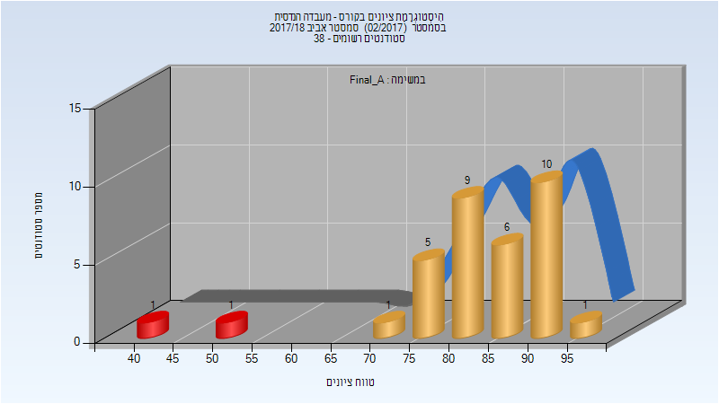

| סטודנטים | עברו/נכשלו | אחוז עוברים | ציון מינימלי | ציון מקסימלי | ממוצע | חציון |
| ---- | ---- | ---- | ---- | ---- | ---- | ---- |
| 34 | 32/2 | 94 | 42 | 95 | 83.676 | 84.5 |

<h3 id="201702-Finals">סופי</h3>

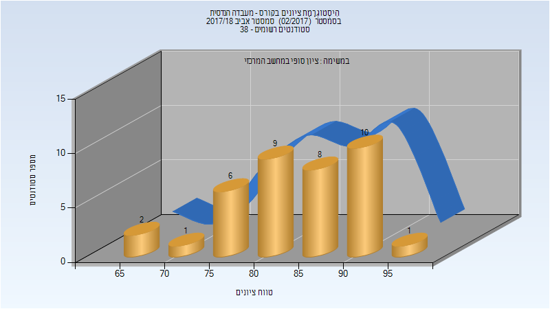

| סטודנטים | עברו/נכשלו | אחוז עוברים | ציון מינימלי | ציון מקסימלי | ממוצע | חציון |
| ---- | ---- | ---- | ---- | ---- | ---- | ---- |
| 37 | 37/0 | 100 | 68 | 95 | 84.838 | 85 |

<h2 id="201701">חורף 2017-2018</h2>

| איש סגל | תפקיד |
| ---- | ---- |
| ז'וטובסקי סמיון | מרצה - אחראי מקצוע |

<h3 id="201701-Final_A">סופי מועד א'</h3>

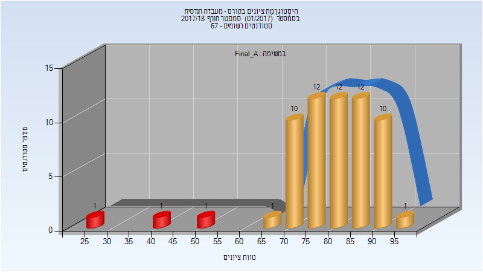

| סטודנטים | עברו/נכשלו | אחוז עוברים | ציון מינימלי | ציון מקסימלי | ממוצע | חציון |
| ---- | ---- | ---- | ---- | ---- | ---- | ---- |
| 61 | 58/3 | 95 | 25 | 96.275 | 80.258 | 81.875 |

<h3 id="201701-Finals">סופי</h3>

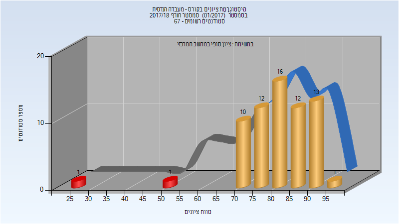

| סטודנטים | עברו/נכשלו | אחוז עוברים | ציון מינימלי | ציון מקסימלי | ממוצע | חציון |
| ---- | ---- | ---- | ---- | ---- | ---- | ---- |
| 66 | 64/2 | 97 | 25 | 96 | 81.03 | 81.5 |

<h2 id="201603">קיץ 2017</h2>

| איש סגל | תפקיד |
| ---- | ---- |
| פלדפוגל שי | מרצה - אחראי מקצוע |
| צאצאשוילי תמי | סגל מנהלי - עם הרשאות מרצה אחראי |
| שביט שרית | סגל מנהלי - עם הרשאות מרצה אחראי |

<h3 id="201603-Final_A">סופי מועד א'</h3>

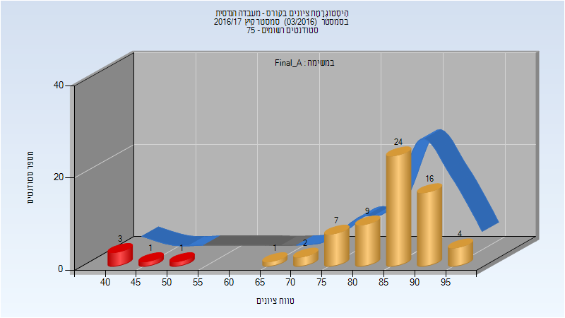

| סטודנטים | עברו/נכשלו | אחוז עוברים | ציון מינימלי | ציון מקסימלי | ממוצע | חציון |
| ---- | ---- | ---- | ---- | ---- | ---- | ---- |
| 68 | 63/5 | 93 | 41 | 96.45 | 83.559 | 86.35 |

<h3 id="201603-Finals">סופי</h3>

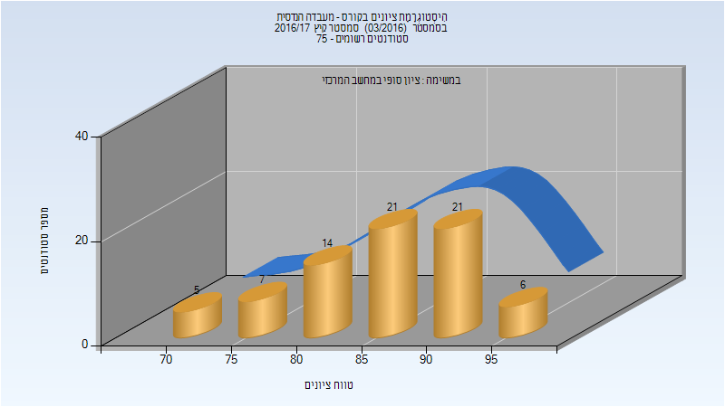

| סטודנטים | עברו/נכשלו | אחוז עוברים | ציון מינימלי | ציון מקסימלי | ממוצע | חציון |
| ---- | ---- | ---- | ---- | ---- | ---- | ---- |
| 74 | 74/0 | 100 | 70 | 97 | 86.23 | 86.5 |

<h2 id="201601">חורף 2016-2017</h2>

| איש סגל | תפקיד |
| ---- | ---- |
| פינקרט שמואל | מרצה - אחראי מקצוע |

<h3 id="201601-Final_A">סופי מועד א'</h3>

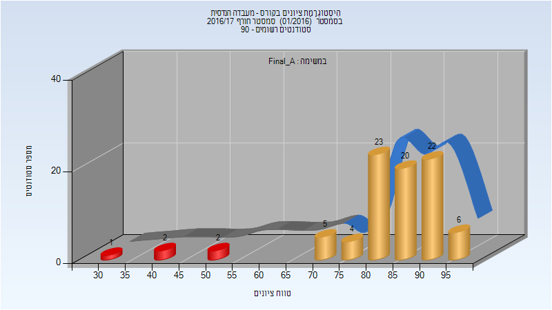

| סטודנטים | עברו/נכשלו | אחוז עוברים | ציון מינימלי | ציון מקסימלי | ממוצע | חציון |
| ---- | ---- | ---- | ---- | ---- | ---- | ---- |
| 85 | 80/5 | 94 | 32 | 98 | 83.612 | 87 |

<h3 id="201601-Finals">סופי</h3>

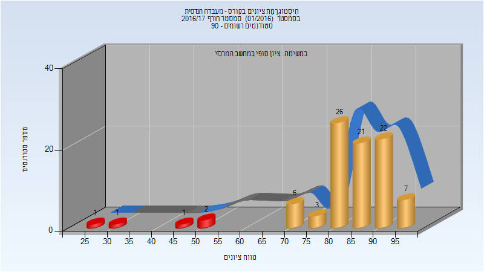

| סטודנטים | עברו/נכשלו | אחוז עוברים | ציון מינימלי | ציון מקסימלי | ממוצע | חציון |
| ---- | ---- | ---- | ---- | ---- | ---- | ---- |
| 90 | 85/5 | 94 | 29 | 98 | 83.6 | 87 |

