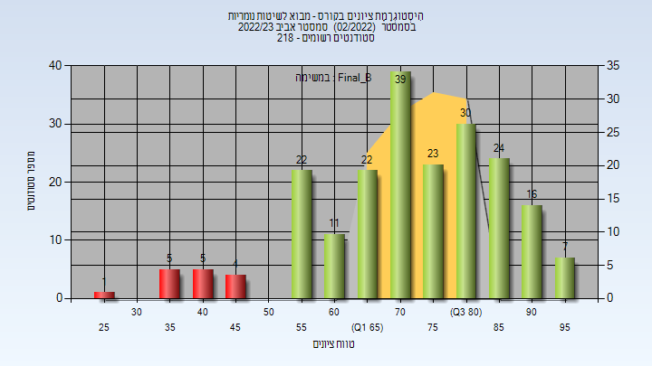
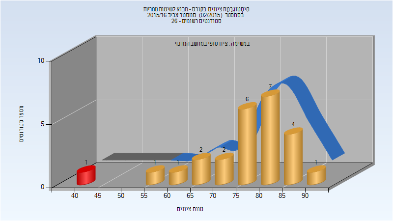

# 00140006 - מבוא לשיטות נומריות

**הערה**: מאגר ההיסטוגרמות הוקם עבור [CheeseFork](https://cheesefork.cf/), כלי בניית מערכת שעות עבור סטודנטים בטכניון. באתר בו אתם גולשים ניתן לעיין בהיסטוגרמות, אך הדרך היותר נוחה היא לעיין בהיסטוגרמות, ובמידע נוסף כגון חוות דעת של סטודנטים, באתר CheeseFork.

* [אביב 2025](#202402)
  * [סופי מועד א'](#202402-Final_A)
  * [סופי מועד ב'](#202402-Final_B)
  * [סופי](#202402-Finals)
* [חורף 2024-2025](#202401)
* [אביב 2024](#202302)
  * [מבחן מועד א'](#202302-Exam_A)
  * [סופי מועד א'](#202302-Final_A)
  * [סופי](#202302-Finals)
* [אביב 2023](#202202)
  * [מבחן מועד א'](#202202-Exam_A)
  * [סופי מועד א'](#202202-Final_A)
  * [סופי מועד ב'](#202202-Final_B)
  * [סופי](#202202-Finals)
* [חורף 2022-2023](#202201)
  * [סופי מועד א'](#202201-Final_A)
  * [סופי מועד ב'](#202201-Final_B)
  * [סופי](#202201-Finals)
* [אביב 2022](#202102)
  * [סופי מועד א'](#202102-Final_A)
  * [סופי מועד ב'](#202102-Final_B)
  * [סופי](#202102-Finals)
* [חורף 2021-2022](#202101)
  * [מבחן מועד א'](#202101-Exam_A)
  * [סופי מועד א'](#202101-Final_A)
  * [סופי](#202101-Finals)
* [אביב 2021](#202002)
  * [סופי מועד א'](#202002-Final_A)
  * [סופי מועד ב'](#202002-Final_B)
  * [סופי](#202002-Finals)
* [חורף 2020-2021](#202001)
  * [סופי מועד א'](#202001-Final_A)
  * [סופי מועד ב'](#202001-Final_B)
  * [סופי](#202001-Finals)
* [אביב 2020](#201902)
  * [סופי מועד א'](#201902-Final_A)
  * [סופי מועד ב'](#201902-Final_B)
  * [סופי](#201902-Finals)
* [חורף 2019-2020](#201901)
  * [סופי מועד א'](#201901-Final_A)
  * [סופי](#201901-Finals)
* [אביב 2019](#201802)
  * [סופי מועד א'](#201802-Final_A)
  * [סופי מועד ב'](#201802-Final_B)
  * [סופי](#201802-Finals)
* [חורף 2018-2019](#201801)
  * [סופי מועד א'](#201801-Final_A)
  * [סופי מועד ב'](#201801-Final_B)
  * [סופי](#201801-Finals)
* [אביב 2018](#201702)
  * [סופי מועד א'](#201702-Final_A)
  * [סופי מועד ב'](#201702-Final_B)
  * [סופי](#201702-Finals)
* [חורף 2017-2018](#201701)
  * [סופי מועד א'](#201701-Final_A)
  * [סופי מועד ב'](#201701-Final_B)
  * [סופי](#201701-Finals)
* [אביב 2017](#201602)
  * [סופי מועד א'](#201602-Final_A)
  * [סופי מועד ב'](#201602-Final_B)
  * [סופי](#201602-Finals)
* [אביב 2016](#201502)
  * [סופי מועד א'](#201502-Final_A)
  * [סופי מועד ב'](#201502-Final_B)
  * [סופי](#201502-Finals)

<h2 id="202402">אביב 2025</h2>

| איש סגל | תפקיד |
| ---- | ---- |
| דגני אמיר | מרצה - אחראי מקצוע |
| אוזנה נועם | מתרגל - עם הרשאות מרצה אחראי |
| צעירי קובלר קרן | סגל מנהלי - עם הרשאות מרצה אחראי |

<h3 id="202402-Final_A">סופי מועד א'</h3>

| סטודנטים | עברו/נכשלו | אחוז עוברים | ציון מינימלי | ציון מקסימלי | ממוצע | חציון |
| ---- | ---- | ---- | ---- | ---- | ---- | ---- |
| 152 | 116/36 | 76 | 14 | 99 | 68.132 | 74 |

<h3 id="202402-Final_B">סופי מועד ב'</h3>

| סטודנטים | עברו/נכשלו | אחוז עוברים | ציון מינימלי | ציון מקסימלי | ממוצע | חציון |
| ---- | ---- | ---- | ---- | ---- | ---- | ---- |
| 73 | 66/7 | 90 | 36 | 97 | 72.178 | 75 |

<h3 id="202402-Finals">סופי</h3>

| סטודנטים | עברו/נכשלו | אחוז עוברים | ציון מינימלי | ציון מקסימלי | ממוצע | חציון |
| ---- | ---- | ---- | ---- | ---- | ---- | ---- |
| 178 | 169/9 | 95 | 36 | 99 | 75.522 | 76.5 |

<h2 id="202401">חורף 2024-2025</h2>

| איש סגל | תפקיד |
| ---- | ---- |
| טולדו תומר | מרצה - אחראי מקצוע |

<h2 id="202302">אביב 2024</h2>

| איש סגל | תפקיד |
| ---- | ---- |
| דגני אמיר | מרצה - אחראי מקצוע |
| אוזנה נועם | מתרגל - עם הרשאות מרצה אחראי |
| מלכה אופירה | סגל מנהלי - עם הרשאות מרצה אחראי |
| צעירי קובלר קרן | סגל מנהלי - עם הרשאות מרצה אחראי |

<h3 id="202302-Exam_A">מבחן מועד א'</h3>

| סטודנטים | עברו/נכשלו | אחוז עוברים | ציון מינימלי | ציון מקסימלי | ממוצע | חציון |
| ---- | ---- | ---- | ---- | ---- | ---- | ---- |
| 123 | 109/14 | 89 | 8 | 98 | 69.97 | 71 |

<h3 id="202302-Final_A">סופי מועד א'</h3>

| סטודנטים | עברו/נכשלו | אחוז עוברים | ציון מינימלי | ציון מקסימלי | ממוצע | חציון |
| ---- | ---- | ---- | ---- | ---- | ---- | ---- |
| 123 | 117/6 | 95 | 8 | 98.08 | 72.46 | 72.72 |

<h3 id="202302-Finals">סופי</h3>

| סטודנטים | עברו/נכשלו | אחוז עוברים | ציון מינימלי | ציון מקסימלי | ממוצע | חציון |
| ---- | ---- | ---- | ---- | ---- | ---- | ---- |
| 151 | 149/2 | 99 | 44 | 98 | 76.325 | 78.5 |

<h2 id="202202">אביב 2023</h2>

| איש סגל | תפקיד |
| ---- | ---- |
| דגני אמיר | מרצה - אחראי מקצוע |
| בנימין דוד | מתרגל - עם הרשאות מרצה אחראי |
| מלכה אופירה | סגל מנהלי - עם הרשאות מרצה אחראי |
| צעירי קובלר קרן | סגל מנהלי - עם הרשאות מרצה אחראי |

<h3 id="202202-Exam_A">מבחן מועד א'</h3>

| סטודנטים | עברו/נכשלו | אחוז עוברים | ציון מינימלי | ציון מקסימלי | ממוצע | חציון |
| ---- | ---- | ---- | ---- | ---- | ---- | ---- |
| 182 | 140/42 | 77 | 21 | 97 | 67.725 | 70 |

<h3 id="202202-Final_A">סופי מועד א'</h3>

| סטודנטים | עברו/נכשלו | אחוז עוברים | ציון מינימלי | ציון מקסימלי | ממוצע | חציון |
| ---- | ---- | ---- | ---- | ---- | ---- | ---- |
| 182 | 140/42 | 77 | 21 | 97 | 69.791 | 73.5 |

<h3 id="202202-Final_B">סופי מועד ב'</h3>

| סטודנטים | עברו/נכשלו | אחוז עוברים | ציון מינימלי | ציון מקסימלי | ממוצע | חציון |
| ---- | ---- | ---- | ---- | ---- | ---- | ---- |
| 209 | 194/15 | 93 | 26 | 97 | 73.177 | 74 |

<h3 id="202202-Finals">סופי</h3>

| סטודנטים | עברו/נכשלו | אחוז עוברים | ציון מינימלי | ציון מקסימלי | ממוצע | חציון |
| ---- | ---- | ---- | ---- | ---- | ---- | ---- |
| 209 | 197/12 | 94 | 37 | 97 | 76.806 | 80 |

<h2 id="202201">חורף 2022-2023</h2>

| איש סגל | תפקיד |
| ---- | ---- |
| טולדו תומר | מרצה - אחראי מקצוע |
| מלכה אופירה | סגל מנהלי - עם הרשאות מרצה אחראי |
| קובלר קרן | סגל מנהלי - עם הרשאות מרצה אחראי |

<h3 id="202201-Final_A">סופי מועד א'</h3>

| סטודנטים | עברו/נכשלו | אחוז עוברים | ציון מינימלי | ציון מקסימלי | ממוצע | חציון |
| ---- | ---- | ---- | ---- | ---- | ---- | ---- |
| 21 | 16/5 | 76 | 39 | 93 | 69.143 | 73 |

<h3 id="202201-Final_B">סופי מועד ב'</h3>

| סטודנטים | עברו/נכשלו | אחוז עוברים | ציון מינימלי | ציון מקסימלי | ממוצע | חציון |
| ---- | ---- | ---- | ---- | ---- | ---- | ---- |
| 16 | 7/9 | 44 | 9 | 67 | 41.312 | 40 |

<h3 id="202201-Finals">סופי</h3>

| סטודנטים | עברו/נכשלו | אחוז עוברים | ציון מינימלי | ציון מקסימלי | ממוצע | חציון |
| ---- | ---- | ---- | ---- | ---- | ---- | ---- |
| 32 | 23/9 | 72 | 9 | 93 | 58.969 | 65 |

<h2 id="202102">אביב 2022</h2>

| איש סגל | תפקיד |
| ---- | ---- |
| דגני אמיר | מרצה - אחראי מקצוע |
| קבלאוי מחמוד | מתרגל - עם הרשאות מרצה אחראי |
| צעירי קובלר קרן | סגל מנהלי - עם הרשאות מרצה אחראי |
| מלכה אופירה | סגל מנהלי - עם הרשאות מרצה אחראי |

<h3 id="202102-Final_A">סופי מועד א'</h3>

| סטודנטים | עברו/נכשלו | אחוז עוברים | ציון מינימלי | ציון מקסימלי | ממוצע | חציון |
| ---- | ---- | ---- | ---- | ---- | ---- | ---- |
| 205 | 195/10 | 95 | 33 | 97 | 79.434 | 81 |

<h3 id="202102-Final_B">סופי מועד ב'</h3>

| סטודנטים | עברו/נכשלו | אחוז עוברים | ציון מינימלי | ציון מקסימלי | ממוצע | חציון |
| ---- | ---- | ---- | ---- | ---- | ---- | ---- |
| 41 | 29/12 | 71 | 25 | 87 | 60.098 | 63 |

<h3 id="202102-Finals">סופי</h3>

| סטודנטים | עברו/נכשלו | אחוז עוברים | ציון מינימלי | ציון מקסימלי | ממוצע | חציון |
| ---- | ---- | ---- | ---- | ---- | ---- | ---- |
| 237 | 222/15 | 94 | 25 | 97 | 77.143 | 80 |

<h2 id="202101">חורף 2021-2022</h2>

| איש סגל | תפקיד |
| ---- | ---- |
| פריגוזין עמית | מרצה - אחראי מקצוע |

<h3 id="202101-Exam_A">מבחן מועד א'</h3>

| סטודנטים | עברו/נכשלו | אחוז עוברים | ציון מינימלי | ציון מקסימלי | ממוצע | חציון |
| ---- | ---- | ---- | ---- | ---- | ---- | ---- |
| 12 | 11/1 | 92 | 43 | 84 | 68.583 | 68.5 |

<h3 id="202101-Final_A">סופי מועד א'</h3>

| סטודנטים | עברו/נכשלו | אחוז עוברים | ציון מינימלי | ציון מקסימלי | ממוצע | חציון |
| ---- | ---- | ---- | ---- | ---- | ---- | ---- |
| 12 | 11/1 | 92 | 43 | 88 | 73.917 | 75.5 |

<h3 id="202101-Finals">סופי</h3>

| סטודנטים | עברו/נכשלו | אחוז עוברים | ציון מינימלי | ציון מקסימלי | ממוצע | חציון |
| ---- | ---- | ---- | ---- | ---- | ---- | ---- |
| 16 | 16/0 | 100 | 64 | 94 | 76.5 | 76.5 |

<h2 id="202002">אביב 2021</h2>

| איש סגל | תפקיד |
| ---- | ---- |
| דגני אמיר | מרצה - אחראי מקצוע |
| קבלאוי מחמוד | מתרגל - עם הרשאות מרצה אחראי |
| מלכה אופירה | סגל מנהלי - עם הרשאות מרצה אחראי |
| קובלר קרן | סגל מנהלי - עם הרשאות מרצה אחראי |

<h3 id="202002-Final_A">סופי מועד א'</h3>

| סטודנטים | עברו/נכשלו | אחוז עוברים | ציון מינימלי | ציון מקסימלי | ממוצע | חציון |
| ---- | ---- | ---- | ---- | ---- | ---- | ---- |
| 151 | 144/7 | 95 | 19 | 97 | 76.344 | 79 |

<h3 id="202002-Final_B">סופי מועד ב'</h3>

| סטודנטים | עברו/נכשלו | אחוז עוברים | ציון מינימלי | ציון מקסימלי | ממוצע | חציון |
| ---- | ---- | ---- | ---- | ---- | ---- | ---- |
| 53 | 29/24 | 55 | 27 | 98 | 57.906 | 59 |

<h3 id="202002-Finals">סופי</h3>

| סטודנטים | עברו/נכשלו | אחוז עוברים | ציון מינימלי | ציון מקסימלי | ממוצע | חציון |
| ---- | ---- | ---- | ---- | ---- | ---- | ---- |
| 192 | 168/24 | 88 | 19 | 98 | 72.609 | 75 |

<h2 id="202001">חורף 2020-2021</h2>

| איש סגל | תפקיד |
| ---- | ---- |
| טולדו תומר | מרצה - אחראי מקצוע |
| קובלר קרן | סגל מנהלי - עם הרשאות מרצה אחראי |
| מלכה אופירה | סגל מנהלי - עם הרשאות מרצה אחראי |

<h3 id="202001-Final_A">סופי מועד א'</h3>

| סטודנטים | עברו/נכשלו | אחוז עוברים | ציון מינימלי | ציון מקסימלי | ממוצע | חציון |
| ---- | ---- | ---- | ---- | ---- | ---- | ---- |
| 29 | 18/11 | 62 | 0 | 94 | 52.172 | 62 |

<h3 id="202001-Final_B">סופי מועד ב'</h3>

| סטודנטים | עברו/נכשלו | אחוז עוברים | ציון מינימלי | ציון מקסימלי | ממוצע | חציון |
| ---- | ---- | ---- | ---- | ---- | ---- | ---- |
| 19 | 15/4 | 79 | 37 | 91 | 64 | 62 |

<h3 id="202001-Finals">סופי</h3>

| סטודנטים | עברו/נכשלו | אחוז עוברים | ציון מינימלי | ציון מקסימלי | ממוצע | חציון |
| ---- | ---- | ---- | ---- | ---- | ---- | ---- |
| 40 | 34/6 | 85 | 37 | 94 | 65.625 | 66.5 |

<h2 id="201902">אביב 2020</h2>

| איש סגל | תפקיד |
| ---- | ---- |
| טולדו תומר | מרצה - אחראי מקצוע |
| הלל רוני | מתרגל - עם הרשאות מרצה אחראי |
| מלכה אופירה | סגל מנהלי - עם הרשאות מרצה אחראי |
| קובלר קרן | סגל מנהלי - עם הרשאות מרצה אחראי |

<h3 id="201902-Final_A">סופי מועד א'</h3>

| סטודנטים | עברו/נכשלו | אחוז עוברים | ציון מינימלי | ציון מקסימלי | ממוצע | חציון |
| ---- | ---- | ---- | ---- | ---- | ---- | ---- |
| 145 | 133/12 | 92 | 29 | 97 | 72.448 | 73 |

<h3 id="201902-Final_B">סופי מועד ב'</h3>

| סטודנטים | עברו/נכשלו | אחוז עוברים | ציון מינימלי | ציון מקסימלי | ממוצע | חציון |
| ---- | ---- | ---- | ---- | ---- | ---- | ---- |
| 70 | 54/16 | 77 | 27 | 96 | 64.357 | 67.5 |

<h3 id="201902-Finals">סופי</h3>

| סטודנטים | עברו/נכשלו | אחוז עוברים | ציון מינימלי | ציון מקסימלי | ממוצע | חציון |
| ---- | ---- | ---- | ---- | ---- | ---- | ---- |
| 183 | 168/15 | 92 | 27 | 97 | 72.727 | 74 |

<h2 id="201901">חורף 2019-2020</h2>

| איש סגל | תפקיד |
| ---- | ---- |
| טולדו תומר | מרצה - אחראי מקצוע |
| פריגוזין עמית | מתרגל - עם הרשאות מרצה אחראי |
| סגל רחלי | סגל מנהלי - עם הרשאות מרצה אחראי |
| קובלר קרן | סגל מנהלי - עם הרשאות מרצה אחראי |

<h3 id="201901-Final_A">סופי מועד א'</h3>

| סטודנטים | עברו/נכשלו | אחוז עוברים | ציון מינימלי | ציון מקסימלי | ממוצע | חציון |
| ---- | ---- | ---- | ---- | ---- | ---- | ---- |
| 12 | 9/3 | 75 | 39 | 89 | 65 | 66.5 |

<h3 id="201901-Finals">סופי</h3>

| סטודנטים | עברו/נכשלו | אחוז עוברים | ציון מינימלי | ציון מקסימלי | ממוצע | חציון |
| ---- | ---- | ---- | ---- | ---- | ---- | ---- |
| 17 | 13/4 | 76 | 39 | 94 | 68.529 | 72 |

<h2 id="201802">אביב 2019</h2>

| איש סגל | תפקיד |
| ---- | ---- |
| דגני אמיר | מרצה - אחראי מקצוע |
| הלל רוני | מתרגל - עם הרשאות מרצה אחראי |

<h3 id="201802-Final_A">סופי מועד א'</h3>

| סטודנטים | עברו/נכשלו | אחוז עוברים | ציון מינימלי | ציון מקסימלי | ממוצע | חציון |
| ---- | ---- | ---- | ---- | ---- | ---- | ---- |
| 133 | 125/8 | 94 | 30 | 100 | 74.271 | 74 |

<h3 id="201802-Final_B">סופי מועד ב'</h3>

| סטודנטים | עברו/נכשלו | אחוז עוברים | ציון מינימלי | ציון מקסימלי | ממוצע | חציון |
| ---- | ---- | ---- | ---- | ---- | ---- | ---- |
| 58 | 53/5 | 91 | 40 | 89 | 69.034 | 71 |

<h3 id="201802-Finals">סופי</h3>

| סטודנטים | עברו/נכשלו | אחוז עוברים | ציון מינימלי | ציון מקסימלי | ממוצע | חציון |
| ---- | ---- | ---- | ---- | ---- | ---- | ---- |
| 168 | 164/4 | 98 | 40 | 100 | 75.994 | 76 |

<h2 id="201801">חורף 2018-2019</h2>

| איש סגל | תפקיד |
| ---- | ---- |
| טולדו תומר | מרצה - אחראי מקצוע |
| סגל רחלי | סגל מנהלי - עם הרשאות מרצה אחראי |
| קובלר קרן | סגל מנהלי - עם הרשאות מרצה אחראי |

<h3 id="201801-Final_A">סופי מועד א'</h3>

| סטודנטים | עברו/נכשלו | אחוז עוברים | ציון מינימלי | ציון מקסימלי | ממוצע | חציון |
| ---- | ---- | ---- | ---- | ---- | ---- | ---- |
| 22 | 15/7 | 68 | 9 | 90 | 57.773 | 63 |

<h3 id="201801-Final_B">סופי מועד ב'</h3>

| סטודנטים | עברו/נכשלו | אחוז עוברים | ציון מינימלי | ציון מקסימלי | ממוצע | חציון |
| ---- | ---- | ---- | ---- | ---- | ---- | ---- |
| 16 | 12/4 | 75 | 28 | 91 | 64.75 | 68 |

<h3 id="201801-Finals">סופי</h3>

| סטודנטים | עברו/נכשלו | אחוז עוברים | ציון מינימלי | ציון מקסימלי | ממוצע | חציון |
| ---- | ---- | ---- | ---- | ---- | ---- | ---- |
| 28 | 26/2 | 93 | 28 | 91 | 69.214 | 69.5 |

<h2 id="201702">אביב 2018</h2>

| איש סגל | תפקיד |
| ---- | ---- |
| דגני אמיר | מרצה - אחראי מקצוע |
| טולדו תומר | מרצה |
| הלל רוני | מתרגל - עם הרשאות מרצה אחראי |

<h3 id="201702-Final_A">סופי מועד א'</h3>

| סטודנטים | עברו/נכשלו | אחוז עוברים | ציון מינימלי | ציון מקסימלי | ממוצע | חציון |
| ---- | ---- | ---- | ---- | ---- | ---- | ---- |
| 189 | 186/3 | 98 | 42 | 99 | 79.566 | 82 |

<h3 id="201702-Final_B">סופי מועד ב'</h3>

| סטודנטים | עברו/נכשלו | אחוז עוברים | ציון מינימלי | ציון מקסימלי | ממוצע | חציון |
| ---- | ---- | ---- | ---- | ---- | ---- | ---- |
| 64 | 56/8 | 88 | 19 | 95 | 66.828 | 69 |

<h3 id="201702-Finals">סופי</h3>

| סטודנטים | עברו/נכשלו | אחוז עוברים | ציון מינימלי | ציון מקסימלי | ממוצע | חציון |
| ---- | ---- | ---- | ---- | ---- | ---- | ---- |
| 243 | 235/8 | 97 | 19 | 99 | 77.42 | 79 |

<h2 id="201701">חורף 2017-2018</h2>

| איש סגל | תפקיד |
| ---- | ---- |
| טולדו תומר | מרצה - אחראי מקצוע |
| הלל רוני | מתרגל - עם הרשאות מרצה אחראי |

<h3 id="201701-Final_A">סופי מועד א'</h3>

| סטודנטים | עברו/נכשלו | אחוז עוברים | ציון מינימלי | ציון מקסימלי | ממוצע | חציון |
| ---- | ---- | ---- | ---- | ---- | ---- | ---- |
| 23 | 23/0 | 100 | 56 | 94 | 78.826 | 78 |

<h3 id="201701-Final_B">סופי מועד ב'</h3>

| סטודנטים | עברו/נכשלו | אחוז עוברים | ציון מינימלי | ציון מקסימלי | ממוצע | חציון |
| ---- | ---- | ---- | ---- | ---- | ---- | ---- |
| 11 | 10/1 | 91 | 48 | 89 | 76.545 | 81 |

<h3 id="201701-Finals">סופי</h3>

| סטודנטים | עברו/נכשלו | אחוז עוברים | ציון מינימלי | ציון מקסימלי | ממוצע | חציון |
| ---- | ---- | ---- | ---- | ---- | ---- | ---- |
| 32 | 31/1 | 97 | 48 | 95 | 78.656 | 82 |

<h2 id="201602">אביב 2017</h2>

| איש סגל | תפקיד |
| ---- | ---- |
| דגני אמיר | מרצה - אחראי מקצוע |
| הלל רוני | מתרגל - עם הרשאות מרצה אחראי |

<h3 id="201602-Final_A">סופי מועד א'</h3>

| סטודנטים | עברו/נכשלו | אחוז עוברים | ציון מינימלי | ציון מקסימלי | ממוצע | חציון |
| ---- | ---- | ---- | ---- | ---- | ---- | ---- |
| 199 | 190/9 | 95 | 42 | 100 | 79.239 | 81.6 |

<h3 id="201602-Final_B">סופי מועד ב'</h3>

| סטודנטים | עברו/נכשלו | אחוז עוברים | ציון מינימלי | ציון מקסימלי | ממוצע | חציון |
| ---- | ---- | ---- | ---- | ---- | ---- | ---- |
| 37 | 29/8 | 78 | 24 | 95 | 67.514 | 69 |

<h3 id="201602-Finals">סופי</h3>

| סטודנטים | עברו/נכשלו | אחוז עוברים | ציון מינימלי | ציון מקסימלי | ממוצע | חציון |
| ---- | ---- | ---- | ---- | ---- | ---- | ---- |
| 229 | 220/9 | 96 | 24 | 100 | 78.437 | 81 |

<h2 id="201502">אביב 2016</h2>

| איש סגל | תפקיד |
| ---- | ---- |
| טולדו תומר | מרצה - אחראי מקצוע |

<h3 id="201502-Final_A">סופי מועד א'</h3>

| סטודנטים | עברו/נכשלו | אחוז עוברים | ציון מינימלי | ציון מקסימלי | ממוצע | חציון |
| ---- | ---- | ---- | ---- | ---- | ---- | ---- |
| 206 | 190/16 | 92 | 26 | 99 | 78.515 | 82 |

<h3 id="201502-Final_B">סופי מועד ב'</h3>

| סטודנטים | עברו/נכשלו | אחוז עוברים | ציון מינימלי | ציון מקסימלי | ממוצע | חציון |
| ---- | ---- | ---- | ---- | ---- | ---- | ---- |
| 16 | 15/1 | 94 | 40 | 91 | 75.062 | 78.5 |

<h3 id="201502-Finals">סופי</h3>

| סטודנטים | עברו/נכשלו | אחוז עוברים | ציון מינימלי | ציון מקסימלי | ממוצע | חציון |
| ---- | ---- | ---- | ---- | ---- | ---- | ---- |
| 25 | 24/1 | 96 | 40 | 91 | 76.88 | 79 |

