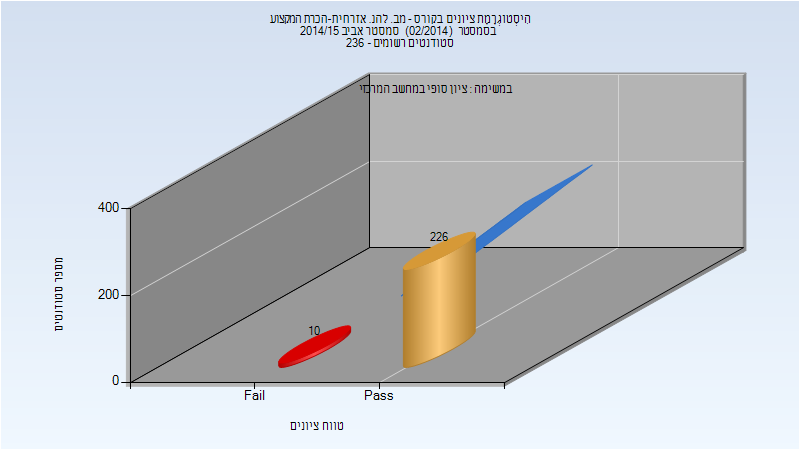

# 00140009 - מב. להנ. אזרחית-הכרת המקצוע

**הערה**: מאגר ההיסטוגרמות הוקם עבור [CheeseFork](https://cheesefork.cf/), כלי בניית מערכת שעות עבור סטודנטים בטכניון. באתר בו אתם גולשים ניתן לעיין בהיסטוגרמות, אך הדרך היותר נוחה היא לעיין בהיסטוגרמות, ובמידע נוסף כגון חוות דעת של סטודנטים, באתר CheeseFork.

* [אביב 2015](#201402)
  * [סופי](#201402-Finals)

<h2 id="201402">אביב 2015</h2>

| איש סגל | תפקיד |
| ---- | ---- |
| לבן אורן | מרצה - אחראי מקצוע |

<h3 id="201402-Finals">סופי</h3>

| סטודנטים | עברו/נכשלו | אחוז עוברים | ציון מינימלי | ציון מקסימלי | ממוצע | חציון |
| ---- | ---- | ---- | ---- | ---- | ---- | ---- |
|  |  |  |  |  |  |  |

