# 00140102 - מבוא למכניקה הנדסית

**הערה**: מאגר ההיסטוגרמות הוקם עבור [CheeseFork](https://cheesefork.cf/), כלי בניית מערכת שעות עבור סטודנטים בטכניון. באתר בו אתם גולשים ניתן לעיין בהיסטוגרמות, אך הדרך היותר נוחה היא לעיין בהיסטוגרמות, ובמידע נוסף כגון חוות דעת של סטודנטים, באתר CheeseFork.

* [אביב 2025](#202402)
  * [מבחן מועד א'](#202402-Exam_A)
  * [סופי מועד א'](#202402-Final_A)
  * [מבחן מועד ב'](#202402-Exam_B)
  * [סופי מועד ב'](#202402-Final_B)
  * [סופי](#202402-Finals)
* [חורף 2024-2025](#202401)
  * [מבחן מועד א'](#202401-Exam_A)
  * [סופי מועד א'](#202401-Final_A)
  * [מבחן מועד ב'](#202401-Exam_B)
  * [סופי מועד ב'](#202401-Final_B)
  * [סופי](#202401-Finals)
* [אביב 2024](#202302)
  * [סופי מועד א'](#202302-Final_A)
  * [סופי מועד ב'](#202302-Final_B)
* [חורף 2023-2024](#202301)
  * [מבחן מועד א'](#202301-Exam_A)
  * [סופי מועד א'](#202301-Final_A)
  * [מבחן מועד ב'](#202301-Exam_B)
  * [סופי מועד ב'](#202301-Final_B)
  * [סופי](#202301-Finals)

<h2 id="202402">אביב 2025</h2>

| איש סגל | תפקיד |
| ---- | ---- |
| ג'בארין מחמוד | מרצה - אחראי מקצוע |

<h3 id="202402-Exam_A">מבחן מועד א'</h3>

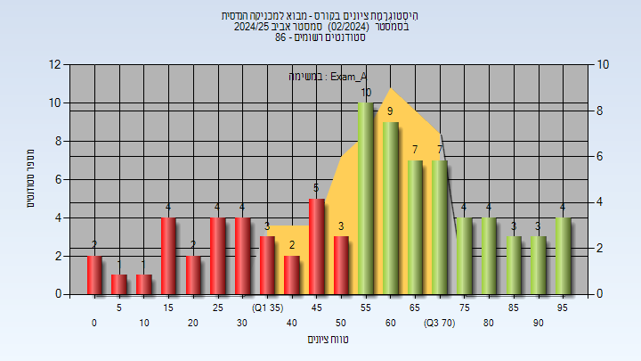

| סטודנטים | עברו/נכשלו | אחוז עוברים | ציון מינימלי | ציון מקסימלי | ממוצע | חציון |
| ---- | ---- | ---- | ---- | ---- | ---- | ---- |
| 82 | 51/31 | 62 | 1 | 97 | 56.702 | 59.925 |

<h3 id="202402-Final_A">סופי מועד א'</h3>

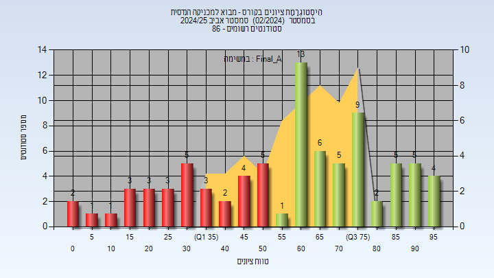

| סטודנטים | עברו/נכשלו | אחוז עוברים | ציון מינימלי | ציון מקסימלי | ממוצע | חציון |
| ---- | ---- | ---- | ---- | ---- | ---- | ---- |
| 82 | 50/32 | 61 | 1 | 97 | 58.415 | 63.5 |

<h3 id="202402-Exam_B">מבחן מועד ב'</h3>

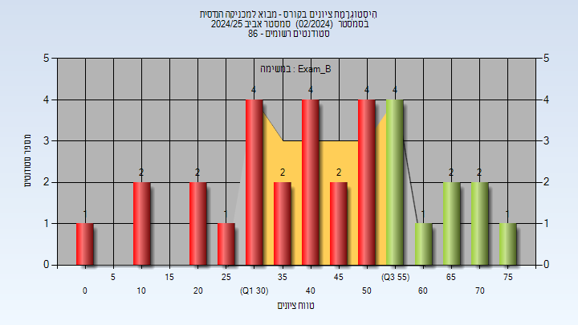

| סטודנטים | עברו/נכשלו | אחוז עוברים | ציון מינימלי | ציון מקסימלי | ממוצע | חציון |
| ---- | ---- | ---- | ---- | ---- | ---- | ---- |
| 32 | 10/22 | 31 | 2 | 79 | 44.25 | 45 |

<h3 id="202402-Final_B">סופי מועד ב'</h3>

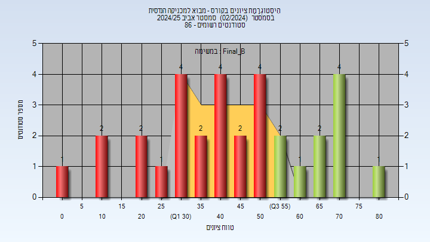

| סטודנטים | עברו/נכשלו | אחוז עוברים | ציון מינימלי | ציון מקסימלי | ממוצע | חציון |
| ---- | ---- | ---- | ---- | ---- | ---- | ---- |
| 32 | 10/22 | 31 | 2 | 83 | 45.094 | 45 |

<h3 id="202402-Finals">סופי</h3>

| סטודנטים | עברו/נכשלו | אחוז עוברים | ציון מינימלי | ציון מקסימלי | ממוצע | חציון |
| ---- | ---- | ---- | ---- | ---- | ---- | ---- |
| 82 | 50/32 | 61 | 1 | 97 | 58.415 | 63.5 |

<h2 id="202401">חורף 2024-2025</h2>

| איש סגל | תפקיד |
| ---- | ---- |
| ג'בארין מחמוד | מרצה - אחראי מקצוע |
| הלר שירי | סגל מנהלי - עם הרשאות מרצה אחראי |
| שביט שרית | סגל מנהלי - עם הרשאות מרצה אחראי |
| לוינסקי יעל | סגל מנהלי - עם הרשאות מרצה אחראי |

<h3 id="202401-Exam_A">מבחן מועד א'</h3>

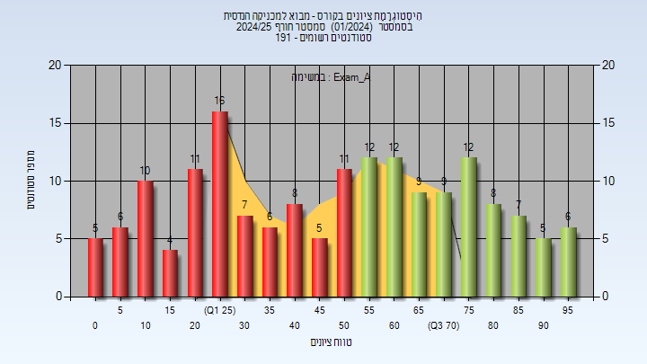

| סטודנטים | עברו/נכשלו | אחוז עוברים | ציון מינימלי | ציון מקסימלי | ממוצע | חציון |
| ---- | ---- | ---- | ---- | ---- | ---- | ---- |
| 169 | 80/89 | 47 | 1 | 99 | 49.604 | 52 |

<h3 id="202401-Final_A">סופי מועד א'</h3>

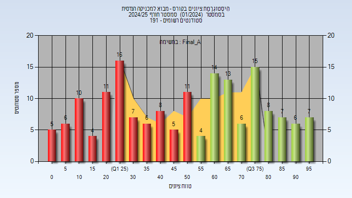

| סטודנטים | עברו/נכשלו | אחוז עוברים | ציון מינימלי | ציון מקסימלי | ממוצע | חציון |
| ---- | ---- | ---- | ---- | ---- | ---- | ---- |
| 169 | 80/89 | 47 | 1 | 99 | 50.669 | 52 |

<h3 id="202401-Exam_B">מבחן מועד ב'</h3>

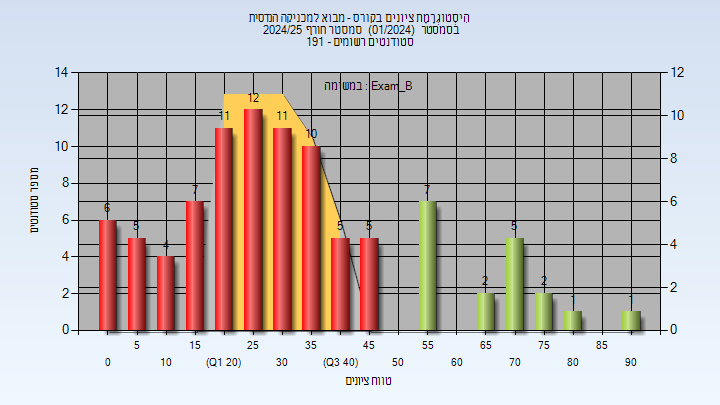

| סטודנטים | עברו/נכשלו | אחוז עוברים | ציון מינימלי | ציון מקסימלי | ממוצע | חציון |
| ---- | ---- | ---- | ---- | ---- | ---- | ---- |
| 94 | 18/76 | 19 | 0 | 90 | 33.926 | 31 |

<h3 id="202401-Final_B">סופי מועד ב'</h3>

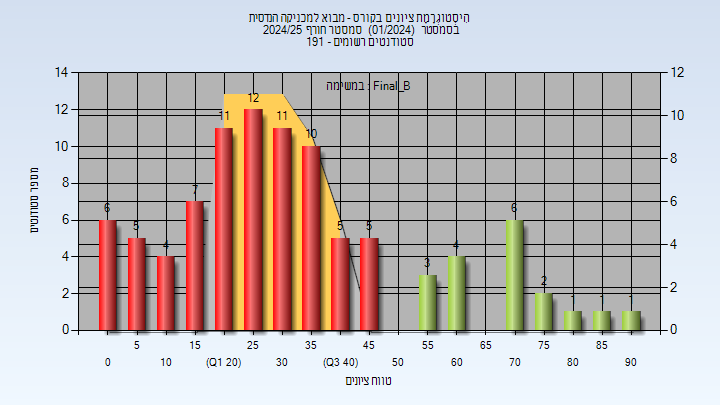

| סטודנטים | עברו/נכשלו | אחוז עוברים | ציון מינימלי | ציון מקסימלי | ממוצע | חציון |
| ---- | ---- | ---- | ---- | ---- | ---- | ---- |
| 94 | 18/76 | 19 | 0 | 91 | 34.426 | 31 |

<h3 id="202401-Finals">סופי</h3>

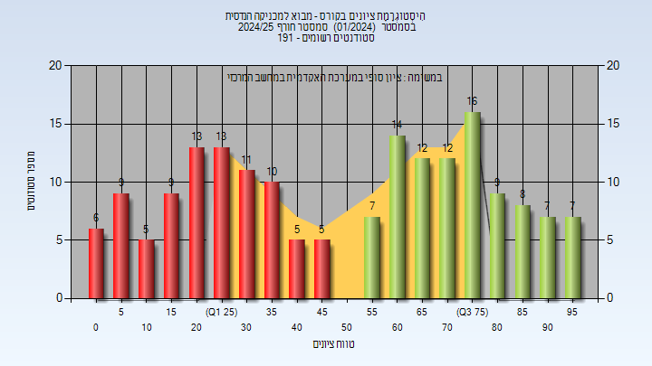

| סטודנטים | עברו/נכשלו | אחוז עוברים | ציון מינימלי | ציון מקסימלי | ממוצע | חציון |
| ---- | ---- | ---- | ---- | ---- | ---- | ---- |
| 191 | 92/99 | 48 | 0 | 99 | 50.893 | 59 |

<h2 id="202302">אביב 2024</h2>

| איש סגל | תפקיד |
| ---- | ---- |
| קרינסקי יורי | מרצה - אחראי מקצוע |
| בלסברג עליזה | סגל מנהלי - עם הרשאות מרצה אחראי |
| צאצאשוילי תמי | סגל מנהלי - עם הרשאות מרצה אחראי |
| שביט שרית | סגל מנהלי - עם הרשאות מרצה אחראי |
| צעירי קובלר קרן | סגל מנהלי - עם הרשאות מרצה אחראי |
| בן-סימון צפורה | סגל מנהלי - עם הרשאות מרצה אחראי |
| מלכה אופירה | סגל מנהלי - עם הרשאות מרצה אחראי |
| לוינסקי יעל | סגל מנהלי - עם הרשאות מרצה אחראי |

<h3 id="202302-Final_A">סופי מועד א'</h3>

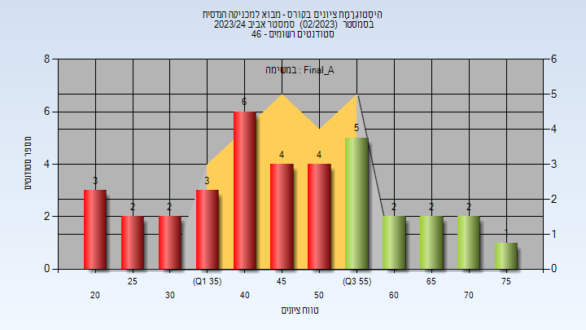

| סטודנטים | עברו/נכשלו | אחוז עוברים | ציון מינימלי | ציון מקסימלי | ממוצע | חציון |
| ---- | ---- | ---- | ---- | ---- | ---- | ---- |
| 36 | 12/24 | 33 | 22 | 77 | 47.194 | 48 |

<h3 id="202302-Final_B">סופי מועד ב'</h3>

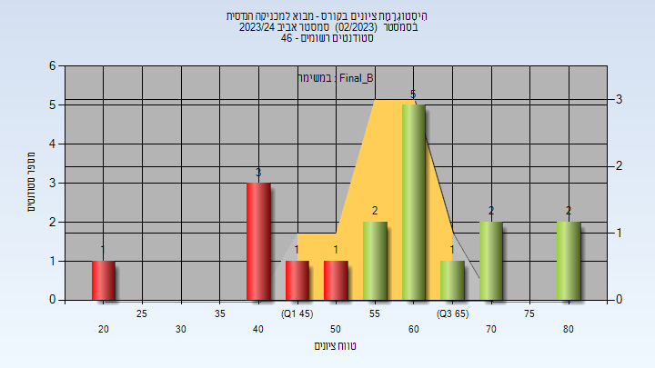

| סטודנטים | עברו/נכשלו | אחוז עוברים | ציון מינימלי | ציון מקסימלי | ממוצע | חציון |
| ---- | ---- | ---- | ---- | ---- | ---- | ---- |
| 18 | 12/6 | 67 | 21 | 80 | 57.889 | 62 |

<h2 id="202301">חורף 2023-2024</h2>

| איש סגל | תפקיד |
| ---- | ---- |
| ג'בארין מחמוד | מרצה - אחראי מקצוע |
| בן-סימון צפורה | סגל מנהלי - עם הרשאות מרצה אחראי |
| צאצאשוילי תמי | סגל מנהלי - עם הרשאות מרצה אחראי |
| לוינסקי יעל | סגל מנהלי - עם הרשאות מרצה אחראי |
| שביט שרית | סגל מנהלי - עם הרשאות מרצה אחראי |
| בלסברג עליזה | סגל מנהלי - עם הרשאות מרצה אחראי |

<h3 id="202301-Exam_A">מבחן מועד א'</h3>

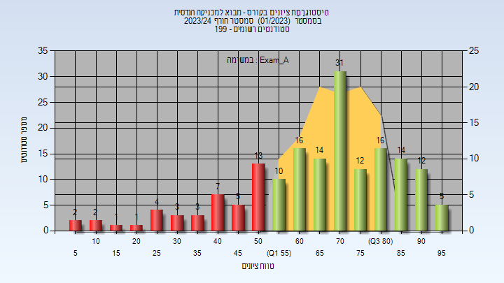

| סטודנטים | עברו/נכשלו | אחוז עוברים | ציון מינימלי | ציון מקסימלי | ממוצע | חציון |
| ---- | ---- | ---- | ---- | ---- | ---- | ---- |
| 171 | 130/41 | 76 | 6 | 96 | 66.368 | 70 |

<h3 id="202301-Final_A">סופי מועד א'</h3>

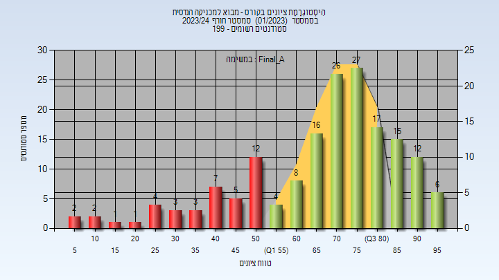

| סטודנטים | עברו/נכשלו | אחוז עוברים | ציון מינימלי | ציון מקסימלי | ממוצע | חציון |
| ---- | ---- | ---- | ---- | ---- | ---- | ---- |
| 171 | 131/40 | 77 | 6 | 96 | 68.398 | 73 |

<h3 id="202301-Exam_B">מבחן מועד ב'</h3>

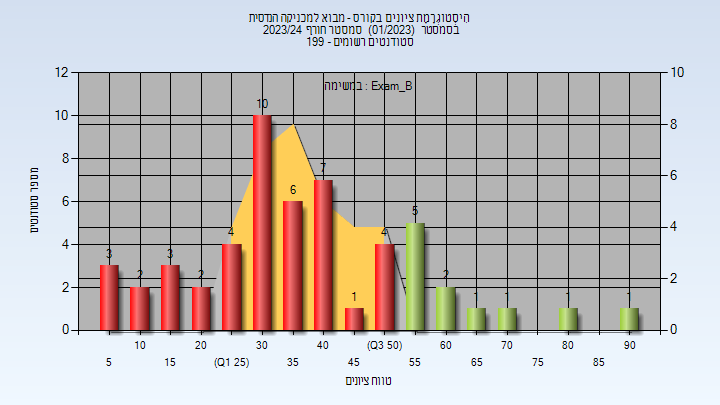

| סטודנטים | עברו/נכשלו | אחוז עוברים | ציון מינימלי | ציון מקסימלי | ממוצע | חציון |
| ---- | ---- | ---- | ---- | ---- | ---- | ---- |
| 53 | 11/42 | 21 | 7 | 93 | 39.075 | 37 |

<h3 id="202301-Final_B">סופי מועד ב'</h3>

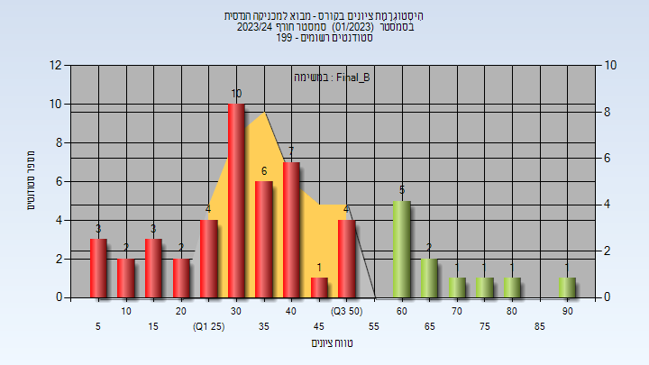

| סטודנטים | עברו/נכשלו | אחוז עוברים | ציון מינימלי | ציון מקסימלי | ממוצע | חציון |
| ---- | ---- | ---- | ---- | ---- | ---- | ---- |
| 53 | 11/42 | 21 | 7 | 94 | 39.943 | 37 |

<h3 id="202301-Finals">סופי</h3>

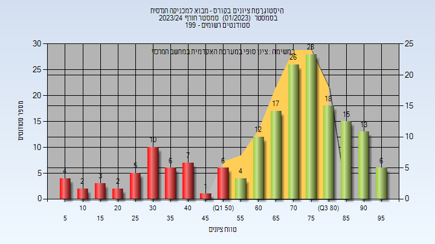

| סטודנטים | עברו/נכשלו | אחוז עוברים | ציון מינימלי | ציון מקסימלי | ממוצע | חציון |
| ---- | ---- | ---- | ---- | ---- | ---- | ---- |
| 185 | 139/46 | 75 | 6 | 96 | 65.978 | 73 |

