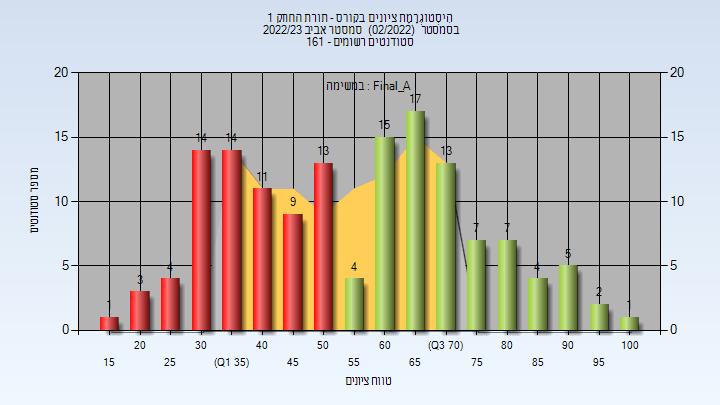
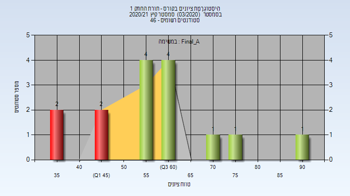
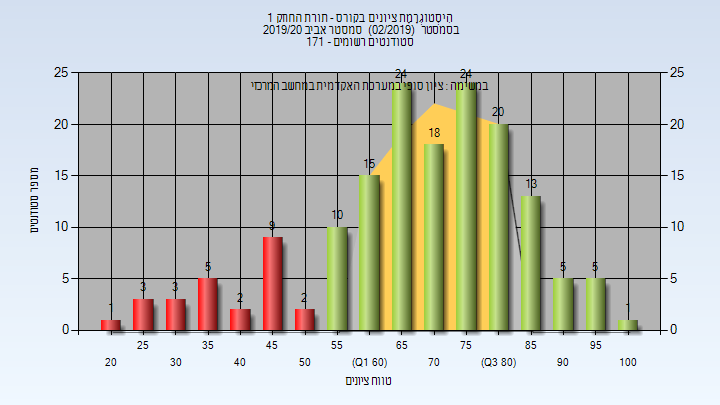
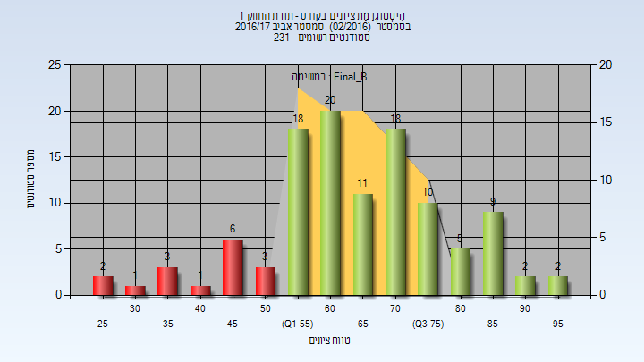

# 00140104 - תורת החוזק 1

**הערה**: מאגר ההיסטוגרמות הוקם עבור [CheeseFork](https://cheesefork.cf/), כלי בניית מערכת שעות עבור סטודנטים בטכניון. באתר בו אתם גולשים ניתן לעיין בהיסטוגרמות, אך הדרך היותר נוחה היא לעיין בהיסטוגרמות, ובמידע נוסף כגון חוות דעת של סטודנטים, באתר CheeseFork.

* [אביב 2024](#202302)
  * [מבחן מועד א'](#202302-Exam_A)
  * [סופי מועד א'](#202302-Final_A)
  * [מבחן מועד ב'](#202302-Exam_B)
  * [סופי מועד ב'](#202302-Final_B)
  * [סופי](#202302-Finals)
* [אביב 2023](#202202)
  * [מבחן מועד א'](#202202-Exam_A)
  * [סופי מועד א'](#202202-Final_A)
  * [מבחן מועד ב'](#202202-Exam_B)
  * [סופי מועד ב'](#202202-Final_B)
  * [סופי](#202202-Finals)
* [קיץ 2022](#202103)
  * [מבחן מועד א'](#202103-Exam_A)
  * [סופי מועד א'](#202103-Final_A)
  * [מבחן מועד ב'](#202103-Exam_B)
  * [סופי מועד ב'](#202103-Final_B)
  * [סופי](#202103-Finals)
* [אביב 2022](#202102)
  * [מבחן מועד א'](#202102-Exam_A)
  * [סופי מועד א'](#202102-Final_A)
  * [מבחן מועד ב'](#202102-Exam_B)
  * [סופי מועד ב'](#202102-Final_B)
  * [סופי](#202102-Finals)
* [חורף 2021-2022](#202101)
* [קיץ 2021](#202003)
  * [סופי מועד א'](#202003-Final_A)
  * [סופי מועד ב'](#202003-Final_B)
  * [סופי](#202003-Finals)
* [אביב 2021](#202002)
  * [סופי מועד א'](#202002-Final_A)
  * [סופי מועד ב'](#202002-Final_B)
  * [סופי](#202002-Finals)
* [חורף 2020-2021](#202001)
  * [סופי מועד א'](#202001-Final_A)
  * [סופי מועד ב'](#202001-Final_B)
  * [סופי](#202001-Finals)
* [קיץ 2020](#201903)
  * [סופי מועד א'](#201903-Final_A)
  * [סופי](#201903-Finals)
* [אביב 2020](#201902)
  * [סופי מועד א'](#201902-Final_A)
  * [סופי מועד ב'](#201902-Final_B)
  * [סופי](#201902-Finals)
* [חורף 2019-2020](#201901)
  * [סופי](#201901-Finals)
* [קיץ 2019](#201803)
  * [סופי](#201803-Finals)
* [אביב 2019](#201802)
  * [סופי מועד א'](#201802-Final_A)
  * [סופי מועד ב'](#201802-Final_B)
  * [סופי](#201802-Finals)
* [חורף 2018-2019](#201801)
  * [סופי](#201801-Finals)
* [קיץ 2018](#201703)
  * [סופי מועד א'](#201703-Final_A)
  * [סופי](#201703-Finals)
* [אביב 2018](#201702)
  * [סופי מועד א'](#201702-Final_A)
  * [סופי מועד ב'](#201702-Final_B)
  * [סופי](#201702-Finals)
* [קיץ 2017](#201603)
  * [סופי מועד א'](#201603-Final_A)
  * [סופי](#201603-Finals)
* [אביב 2017](#201602)
  * [סופי מועד א'](#201602-Final_A)
  * [סופי מועד ב'](#201602-Final_B)
  * [סופי](#201602-Finals)
* [קיץ 2016](#201503)
  * [סופי מועד א'](#201503-Final_A)
  * [סופי מועד ב'](#201503-Final_B)
  * [סופי](#201503-Finals)
* [אביב 2016](#201502)
  * [סופי מועד א'](#201502-Final_A)
  * [סופי מועד ב'](#201502-Final_B)
  * [סופי](#201502-Finals)
* [אביב 2015](#201402)
  * [סופי מועד א'](#201402-Final_A)
  * [סופי מועד ב'](#201402-Final_B)
  * [סופי](#201402-Finals)
* [חורף 2014-2015](#201401)
  * [סופי](#201401-Finals)

<h2 id="202302">אביב 2024</h2>

| איש סגל | תפקיד |
| ---- | ---- |
| גריסרו יחזקאל )חז | מרצה - אחראי מקצוע |
| לוינסקי יעל | סגל מנהלי - עם הרשאות מרצה אחראי |
| שביט שרית | סגל מנהלי - עם הרשאות מרצה אחראי |
| בן-סימון ציפורה | סגל מנהלי - עם הרשאות מרצה אחראי |
| צאצאשוילי תמי | סגל מנהלי - עם הרשאות מרצה אחראי |
| בלסברג עליזה | סגל מנהלי - עם הרשאות מרצה אחראי |

<h3 id="202302-Exam_A">מבחן מועד א'</h3>

| סטודנטים | עברו/נכשלו | אחוז עוברים | ציון מינימלי | ציון מקסימלי | ממוצע | חציון |
| ---- | ---- | ---- | ---- | ---- | ---- | ---- |
| 146 | 52/94 | 36 | 4 | 101 | 47.048 | 45.5 |

<h3 id="202302-Final_A">סופי מועד א'</h3>

| סטודנטים | עברו/נכשלו | אחוז עוברים | ציון מינימלי | ציון מקסימלי | ממוצע | חציון |
| ---- | ---- | ---- | ---- | ---- | ---- | ---- |
| 146 | 54/92 | 37 | 4 | 100 | 48.438 | 45.5 |

<h3 id="202302-Exam_B">מבחן מועד ב'</h3>

| סטודנטים | עברו/נכשלו | אחוז עוברים | ציון מינימלי | ציון מקסימלי | ממוצע | חציון |
| ---- | ---- | ---- | ---- | ---- | ---- | ---- |
| 95 | 58/37 | 61 | 15 | 94 | 58.021 | 60 |

<h3 id="202302-Final_B">סופי מועד ב'</h3>

| סטודנטים | עברו/נכשלו | אחוז עוברים | ציון מינימלי | ציון מקסימלי | ממוצע | חציון |
| ---- | ---- | ---- | ---- | ---- | ---- | ---- |
| 95 | 58/37 | 61 | 15 | 95 | 59.905 | 64 |

<h3 id="202302-Finals">סופי</h3>

| סטודנטים | עברו/נכשלו | אחוז עוברים | ציון מינימלי | ציון מקסימלי | ממוצע | חציון |
| ---- | ---- | ---- | ---- | ---- | ---- | ---- |
| 156 | 108/48 | 69 | 12 | 100 | 61.63 | 67 |

<h2 id="202202">אביב 2023</h2>

| איש סגל | תפקיד |
| ---- | ---- |
| גריסרו יחזקאל )חז | מרצה - אחראי מקצוע |
| מלכה אופירה | סגל מנהלי - עם הרשאות מרצה אחראי |
| בלסברג עליזה | סגל מנהלי - עם הרשאות מרצה אחראי |
| בן-סימון ציפורה | סגל מנהלי - עם הרשאות מרצה אחראי |
| לוינסקי יעל | סגל מנהלי - עם הרשאות מרצה אחראי |
| צאצאשוילי תמי | סגל מנהלי - עם הרשאות מרצה אחראי |
| שביט שרית | סגל מנהלי - עם הרשאות מרצה אחראי |
| קובלר קרן | סגל מנהלי - עם הרשאות מרצה אחראי |

<h3 id="202202-Exam_A">מבחן מועד א'</h3>

| סטודנטים | עברו/נכשלו | אחוז עוברים | ציון מינימלי | ציון מקסימלי | ממוצע | חציון |
| ---- | ---- | ---- | ---- | ---- | ---- | ---- |
| 144 | 75/69 | 52 | 19 | 103 | 54.938 | 55 |

<h3 id="202202-Final_A">סופי מועד א'</h3>

| סטודנטים | עברו/נכשלו | אחוז עוברים | ציון מינימלי | ציון מקסימלי | ממוצע | חציון |
| ---- | ---- | ---- | ---- | ---- | ---- | ---- |
| 144 | 75/69 | 52 | 19 | 100 | 56.819 | 59 |

<h3 id="202202-Exam_B">מבחן מועד ב'</h3>

| סטודנטים | עברו/נכשלו | אחוז עוברים | ציון מינימלי | ציון מקסימלי | ממוצע | חציון |
| ---- | ---- | ---- | ---- | ---- | ---- | ---- |
| 75 | 49/26 | 65 | 0 | 94 | 59.027 | 62 |

<h3 id="202202-Final_B">סופי מועד ב'</h3>

| סטודנטים | עברו/נכשלו | אחוז עוברים | ציון מינימלי | ציון מקסימלי | ממוצע | חציון |
| ---- | ---- | ---- | ---- | ---- | ---- | ---- |
| 75 | 50/25 | 67 | 0 | 95 | 60.84 | 66 |

<h3 id="202202-Finals">סופי</h3>

| סטודנטים | עברו/נכשלו | אחוז עוברים | ציון מינימלי | ציון מקסימלי | ממוצע | חציון |
| ---- | ---- | ---- | ---- | ---- | ---- | ---- |
| 150 | 126/24 | 84 | 5 | 100 | 67.913 | 71 |

<h2 id="202103">קיץ 2022</h2>

| איש סגל | תפקיד |
| ---- | ---- |
| גריסרו יחזקאל (חזי) | מרצה - אחראי מקצוע |
| בן-סימון צפורה | סגל מנהלי - עם הרשאות מרצה אחראי |
| מלכה אופירה | סגל מנהלי - עם הרשאות מרצה אחראי |
| שביט שרית | סגל מנהלי - עם הרשאות מרצה אחראי |
| צעירי קובלר קרן | סגל מנהלי - עם הרשאות מרצה אחראי |
| צאצאשוילי תמי | סגל מנהלי - עם הרשאות מרצה אחראי |
| בלסברג עליזה | סגל מנהלי - עם הרשאות מרצה אחראי |

<h3 id="202103-Exam_A">מבחן מועד א'</h3>

| סטודנטים | עברו/נכשלו | אחוז עוברים | ציון מינימלי | ציון מקסימלי | ממוצע | חציון |
| ---- | ---- | ---- | ---- | ---- | ---- | ---- |
| 27 | 13/14 | 48 | 3 | 92 | 55.222 | 49 |

<h3 id="202103-Final_A">סופי מועד א'</h3>

| סטודנטים | עברו/נכשלו | אחוז עוברים | ציון מינימלי | ציון מקסימלי | ממוצע | חציון |
| ---- | ---- | ---- | ---- | ---- | ---- | ---- |
| 28 | 14/14 | 50 | 3 | 92 | 55.929 | 58.5 |

<h3 id="202103-Exam_B">מבחן מועד ב'</h3>

| סטודנטים | עברו/נכשלו | אחוז עוברים | ציון מינימלי | ציון מקסימלי | ממוצע | חציון |
| ---- | ---- | ---- | ---- | ---- | ---- | ---- |
| 30 | 11/19 | 37 | 6 | 85 | 42.1 | 46.5 |

<h3 id="202103-Final_B">סופי מועד ב'</h3>

| סטודנטים | עברו/נכשלו | אחוז עוברים | ציון מינימלי | ציון מקסימלי | ממוצע | חציון |
| ---- | ---- | ---- | ---- | ---- | ---- | ---- |
| 30 | 11/19 | 37 | 6 | 87 | 44.033 | 46.5 |

<h3 id="202103-Finals">סופי</h3>

| סטודנטים | עברו/נכשלו | אחוז עוברים | ציון מינימלי | ציון מקסימלי | ממוצע | חציון |
| ---- | ---- | ---- | ---- | ---- | ---- | ---- |
| 44 | 26/18 | 59 | 6 | 92 | 54.182 | 64 |

<h2 id="202102">אביב 2022</h2>

| איש סגל | תפקיד |
| ---- | ---- |
| גריסרו יחזקאל )חז | מרצה - אחראי מקצוע |
| בלסברג עליזה | סגל מנהלי - עם הרשאות מרצה אחראי |
| מלכה אופירה | סגל מנהלי - עם הרשאות מרצה אחראי |
| לוינסקי יעל | סגל מנהלי - עם הרשאות מרצה אחראי |
| שביט שרית | סגל מנהלי - עם הרשאות מרצה אחראי |
| קובלר קרן | סגל מנהלי - עם הרשאות מרצה אחראי |
| צאצאשוילי תמי | סגל מנהלי - עם הרשאות מרצה אחראי |
| בן-סימון ציפורה | סגל מנהלי - עם הרשאות מרצה אחראי |

<h3 id="202102-Exam_A">מבחן מועד א'</h3>

| סטודנטים | עברו/נכשלו | אחוז עוברים | ציון מינימלי | ציון מקסימלי | ממוצע | חציון |
| ---- | ---- | ---- | ---- | ---- | ---- | ---- |
| 182 | 131/51 | 72 | 5 | 100 | 63.582 | 65.5 |

<h3 id="202102-Final_A">סופי מועד א'</h3>

| סטודנטים | עברו/נכשלו | אחוז עוברים | ציון מינימלי | ציון מקסימלי | ממוצע | חציון |
| ---- | ---- | ---- | ---- | ---- | ---- | ---- |
| 182 | 132/50 | 73 | 5 | 100 | 65.962 | 69.5 |

<h3 id="202102-Exam_B">מבחן מועד ב'</h3>

| סטודנטים | עברו/נכשלו | אחוז עוברים | ציון מינימלי | ציון מקסימלי | ממוצע | חציון |
| ---- | ---- | ---- | ---- | ---- | ---- | ---- |
| 67 | 32/35 | 48 | 2 | 90 | 54.119 | 53 |

<h3 id="202102-Final_B">סופי מועד ב'</h3>

| סטודנטים | עברו/נכשלו | אחוז עוברים | ציון מינימלי | ציון מקסימלי | ממוצע | חציון |
| ---- | ---- | ---- | ---- | ---- | ---- | ---- |
| 67 | 34/33 | 51 | 2 | 91 | 55.955 | 53 |

<h3 id="202102-Finals">סופי</h3>

| סטודנטים | עברו/נכשלו | אחוז עוברים | ציון מינימלי | ציון מקסימלי | ממוצע | חציון |
| ---- | ---- | ---- | ---- | ---- | ---- | ---- |
| 198 | 162/36 | 82 | 2 | 100 | 69.389 | 71.5 |

<h2 id="202101">חורף 2021-2022</h2>

<h2 id="202003">קיץ 2021</h2>

| איש סגל | תפקיד |
| ---- | ---- |
| קרינסקי יורי | מרצה - אחראי מקצוע |
| בן-סימון ציפורה | סגל מנהלי - עם הרשאות מרצה אחראי |
| צאצאשוילי תמי | סגל מנהלי - עם הרשאות מרצה אחראי |
| קובלר קרן | סגל מנהלי - עם הרשאות מרצה אחראי |
| לוינסקי יעל | סגל מנהלי - עם הרשאות מרצה אחראי |
| מלכה אופירה | סגל מנהלי - עם הרשאות מרצה אחראי |
| שביט שרית | סגל מנהלי - עם הרשאות מרצה אחראי |
| בלסברג עליזה | סגל מנהלי - עם הרשאות מרצה אחראי |

<h3 id="202003-Final_A">סופי מועד א'</h3>

| סטודנטים | עברו/נכשלו | אחוז עוברים | ציון מינימלי | ציון מקסימלי | ממוצע | חציון |
| ---- | ---- | ---- | ---- | ---- | ---- | ---- |
| 15 | 11/4 | 73 | 36 | 91 | 58.533 | 55 |

<h3 id="202003-Final_B">סופי מועד ב'</h3>

| סטודנטים | עברו/נכשלו | אחוז עוברים | ציון מינימלי | ציון מקסימלי | ממוצע | חציון |
| ---- | ---- | ---- | ---- | ---- | ---- | ---- |
| 17 | 8/9 | 47 | 18 | 70 | 44 | 44 |

<h3 id="202003-Finals">סופי</h3>

| סטודנטים | עברו/נכשלו | אחוז עוברים | ציון מינימלי | ציון מקסימלי | ממוצע | חציון |
| ---- | ---- | ---- | ---- | ---- | ---- | ---- |
| 27 | 19/8 | 70 | 18 | 91 | 54.296 | 55 |

<h2 id="202002">אביב 2021</h2>

| איש סגל | תפקיד |
| ---- | ---- |
| גריסרו יחזקאל )חז | מרצה - אחראי מקצוע |
| שביט שרית | סגל מנהלי - עם הרשאות מרצה אחראי |
| מלכה אופירה | סגל מנהלי - עם הרשאות מרצה אחראי |
| בן-סימון ציפורה | סגל מנהלי - עם הרשאות מרצה אחראי |
| לוינסקי יעל | סגל מנהלי - עם הרשאות מרצה אחראי |
| צאצאשוילי תמי | סגל מנהלי - עם הרשאות מרצה אחראי |
| בלסברג עליזה | סגל מנהלי - עם הרשאות מרצה אחראי |
| קובלר קרן | סגל מנהלי - עם הרשאות מרצה אחראי |

<h3 id="202002-Final_A">סופי מועד א'</h3>

| סטודנטים | עברו/נכשלו | אחוז עוברים | ציון מינימלי | ציון מקסימלי | ממוצע | חציון |
| ---- | ---- | ---- | ---- | ---- | ---- | ---- |
| 144 | 62/82 | 43 | 0 | 99 | 50.778 | 46.5 |

<h3 id="202002-Final_B">סופי מועד ב'</h3>

| סטודנטים | עברו/נכשלו | אחוז עוברים | ציון מינימלי | ציון מקסימלי | ממוצע | חציון |
| ---- | ---- | ---- | ---- | ---- | ---- | ---- |
| 95 | 39/56 | 41 | 0 | 96 | 50.316 | 47 |

<h3 id="202002-Finals">סופי</h3>

| סטודנטים | עברו/נכשלו | אחוז עוברים | ציון מינימלי | ציון מקסימלי | ממוצע | חציון |
| ---- | ---- | ---- | ---- | ---- | ---- | ---- |
| 160 | 102/58 | 64 | 7 | 99 | 59.412 | 66 |

<h2 id="202001">חורף 2020-2021</h2>

| איש סגל | תפקיד |
| ---- | ---- |
| בשארה דאנא | מרצה - אחראי מקצוע |

<h3 id="202001-Final_A">סופי מועד א'</h3>

| סטודנטים | עברו/נכשלו | אחוז עוברים | ציון מינימלי | ציון מקסימלי | ממוצע | חציון |
| ---- | ---- | ---- | ---- | ---- | ---- | ---- |
| 17 | 12/5 | 71 | 7 | 100 | 64.706 | 75 |

<h3 id="202001-Final_B">סופי מועד ב'</h3>

| סטודנטים | עברו/נכשלו | אחוז עוברים | ציון מינימלי | ציון מקסימלי | ממוצע | חציון |
| ---- | ---- | ---- | ---- | ---- | ---- | ---- |
| 11 | 11/0 | 100 | 62 | 82 | 73 | 72 |

<h3 id="202001-Finals">סופי</h3>

| סטודנטים | עברו/נכשלו | אחוז עוברים | ציון מינימלי | ציון מקסימלי | ממוצע | חציון |
| ---- | ---- | ---- | ---- | ---- | ---- | ---- |
| 21 | 21/0 | 100 | 62 | 100 | 76.143 | 75 |

<h2 id="201903">קיץ 2020</h2>

| איש סגל | תפקיד |
| ---- | ---- |
| קרינסקי יורי | מרצה - אחראי מקצוע |
| צאצאשוילי תמי | סגל מנהלי - עם הרשאות מרצה אחראי |
| שביט שרית | סגל מנהלי - עם הרשאות מרצה אחראי |

<h3 id="201903-Final_A">סופי מועד א'</h3>

| סטודנטים | עברו/נכשלו | אחוז עוברים | ציון מינימלי | ציון מקסימלי | ממוצע | חציון |
| ---- | ---- | ---- | ---- | ---- | ---- | ---- |
| 19 | 16/3 | 84 | 32 | 85 | 63.316 | 60 |

<h3 id="201903-Finals">סופי</h3>

| סטודנטים | עברו/נכשלו | אחוז עוברים | ציון מינימלי | ציון מקסימלי | ממוצע | חציון |
| ---- | ---- | ---- | ---- | ---- | ---- | ---- |
| 24 | 22/2 | 92 | 45 | 85 | 66.458 | 68 |

<h2 id="201902">אביב 2020</h2>

| איש סגל | תפקיד |
| ---- | ---- |
| איזנברגר משה | מרצה - אחראי מקצוע |
| שביט שרית | סגל מנהלי - עם הרשאות מרצה אחראי |
| צאצאשוילי תמי | סגל מנהלי - עם הרשאות מרצה אחראי |

<h3 id="201902-Final_A">סופי מועד א'</h3>

| סטודנטים | עברו/נכשלו | אחוז עוברים | ציון מינימלי | ציון מקסימלי | ממוצע | חציון |
| ---- | ---- | ---- | ---- | ---- | ---- | ---- |
| 126 | 90/36 | 71 | 20 | 97 | 65.357 | 68 |

<h3 id="201902-Final_B">סופי מועד ב'</h3>

| סטודנטים | עברו/נכשלו | אחוז עוברים | ציון מינימלי | ציון מקסימלי | ממוצע | חציון |
| ---- | ---- | ---- | ---- | ---- | ---- | ---- |
| 76 | 50/26 | 66 | 0 | 99.7 | 60.075 | 63.1875 |

<h3 id="201902-Finals">סופי</h3>

| סטודנטים | עברו/נכשלו | אחוז עוברים | ציון מינימלי | ציון מקסימלי | ממוצע | חציון |
| ---- | ---- | ---- | ---- | ---- | ---- | ---- |
| 160 | 135/25 | 84 | 20 | 100 | 68.731 | 72 |

<h2 id="201901">חורף 2019-2020</h2>

| איש סגל | תפקיד |
| ---- | ---- |
| פלדפוגל שי | מרצה - אחראי מקצוע |
| ארודיתה סליג'י | מרצה |

<h3 id="201901-Finals">סופי</h3>

| סטודנטים | עברו/נכשלו | אחוז עוברים | ציון מינימלי | ציון מקסימלי | ממוצע | חציון |
| ---- | ---- | ---- | ---- | ---- | ---- | ---- |
| 12 | 12/0 | 100 | 67 | 97 | 83.917 | 85.5 |

<h2 id="201803">קיץ 2019</h2>

| איש סגל | תפקיד |
| ---- | ---- |
| קרינסקי יורי | מרצה - אחראי מקצוע |
| צאצאשוילי תמי | סגל מנהלי - עם הרשאות מרצה אחראי |
| שביט שרית | סגל מנהלי - עם הרשאות מרצה אחראי |

<h3 id="201803-Finals">סופי</h3>

| סטודנטים | עברו/נכשלו | אחוז עוברים | ציון מינימלי | ציון מקסימלי | ממוצע | חציון |
| ---- | ---- | ---- | ---- | ---- | ---- | ---- |
| 11 | 9/2 | 82 | 26 | 90 | 68.273 | 64 |

<h2 id="201802">אביב 2019</h2>

| איש סגל | תפקיד |
| ---- | ---- |
| איזנברגר משה | מרצה - אחראי מקצוע |

<h3 id="201802-Final_A">סופי מועד א'</h3>

| סטודנטים | עברו/נכשלו | אחוז עוברים | ציון מינימלי | ציון מקסימלי | ממוצע | חציון |
| ---- | ---- | ---- | ---- | ---- | ---- | ---- |
| 166 | 132/34 | 80 | 18.6 | 100 | 69.334 | 69.2 |

<h3 id="201802-Final_B">סופי מועד ב'</h3>

| סטודנטים | עברו/נכשלו | אחוז עוברים | ציון מינימלי | ציון מקסימלי | ממוצע | חציון |
| ---- | ---- | ---- | ---- | ---- | ---- | ---- |
| 64 | 48/16 | 75 | 18.1 | 100 | 67.83 | 71.2 |

<h3 id="201802-Finals">סופי</h3>

| סטודנטים | עברו/נכשלו | אחוז עוברים | ציון מינימלי | ציון מקסימלי | ממוצע | חציון |
| ---- | ---- | ---- | ---- | ---- | ---- | ---- |
| 181 | 170/11 | 94 | 18 | 100 | 74.74 | 75 |

<h2 id="201801">חורף 2018-2019</h2>

| איש סגל | תפקיד |
| ---- | ---- |
| פלדפוגל שי | מרצה - אחראי מקצוע |
| ארודיתה סליג'י | מרצה |

<h3 id="201801-Finals">סופי</h3>

| סטודנטים | עברו/נכשלו | אחוז עוברים | ציון מינימלי | ציון מקסימלי | ממוצע | חציון |
| ---- | ---- | ---- | ---- | ---- | ---- | ---- |
| 22 | 18/4 | 82 | 2 | 99 | 68.591 | 72 |

<h2 id="201703">קיץ 2018</h2>

| איש סגל | תפקיד |
| ---- | ---- |
| קרינסקי יורי | מרצה - אחראי מקצוע |
| שביט שרית | סגל מנהלי - עם הרשאות מרצה אחראי |
| צאצאשוילי תמי | סגל מנהלי - עם הרשאות מרצה אחראי |

<h3 id="201703-Final_A">סופי מועד א'</h3>

| סטודנטים | עברו/נכשלו | אחוז עוברים | ציון מינימלי | ציון מקסימלי | ממוצע | חציון |
| ---- | ---- | ---- | ---- | ---- | ---- | ---- |
| 19 | 19/0 | 100 | 60 | 100 | 79.737 | 76 |

<h3 id="201703-Finals">סופי</h3>

| סטודנטים | עברו/נכשלו | אחוז עוברים | ציון מינימלי | ציון מקסימלי | ממוצע | חציון |
| ---- | ---- | ---- | ---- | ---- | ---- | ---- |
| 25 | 23/2 | 92 | 44 | 100 | 74.64 | 75 |

<h2 id="201702">אביב 2018</h2>

| איש סגל | תפקיד |
| ---- | ---- |
| איזנברגר משה | מרצה - אחראי מקצוע |

<h3 id="201702-Final_A">סופי מועד א'</h3>

| סטודנטים | עברו/נכשלו | אחוז עוברים | ציון מינימלי | ציון מקסימלי | ממוצע | חציון |
| ---- | ---- | ---- | ---- | ---- | ---- | ---- |
| 138 | 92/46 | 67 | 6 | 95.129 | 62.34 | 66.7 |

<h3 id="201702-Final_B">סופי מועד ב'</h3>

| סטודנטים | עברו/נכשלו | אחוז עוברים | ציון מינימלי | ציון מקסימלי | ממוצע | חציון |
| ---- | ---- | ---- | ---- | ---- | ---- | ---- |
| 66 | 55/11 | 83 | 10 | 97.3 | 70.101 | 72.1 |

<h3 id="201702-Finals">סופי</h3>

| סטודנטים | עברו/נכשלו | אחוז עוברים | ציון מינימלי | ציון מקסימלי | ממוצע | חציון |
| ---- | ---- | ---- | ---- | ---- | ---- | ---- |
| 154 | 143/11 | 93 | 6 | 97 | 72.506 | 76 |

<h2 id="201603">קיץ 2017</h2>

| איש סגל | תפקיד |
| ---- | ---- |
| קרינסקי יורי | מרצה - אחראי מקצוע |
| בן-סימון ציפורה | סגל מנהלי - עם הרשאות מרצה אחראי |
| שביט שרית | סגל מנהלי - עם הרשאות מרצה אחראי |
| צאצאשוילי תמי | סגל מנהלי - עם הרשאות מרצה אחראי |

<h3 id="201603-Final_A">סופי מועד א'</h3>

| סטודנטים | עברו/נכשלו | אחוז עוברים | ציון מינימלי | ציון מקסימלי | ממוצע | חציון |
| ---- | ---- | ---- | ---- | ---- | ---- | ---- |
| 25 | 19/6 | 76 | 0 | 91 | 63.999 | 70 |

<h3 id="201603-Finals">סופי</h3>

| סטודנטים | עברו/נכשלו | אחוז עוברים | ציון מינימלי | ציון מקסימלי | ממוצע | חציון |
| ---- | ---- | ---- | ---- | ---- | ---- | ---- |
| 28 | 27/1 | 96 | 34 | 92 | 71.571 | 71.5 |

<h2 id="201602">אביב 2017</h2>

| איש סגל | תפקיד |
| ---- | ---- |
| איזנברגר משה | מרצה - אחראי מקצוע |

<h3 id="201602-Final_A">סופי מועד א'</h3>

| סטודנטים | עברו/נכשלו | אחוז עוברים | ציון מינימלי | ציון מקסימלי | ממוצע | חציון |
| ---- | ---- | ---- | ---- | ---- | ---- | ---- |
| 201 | 129/72 | 64 | 13 | 99 | 58.704 | 62.7 |

<h3 id="201602-Final_B">סופי מועד ב'</h3>

| סטודנטים | עברו/נכשלו | אחוז עוברים | ציון מינימלי | ציון מקסימלי | ממוצע | חציון |
| ---- | ---- | ---- | ---- | ---- | ---- | ---- |
| 111 | 95/16 | 86 | 25.483 | 96.15 | 66.046 | 65 |

<h3 id="201602-Finals">סופי</h3>

| סטודנטים | עברו/נכשלו | אחוז עוברים | ציון מינימלי | ציון מקסימלי | ממוצע | חציון |
| ---- | ---- | ---- | ---- | ---- | ---- | ---- |
| 217 | 201/16 | 93 | 25 | 99 | 69.369 | 69 |

<h2 id="201503">קיץ 2016</h2>

| איש סגל | תפקיד |
| ---- | ---- |
| קרינסקי יורי | מרצה - אחראי מקצוע |
| צאצאשוילי תמי | סגל מנהלי - עם הרשאות מרצה אחראי |
| שביט שרית | סגל מנהלי - עם הרשאות מרצה אחראי |

<h3 id="201503-Final_A">סופי מועד א'</h3>

| סטודנטים | עברו/נכשלו | אחוז עוברים | ציון מינימלי | ציון מקסימלי | ממוצע | חציון |
| ---- | ---- | ---- | ---- | ---- | ---- | ---- |
| 27 | 24/3 | 89 | 44 | 96 | 71.852 | 72 |

<h3 id="201503-Final_B">סופי מועד ב'</h3>

| סטודנטים | עברו/נכשלו | אחוז עוברים | ציון מינימלי | ציון מקסימלי | ממוצע | חציון |
| ---- | ---- | ---- | ---- | ---- | ---- | ---- |
| 13 | 9/4 | 69 | 11 | 88 | 62.462 | 67 |

<h3 id="201503-Finals">סופי</h3>

| סטודנטים | עברו/נכשלו | אחוז עוברים | ציון מינימלי | ציון מקסימלי | ממוצע | חציון |
| ---- | ---- | ---- | ---- | ---- | ---- | ---- |
| 38 | 34/4 | 89 | 11 | 96 | 70.289 | 73.5 |

<h2 id="201502">אביב 2016</h2>

| איש סגל | תפקיד |
| ---- | ---- |
| איזנברגר משה | מרצה - אחראי מקצוע |

<h3 id="201502-Final_A">סופי מועד א'</h3>

| סטודנטים | עברו/נכשלו | אחוז עוברים | ציון מינימלי | ציון מקסימלי | ממוצע | חציון |
| ---- | ---- | ---- | ---- | ---- | ---- | ---- |
| 184 | 148/36 | 80 | 25 | 98 | 69.125 | 71 |

<h3 id="201502-Final_B">סופי מועד ב'</h3>

| סטודנטים | עברו/נכשלו | אחוז עוברים | ציון מינימלי | ציון מקסימלי | ממוצע | חציון |
| ---- | ---- | ---- | ---- | ---- | ---- | ---- |
| 51 | 35/16 | 69 | 22 | 92 | 59.804 | 59 |

<h3 id="201502-Finals">סופי</h3>

| סטודנטים | עברו/נכשלו | אחוז עוברים | ציון מינימלי | ציון מקסימלי | ממוצע | חציון |
| ---- | ---- | ---- | ---- | ---- | ---- | ---- |
| 197 | 182/15 | 92 | 22 | 98 | 70.995 | 71 |

<h2 id="201402">אביב 2015</h2>

| איש סגל | תפקיד |
| ---- | ---- |
| רבינוביץ' עודד | מרצה - אחראי מקצוע |

<h3 id="201402-Final_A">סופי מועד א'</h3>

| סטודנטים | עברו/נכשלו | אחוז עוברים | ציון מינימלי | ציון מקסימלי | ממוצע | חציון |
| ---- | ---- | ---- | ---- | ---- | ---- | ---- |
| 187 | 139/48 | 74 | 18 | 96 | 62.198 | 63 |

<h3 id="201402-Final_B">סופי מועד ב'</h3>

| סטודנטים | עברו/נכשלו | אחוז עוברים | ציון מינימלי | ציון מקסימלי | ממוצע | חציון |
| ---- | ---- | ---- | ---- | ---- | ---- | ---- |
| 79 | 74/5 | 94 | 30 | 91 | 67.165 | 67 |

<h3 id="201402-Finals">סופי</h3>

| סטודנטים | עברו/נכשלו | אחוז עוברים | ציון מינימלי | ציון מקסימלי | ממוצע | חציון |
| ---- | ---- | ---- | ---- | ---- | ---- | ---- |
| 200 | 194/6 | 97 | 30 | 97 | 70.35 | 71 |

<h2 id="201401">חורף 2014-2015</h2>

| איש סגל | תפקיד |
| ---- | ---- |
| קרינסקי יורי | מרצה - אחראי מקצוע |

<h3 id="201401-Finals">סופי</h3>

| סטודנטים | עברו/נכשלו | אחוז עוברים | ציון מינימלי | ציון מקסימלי | ממוצע | חציון |
| ---- | ---- | ---- | ---- | ---- | ---- | ---- |
| 75 | 59/16 | 79 | 23 | 99 | 61.12 | 60 |

