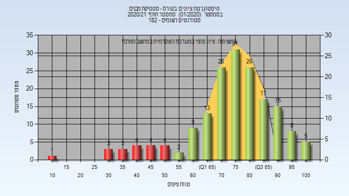

# 00140108 - סטטיקת מבנים

**הערה**: מאגר ההיסטוגרמות הוקם עבור [CheeseFork](https://cheesefork.cf/), כלי בניית מערכת שעות עבור סטודנטים בטכניון. באתר בו אתם גולשים ניתן לעיין בהיסטוגרמות, אך הדרך היותר נוחה היא לעיין בהיסטוגרמות, ובמידע נוסף כגון חוות דעת של סטודנטים, באתר CheeseFork.

* [חורף 2023-2024](#202301)
  * [מבחן מועד א'](#202301-Exam_A)
  * [סופי מועד א'](#202301-Final_A)
  * [מבחן מועד ב'](#202301-Exam_B)
  * [סופי מועד ב'](#202301-Final_B)
  * [סופי](#202301-Finals)
* [חורף 2022-2023](#202201)
  * [מבחן מועד א'](#202201-Exam_A)
  * [סופי מועד א'](#202201-Final_A)
  * [מבחן מועד ב'](#202201-Exam_B)
  * [סופי מועד ב'](#202201-Final_B)
  * [סופי](#202201-Finals)
* [חורף 2021-2022](#202101)
  * [מבחן מועד א'](#202101-Exam_A)
  * [סופי מועד א'](#202101-Final_A)
  * [מבחן מועד ב'](#202101-Exam_B)
  * [סופי מועד ב'](#202101-Final_B)
  * [סופי](#202101-Finals)
* [אביב 2021](#202002)
  * [סופי מועד א'](#202002-Final_A)
  * [סופי](#202002-Finals)
* [חורף 2020-2021](#202001)
  * [מבחן מועד א'](#202001-Exam_A)
  * [סופי מועד א'](#202001-Final_A)
  * [מבחן מועד ב'](#202001-Exam_B)
  * [סופי מועד ב'](#202001-Final_B)
  * [סופי](#202001-Finals)
* [חורף 2019-2020](#201901)
  * [מבחן מועד א'](#201901-Exam_A)
  * [סופי מועד א'](#201901-Final_A)
  * [מבחן מועד ב'](#201901-Exam_B)
  * [סופי מועד ב'](#201901-Final_B)
  * [סופי](#201901-Finals)
* [אביב 2019](#201802)
  * [מבחן מועד א'](#201802-Exam_A)
  * [סופי מועד א'](#201802-Final_A)
  * [מבחן מועד ב'](#201802-Exam_B)
  * [סופי מועד ב'](#201802-Final_B)
  * [סופי](#201802-Finals)
* [חורף 2018-2019](#201801)
  * [סופי מועד א'](#201801-Final_A)
  * [סופי מועד ב'](#201801-Final_B)
  * [סופי](#201801-Finals)
* [חורף 2017-2018](#201701)
  * [סופי מועד א'](#201701-Final_A)
  * [סופי מועד ב'](#201701-Final_B)
  * [סופי](#201701-Finals)
* [חורף 2016-2017](#201601)
  * [מבחן מועד א'](#201601-Exam_A)
  * [סופי מועד א'](#201601-Final_A)
  * [מבחן מועד ב'](#201601-Exam_B)
  * [סופי מועד ב'](#201601-Final_B)
  * [סופי](#201601-Finals)
* [חורף 2015-2016](#201501)
  * [סופי מועד א'](#201501-Final_A)
  * [סופי מועד ב'](#201501-Final_B)
  * [סופי](#201501-Finals)

<h2 id="202301">חורף 2023-2024</h2>

| איש סגל | תפקיד |
| ---- | ---- |
| פוליני ניקולו | מרצה - אחראי מקצוע |
| בלסברג עליזה | סגל מנהלי - עם הרשאות מרצה אחראי |
| לוינסקי יעל | סגל מנהלי - עם הרשאות מרצה אחראי |
| שביט שרית | סגל מנהלי - עם הרשאות מרצה אחראי |
| מלכה אופירה | סגל מנהלי - עם הרשאות מרצה אחראי |
| בן-סימון ציפורה | סגל מנהלי - עם הרשאות מרצה אחראי |
| קובלר קרן | סגל מנהלי - עם הרשאות מרצה אחראי |
| צאצאשוילי תמי | סגל מנהלי - עם הרשאות מרצה אחראי |

<h3 id="202301-Exam_A">מבחן מועד א'</h3>

| סטודנטים | עברו/נכשלו | אחוז עוברים | ציון מינימלי | ציון מקסימלי | ממוצע | חציון |
| ---- | ---- | ---- | ---- | ---- | ---- | ---- |
| 154 | 73/81 | 47 | 0 | 97 | 53.747 | 52.5 |

<h3 id="202301-Final_A">סופי מועד א'</h3>

| סטודנטים | עברו/נכשלו | אחוז עוברים | ציון מינימלי | ציון מקסימלי | ממוצע | חציון |
| ---- | ---- | ---- | ---- | ---- | ---- | ---- |
| 154 | 76/78 | 49 | 0 | 98 | 56.37 | 54 |

<h3 id="202301-Exam_B">מבחן מועד ב'</h3>

| סטודנטים | עברו/נכשלו | אחוז עוברים | ציון מינימלי | ציון מקסימלי | ממוצע | חציון |
| ---- | ---- | ---- | ---- | ---- | ---- | ---- |
| 109 | 50/59 | 46 | 0 | 94 | 50.303 | 51 |

<h3 id="202301-Final_B">סופי מועד ב'</h3>

| סטודנטים | עברו/נכשלו | אחוז עוברים | ציון מינימלי | ציון מקסימלי | ממוצע | חציון |
| ---- | ---- | ---- | ---- | ---- | ---- | ---- |
| 109 | 56/53 | 51 | 0 | 95 | 53.688 | 61 |

<h3 id="202301-Finals">סופי</h3>

| סטודנטים | עברו/נכשלו | אחוז עוברים | ציון מינימלי | ציון מקסימלי | ממוצע | חציון |
| ---- | ---- | ---- | ---- | ---- | ---- | ---- |
| 181 | 126/55 | 70 | 2 | 98 | 63.138 | 67 |

<h2 id="202201">חורף 2022-2023</h2>

| איש סגל | תפקיד |
| ---- | ---- |
| אמיר עודד | מרצה - אחראי מקצוע |
| בלסברג עליזה | סגל מנהלי - עם הרשאות מרצה אחראי |
| שביט שרית | סגל מנהלי - עם הרשאות מרצה אחראי |
| מלכה אופירה | סגל מנהלי - עם הרשאות מרצה אחראי |
| לוינסקי יעל | סגל מנהלי - עם הרשאות מרצה אחראי |
| בן-סימון ציפורה | סגל מנהלי - עם הרשאות מרצה אחראי |
| קובלר קרן | סגל מנהלי - עם הרשאות מרצה אחראי |
| צאצאשוילי תמי | סגל מנהלי - עם הרשאות מרצה אחראי |

<h3 id="202201-Exam_A">מבחן מועד א'</h3>

| סטודנטים | עברו/נכשלו | אחוז עוברים | ציון מינימלי | ציון מקסימלי | ממוצע | חציון |
| ---- | ---- | ---- | ---- | ---- | ---- | ---- |
| 181 | 129/52 | 71 | 8 | 101 | 64.746 | 68 |

<h3 id="202201-Final_A">סופי מועד א'</h3>

| סטודנטים | עברו/נכשלו | אחוז עוברים | ציון מינימלי | ציון מקסימלי | ממוצע | חציון |
| ---- | ---- | ---- | ---- | ---- | ---- | ---- |
| 181 | 129/52 | 71 | 8 | 100 | 68.16 | 74 |

<h3 id="202201-Exam_B">מבחן מועד ב'</h3>

| סטודנטים | עברו/נכשלו | אחוז עוברים | ציון מינימלי | ציון מקסימלי | ממוצע | חציון |
| ---- | ---- | ---- | ---- | ---- | ---- | ---- |
| 84 | 63/21 | 75 | 0 | 103 | 66.345 | 70 |

<h3 id="202201-Final_B">סופי מועד ב'</h3>

| סטודנטים | עברו/נכשלו | אחוז עוברים | ציון מינימלי | ציון מקסימלי | ממוצע | חציון |
| ---- | ---- | ---- | ---- | ---- | ---- | ---- |
| 84 | 63/21 | 75 | 0 | 100 | 68.607 | 73 |

<h3 id="202201-Finals">סופי</h3>

| סטודנטים | עברו/נכשלו | אחוז עוברים | ציון מינימלי | ציון מקסימלי | ממוצע | חציון |
| ---- | ---- | ---- | ---- | ---- | ---- | ---- |
| 210 | 192/18 | 91 | 13 | 100 | 76.062 | 78.5 |

<h2 id="202101">חורף 2021-2022</h2>

| איש סגל | תפקיד |
| ---- | ---- |
| אמיר עודד | מרצה - אחראי מקצוע |
| צאצאשוילי תמי | סגל מנהלי - עם הרשאות מרצה אחראי |
| קובלר קרן | סגל מנהלי - עם הרשאות מרצה אחראי |
| לוינסקי יעל | סגל מנהלי - עם הרשאות מרצה אחראי |
| שביט שרית | סגל מנהלי - עם הרשאות מרצה אחראי |
| בלסברג עליזה | סגל מנהלי - עם הרשאות מרצה אחראי |
| מלכה אופירה | סגל מנהלי - עם הרשאות מרצה אחראי |
| בן-סימון ציפורה | סגל מנהלי - עם הרשאות מרצה אחראי |

<h3 id="202101-Exam_A">מבחן מועד א'</h3>

| סטודנטים | עברו/נכשלו | אחוז עוברים | ציון מינימלי | ציון מקסימלי | ממוצע | חציון |
| ---- | ---- | ---- | ---- | ---- | ---- | ---- |
| 117 | 85/32 | 73 | 8 | 94 | 62.581 | 66 |

<h3 id="202101-Final_A">סופי מועד א'</h3>

| סטודנטים | עברו/נכשלו | אחוז עוברים | ציון מינימלי | ציון מקסימלי | ממוצע | חציון |
| ---- | ---- | ---- | ---- | ---- | ---- | ---- |
| 117 | 85/32 | 73 | 8 | 97 | 68.188 | 76 |

<h3 id="202101-Exam_B">מבחן מועד ב'</h3>

| סטודנטים | עברו/נכשלו | אחוז עוברים | ציון מינימלי | ציון מקסימלי | ממוצע | חציון |
| ---- | ---- | ---- | ---- | ---- | ---- | ---- |
| 61 | 40/21 | 66 | 12 | 90 | 56.262 | 62 |

<h3 id="202101-Final_B">סופי מועד ב'</h3>

| סטודנטים | עברו/נכשלו | אחוז עוברים | ציון מינימלי | ציון מקסימלי | ממוצע | חציון |
| ---- | ---- | ---- | ---- | ---- | ---- | ---- |
| 61 | 40/21 | 66 | 12 | 97 | 59.77 | 66 |

<h3 id="202101-Finals">סופי</h3>

| סטודנטים | עברו/נכשלו | אחוז עוברים | ציון מינימלי | ציון מקסימלי | ממוצע | חציון |
| ---- | ---- | ---- | ---- | ---- | ---- | ---- |
| 142 | 122/20 | 86 | 12 | 97 | 71.345 | 76 |

<h2 id="202002">אביב 2021</h2>

| איש סגל | תפקיד |
| ---- | ---- |
| גולן רוני | מרצה - אחראי מקצוע |
| אקסמן קליינג שלום דוד | מרצה |
| אלמוגי בת-אל | מרצה |

<h3 id="202002-Final_A">סופי מועד א'</h3>

| סטודנטים | עברו/נכשלו | אחוז עוברים | ציון מינימלי | ציון מקסימלי | ממוצע | חציון |
| ---- | ---- | ---- | ---- | ---- | ---- | ---- |
| 15 | 14/1 | 93 | 41 | 100 | 80.467 | 79 |

<h3 id="202002-Finals">סופי</h3>

| סטודנטים | עברו/נכשלו | אחוז עוברים | ציון מינימלי | ציון מקסימלי | ממוצע | חציון |
| ---- | ---- | ---- | ---- | ---- | ---- | ---- |
| 20 | 20/0 | 100 | 57 | 100 | 77.65 | 77 |

<h2 id="202001">חורף 2020-2021</h2>

| איש סגל | תפקיד |
| ---- | ---- |
| אמיר עודד | מרצה - אחראי מקצוע |
| שביט שרית | סגל מנהלי - עם הרשאות מרצה אחראי |
| צאצאשוילי תמי | סגל מנהלי - עם הרשאות מרצה אחראי |

<h3 id="202001-Exam_A">מבחן מועד א'</h3>

| סטודנטים | עברו/נכשלו | אחוז עוברים | ציון מינימלי | ציון מקסימלי | ממוצע | חציון |
| ---- | ---- | ---- | ---- | ---- | ---- | ---- |
| 141 | 107/34 | 76 | 5 | 100 | 65.645 | 69 |

<h3 id="202001-Final_A">סופי מועד א'</h3>

| סטודנטים | עברו/נכשלו | אחוז עוברים | ציון מינימלי | ציון מקסימלי | ממוצע | חציון |
| ---- | ---- | ---- | ---- | ---- | ---- | ---- |
| 141 | 107/34 | 76 | 5 | 100 | 70.851 | 76 |

<h3 id="202001-Exam_B">מבחן מועד ב'</h3>

| סטודנטים | עברו/נכשלו | אחוז עוברים | ציון מינימלי | ציון מקסימלי | ממוצע | חציון |
| ---- | ---- | ---- | ---- | ---- | ---- | ---- |
| 75 | 56/19 | 75 | 13 | 92 | 61.427 | 64 |

<h3 id="202001-Final_B">סופי מועד ב'</h3>

| סטודנטים | עברו/נכשלו | אחוז עוברים | ציון מינימלי | ציון מקסימלי | ממוצע | חציון |
| ---- | ---- | ---- | ---- | ---- | ---- | ---- |
| 75 | 55/20 | 73 | 13 | 92 | 64.907 | 70 |

<h3 id="202001-Finals">סופי</h3>

| סטודנטים | עברו/נכשלו | אחוז עוברים | ציון מינימלי | ציון מקסימלי | ממוצע | חציון |
| ---- | ---- | ---- | ---- | ---- | ---- | ---- |
| 171 | 152/19 | 89 | 13 | 100 | 75.14 | 77 |

<h2 id="201901">חורף 2019-2020</h2>

| איש סגל | תפקיד |
| ---- | ---- |
| אמיר עודד | מרצה - אחראי מקצוע |

<h3 id="201901-Exam_A">מבחן מועד א'</h3>

| סטודנטים | עברו/נכשלו | אחוז עוברים | ציון מינימלי | ציון מקסימלי | ממוצע | חציון |
| ---- | ---- | ---- | ---- | ---- | ---- | ---- |
| 144 | 115/29 | 80 | 5 | 99 | 67.972 | 69 |

<h3 id="201901-Final_A">סופי מועד א'</h3>

| סטודנטים | עברו/נכשלו | אחוז עוברים | ציון מינימלי | ציון מקסימלי | ממוצע | חציון |
| ---- | ---- | ---- | ---- | ---- | ---- | ---- |
| 144 | 115/29 | 80 | 5 | 100 | 70.681 | 74 |

<h3 id="201901-Exam_B">מבחן מועד ב'</h3>

| סטודנטים | עברו/נכשלו | אחוז עוברים | ציון מינימלי | ציון מקסימלי | ממוצע | חציון |
| ---- | ---- | ---- | ---- | ---- | ---- | ---- |
| 46 | 38/8 | 83 | 18 | 96 | 68.696 | 70.5 |

<h3 id="201901-Final_B">סופי מועד ב'</h3>

| סטודנטים | עברו/נכשלו | אחוז עוברים | ציון מינימלי | ציון מקסימלי | ממוצע | חציון |
| ---- | ---- | ---- | ---- | ---- | ---- | ---- |
| 46 | 38/8 | 83 | 18 | 96 | 70.152 | 72 |

<h3 id="201901-Finals">סופי</h3>

| סטודנטים | עברו/נכשלו | אחוז עוברים | ציון מינימלי | ציון מקסימלי | ממוצע | חציון |
| ---- | ---- | ---- | ---- | ---- | ---- | ---- |
| 172 | 155/17 | 90 | 25 | 100 | 73.872 | 76 |

<h2 id="201802">אביב 2019</h2>

| איש סגל | תפקיד |
| ---- | ---- |
| גולן רוני | מרצה - אחראי מקצוע |
| אקסמן קליינג שלום דוד | מרצה |

<h3 id="201802-Exam_A">מבחן מועד א'</h3>

| סטודנטים | עברו/נכשלו | אחוז עוברים | ציון מינימלי | ציון מקסימלי | ממוצע | חציון |
| ---- | ---- | ---- | ---- | ---- | ---- | ---- |
| 19 | 12/7 | 63 | 1 | 95 | 54.684 | 57 |

<h3 id="201802-Final_A">סופי מועד א'</h3>

| סטודנטים | עברו/נכשלו | אחוז עוברים | ציון מינימלי | ציון מקסימלי | ממוצע | חציון |
| ---- | ---- | ---- | ---- | ---- | ---- | ---- |
| 19 | 11/8 | 58 | 20 | 100 | 59.421 | 56 |

<h3 id="201802-Exam_B">מבחן מועד ב'</h3>

| סטודנטים | עברו/נכשלו | אחוז עוברים | ציון מינימלי | ציון מקסימלי | ממוצע | חציון |
| ---- | ---- | ---- | ---- | ---- | ---- | ---- |
| 12 | 10/2 | 83 | 22 | 85 | 64.333 | 65.5 |

<h3 id="201802-Final_B">סופי מועד ב'</h3>

| סטודנטים | עברו/נכשלו | אחוז עוברים | ציון מינימלי | ציון מקסימלי | ממוצע | חציון |
| ---- | ---- | ---- | ---- | ---- | ---- | ---- |
| 12 | 10/2 | 83 | 24 | 87 | 67.917 | 68.5 |

<h3 id="201802-Finals">סופי</h3>

| סטודנטים | עברו/נכשלו | אחוז עוברים | ציון מינימלי | ציון מקסימלי | ממוצע | חציון |
| ---- | ---- | ---- | ---- | ---- | ---- | ---- |
| 24 | 21/3 | 88 | 24 | 100 | 70.042 | 71 |

<h2 id="201801">חורף 2018-2019</h2>

| איש סגל | תפקיד |
| ---- | ---- |
| גולן רוני | מרצה - אחראי מקצוע |

<h3 id="201801-Final_A">סופי מועד א'</h3>

| סטודנטים | עברו/נכשלו | אחוז עוברים | ציון מינימלי | ציון מקסימלי | ממוצע | חציון |
| ---- | ---- | ---- | ---- | ---- | ---- | ---- |
| 127 | 106/21 | 83 | 14 | 100 | 69.465 | 73 |

<h3 id="201801-Final_B">סופי מועד ב'</h3>

| סטודנטים | עברו/נכשלו | אחוז עוברים | ציון מינימלי | ציון מקסימלי | ממוצע | חציון |
| ---- | ---- | ---- | ---- | ---- | ---- | ---- |
| 80 | 60/20 | 75 | 24 | 100 | 64.05 | 66 |

<h3 id="201801-Finals">סופי</h3>

| סטודנטים | עברו/נכשלו | אחוז עוברים | ציון מינימלי | ציון מקסימלי | ממוצע | חציון |
| ---- | ---- | ---- | ---- | ---- | ---- | ---- |
| 165 | 145/20 | 88 | 24 | 100 | 71.521 | 73 |

<h2 id="201701">חורף 2017-2018</h2>

| איש סגל | תפקיד |
| ---- | ---- |
| גולן רוני | מרצה - אחראי מקצוע |

<h3 id="201701-Final_A">סופי מועד א'</h3>

| סטודנטים | עברו/נכשלו | אחוז עוברים | ציון מינימלי | ציון מקסימלי | ממוצע | חציון |
| ---- | ---- | ---- | ---- | ---- | ---- | ---- |
| 176 | 166/10 | 94 | 25 | 100 | 79.693 | 81 |

<h3 id="201701-Final_B">סופי מועד ב'</h3>

| סטודנטים | עברו/נכשלו | אחוז עוברים | ציון מינימלי | ציון מקסימלי | ממוצע | חציון |
| ---- | ---- | ---- | ---- | ---- | ---- | ---- |
| 63 | 56/7 | 89 | 38 | 96 | 68.27 | 69 |

<h3 id="201701-Finals">סופי</h3>

| סטודנטים | עברו/נכשלו | אחוז עוברים | ציון מינימלי | ציון מקסימלי | ממוצע | חציון |
| ---- | ---- | ---- | ---- | ---- | ---- | ---- |
| 222 | 214/8 | 96 | 38 | 100 | 78.162 | 80 |

<h2 id="201601">חורף 2016-2017</h2>

| איש סגל | תפקיד |
| ---- | ---- |
| אמיר עודד | מרצה - אחראי מקצוע |

<h3 id="201601-Exam_A">מבחן מועד א'</h3>

| סטודנטים | עברו/נכשלו | אחוז עוברים | ציון מינימלי | ציון מקסימלי | ממוצע | חציון |
| ---- | ---- | ---- | ---- | ---- | ---- | ---- |
| 162 | 122/40 | 75 | 6 | 98 | 63.765 | 67 |

<h3 id="201601-Final_A">סופי מועד א'</h3>

| סטודנטים | עברו/נכשלו | אחוז עוברים | ציון מינימלי | ציון מקסימלי | ממוצע | חציון |
| ---- | ---- | ---- | ---- | ---- | ---- | ---- |
| 162 | 122/40 | 75 | 6 | 100 | 66.728 | 72 |

<h3 id="201601-Exam_B">מבחן מועד ב'</h3>

| סטודנטים | עברו/נכשלו | אחוז עוברים | ציון מינימלי | ציון מקסימלי | ממוצע | חציון |
| ---- | ---- | ---- | ---- | ---- | ---- | ---- |
| 76 | 62/14 | 82 | 25 | 94 | 66.829 | 70.5 |

<h3 id="201601-Final_B">סופי מועד ב'</h3>

| סטודנטים | עברו/נכשלו | אחוז עוברים | ציון מינימלי | ציון מקסימלי | ממוצע | חציון |
| ---- | ---- | ---- | ---- | ---- | ---- | ---- |
| 76 | 62/14 | 82 | 25 | 95 | 69.039 | 72.5 |

<h3 id="201601-Finals">סופי</h3>

| סטודנטים | עברו/נכשלו | אחוז עוברים | ציון מינימלי | ציון מקסימלי | ממוצע | חציון |
| ---- | ---- | ---- | ---- | ---- | ---- | ---- |
| 191 | 177/14 | 93 | 25 | 100 | 73.728 | 75 |

<h2 id="201501">חורף 2015-2016</h2>

| איש סגל | תפקיד |
| ---- | ---- |
| אמיר עודד | מרצה - אחראי מקצוע |

<h3 id="201501-Final_A">סופי מועד א'</h3>

| סטודנטים | עברו/נכשלו | אחוז עוברים | ציון מינימלי | ציון מקסימלי | ממוצע | חציון |
| ---- | ---- | ---- | ---- | ---- | ---- | ---- |
| 185 | 161/24 | 87 | 14 | 100 | 72.508 | 75 |

<h3 id="201501-Final_B">סופי מועד ב'</h3>

| סטודנטים | עברו/נכשלו | אחוז עוברים | ציון מינימלי | ציון מקסימלי | ממוצע | חציון |
| ---- | ---- | ---- | ---- | ---- | ---- | ---- |
| 66 | 53/13 | 80 | 29 | 91 | 67.833 | 71 |

<h3 id="201501-Finals">סופי</h3>

| סטודנטים | עברו/נכשלו | אחוז עוברים | ציון מינימלי | ציון מקסימלי | ממוצע | חציון |
| ---- | ---- | ---- | ---- | ---- | ---- | ---- |
| 215 | 206/9 | 96 | 29 | 100 | 75.019 | 77 |

