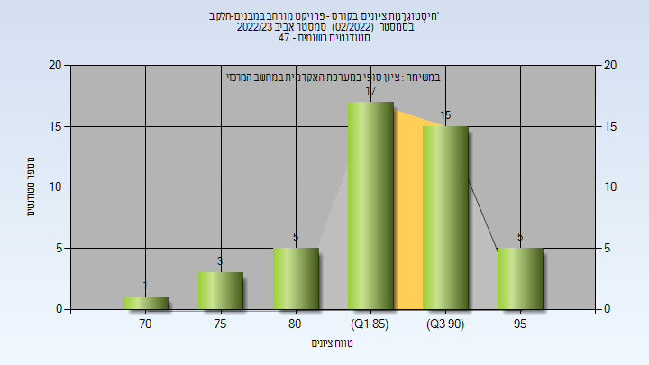
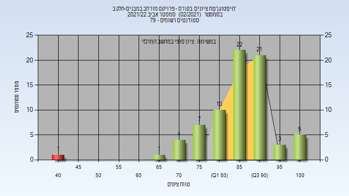

# 00140132 - פרויקט מורחב במבנים-חלק ב'

**הערה**: מאגר ההיסטוגרמות הוקם עבור [CheeseFork](https://cheesefork.cf/), כלי בניית מערכת שעות עבור סטודנטים בטכניון. באתר בו אתם גולשים ניתן לעיין בהיסטוגרמות, אך הדרך היותר נוחה היא לעיין בהיסטוגרמות, ובמידע נוסף כגון חוות דעת של סטודנטים, באתר CheeseFork.

* [חורף 2024-2025](#202401)
* [אביב 2023](#202202)
  * [סופי מועד א'](#202202-Final_A)
  * [סופי](#202202-Finals)
* [אביב 2022](#202102)
  * [סופי מועד א'](#202102-Final_A)
  * [סופי מועד ב'](#202102-Final_B)
  * [סופי](#202102-Finals)
* [אביב 2020](#201902)
  * [סופי מועד א'](#201902-Final_A)
  * [סופי](#201902-Finals)
* [אביב 2019](#201802)
  * [סופי מועד א'](#201802-Final_A)
  * [סופי מועד ב'](#201802-Final_B)
  * [סופי](#201802-Finals)
* [אביב 2018](#201702)
  * [סופי מועד א'](#201702-Final_A)
  * [סופי מועד ב'](#201702-Final_B)
  * [סופי](#201702-Finals)

<h2 id="202401">חורף 2024-2025</h2>

| איש סגל | תפקיד |
| ---- | ---- |
| שולץ יוסף | מרצה |
| שביט שרית | מרצה |

<h2 id="202202">אביב 2023</h2>

| איש סגל | תפקיד |
| ---- | ---- |
| צאצאשוילי תמי | סגל מנהלי - עם הרשאות מרצה אחראי |
| שביט שרית | סגל מנהלי - עם הרשאות מרצה אחראי |

<h3 id="202202-Final_A">סופי מועד א'</h3>

| סטודנטים | עברו/נכשלו | אחוז עוברים | ציון מינימלי | ציון מקסימלי | ממוצע | חציון |
| ---- | ---- | ---- | ---- | ---- | ---- | ---- |
| 39 | 38/1 | 97 | 40 | 97 | 87.333 | 88 |

<h3 id="202202-Finals">סופי</h3>

| סטודנטים | עברו/נכשלו | אחוז עוברים | ציון מינימלי | ציון מקסימלי | ממוצע | חציון |
| ---- | ---- | ---- | ---- | ---- | ---- | ---- |
| 46 | 46/0 | 100 | 73 | 97 | 87.348 | 87.5 |

<h2 id="202102">אביב 2022</h2>

| איש סגל | תפקיד |
| ---- | ---- |
| שביט שרית | סגל מנהלי - עם הרשאות מרצה אחראי |
| צאצאשוילי תמי | סגל מנהלי - עם הרשאות מרצה אחראי |

<h3 id="202102-Final_A">סופי מועד א'</h3>

| סטודנטים | עברו/נכשלו | אחוז עוברים | ציון מינימלי | ציון מקסימלי | ממוצע | חציון |
| ---- | ---- | ---- | ---- | ---- | ---- | ---- |
| 59 | 58/1 | 98 | 40 | 100 | 87.78 | 88 |

<h3 id="202102-Final_B">סופי מועד ב'</h3>

| סטודנטים | עברו/נכשלו | אחוז עוברים | ציון מינימלי | ציון מקסימלי | ממוצע | חציון |
| ---- | ---- | ---- | ---- | ---- | ---- | ---- |
| 16 | 15/1 | 94 | 40 | 97 | 76.25 | 76.5 |

<h3 id="202102-Finals">סופי</h3>

| סטודנטים | עברו/נכשלו | אחוז עוברים | ציון מינימלי | ציון מקסימלי | ממוצע | חציון |
| ---- | ---- | ---- | ---- | ---- | ---- | ---- |
| 74 | 73/1 | 99 | 40 | 100 | 85.932 | 87 |

<h2 id="201902">אביב 2020</h2>

| איש סגל | תפקיד |
| ---- | ---- |
| צאצאשוילי תמי | סגל מנהלי - עם הרשאות מרצה אחראי |
| שביט שרית | סגל מנהלי - עם הרשאות מרצה אחראי |

<h3 id="201902-Final_A">סופי מועד א'</h3>

| סטודנטים | עברו/נכשלו | אחוז עוברים | ציון מינימלי | ציון מקסימלי | ממוצע | חציון |
| ---- | ---- | ---- | ---- | ---- | ---- | ---- |
| 67 | 67/0 | 100 | 65 | 100 | 87.582 | 88 |

<h3 id="201902-Finals">סופי</h3>

| סטודנטים | עברו/נכשלו | אחוז עוברים | ציון מינימלי | ציון מקסימלי | ממוצע | חציון |
| ---- | ---- | ---- | ---- | ---- | ---- | ---- |
| 67 | 67/0 | 100 | 65 | 100 | 87.582 | 88 |

<h2 id="201802">אביב 2019</h2>

| איש סגל | תפקיד |
| ---- | ---- |
| שביט שרית | סגל מנהלי - עם הרשאות מרצה אחראי |
| צאצאשוילי תמי | סגל מנהלי - עם הרשאות מרצה אחראי |

<h3 id="201802-Final_A">סופי מועד א'</h3>

| סטודנטים | עברו/נכשלו | אחוז עוברים | ציון מינימלי | ציון מקסימלי | ממוצע | חציון |
| ---- | ---- | ---- | ---- | ---- | ---- | ---- |
| 73 | 73/0 | 100 | 60 | 98 | 86.767 | 88 |

<h3 id="201802-Final_B">סופי מועד ב'</h3>

| סטודנטים | עברו/נכשלו | אחוז עוברים | ציון מינימלי | ציון מקסימלי | ממוצע | חציון |
| ---- | ---- | ---- | ---- | ---- | ---- | ---- |
| 23 | 23/0 | 100 | 70 | 93 | 80.783 | 80 |

<h3 id="201802-Finals">סופי</h3>

| סטודנטים | עברו/נכשלו | אחוז עוברים | ציון מינימלי | ציון מקסימלי | ממוצע | חציון |
| ---- | ---- | ---- | ---- | ---- | ---- | ---- |
| 99 | 98/1 | 99 | 40 | 98 | 84.677 | 85 |

<h2 id="201702">אביב 2018</h2>

<h3 id="201702-Final_A">סופי מועד א'</h3>

| סטודנטים | עברו/נכשלו | אחוז עוברים | ציון מינימלי | ציון מקסימלי | ממוצע | חציון |
| ---- | ---- | ---- | ---- | ---- | ---- | ---- |
| 72 | 72/0 | 100 | 75 | 100 | 87.736 | 88 |

<h3 id="201702-Final_B">סופי מועד ב'</h3>

| סטודנטים | עברו/נכשלו | אחוז עוברים | ציון מינימלי | ציון מקסימלי | ממוצע | חציון |
| ---- | ---- | ---- | ---- | ---- | ---- | ---- |
| 16 | 16/0 | 100 | 70 | 92 | 81.188 | 81 |

<h3 id="201702-Finals">סופי</h3>

| סטודנטים | עברו/נכשלו | אחוז עוברים | ציון מינימלי | ציון מקסימלי | ממוצע | חציון |
| ---- | ---- | ---- | ---- | ---- | ---- | ---- |
| 91 | 91/0 | 100 | 70 | 100 | 86.429 | 86 |

