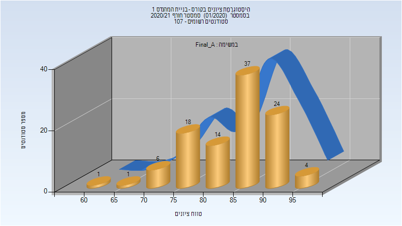

# 00140147 - בניית המהנדס 1

**הערה**: מאגר ההיסטוגרמות הוקם עבור [CheeseFork](https://cheesefork.cf/), כלי בניית מערכת שעות עבור סטודנטים בטכניון. באתר בו אתם גולשים ניתן לעיין בהיסטוגרמות, אך הדרך היותר נוחה היא לעיין בהיסטוגרמות, ובמידע נוסף כגון חוות דעת של סטודנטים, באתר CheeseFork.

* [חורף 2024-2025](#202401)
  * [מבחן מועד א'](#202401-Exam_A)
  * [סופי מועד א'](#202401-Final_A)
* [חורף 2023-2024](#202301)
  * [סופי מועד א'](#202301-Final_A)
  * [סופי מועד ב'](#202301-Final_B)
  * [סופי](#202301-Finals)
* [חורף 2022-2023](#202201)
  * [סופי מועד א'](#202201-Final_A)
  * [סופי מועד ב'](#202201-Final_B)
  * [סופי](#202201-Finals)
* [חורף 2021-2022](#202101)
  * [סופי מועד א'](#202101-Final_A)
  * [סופי](#202101-Finals)
* [חורף 2020-2021](#202001)
  * [סופי מועד א'](#202001-Final_A)
  * [סופי](#202001-Finals)
* [חורף 2019-2020](#201901)
  * [סופי מועד א'](#201901-Final_A)
  * [סופי](#201901-Finals)
* [חורף 2018-2019](#201801)
  * [סופי מועד א'](#201801-Final_A)
  * [סופי](#201801-Finals)
* [חורף 2017-2018](#201701)
  * [סופי מועד א'](#201701-Final_A)
  * [סופי](#201701-Finals)

<h2 id="202401">חורף 2024-2025</h2>

| איש סגל | תפקיד |
| ---- | ---- |
| לבן אורן | מרצה - אחראי מקצוע |
| אל ולי פיסל | מרצה |
| שקד עדיה | מתרגל |
| מורן גל | מתרגל |
| אביגדורי טל | מתרגל |
| בסול ויסאם | מתרגל |
| רוני דביר | מתרגל |
| מדאח חאזם | מתרגל |
| גנון תומר | מתרגל |
| חוסיין מראם | מתרגל |

<h3 id="202401-Exam_A">מבחן מועד א'</h3>

| סטודנטים | עברו/נכשלו | אחוז עוברים | ציון מינימלי | ציון מקסימלי | ממוצע | חציון |
| ---- | ---- | ---- | ---- | ---- | ---- | ---- |
| 97 | 28/69 | 29 | 0 | 88 | 42.454 | 47 |

<h3 id="202401-Final_A">סופי מועד א'</h3>

| סטודנטים | עברו/נכשלו | אחוז עוברים | ציון מינימלי | ציון מקסימלי | ממוצע | חציון |
| ---- | ---- | ---- | ---- | ---- | ---- | ---- |
| 96 | 52/44 | 54 | 0 | 90 | 47.188 | 58.5 |

<h2 id="202301">חורף 2023-2024</h2>

| איש סגל | תפקיד |
| ---- | ---- |
| אל ולי פיסל | מרצה - אחראי מקצוע |
| שביט שרית | סגל מנהלי - עם הרשאות מרצה אחראי |
| צאצאשוילי תמי | סגל מנהלי - עם הרשאות מרצה אחראי |

<h3 id="202301-Final_A">סופי מועד א'</h3>

| סטודנטים | עברו/נכשלו | אחוז עוברים | ציון מינימלי | ציון מקסימלי | ממוצע | חציון |
| ---- | ---- | ---- | ---- | ---- | ---- | ---- |
| 90 | 74/16 | 82 | 0 | 93.788 | 68.66 | 73.1125 |

<h3 id="202301-Final_B">סופי מועד ב'</h3>

| סטודנטים | עברו/נכשלו | אחוז עוברים | ציון מינימלי | ציון מקסימלי | ממוצע | חציון |
| ---- | ---- | ---- | ---- | ---- | ---- | ---- |
| 22 | 18/4 | 82 | 30 | 96.7 | 71.953 | 77.4125 |

<h3 id="202301-Finals">סופי</h3>

| סטודנטים | עברו/נכשלו | אחוז עוברים | ציון מינימלי | ציון מקסימלי | ממוצע | חציון |
| ---- | ---- | ---- | ---- | ---- | ---- | ---- |
| 95 | 92/3 | 97 | 30 | 97 | 76.022 | 77 |

<h2 id="202201">חורף 2022-2023</h2>

| איש סגל | תפקיד |
| ---- | ---- |
| אל ולי פיסל | מרצה - אחראי מקצוע |
| שביט שרית | סגל מנהלי - עם הרשאות מרצה אחראי |
| צאצאשוילי תמי | סגל מנהלי - עם הרשאות מרצה אחראי |

<h3 id="202201-Final_A">סופי מועד א'</h3>

| סטודנטים | עברו/נכשלו | אחוז עוברים | ציון מינימלי | ציון מקסימלי | ממוצע | חציון |
| ---- | ---- | ---- | ---- | ---- | ---- | ---- |
| 57 | 46/11 | 81 | 6 | 89 | 67.561 | 73 |

<h3 id="202201-Final_B">סופי מועד ב'</h3>

| סטודנטים | עברו/נכשלו | אחוז עוברים | ציון מינימלי | ציון מקסימלי | ממוצע | חציון |
| ---- | ---- | ---- | ---- | ---- | ---- | ---- |
| 16 | 5/11 | 31 | 18 | 76 | 44.812 | 41.5 |

<h3 id="202201-Finals">סופי</h3>

| סטודנטים | עברו/נכשלו | אחוז עוברים | ציון מינימלי | ציון מקסימלי | ממוצע | חציון |
| ---- | ---- | ---- | ---- | ---- | ---- | ---- |
| 63 | 52/11 | 83 | 18 | 89 | 67.381 | 73 |

<h2 id="202101">חורף 2021-2022</h2>

| איש סגל | תפקיד |
| ---- | ---- |
| אל ולי פיסל | מרצה - אחראי מקצוע |
| שביט שרית | סגל מנהלי - עם הרשאות מרצה אחראי |
| צאצאשוילי תמי | סגל מנהלי - עם הרשאות מרצה אחראי |

<h3 id="202101-Final_A">סופי מועד א'</h3>

| סטודנטים | עברו/נכשלו | אחוז עוברים | ציון מינימלי | ציון מקסימלי | ממוצע | חציון |
| ---- | ---- | ---- | ---- | ---- | ---- | ---- |
| 96 | 96/0 | 100 | 69.625 | 95.85 | 80.588 | 80.9375 |

<h3 id="202101-Finals">סופי</h3>

| סטודנטים | עברו/נכשלו | אחוז עוברים | ציון מינימלי | ציון מקסימלי | ממוצע | חציון |
| ---- | ---- | ---- | ---- | ---- | ---- | ---- |
| 96 | 96/0 | 100 | 70 | 96 | 80.573 | 81 |

<h2 id="202001">חורף 2020-2021</h2>

| איש סגל | תפקיד |
| ---- | ---- |
| אל ולי פיסל | מרצה - אחראי מקצוע |
| צאצאשוילי תמי | סגל מנהלי - עם הרשאות מרצה אחראי |
| שביט שרית | סגל מנהלי - עם הרשאות מרצה אחראי |

<h3 id="202001-Final_A">סופי מועד א'</h3>

| סטודנטים | עברו/נכשלו | אחוז עוברים | ציון מינימלי | ציון מקסימלי | ממוצע | חציון |
| ---- | ---- | ---- | ---- | ---- | ---- | ---- |
| 105 | 105/0 | 100 | 64.183 | 98.4 | 85.296 | 86.637 |

<h3 id="202001-Finals">סופי</h3>

| סטודנטים | עברו/נכשלו | אחוז עוברים | ציון מינימלי | ציון מקסימלי | ממוצע | חציון |
| ---- | ---- | ---- | ---- | ---- | ---- | ---- |
| 106 | 106/0 | 100 | 64 | 98 | 85.425 | 86.5 |

<h2 id="201901">חורף 2019-2020</h2>

| איש סגל | תפקיד |
| ---- | ---- |
| אל ולי פיסל | מרצה - אחראי מקצוע |
| שביט שרית | סגל מנהלי - עם הרשאות מרצה אחראי |
| צאצאשוילי תמי | סגל מנהלי - עם הרשאות מרצה אחראי |

<h3 id="201901-Final_A">סופי מועד א'</h3>

| סטודנטים | עברו/נכשלו | אחוז עוברים | ציון מינימלי | ציון מקסימלי | ממוצע | חציון |
| ---- | ---- | ---- | ---- | ---- | ---- | ---- |
| 121 | 112/9 | 93 | 39.089 | 97.081 | 78.715 | 79.6 |

<h3 id="201901-Finals">סופי</h3>

| סטודנטים | עברו/נכשלו | אחוז עוברים | ציון מינימלי | ציון מקסימלי | ממוצע | חציון |
| ---- | ---- | ---- | ---- | ---- | ---- | ---- |
| 123 | 121/2 | 98 | 47 | 97 | 81.463 | 81 |

<h2 id="201801">חורף 2018-2019</h2>

| איש סגל | תפקיד |
| ---- | ---- |
| טרכטנברג גבריאל | מרצה - אחראי מקצוע |
| צאצאשוילי תמי | סגל מנהלי - עם הרשאות מרצה אחראי |
| שביט שרית | סגל מנהלי - עם הרשאות מרצה אחראי |

<h3 id="201801-Final_A">סופי מועד א'</h3>

| סטודנטים | עברו/נכשלו | אחוז עוברים | ציון מינימלי | ציון מקסימלי | ממוצע | חציון |
| ---- | ---- | ---- | ---- | ---- | ---- | ---- |
| 116 | 111/5 | 96 | 40 | 96 | 77.845 | 78.5 |

<h3 id="201801-Finals">סופי</h3>

| סטודנטים | עברו/נכשלו | אחוז עוברים | ציון מינימלי | ציון מקסימלי | ממוצע | חציון |
| ---- | ---- | ---- | ---- | ---- | ---- | ---- |
| 120 | 120/0 | 100 | 55 | 97 | 80.758 | 82 |

<h2 id="201701">חורף 2017-2018</h2>

| איש סגל | תפקיד |
| ---- | ---- |
| טרכטנברג גבריאל | מרצה - אחראי מקצוע |

<h3 id="201701-Final_A">סופי מועד א'</h3>

| סטודנטים | עברו/נכשלו | אחוז עוברים | ציון מינימלי | ציון מקסימלי | ממוצע | חציון |
| ---- | ---- | ---- | ---- | ---- | ---- | ---- |
| 119 | 119/0 | 100 | 55 | 100 | 82.378 | 84 |

<h3 id="201701-Finals">סופי</h3>

| סטודנטים | עברו/נכשלו | אחוז עוברים | ציון מינימלי | ציון מקסימלי | ממוצע | חציון |
| ---- | ---- | ---- | ---- | ---- | ---- | ---- |
| 119 | 119/0 | 100 | 55 | 100 | 85.16 | 86 |

