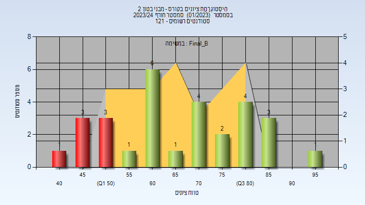
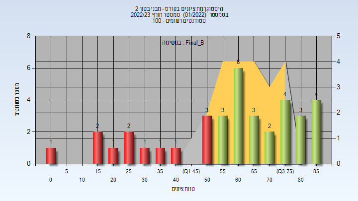

# 00140149 - מבני בטון 2

**הערה**: מאגר ההיסטוגרמות הוקם עבור [CheeseFork](https://cheesefork.cf/), כלי בניית מערכת שעות עבור סטודנטים בטכניון. באתר בו אתם גולשים ניתן לעיין בהיסטוגרמות, אך הדרך היותר נוחה היא לעיין בהיסטוגרמות, ובמידע נוסף כגון חוות דעת של סטודנטים, באתר CheeseFork.

* [חורף 2024-2025](#202401)
  * [מבחן מועד א'](#202401-Exam_A)
  * [סופי מועד א'](#202401-Final_A)
  * [מבחן מועד ב'](#202401-Exam_B)
  * [סופי מועד ב'](#202401-Final_B)
  * [סופי](#202401-Finals)
* [חורף 2023-2024](#202301)
  * [מבחן מועד א'](#202301-Exam_A)
  * [סופי מועד א'](#202301-Final_A)
  * [מבחן מועד ב'](#202301-Exam_B)
  * [סופי מועד ב'](#202301-Final_B)
  * [סופי](#202301-Finals)
* [חורף 2022-2023](#202201)
  * [מבחן מועד א'](#202201-Exam_A)
  * [סופי מועד א'](#202201-Final_A)
  * [מבחן מועד ב'](#202201-Exam_B)
  * [סופי מועד ב'](#202201-Final_B)
  * [סופי](#202201-Finals)
* [חורף 2021-2022](#202101)
  * [מבחן מועד א'](#202101-Exam_A)
  * [סופי מועד א'](#202101-Final_A)
  * [מבחן מועד ב'](#202101-Exam_B)
  * [סופי מועד ב'](#202101-Final_B)
  * [סופי](#202101-Finals)
* [חורף 2020-2021](#202001)
  * [סופי מועד א'](#202001-Final_A)
  * [סופי מועד ב'](#202001-Final_B)
  * [סופי](#202001-Finals)
* [חורף 2019-2020](#201901)
  * [סופי מועד א'](#201901-Final_A)
  * [סופי מועד ב'](#201901-Final_B)
  * [סופי](#201901-Finals)
* [חורף 2018-2019](#201801)
  * [סופי מועד א'](#201801-Final_A)
  * [סופי מועד ב'](#201801-Final_B)
  * [סופי](#201801-Finals)
* [חורף 2017-2018](#201701)
  * [סופי מועד א'](#201701-Final_A)
  * [סופי מועד ב'](#201701-Final_B)
  * [סופי](#201701-Finals)
* [חורף 2016-2017](#201601)
  * [סופי מועד א'](#201601-Final_A)
  * [סופי מועד ב'](#201601-Final_B)
  * [סופי](#201601-Finals)

<h2 id="202401">חורף 2024-2025</h2>

| איש סגל | תפקיד |
| ---- | ---- |
| ג'בארין מחמוד | מרצה - אחראי מקצוע |
| שביט שרית | סגל מנהלי - עם הרשאות מרצה אחראי |

<h3 id="202401-Exam_A">מבחן מועד א'</h3>

| סטודנטים | עברו/נכשלו | אחוז עוברים | ציון מינימלי | ציון מקסימלי | ממוצע | חציון |
| ---- | ---- | ---- | ---- | ---- | ---- | ---- |
| 90 | 77/13 | 86 | 12 | 98 | 66.9 | 67.5 |

<h3 id="202401-Final_A">סופי מועד א'</h3>

| סטודנטים | עברו/נכשלו | אחוז עוברים | ציון מינימלי | ציון מקסימלי | ממוצע | חציון |
| ---- | ---- | ---- | ---- | ---- | ---- | ---- |
| 90 | 77/13 | 86 | 12 | 98 | 69.733 | 71 |

<h3 id="202401-Exam_B">מבחן מועד ב'</h3>

| סטודנטים | עברו/נכשלו | אחוז עוברים | ציון מינימלי | ציון מקסימלי | ממוצע | חציון |
| ---- | ---- | ---- | ---- | ---- | ---- | ---- |
| 28 | 10/18 | 36 | 0 | 86 | 47.393 | 46.5 |

<h3 id="202401-Final_B">סופי מועד ב'</h3>

| סטודנטים | עברו/נכשלו | אחוז עוברים | ציון מינימלי | ציון מקסימלי | ממוצע | חציון |
| ---- | ---- | ---- | ---- | ---- | ---- | ---- |
| 27 | 9/18 | 33 | 0 | 89 | 48.111 | 45 |

<h3 id="202401-Finals">סופי</h3>

| סטודנטים | עברו/נכשלו | אחוז עוברים | ציון מינימלי | ציון מקסימלי | ממוצע | חציון |
| ---- | ---- | ---- | ---- | ---- | ---- | ---- |
| 90 | 77/13 | 86 | 12 | 98 | 69.733 | 71 |

<h2 id="202301">חורף 2023-2024</h2>

| איש סגל | תפקיד |
| ---- | ---- |
| ג'בארין מחמוד | מרצה - אחראי מקצוע |
| צאצאשוילי תמי | סגל מנהלי - עם הרשאות מרצה אחראי |
| שביט שרית | סגל מנהלי - עם הרשאות מרצה אחראי |
| לוינסקי יעל | סגל מנהלי - עם הרשאות מרצה אחראי |

<h3 id="202301-Exam_A">מבחן מועד א'</h3>

| סטודנטים | עברו/נכשלו | אחוז עוברים | ציון מינימלי | ציון מקסימלי | ממוצע | חציון |
| ---- | ---- | ---- | ---- | ---- | ---- | ---- |
| 107 | 88/19 | 82 | 28 | 99 | 70.757 | 71 |

<h3 id="202301-Final_A">סופי מועד א'</h3>

| סטודנטים | עברו/נכשלו | אחוז עוברים | ציון מינימלי | ציון מקסימלי | ממוצע | חציון |
| ---- | ---- | ---- | ---- | ---- | ---- | ---- |
| 107 | 90/17 | 84 | 28 | 99 | 72.271 | 73 |

<h3 id="202301-Exam_B">מבחן מועד ב'</h3>

| סטודנטים | עברו/נכשלו | אחוז עוברים | ציון מינימלי | ציון מקסימלי | ממוצע | חציון |
| ---- | ---- | ---- | ---- | ---- | ---- | ---- |
| 29 | 22/7 | 76 | 41 | 96 | 65.966 | 66 |

<h3 id="202301-Final_B">סופי מועד ב'</h3>

| סטודנטים | עברו/נכשלו | אחוז עוברים | ציון מינימלי | ציון מקסימלי | ממוצע | חציון |
| ---- | ---- | ---- | ---- | ---- | ---- | ---- |
| 29 | 22/7 | 76 | 41 | 96 | 67.655 | 69 |

<h3 id="202301-Finals">סופי</h3>

| סטודנטים | עברו/נכשלו | אחוז עוברים | ציון מינימלי | ציון מקסימלי | ממוצע | חציון |
| ---- | ---- | ---- | ---- | ---- | ---- | ---- |
| 116 | 109/7 | 94 | 41 | 99 | 75.991 | 76 |

<h2 id="202201">חורף 2022-2023</h2>

| איש סגל | תפקיד |
| ---- | ---- |
| ג'בארין מחמוד | מרצה - אחראי מקצוע |
| לוינסקי יעל | סגל מנהלי - עם הרשאות מרצה אחראי |
| שביט שרית | סגל מנהלי - עם הרשאות מרצה אחראי |
| צאצאשוילי תמי | סגל מנהלי - עם הרשאות מרצה אחראי |

<h3 id="202201-Exam_A">מבחן מועד א'</h3>

| סטודנטים | עברו/נכשלו | אחוז עוברים | ציון מינימלי | ציון מקסימלי | ממוצע | חציון |
| ---- | ---- | ---- | ---- | ---- | ---- | ---- |
| 81 | 52/29 | 64 | 10.35 | 98.513 | 60.311 | 59.225 |

<h3 id="202201-Final_A">סופי מועד א'</h3>

| סטודנטים | עברו/נכשלו | אחוז עוברים | ציון מינימלי | ציון מקסימלי | ממוצע | חציון |
| ---- | ---- | ---- | ---- | ---- | ---- | ---- |
| 81 | 53/28 | 65 | 10 | 99 | 61.951 | 62 |

<h3 id="202201-Exam_B">מבחן מועד ב'</h3>

| סטודנטים | עברו/נכשלו | אחוז עוברים | ציון מינימלי | ציון מקסימלי | ממוצע | חציון |
| ---- | ---- | ---- | ---- | ---- | ---- | ---- |
| 37 | 25/12 | 68 | 4.2 | 84.7 | 56.485 | 60.7 |

<h3 id="202201-Final_B">סופי מועד ב'</h3>

| סטודנטים | עברו/נכשלו | אחוז עוברים | ציון מינימלי | ציון מקסימלי | ממוצע | חציון |
| ---- | ---- | ---- | ---- | ---- | ---- | ---- |
| 37 | 25/12 | 68 | 4 | 86 | 58.351 | 64 |

<h3 id="202201-Finals">סופי</h3>

| סטודנטים | עברו/נכשלו | אחוז עוברים | ציון מינימלי | ציון מקסימלי | ממוצע | חציון |
| ---- | ---- | ---- | ---- | ---- | ---- | ---- |
| 95 | 81/14 | 85 | 4 | 99 | 67.958 | 69 |

<h2 id="202101">חורף 2021-2022</h2>

| איש סגל | תפקיד |
| ---- | ---- |
| ג'בארין מחמוד | מרצה - אחראי מקצוע |
| צאצאשוילי תמי | סגל מנהלי - עם הרשאות מרצה אחראי |
| שביט שרית | סגל מנהלי - עם הרשאות מרצה אחראי |
| לוינסקי יעל | סגל מנהלי - עם הרשאות מרצה אחראי |

<h3 id="202101-Exam_A">מבחן מועד א'</h3>

| סטודנטים | עברו/נכשלו | אחוז עוברים | ציון מינימלי | ציון מקסימלי | ממוצע | חציון |
| ---- | ---- | ---- | ---- | ---- | ---- | ---- |
| 80 | 64/16 | 80 | 25 | 98 | 69.312 | 74.5 |

<h3 id="202101-Final_A">סופי מועד א'</h3>

| סטודנטים | עברו/נכשלו | אחוז עוברים | ציון מינימלי | ציון מקסימלי | ממוצע | חציון |
| ---- | ---- | ---- | ---- | ---- | ---- | ---- |
| 80 | 65/15 | 81 | 25 | 98 | 70.912 | 77 |

<h3 id="202101-Exam_B">מבחן מועד ב'</h3>

| סטודנטים | עברו/נכשלו | אחוז עוברים | ציון מינימלי | ציון מקסימלי | ממוצע | חציון |
| ---- | ---- | ---- | ---- | ---- | ---- | ---- |
| 24 | 13/11 | 54 | 16 | 81 | 52.583 | 55 |

<h3 id="202101-Final_B">סופי מועד ב'</h3>

| סטודנטים | עברו/נכשלו | אחוז עוברים | ציון מינימלי | ציון מקסימלי | ממוצע | חציון |
| ---- | ---- | ---- | ---- | ---- | ---- | ---- |
| 24 | 13/11 | 54 | 16 | 84 | 53.708 | 58 |

<h3 id="202101-Finals">סופי</h3>

| סטודנטים | עברו/נכשלו | אחוז עוברים | ציון מינימלי | ציון מקסימלי | ממוצע | חציון |
| ---- | ---- | ---- | ---- | ---- | ---- | ---- |
| 97 | 77/20 | 79 | 1 | 98 | 67.526 | 71 |

<h2 id="202001">חורף 2020-2021</h2>

| איש סגל | תפקיד |
| ---- | ---- |
| ג'בארין מחמוד | מרצה - אחראי מקצוע |
| צאצאשוילי תמי | סגל מנהלי - עם הרשאות מרצה אחראי |
| שביט שרית | סגל מנהלי - עם הרשאות מרצה אחראי |

<h3 id="202001-Final_A">סופי מועד א'</h3>

| סטודנטים | עברו/נכשלו | אחוז עוברים | ציון מינימלי | ציון מקסימלי | ממוצע | חציון |
| ---- | ---- | ---- | ---- | ---- | ---- | ---- |
| 97 | 64/33 | 66 | 0 | 100 | 61.948 | 68 |

<h3 id="202001-Final_B">סופי מועד ב'</h3>

| סטודנטים | עברו/נכשלו | אחוז עוברים | ציון מינימלי | ציון מקסימלי | ממוצע | חציון |
| ---- | ---- | ---- | ---- | ---- | ---- | ---- |
| 53 | 36/17 | 68 | 4 | 92 | 63.962 | 70 |

<h3 id="202001-Finals">סופי</h3>

| סטודנטים | עברו/נכשלו | אחוז עוברים | ציון מינימלי | ציון מקסימלי | ממוצע | חציון |
| ---- | ---- | ---- | ---- | ---- | ---- | ---- |
| 116 | 98/18 | 84 | 4 | 100 | 69.526 | 73 |

<h2 id="201901">חורף 2019-2020</h2>

| איש סגל | תפקיד |
| ---- | ---- |
| ג'בארין מחמוד | מרצה - אחראי מקצוע |

<h3 id="201901-Final_A">סופי מועד א'</h3>

| סטודנטים | עברו/נכשלו | אחוז עוברים | ציון מינימלי | ציון מקסימלי | ממוצע | חציון |
| ---- | ---- | ---- | ---- | ---- | ---- | ---- |
| 122 | 70/52 | 57 | 4 | 98 | 58.467 | 65 |

<h3 id="201901-Final_B">סופי מועד ב'</h3>

| סטודנטים | עברו/נכשלו | אחוז עוברים | ציון מינימלי | ציון מקסימלי | ממוצע | חציון |
| ---- | ---- | ---- | ---- | ---- | ---- | ---- |
| 78 | 63/15 | 81 | 13 | 94 | 60.846 | 64 |

<h3 id="201901-Finals">סופי</h3>

| סטודנטים | עברו/נכשלו | אחוז עוברים | ציון מינימלי | ציון מקסימלי | ממוצע | חציון |
| ---- | ---- | ---- | ---- | ---- | ---- | ---- |
| 134 | 119/15 | 89 | 13 | 98 | 67.06 | 70.5 |

<h2 id="201801">חורף 2018-2019</h2>

| איש סגל | תפקיד |
| ---- | ---- |
| ברודסקי אלכס | מרצה - אחראי מקצוע |
| שביט שרית | סגל מנהלי - עם הרשאות מרצה אחראי |
| צאצאשוילי תמי | סגל מנהלי - עם הרשאות מרצה אחראי |

<h3 id="201801-Final_A">סופי מועד א'</h3>

| סטודנטים | עברו/נכשלו | אחוז עוברים | ציון מינימלי | ציון מקסימלי | ממוצע | חציון |
| ---- | ---- | ---- | ---- | ---- | ---- | ---- |
| 135 | 116/19 | 86 | 23 | 95 | 67.674 | 69 |

<h3 id="201801-Final_B">סופי מועד ב'</h3>

| סטודנטים | עברו/נכשלו | אחוז עוברים | ציון מינימלי | ציון מקסימלי | ממוצע | חציון |
| ---- | ---- | ---- | ---- | ---- | ---- | ---- |
| 53 | 45/8 | 85 | 30 | 95 | 64.811 | 69 |

<h3 id="201801-Finals">סופי</h3>

| סטודנטים | עברו/נכשלו | אחוז עוברים | ציון מינימלי | ציון מקסימלי | ממוצע | חציון |
| ---- | ---- | ---- | ---- | ---- | ---- | ---- |
| 146 | 137/9 | 94 | 30 | 95 | 71.445 | 72.5 |

<h2 id="201701">חורף 2017-2018</h2>

| איש סגל | תפקיד |
| ---- | ---- |
| ג'בארין מחמוד | מרצה - אחראי מקצוע |

<h3 id="201701-Final_A">סופי מועד א'</h3>

| סטודנטים | עברו/נכשלו | אחוז עוברים | ציון מינימלי | ציון מקסימלי | ממוצע | חציון |
| ---- | ---- | ---- | ---- | ---- | ---- | ---- |
| 110 | 76/34 | 69 | 3 | 93 | 65.409 | 71 |

<h3 id="201701-Final_B">סופי מועד ב'</h3>

| סטודנטים | עברו/נכשלו | אחוז עוברים | ציון מינימלי | ציון מקסימלי | ממוצע | חציון |
| ---- | ---- | ---- | ---- | ---- | ---- | ---- |
| 54 | 40/14 | 74 | 23 | 98 | 66.407 | 70.5 |

<h3 id="201701-Finals">סופי</h3>

| סטודנטים | עברו/נכשלו | אחוז עוברים | ציון מינימלי | ציון מקסימלי | ממוצע | חציון |
| ---- | ---- | ---- | ---- | ---- | ---- | ---- |
| 128 | 112/16 | 88 | 5 | 98 | 71.977 | 75.5 |

<h2 id="201601">חורף 2016-2017</h2>

| איש סגל | תפקיד |
| ---- | ---- |
| ג'בארין מחמוד | מרצה - אחראי מקצוע |

<h3 id="201601-Final_A">סופי מועד א'</h3>

| סטודנטים | עברו/נכשלו | אחוז עוברים | ציון מינימלי | ציון מקסימלי | ממוצע | חציון |
| ---- | ---- | ---- | ---- | ---- | ---- | ---- |
| 133 | 92/41 | 69 | 19 | 94 | 63.842 | 68 |

<h3 id="201601-Final_B">סופי מועד ב'</h3>

| סטודנטים | עברו/נכשלו | אחוז עוברים | ציון מינימלי | ציון מקסימלי | ממוצע | חציון |
| ---- | ---- | ---- | ---- | ---- | ---- | ---- |
| 68 | 43/25 | 63 | 5 | 100 | 61.691 | 65.5 |

<h3 id="201601-Finals">סופי</h3>

| סטודנטים | עברו/נכשלו | אחוז עוברים | ציון מינימלי | ציון מקסימלי | ממוצע | חציון |
| ---- | ---- | ---- | ---- | ---- | ---- | ---- |
| 150 | 124/26 | 83 | 5 | 100 | 68.413 | 71 |

