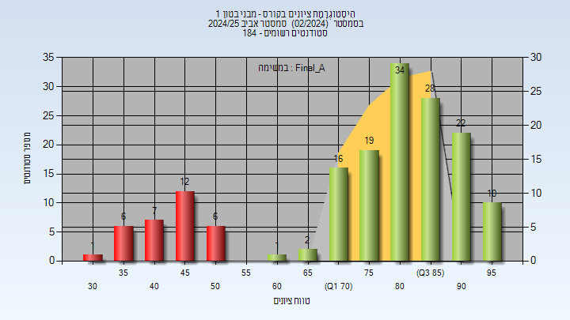
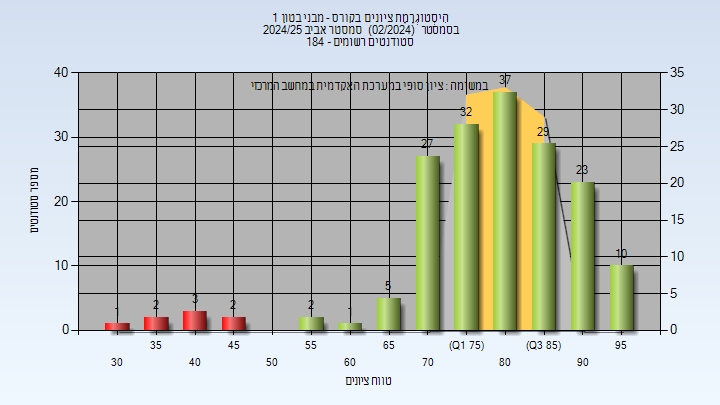
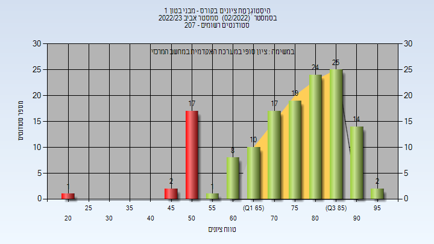

# 00140153 - מבני בטון 1

**הערה**: מאגר ההיסטוגרמות הוקם עבור [CheeseFork](https://cheesefork.cf/), כלי בניית מערכת שעות עבור סטודנטים בטכניון. באתר בו אתם גולשים ניתן לעיין בהיסטוגרמות, אך הדרך היותר נוחה היא לעיין בהיסטוגרמות, ובמידע נוסף כגון חוות דעת של סטודנטים, באתר CheeseFork.

* [אביב 2025](#202402)
  * [מבחן מועד א'](#202402-Exam_A)
  * [סופי מועד א'](#202402-Final_A)
  * [מבחן מועד ב'](#202402-Exam_B)
  * [סופי מועד ב'](#202402-Final_B)
  * [סופי](#202402-Finals)
* [אביב 2024](#202302)
  * [מבחן מועד א'](#202302-Exam_A)
  * [סופי מועד א'](#202302-Final_A)
  * [מבחן מועד ב'](#202302-Exam_B)
  * [סופי מועד ב'](#202302-Final_B)
  * [סופי](#202302-Finals)
* [אביב 2023](#202202)
  * [סופי מועד א'](#202202-Final_A)
  * [סופי מועד ב'](#202202-Final_B)
  * [סופי](#202202-Finals)
* [אביב 2022](#202102)
  * [סופי מועד א'](#202102-Final_A)
  * [סופי מועד ב'](#202102-Final_B)
  * [סופי](#202102-Finals)
* [חורף 2021-2022](#202101)
  * [סופי מועד א'](#202101-Final_A)
  * [סופי](#202101-Finals)
* [אביב 2021](#202002)
  * [סופי מועד א'](#202002-Final_A)
  * [סופי מועד ב'](#202002-Final_B)
  * [סופי](#202002-Finals)
* [אביב 2020](#201902)
  * [סופי מועד א'](#201902-Final_A)
  * [סופי מועד ב'](#201902-Final_B)
  * [סופי](#201902-Finals)
* [קיץ 2019](#201803)
  * [סופי מועד א'](#201803-Final_A)
  * [סופי](#201803-Finals)
* [אביב 2019](#201802)
  * [סופי מועד א'](#201802-Final_A)
  * [סופי מועד ב'](#201802-Final_B)
  * [סופי](#201802-Finals)
* [אביב 2018](#201702)
  * [סופי מועד א'](#201702-Final_A)
  * [סופי מועד ב'](#201702-Final_B)
  * [סופי](#201702-Finals)

<h2 id="202402">אביב 2025</h2>

| איש סגל | תפקיד |
| ---- | ---- |
| שורץ-גבלי הילה | מרצה - אחראי מקצוע |
| צאצאשוילי תמי | סגל מנהלי - עם הרשאות מרצה אחראי |
| שביט שרית | סגל מנהלי - עם הרשאות מרצה אחראי |

<h3 id="202402-Exam_A">מבחן מועד א'</h3>

| סטודנטים | עברו/נכשלו | אחוז עוברים | ציון מינימלי | ציון מקסימלי | ממוצע | חציון |
| ---- | ---- | ---- | ---- | ---- | ---- | ---- |
| 164 | 130/34 | 79 | 14 | 100 | 68.634 | 70.5 |

<h3 id="202402-Final_A">סופי מועד א'</h3>

| סטודנטים | עברו/נכשלו | אחוז עוברים | ציון מינימלי | ציון מקסימלי | ממוצע | חציון |
| ---- | ---- | ---- | ---- | ---- | ---- | ---- |
| 164 | 132/32 | 80 | 34 | 99 | 76.079 | 80.5 |

<h3 id="202402-Exam_B">מבחן מועד ב'</h3>

| סטודנטים | עברו/נכשלו | אחוז עוברים | ציון מינימלי | ציון מקסימלי | ממוצע | חציון |
| ---- | ---- | ---- | ---- | ---- | ---- | ---- |
| 47 | 32/15 | 68 | 34 | 86 | 58.468 | 59 |

<h3 id="202402-Final_B">סופי מועד ב'</h3>

| סטודנטים | עברו/נכשלו | אחוז עוברים | ציון מינימלי | ציון מקסימלי | ממוצע | חציון |
| ---- | ---- | ---- | ---- | ---- | ---- | ---- |
| 46 | 38/8 | 83 | 34 | 91 | 68.87 | 74 |

<h3 id="202402-Finals">סופי</h3>

| סטודנטים | עברו/נכשלו | אחוז עוברים | ציון מינימלי | ציון מקסימלי | ממוצע | חציון |
| ---- | ---- | ---- | ---- | ---- | ---- | ---- |
| 174 | 166/8 | 95 | 34 | 99 | 79.805 | 80 |

<h2 id="202302">אביב 2024</h2>

| איש סגל | תפקיד |
| ---- | ---- |
| שורץ-גבלי הילה | מרצה - אחראי מקצוע |
| לוינסקי יעל | סגל מנהלי - עם הרשאות מרצה אחראי |
| בלסברג עליזה | סגל מנהלי - עם הרשאות מרצה אחראי |
| מלכה אופירה | סגל מנהלי - עם הרשאות מרצה אחראי |
| שביט שרית | סגל מנהלי - עם הרשאות מרצה אחראי |
| צעירי קובלר קרן | סגל מנהלי - עם הרשאות מרצה אחראי |
| צאצאשוילי תמי | סגל מנהלי - עם הרשאות מרצה אחראי |
| בן-סימון צפורה | סגל מנהלי - עם הרשאות מרצה אחראי |

<h3 id="202302-Exam_A">מבחן מועד א'</h3>

| סטודנטים | עברו/נכשלו | אחוז עוברים | ציון מינימלי | ציון מקסימלי | ממוצע | חציון |
| ---- | ---- | ---- | ---- | ---- | ---- | ---- |
| 162 | 99/63 | 61 | 12 | 96 | 57.265 | 57 |

<h3 id="202302-Final_A">סופי מועד א'</h3>

| סטודנטים | עברו/נכשלו | אחוז עוברים | ציון מינימלי | ציון מקסימלי | ממוצע | חציון |
| ---- | ---- | ---- | ---- | ---- | ---- | ---- |
| 161 | 103/58 | 64 | 42 | 100 | 71.901 | 76 |

<h3 id="202302-Exam_B">מבחן מועד ב'</h3>

| סטודנטים | עברו/נכשלו | אחוז עוברים | ציון מינימלי | ציון מקסימלי | ממוצע | חציון |
| ---- | ---- | ---- | ---- | ---- | ---- | ---- |
| 48 | 35/13 | 73 | 17 | 102 | 64.583 | 61 |

<h3 id="202302-Final_B">סופי מועד ב'</h3>

| סטודנטים | עברו/נכשלו | אחוז עוברים | ציון מינימלי | ציון מקסימלי | ממוצע | חציון |
| ---- | ---- | ---- | ---- | ---- | ---- | ---- |
| 47 | 38/9 | 81 | 36 | 100 | 74.255 | 75 |

<h3 id="202302-Finals">סופי</h3>

| סטודנטים | עברו/נכשלו | אחוז עוברים | ציון מינימלי | ציון מקסימלי | ממוצע | חציון |
| ---- | ---- | ---- | ---- | ---- | ---- | ---- |
| 187 | 170/17 | 91 | 42 | 100 | 79.361 | 81 |

<h2 id="202202">אביב 2023</h2>

| איש סגל | תפקיד |
| ---- | ---- |
| דנציגר אברהם | מרצה - אחראי מקצוע |
| קובלר קרן | סגל מנהלי - עם הרשאות מרצה אחראי |
| בן-סימון ציפורה | סגל מנהלי - עם הרשאות מרצה אחראי |
| שביט שרית | סגל מנהלי - עם הרשאות מרצה אחראי |
| צאצאשוילי תמי | סגל מנהלי - עם הרשאות מרצה אחראי |
| בלסברג עליזה | סגל מנהלי - עם הרשאות מרצה אחראי |
| לוינסקי יעל | סגל מנהלי - עם הרשאות מרצה אחראי |
| מלכה אופירה | סגל מנהלי - עם הרשאות מרצה אחראי |

<h3 id="202202-Final_A">סופי מועד א'</h3>

| סטודנטים | עברו/נכשלו | אחוז עוברים | ציון מינימלי | ציון מקסימלי | ממוצע | חציון |
| ---- | ---- | ---- | ---- | ---- | ---- | ---- |
| 178 | 120/58 | 67 | 23 | 96 | 68.376 | 69 |

<h3 id="202202-Final_B">סופי מועד ב'</h3>

| סטודנטים | עברו/נכשלו | אחוז עוברים | ציון מינימלי | ציון מקסימלי | ממוצע | חציון |
| ---- | ---- | ---- | ---- | ---- | ---- | ---- |
| 76 | 56/20 | 74 | 24 | 92 | 65.763 | 66.5 |

<h3 id="202202-Finals">סופי</h3>

| סטודנטים | עברו/נכשלו | אחוז עוברים | ציון מינימלי | ציון מקסימלי | ממוצע | חציון |
| ---- | ---- | ---- | ---- | ---- | ---- | ---- |
| 190 | 170/20 | 89 | 24 | 96 | 74.929 | 78 |

<h2 id="202102">אביב 2022</h2>

| איש סגל | תפקיד |
| ---- | ---- |
| דנציגר אברהם | מרצה - אחראי מקצוע |
| קובלר קרן | סגל מנהלי - עם הרשאות מרצה אחראי |
| צאצאשוילי תמי | סגל מנהלי - עם הרשאות מרצה אחראי |
| שביט שרית | סגל מנהלי - עם הרשאות מרצה אחראי |
| לוינסקי יעל | סגל מנהלי - עם הרשאות מרצה אחראי |
| מלכה אופירה | סגל מנהלי - עם הרשאות מרצה אחראי |
| בן-סימון ציפורה | סגל מנהלי - עם הרשאות מרצה אחראי |

<h3 id="202102-Final_A">סופי מועד א'</h3>

| סטודנטים | עברו/נכשלו | אחוז עוברים | ציון מינימלי | ציון מקסימלי | ממוצע | חציון |
| ---- | ---- | ---- | ---- | ---- | ---- | ---- |
| 106 | 93/13 | 88 | 39 | 98 | 77.377 | 79.5 |

<h3 id="202102-Final_B">סופי מועד ב'</h3>

| סטודנטים | עברו/נכשלו | אחוז עוברים | ציון מינימלי | ציון מקסימלי | ממוצע | חציון |
| ---- | ---- | ---- | ---- | ---- | ---- | ---- |
| 32 | 18/14 | 56 | 41 | 91 | 64.625 | 66 |

<h3 id="202102-Finals">סופי</h3>

| סטודנטים | עברו/נכשלו | אחוז עוברים | ציון מינימלי | ציון מקסימלי | ממוצע | חציון |
| ---- | ---- | ---- | ---- | ---- | ---- | ---- |
| 120 | 108/12 | 90 | 41 | 98 | 77.725 | 80 |

<h2 id="202101">חורף 2021-2022</h2>

| איש סגל | תפקיד |
| ---- | ---- |
| ארודיתה סליג'י | מרצה - אחראי מקצוע |

<h3 id="202101-Final_A">סופי מועד א'</h3>

| סטודנטים | עברו/נכשלו | אחוז עוברים | ציון מינימלי | ציון מקסימלי | ממוצע | חציון |
| ---- | ---- | ---- | ---- | ---- | ---- | ---- |
| 13 | 12/1 | 92 | 31 | 100 | 84.154 | 90 |

<h3 id="202101-Finals">סופי</h3>

| סטודנטים | עברו/נכשלו | אחוז עוברים | ציון מינימלי | ציון מקסימלי | ממוצע | חציון |
| ---- | ---- | ---- | ---- | ---- | ---- | ---- |
| 15 | 14/1 | 93 | 23 | 100 | 83.933 | 88 |

<h2 id="202002">אביב 2021</h2>

| איש סגל | תפקיד |
| ---- | ---- |
| דנציגר אברהם | מרצה - אחראי מקצוע |
| שביט שרית | סגל מנהלי - עם הרשאות מרצה אחראי |
| לוינסקי יעל | סגל מנהלי - עם הרשאות מרצה אחראי |
| מלכה אופירה | סגל מנהלי - עם הרשאות מרצה אחראי |
| בן-סימון ציפורה | סגל מנהלי - עם הרשאות מרצה אחראי |
| צאצאשוילי תמי | סגל מנהלי - עם הרשאות מרצה אחראי |
| קובלר קרן | סגל מנהלי - עם הרשאות מרצה אחראי |

<h3 id="202002-Final_A">סופי מועד א'</h3>

| סטודנטים | עברו/נכשלו | אחוז עוברים | ציון מינימלי | ציון מקסימלי | ממוצע | חציון |
| ---- | ---- | ---- | ---- | ---- | ---- | ---- |
| 164 | 132/32 | 80 | 32 | 97 | 70.854 | 72.5 |

<h3 id="202002-Final_B">סופי מועד ב'</h3>

| סטודנטים | עברו/נכשלו | אחוז עוברים | ציון מינימלי | ציון מקסימלי | ממוצע | חציון |
| ---- | ---- | ---- | ---- | ---- | ---- | ---- |
| 53 | 36/17 | 68 | 13 | 96 | 65.226 | 67 |

<h3 id="202002-Finals">סופי</h3>

| סטודנטים | עברו/נכשלו | אחוז עוברים | ציון מינימלי | ציון מקסימלי | ממוצע | חציון |
| ---- | ---- | ---- | ---- | ---- | ---- | ---- |
| 190 | 176/14 | 93 | 13 | 97 | 73.921 | 75 |

<h2 id="201902">אביב 2020</h2>

| איש סגל | תפקיד |
| ---- | ---- |
| דנציגר אברהם | מרצה - אחראי מקצוע |
| שביט שרית | סגל מנהלי - עם הרשאות מרצה אחראי |
| צאצאשוילי תמי | סגל מנהלי - עם הרשאות מרצה אחראי |

<h3 id="201902-Final_A">סופי מועד א'</h3>

| סטודנטים | עברו/נכשלו | אחוז עוברים | ציון מינימלי | ציון מקסימלי | ממוצע | חציון |
| ---- | ---- | ---- | ---- | ---- | ---- | ---- |
| 149 | 98/51 | 66 | 19 | 100 | 65.389 | 71 |

<h3 id="201902-Final_B">סופי מועד ב'</h3>

| סטודנטים | עברו/נכשלו | אחוז עוברים | ציון מינימלי | ציון מקסימלי | ממוצע | חציון |
| ---- | ---- | ---- | ---- | ---- | ---- | ---- |
| 72 | 37/35 | 51 | 25 | 95 | 59.472 | 56 |

<h3 id="201902-Finals">סופי</h3>

| סטודנטים | עברו/נכשלו | אחוז עוברים | ציון מינימלי | ציון מקסימלי | ממוצע | חציון |
| ---- | ---- | ---- | ---- | ---- | ---- | ---- |
| 159 | 131/28 | 82 | 25 | 100 | 72.698 | 76 |

<h2 id="201803">קיץ 2019</h2>

| איש סגל | תפקיד |
| ---- | ---- |
| פלדפוגל שי | מרצה - אחראי מקצוע |
| שביט שרית | סגל מנהלי - עם הרשאות מרצה אחראי |
| צאצאשוילי תמי | סגל מנהלי - עם הרשאות מרצה אחראי |

<h3 id="201803-Final_A">סופי מועד א'</h3>

| סטודנטים | עברו/נכשלו | אחוז עוברים | ציון מינימלי | ציון מקסימלי | ממוצע | חציון |
| ---- | ---- | ---- | ---- | ---- | ---- | ---- |
| 13 | 13/0 | 100 | 57.738 | 100 | 75.864 | 75.575 |

<h3 id="201803-Finals">סופי</h3>

| סטודנטים | עברו/נכשלו | אחוז עוברים | ציון מינימלי | ציון מקסימלי | ממוצע | חציון |
| ---- | ---- | ---- | ---- | ---- | ---- | ---- |
| 22 | 22/0 | 100 | 56 | 100 | 72.818 | 73.5 |

<h2 id="201802">אביב 2019</h2>

| איש סגל | תפקיד |
| ---- | ---- |
| פלדפוגל שי | מרצה - אחראי מקצוע |

<h3 id="201802-Final_A">סופי מועד א'</h3>

| סטודנטים | עברו/נכשלו | אחוז עוברים | ציון מינימלי | ציון מקסימלי | ממוצע | חציון |
| ---- | ---- | ---- | ---- | ---- | ---- | ---- |
| 154 | 134/20 | 87 | 0 | 105.5 | 80.631 | 85.5 |

<h3 id="201802-Final_B">סופי מועד ב'</h3>

| סטודנטים | עברו/נכשלו | אחוז עוברים | ציון מינימלי | ציון מקסימלי | ממוצע | חציון |
| ---- | ---- | ---- | ---- | ---- | ---- | ---- |
| 39 | 31/8 | 79 | 18.8 | 98.65 | 73.491 | 77.65 |

<h3 id="201802-Finals">סופי</h3>

| סטודנטים | עברו/נכשלו | אחוז עוברים | ציון מינימלי | ציון מקסימלי | ממוצע | חציון |
| ---- | ---- | ---- | ---- | ---- | ---- | ---- |
| 172 | 165/7 | 96 | 19 | 100 | 84.36 | 86 |

<h2 id="201702">אביב 2018</h2>

| איש סגל | תפקיד |
| ---- | ---- |
| דנציגר אברהם | מרצה - אחראי מקצוע |

<h3 id="201702-Final_A">סופי מועד א'</h3>

| סטודנטים | עברו/נכשלו | אחוז עוברים | ציון מינימלי | ציון מקסימלי | ממוצע | חציון |
| ---- | ---- | ---- | ---- | ---- | ---- | ---- |
| 193 | 126/67 | 65 | 1 | 100 | 63.637 | 67 |

<h3 id="201702-Final_B">סופי מועד ב'</h3>

| סטודנטים | עברו/נכשלו | אחוז עוברים | ציון מינימלי | ציון מקסימלי | ממוצע | חציון |
| ---- | ---- | ---- | ---- | ---- | ---- | ---- |
| 96 | 71/25 | 74 | 1 | 96 | 67.062 | 70 |

<h3 id="201702-Finals">סופי</h3>

| סטודנטים | עברו/נכשלו | אחוז עוברים | ציון מינימלי | ציון מקסימלי | ממוצע | חציון |
| ---- | ---- | ---- | ---- | ---- | ---- | ---- |
| 211 | 190/21 | 90 | 1 | 100 | 72.692 | 74 |

