# 00140618 - מבוא לניהול ובטיחות בבנייה

**הערה**: מאגר ההיסטוגרמות הוקם עבור [CheeseFork](https://cheesefork.cf/), כלי בניית מערכת שעות עבור סטודנטים בטכניון. באתר בו אתם גולשים ניתן לעיין בהיסטוגרמות, אך הדרך היותר נוחה היא לעיין בהיסטוגרמות, ובמידע נוסף כגון חוות דעת של סטודנטים, באתר CheeseFork.

* [אביב 2025](#202402)
  * [סופי מועד א'](#202402-Final_A)
  * [סופי מועד ב'](#202402-Final_B)
  * [סופי](#202402-Finals)
* [חורף 2024-2025](#202401)
  * [סופי מועד א'](#202401-Final_A)
  * [סופי מועד ב'](#202401-Final_B)
  * [סופי](#202401-Finals)
* [חורף 2023-2024](#202301)
  * [סופי מועד א'](#202301-Final_A)
  * [סופי מועד ב'](#202301-Final_B)
  * [סופי](#202301-Finals)
* [חורף 2022-2023](#202201)
  * [סופי מועד א'](#202201-Final_A)
  * [סופי מועד ב'](#202201-Final_B)
  * [סופי](#202201-Finals)
* [חורף 2021-2022](#202101)
  * [סופי מועד א'](#202101-Final_A)
  * [סופי מועד ב'](#202101-Final_B)
  * [סופי](#202101-Finals)
* [חורף 2020-2021](#202001)
  * [סופי מועד א'](#202001-Final_A)
  * [סופי מועד ב'](#202001-Final_B)
  * [סופי](#202001-Finals)
* [חורף 2019-2020](#201901)
  * [מבחן מועד א'](#201901-Exam_A)
  * [סופי מועד א'](#201901-Final_A)
  * [מבחן מועד ב'](#201901-Exam_B)
  * [סופי מועד ב'](#201901-Final_B)
  * [סופי](#201901-Finals)

<h2 id="202402">אביב 2025</h2>

| איש סגל | תפקיד |
| ---- | ---- |
| זיצ'ק-פנחס ענת | מרצה - אחראי מקצוע |
| שביט שרית | סגל מנהלי - עם הרשאות מרצה אחראי |

<h3 id="202402-Final_A">סופי מועד א'</h3>

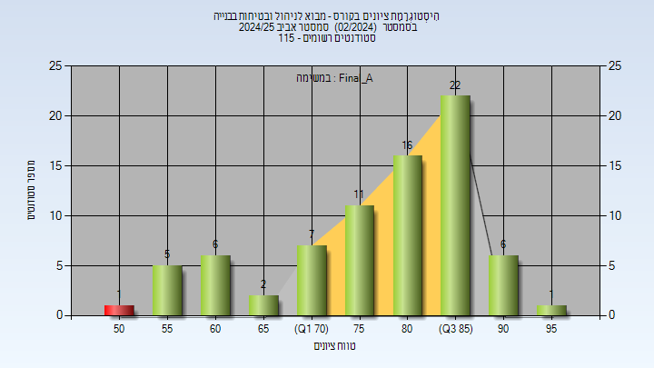

| סטודנטים | עברו/נכשלו | אחוז עוברים | ציון מינימלי | ציון מקסימלי | ממוצע | חציון |
| ---- | ---- | ---- | ---- | ---- | ---- | ---- |
| 77 | 76/1 | 99 | 50 | 95 | 78.935 | 82 |

<h3 id="202402-Final_B">סופי מועד ב'</h3>

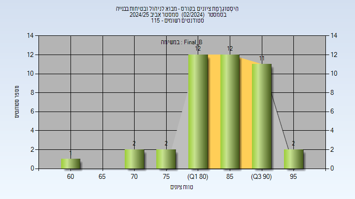

| סטודנטים | עברו/נכשלו | אחוז עוברים | ציון מינימלי | ציון מקסימלי | ממוצע | חציון |
| ---- | ---- | ---- | ---- | ---- | ---- | ---- |
| 42 | 42/0 | 100 | 60 | 98 | 85.786 | 86.5 |

<h3 id="202402-Finals">סופי</h3>

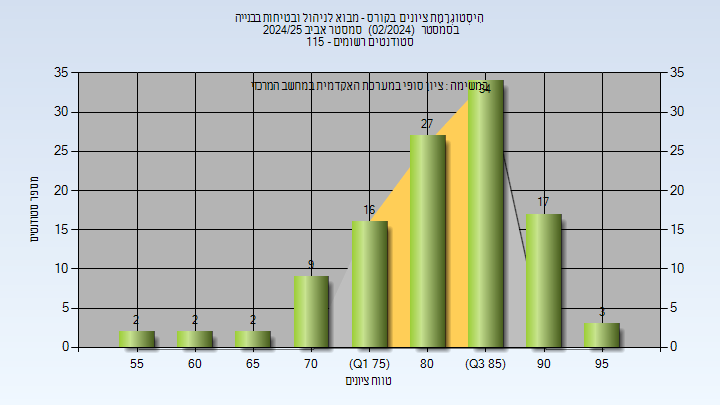

| סטודנטים | עברו/נכשלו | אחוז עוברים | ציון מינימלי | ציון מקסימלי | ממוצע | חציון |
| ---- | ---- | ---- | ---- | ---- | ---- | ---- |
| 112 | 112/0 | 100 | 59 | 98 | 82.964 | 84 |

<h2 id="202401">חורף 2024-2025</h2>

| איש סגל | תפקיד |
| ---- | ---- |
| זיצ'ק-פנחס ענת | מרצה - אחראי מקצוע |
| שביט שרית | מתרגל - עם הרשאות מרצה אחראי |

<h3 id="202401-Final_A">סופי מועד א'</h3>

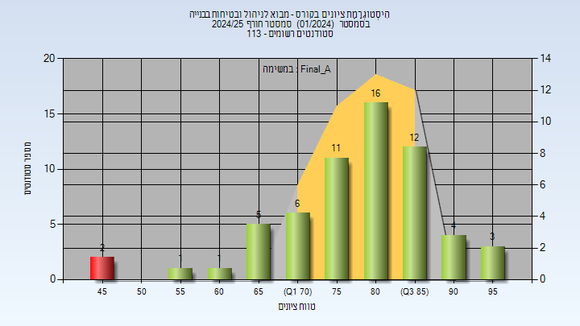

| סטודנטים | עברו/נכשלו | אחוז עוברים | ציון מינימלי | ציון מקסימלי | ממוצע | חציון |
| ---- | ---- | ---- | ---- | ---- | ---- | ---- |
| 61 | 59/2 | 97 | 48 | 99 | 79.311 | 80 |

<h3 id="202401-Final_B">סופי מועד ב'</h3>

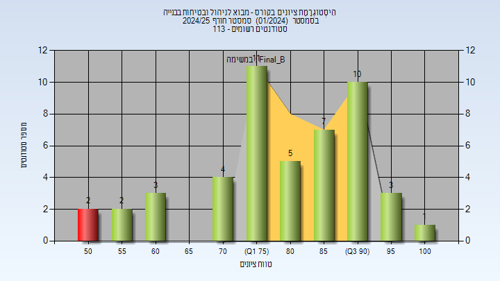

| סטודנטים | עברו/נכשלו | אחוז עוברים | ציון מינימלי | ציון מקסימלי | ממוצע | חציון |
| ---- | ---- | ---- | ---- | ---- | ---- | ---- |
| 48 | 46/2 | 96 | 50 | 100 | 80.646 | 83 |

<h3 id="202401-Finals">סופי</h3>

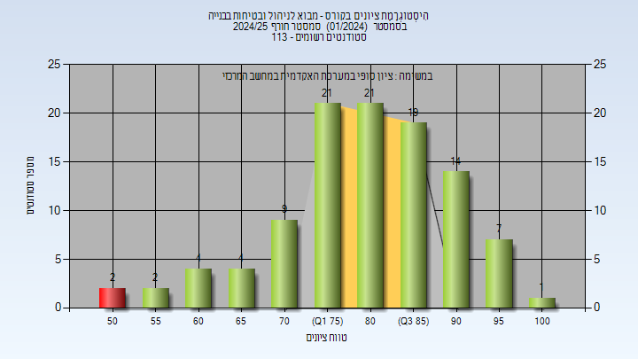

| סטודנטים | עברו/נכשלו | אחוז עוברים | ציון מינימלי | ציון מקסימלי | ממוצע | חציון |
| ---- | ---- | ---- | ---- | ---- | ---- | ---- |
| 113 | 102/11 | 90 | 50 | 100 | 81.106 | 81.5 |

<h2 id="202301">חורף 2023-2024</h2>

| איש סגל | תפקיד |
| ---- | ---- |
| זיצ'ק-פנחס ענת | מרצה - אחראי מקצוע |
| מלכה אופירה | סגל מנהלי - עם הרשאות מרצה אחראי |
| בלסברג עליזה | סגל מנהלי - עם הרשאות מרצה אחראי |
| לוינסקי יעל | סגל מנהלי - עם הרשאות מרצה אחראי |
| בן-סימון צפורה | סגל מנהלי - עם הרשאות מרצה אחראי |
| צאצאשוילי תמי | סגל מנהלי - עם הרשאות מרצה אחראי |
| שביט שרית | סגל מנהלי - עם הרשאות מרצה אחראי |
| צעירי קובלר קרן | סגל מנהלי - עם הרשאות מרצה אחראי |

<h3 id="202301-Final_A">סופי מועד א'</h3>

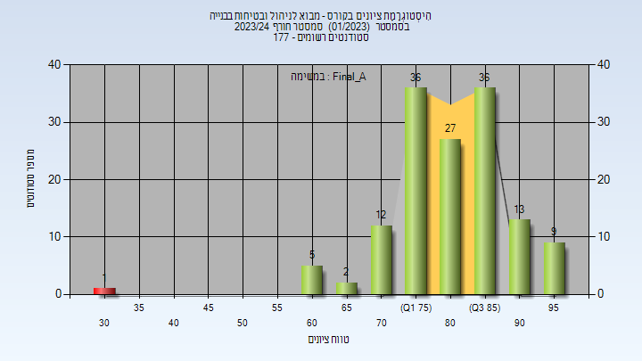

| סטודנטים | עברו/נכשלו | אחוז עוברים | ציון מינימלי | ציון מקסימלי | ממוצע | חציון |
| ---- | ---- | ---- | ---- | ---- | ---- | ---- |
| 141 | 140/1 | 99 | 30 | 99 | 81.574 | 82 |

<h3 id="202301-Final_B">סופי מועד ב'</h3>

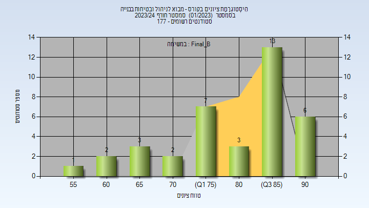

| סטודנטים | עברו/נכשלו | אחוז עוברים | ציון מינימלי | ציון מקסימלי | ממוצע | חציון |
| ---- | ---- | ---- | ---- | ---- | ---- | ---- |
| 37 | 37/0 | 100 | 57 | 94 | 81.081 | 85 |

<h3 id="202301-Finals">סופי</h3>

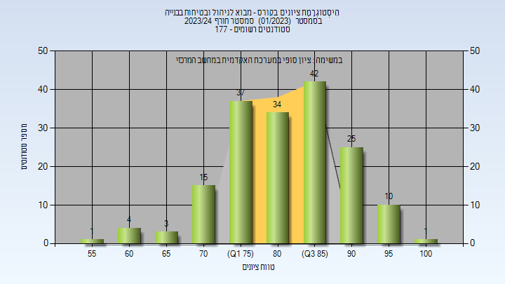

| סטודנטים | עברו/נכשלו | אחוז עוברים | ציון מינימלי | ציון מקסימלי | ממוצע | חציון |
| ---- | ---- | ---- | ---- | ---- | ---- | ---- |
| 174 | 174/0 | 100 | 59 | 100 | 82.709 | 83 |

<h2 id="202201">חורף 2022-2023</h2>

| איש סגל | תפקיד |
| ---- | ---- |
| זיצ'ק-פנחס ענת | מרצה - אחראי מקצוע |
| צאצאשוילי תמי | סגל מנהלי - עם הרשאות מרצה אחראי |
| בן-סימון ציפורה | סגל מנהלי - עם הרשאות מרצה אחראי |
| קובלר קרן | סגל מנהלי - עם הרשאות מרצה אחראי |
| מלכה אופירה | סגל מנהלי - עם הרשאות מרצה אחראי |
| לוינסקי יעל | סגל מנהלי - עם הרשאות מרצה אחראי |
| שביט שרית | סגל מנהלי - עם הרשאות מרצה אחראי |
| בלסברג עליזה | סגל מנהלי - עם הרשאות מרצה אחראי |

<h3 id="202201-Final_A">סופי מועד א'</h3>

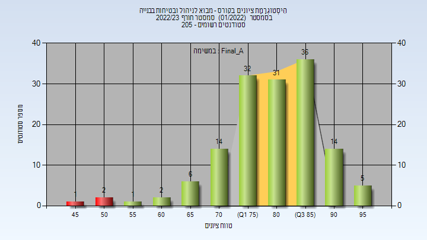

| סטודנטים | עברו/נכשלו | אחוז עוברים | ציון מינימלי | ציון מקסימלי | ממוצע | חציון |
| ---- | ---- | ---- | ---- | ---- | ---- | ---- |
| 144 | 141/3 | 98 | 47 | 97 | 80.979 | 82 |

<h3 id="202201-Final_B">סופי מועד ב'</h3>

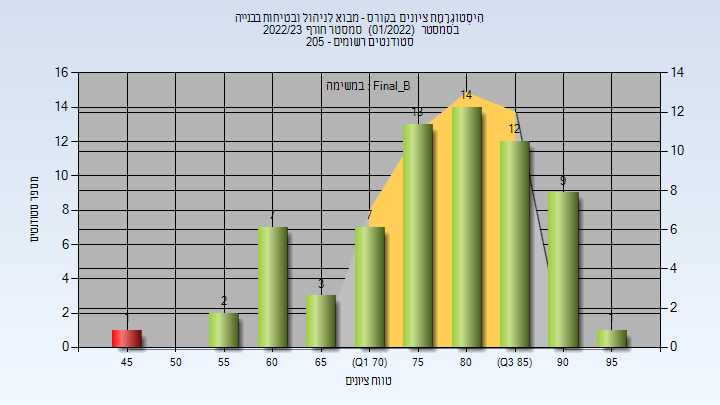

| סטודנטים | עברו/נכשלו | אחוז עוברים | ציון מינימלי | ציון מקסימלי | ממוצע | חציון |
| ---- | ---- | ---- | ---- | ---- | ---- | ---- |
| 69 | 68/1 | 99 | 46 | 98 | 78.188 | 80 |

<h3 id="202201-Finals">סופי</h3>

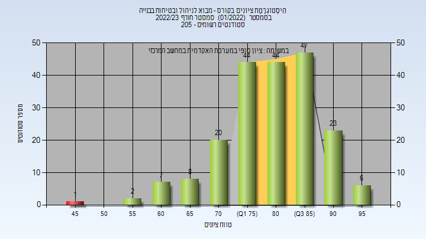

| סטודנטים | עברו/נכשלו | אחוז עוברים | ציון מינימלי | ציון מקסימלי | ממוצע | חציון |
| ---- | ---- | ---- | ---- | ---- | ---- | ---- |
| 202 | 201/1 | 100 | 46 | 98 | 80.881 | 82 |

<h2 id="202101">חורף 2021-2022</h2>

| איש סגל | תפקיד |
| ---- | ---- |
| זיצ'ק-פנחס ענת | מרצה - אחראי מקצוע |
| צאצאשוילי תמי | סגל מנהלי - עם הרשאות מרצה אחראי |
| קובלר קרן | סגל מנהלי - עם הרשאות מרצה אחראי |
| בלסברג עליזה | סגל מנהלי - עם הרשאות מרצה אחראי |
| מלכה אופירה | סגל מנהלי - עם הרשאות מרצה אחראי |
| שביט שרית | סגל מנהלי - עם הרשאות מרצה אחראי |
| בן-סימון ציפורה | סגל מנהלי - עם הרשאות מרצה אחראי |
| לוינסקי יעל | סגל מנהלי - עם הרשאות מרצה אחראי |

<h3 id="202101-Final_A">סופי מועד א'</h3>

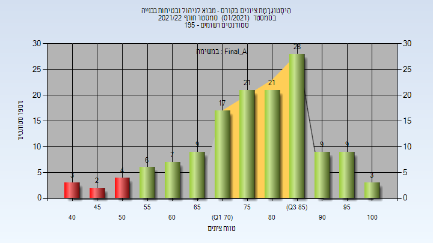

| סטודנטים | עברו/נכשלו | אחוז עוברים | ציון מינימלי | ציון מקסימלי | ממוצע | חציון |
| ---- | ---- | ---- | ---- | ---- | ---- | ---- |
| 139 | 130/9 | 94 | 40 | 100 | 77.518 | 79 |

<h3 id="202101-Final_B">סופי מועד ב'</h3>

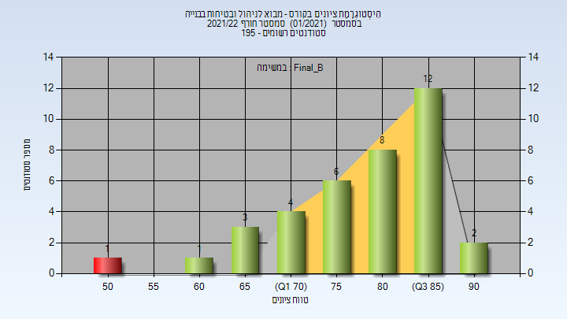

| סטודנטים | עברו/נכשלו | אחוז עוברים | ציון מינימלי | ציון מקסימלי | ממוצע | חציון |
| ---- | ---- | ---- | ---- | ---- | ---- | ---- |
| 37 | 36/1 | 97 | 51 | 91 | 80 | 82 |

<h3 id="202101-Finals">סופי</h3>

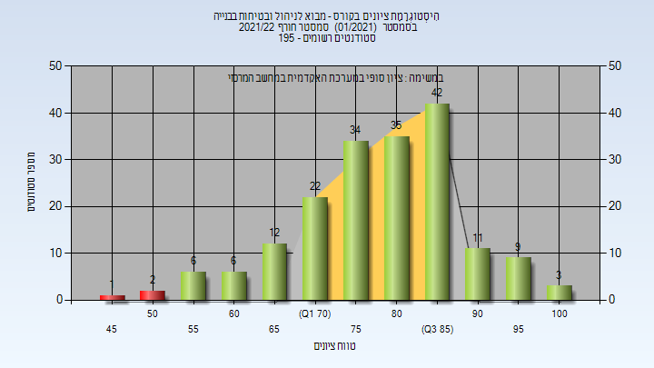

| סטודנטים | עברו/נכשלו | אחוז עוברים | ציון מינימלי | ציון מקסימלי | ממוצע | חציון |
| ---- | ---- | ---- | ---- | ---- | ---- | ---- |
| 183 | 180/3 | 98 | 47 | 100 | 79.459 | 80 |

<h2 id="202001">חורף 2020-2021</h2>

| איש סגל | תפקיד |
| ---- | ---- |
| זיצ'ק-פנחס ענת | מרצה - אחראי מקצוע |
| שביט שרית | סגל מנהלי - עם הרשאות מרצה אחראי |
| צאצאשוילי תמי | סגל מנהלי - עם הרשאות מרצה אחראי |

<h3 id="202001-Final_A">סופי מועד א'</h3>

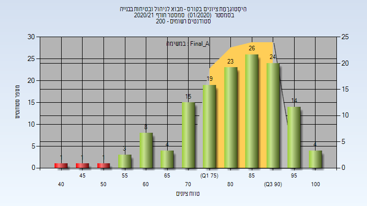

| סטודנטים | עברו/נכשלו | אחוז עוברים | ציון מינימלי | ציון מקסימלי | ממוצע | חציון |
| ---- | ---- | ---- | ---- | ---- | ---- | ---- |
| 143 | 140/3 | 98 | 41 | 100 | 81.804 | 83 |

<h3 id="202001-Final_B">סופי מועד ב'</h3>

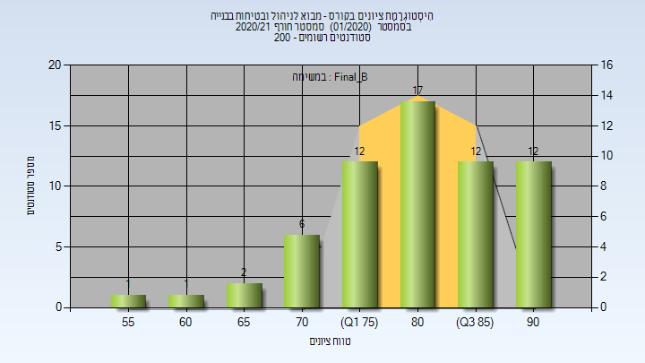

| סטודנטים | עברו/נכשלו | אחוז עוברים | ציון מינימלי | ציון מקסימלי | ממוצע | חציון |
| ---- | ---- | ---- | ---- | ---- | ---- | ---- |
| 63 | 63/0 | 100 | 56 | 93 | 81.841 | 82 |

<h3 id="202001-Finals">סופי</h3>

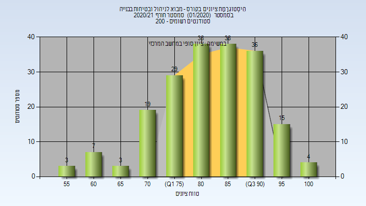

| סטודנטים | עברו/נכשלו | אחוז עוברים | ציון מינימלי | ציון מקסימלי | ממוצע | חציון |
| ---- | ---- | ---- | ---- | ---- | ---- | ---- |
| 192 | 192/0 | 100 | 55 | 100 | 83.156 | 84 |

<h2 id="201901">חורף 2019-2020</h2>

| איש סגל | תפקיד |
| ---- | ---- |
| זיצ'ק-פנחס ענת | מרצה - אחראי מקצוע |
| ואנג גיל | מתרגל - עם הרשאות מרצה אחראי |

<h3 id="201901-Exam_A">מבחן מועד א'</h3>

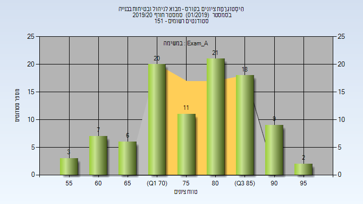

| סטודנטים | עברו/נכשלו | אחוז עוברים | ציון מינימלי | ציון מקסימלי | ממוצע | חציון |
| ---- | ---- | ---- | ---- | ---- | ---- | ---- |
| 97 | 97/0 | 100 | 56 | 98 | 78.392 | 80 |

<h3 id="201901-Final_A">סופי מועד א'</h3>

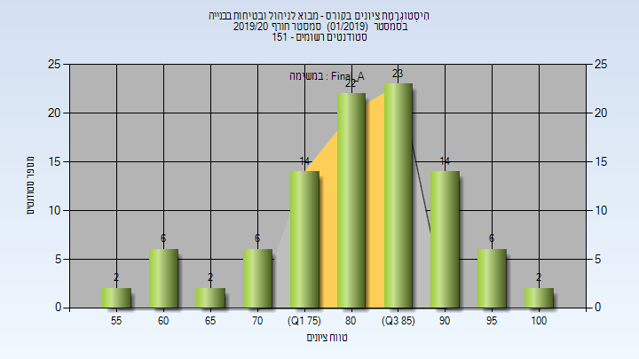

| סטודנטים | עברו/נכשלו | אחוז עוברים | ציון מינימלי | ציון מקסימלי | ממוצע | חציון |
| ---- | ---- | ---- | ---- | ---- | ---- | ---- |
| 97 | 97/0 | 100 | 58 | 100 | 82.557 | 84 |

<h3 id="201901-Exam_B">מבחן מועד ב'</h3>

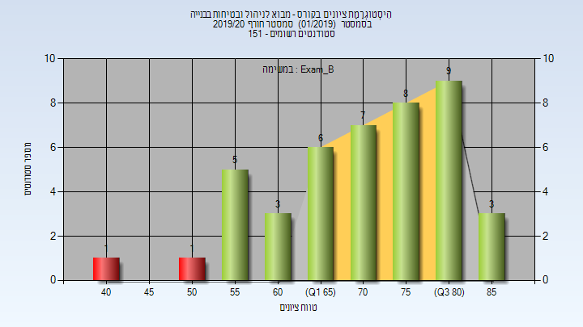

| סטודנטים | עברו/נכשלו | אחוז עוברים | ציון מינימלי | ציון מקסימלי | ממוצע | חציון |
| ---- | ---- | ---- | ---- | ---- | ---- | ---- |
| 43 | 41/2 | 95 | 41 | 88 | 71.953 | 72 |

<h3 id="201901-Final_B">סופי מועד ב'</h3>

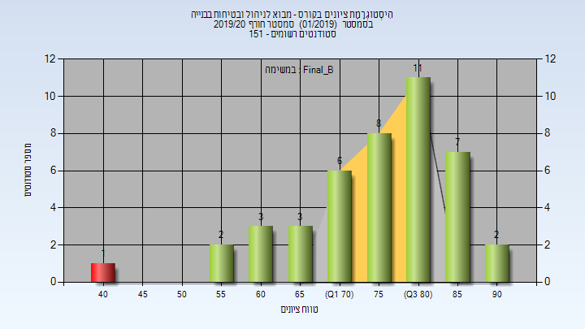

| סטודנטים | עברו/נכשלו | אחוז עוברים | ציון מינימלי | ציון מקסימלי | ממוצע | חציון |
| ---- | ---- | ---- | ---- | ---- | ---- | ---- |
| 43 | 42/1 | 98 | 44 | 92 | 76.186 | 77 |

<h3 id="201901-Finals">סופי</h3>

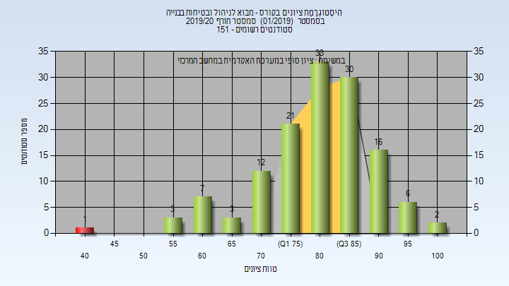

| סטודנטים | עברו/נכשלו | אחוז עוברים | ציון מינימלי | ציון מקסימלי | ממוצע | חציון |
| ---- | ---- | ---- | ---- | ---- | ---- | ---- |
| 134 | 133/1 | 99 | 44 | 100 | 81.284 | 83 |

