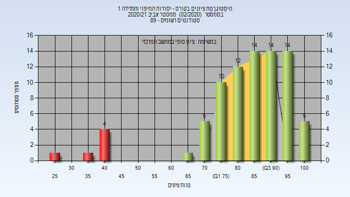

# 00140841 - יסודות המיפוי והמדידה 1

**הערה**: מאגר ההיסטוגרמות הוקם עבור [CheeseFork](https://cheesefork.cf/), כלי בניית מערכת שעות עבור סטודנטים בטכניון. באתר בו אתם גולשים ניתן לעיין בהיסטוגרמות, אך הדרך היותר נוחה היא לעיין בהיסטוגרמות, ובמידע נוסף כגון חוות דעת של סטודנטים, באתר CheeseFork.

* [אביב 2024](#202302)
  * [סופי מועד א'](#202302-Final_A)
  * [סופי מועד ב'](#202302-Final_B)
  * [סופי](#202302-Finals)
* [חורף 2023-2024](#202301)
* [אביב 2023](#202202)
  * [סופי מועד א'](#202202-Final_A)
  * [סופי](#202202-Finals)
* [חורף 2022-2023](#202201)
  * [סופי מועד א'](#202201-Final_A)
  * [סופי מועד ב'](#202201-Final_B)
  * [סופי](#202201-Finals)
* [אביב 2022](#202102)
  * [סופי מועד א'](#202102-Final_A)
  * [סופי מועד ב'](#202102-Final_B)
  * [סופי](#202102-Finals)
* [חורף 2021-2022](#202101)
  * [מבחן מועד א'](#202101-Exam_A)
  * [סופי מועד א'](#202101-Final_A)
  * [סופי מועד ב'](#202101-Final_B)
  * [סופי](#202101-Finals)
* [אביב 2021](#202002)
  * [סופי מועד א'](#202002-Final_A)
  * [סופי מועד ב'](#202002-Final_B)
  * [סופי](#202002-Finals)
* [חורף 2020-2021](#202001)
  * [מבחן מועד א'](#202001-Exam_A)
  * [סופי מועד א'](#202001-Final_A)
  * [מבחן מועד ב'](#202001-Exam_B)
  * [סופי מועד ב'](#202001-Final_B)
  * [סופי](#202001-Finals)
* [אביב 2020](#201902)
  * [סופי מועד א'](#201902-Final_A)
  * [סופי מועד ב'](#201902-Final_B)
  * [סופי](#201902-Finals)
* [חורף 2019-2020](#201901)
  * [סופי מועד א'](#201901-Final_A)
  * [סופי מועד ב'](#201901-Final_B)
  * [סופי](#201901-Finals)
* [אביב 2019](#201802)
  * [סופי מועד א'](#201802-Final_A)
  * [סופי מועד ב'](#201802-Final_B)
  * [סופי](#201802-Finals)
* [חורף 2018-2019](#201801)
  * [מבחן מועד א'](#201801-Exam_A)
  * [סופי מועד א'](#201801-Final_A)
  * [מבחן מועד ב'](#201801-Exam_B)
  * [סופי מועד ב'](#201801-Final_B)
  * [סופי](#201801-Finals)
* [אביב 2018](#201702)
  * [סופי מועד א'](#201702-Final_A)
  * [סופי מועד ב'](#201702-Final_B)
  * [סופי](#201702-Finals)
* [חורף 2017-2018](#201701)
  * [סופי מועד א'](#201701-Final_A)
  * [סופי מועד ב'](#201701-Final_B)
  * [סופי](#201701-Finals)
* [אביב 2017](#201602)
  * [סופי מועד א'](#201602-Final_A)
  * [סופי מועד ב'](#201602-Final_B)
  * [סופי](#201602-Finals)
* [חורף 2016-2017](#201601)
  * [סופי מועד א'](#201601-Final_A)
  * [סופי](#201601-Finals)
* [אביב 2016](#201502)
  * [סופי מועד א'](#201502-Final_A)
  * [סופי מועד ב'](#201502-Final_B)
  * [סופי](#201502-Finals)

<h2 id="202302">אביב 2024</h2>

| איש סגל | תפקיד |
| ---- | ---- |
| רגב אלמוג אופיר | מרצה - אחראי מקצוע |
| בלסברג עליזה | סגל מנהלי - עם הרשאות מרצה אחראי |

<h3 id="202302-Final_A">סופי מועד א'</h3>

| סטודנטים | עברו/נכשלו | אחוז עוברים | ציון מינימלי | ציון מקסימלי | ממוצע | חציון |
| ---- | ---- | ---- | ---- | ---- | ---- | ---- |
| 71 | 71/0 | 100 | 64 | 100 | 90 | 91 |

<h3 id="202302-Final_B">סופי מועד ב'</h3>

| סטודנטים | עברו/נכשלו | אחוז עוברים | ציון מינימלי | ציון מקסימלי | ממוצע | חציון |
| ---- | ---- | ---- | ---- | ---- | ---- | ---- |
| 12 | 12/0 | 100 | 63 | 92 | 81.917 | 84.5 |

<h3 id="202302-Finals">סופי</h3>

| סטודנטים | עברו/נכשלו | אחוז עוברים | ציון מינימלי | ציון מקסימלי | ממוצע | חציון |
| ---- | ---- | ---- | ---- | ---- | ---- | ---- |
| 73 | 73/0 | 100 | 66 | 100 | 91.37 | 93 |

<h2 id="202301">חורף 2023-2024</h2>

| איש סגל | תפקיד |
| ---- | ---- |
| רגב אלמוג אופיר | מרצה - אחראי מקצוע |
| בלסברג עליזה | סגל מנהלי - עם הרשאות מרצה אחראי |

<h2 id="202202">אביב 2023</h2>

| איש סגל | תפקיד |
| ---- | ---- |
| רגב אלמוג אופיר | מרצה - אחראי מקצוע |
| בלסברג עליזה | סגל מנהלי - עם הרשאות מרצה אחראי |

<h3 id="202202-Final_A">סופי מועד א'</h3>

| סטודנטים | עברו/נכשלו | אחוז עוברים | ציון מינימלי | ציון מקסימלי | ממוצע | חציון |
| ---- | ---- | ---- | ---- | ---- | ---- | ---- |
| 88 | 81/7 | 92 | 21 | 100 | 77.727 | 81 |

<h3 id="202202-Finals">סופי</h3>

| סטודנטים | עברו/נכשלו | אחוז עוברים | ציון מינימלי | ציון מקסימלי | ממוצע | חציון |
| ---- | ---- | ---- | ---- | ---- | ---- | ---- |
| 89 | 88/1 | 99 | 44 | 100 | 82.593 | 84 |

<h2 id="202201">חורף 2022-2023</h2>

| איש סגל | תפקיד |
| ---- | ---- |
| רגב אלמוג אופיר | מרצה - אחראי מקצוע |
| בלסברג עליזה | סגל מנהלי - עם הרשאות מרצה אחראי |

<h3 id="202201-Final_A">סופי מועד א'</h3>

| סטודנטים | עברו/נכשלו | אחוז עוברים | ציון מינימלי | ציון מקסימלי | ממוצע | חציון |
| ---- | ---- | ---- | ---- | ---- | ---- | ---- |
| 77 | 74/3 | 96 | 45 | 100 | 84.351 | 84 |

<h3 id="202201-Final_B">סופי מועד ב'</h3>

| סטודנטים | עברו/נכשלו | אחוז עוברים | ציון מינימלי | ציון מקסימלי | ממוצע | חציון |
| ---- | ---- | ---- | ---- | ---- | ---- | ---- |
| 23 | 23/0 | 100 | 67 | 100 | 83.522 | 82 |

<h3 id="202201-Finals">סופי</h3>

| סטודנטים | עברו/נכשלו | אחוז עוברים | ציון מינימלי | ציון מקסימלי | ממוצע | חציון |
| ---- | ---- | ---- | ---- | ---- | ---- | ---- |
| 91 | 91/0 | 100 | 65 | 100 | 85.967 | 86 |

<h2 id="202102">אביב 2022</h2>

| איש סגל | תפקיד |
| ---- | ---- |
| רגב אלמוג אופיר | מרצה - אחראי מקצוע |
| בלסברג עליזה | סגל מנהלי - עם הרשאות מרצה אחראי |

<h3 id="202102-Final_A">סופי מועד א'</h3>

| סטודנטים | עברו/נכשלו | אחוז עוברים | ציון מינימלי | ציון מקסימלי | ממוצע | חציון |
| ---- | ---- | ---- | ---- | ---- | ---- | ---- |
| 68 | 61/7 | 90 | 45 | 100 | 79.544 | 83 |

<h3 id="202102-Final_B">סופי מועד ב'</h3>

| סטודנטים | עברו/נכשלו | אחוז עוברים | ציון מינימלי | ציון מקסימלי | ממוצע | חציון |
| ---- | ---- | ---- | ---- | ---- | ---- | ---- |
| 42 | 42/0 | 100 | 62 | 100 | 84.238 | 85 |

<h3 id="202102-Finals">סופי</h3>

| סטודנטים | עברו/נכשלו | אחוז עוברים | ציון מינימלי | ציון מקסימלי | ממוצע | חציון |
| ---- | ---- | ---- | ---- | ---- | ---- | ---- |
| 100 | 99/1 | 99 | 49 | 100 | 83.32 | 85 |

<h2 id="202101">חורף 2021-2022</h2>

| איש סגל | תפקיד |
| ---- | ---- |
| דליות שגיא | מרצה - אחראי מקצוע |
| ג'לג'ולה רובא | מתרגל |
| בלסברג עליזה | סגל מנהלי - עם הרשאות מרצה אחראי |

<h3 id="202101-Exam_A">מבחן מועד א'</h3>

| סטודנטים | עברו/נכשלו | אחוז עוברים | ציון מינימלי | ציון מקסימלי | ממוצע | חציון |
| ---- | ---- | ---- | ---- | ---- | ---- | ---- |
| 72 | 66/6 | 92 | 31 | 96 | 73.319 | 77 |

<h3 id="202101-Final_A">סופי מועד א'</h3>

| סטודנטים | עברו/נכשלו | אחוז עוברים | ציון מינימלי | ציון מקסימלי | ממוצע | חציון |
| ---- | ---- | ---- | ---- | ---- | ---- | ---- |
| 72 | 66/6 | 92 | 31 | 100 | 81.694 | 85 |

<h3 id="202101-Final_B">סופי מועד ב'</h3>

| סטודנטים | עברו/נכשלו | אחוז עוברים | ציון מינימלי | ציון מקסימלי | ממוצע | חציון |
| ---- | ---- | ---- | ---- | ---- | ---- | ---- |
| 28 | 23/5 | 82 | 29 | 100 | 72.25 | 74.5 |

<h3 id="202101-Finals">סופי</h3>

| סטודנטים | עברו/נכשלו | אחוז עוברים | ציון מינימלי | ציון מקסימלי | ממוצע | חציון |
| ---- | ---- | ---- | ---- | ---- | ---- | ---- |
| 100 | 96/4 | 96 | 29 | 100 | 81.22 | 83 |

<h2 id="202002">אביב 2021</h2>

| איש סגל | תפקיד |
| ---- | ---- |
| דליות שגיא | מרצה - אחראי מקצוע |
| ג'לג'ולה רובא | מתרגל |
| טופל לאה | מרצה |
| בלסברג עליזה | סגל מנהלי - עם הרשאות מרצה אחראי |

<h3 id="202002-Final_A">סופי מועד א'</h3>

| סטודנטים | עברו/נכשלו | אחוז עוברים | ציון מינימלי | ציון מקסימלי | ממוצע | חציון |
| ---- | ---- | ---- | ---- | ---- | ---- | ---- |
| 69 | 64/5 | 93 | 30 | 103 | 84.754 | 88 |

<h3 id="202002-Final_B">סופי מועד ב'</h3>

| סטודנטים | עברו/נכשלו | אחוז עוברים | ציון מינימלי | ציון מקסימלי | ממוצע | חציון |
| ---- | ---- | ---- | ---- | ---- | ---- | ---- |
| 18 | 11/7 | 61 | 0 | 96 | 62.778 | 72.5 |

<h3 id="202002-Finals">סופי</h3>

| סטודנטים | עברו/נכשלו | אחוז עוברים | ציון מינימלי | ציון מקסימלי | ממוצע | חציון |
| ---- | ---- | ---- | ---- | ---- | ---- | ---- |
| 81 | 75/6 | 93 | 28 | 100 | 83.704 | 87 |

<h2 id="202001">חורף 2020-2021</h2>

| איש סגל | תפקיד |
| ---- | ---- |
| דליות שגיא | מרצה - אחראי מקצוע |
| מלג'אק איתמר | מתרגל |
| וידרו יוליה | מתרגל |
| עווד רידא | מתרגל |
| ג'לג'ולה רובא | מתרגל |
| וייל זטלמן שחף | מתרגל |
| כהן אחיטוב | מתרגל |
| בלסברג עליזה | סגל מנהלי - עם הרשאות מרצה אחראי |

<h3 id="202001-Exam_A">מבחן מועד א'</h3>

| סטודנטים | עברו/נכשלו | אחוז עוברים | ציון מינימלי | ציון מקסימלי | ממוצע | חציון |
| ---- | ---- | ---- | ---- | ---- | ---- | ---- |
| 57 | 55/2 | 96 | 21 | 103 | 78.018 | 81 |

<h3 id="202001-Final_A">סופי מועד א'</h3>

| סטודנטים | עברו/נכשלו | אחוז עוברים | ציון מינימלי | ציון מקסימלי | ממוצע | חציון |
| ---- | ---- | ---- | ---- | ---- | ---- | ---- |
| 57 | 55/2 | 96 | 21 | 106 | 83.93 | 84 |

<h3 id="202001-Exam_B">מבחן מועד ב'</h3>

| סטודנטים | עברו/נכשלו | אחוז עוברים | ציון מינימלי | ציון מקסימלי | ממוצע | חציון |
| ---- | ---- | ---- | ---- | ---- | ---- | ---- |
| 29 | 25/4 | 86 | 20 | 92 | 70.862 | 75 |

<h3 id="202001-Final_B">סופי מועד ב'</h3>

| סטודנטים | עברו/נכשלו | אחוז עוברים | ציון מינימלי | ציון מקסימלי | ממוצע | חציון |
| ---- | ---- | ---- | ---- | ---- | ---- | ---- |
| 29 | 25/4 | 86 | 20 | 95 | 76.379 | 81 |

<h3 id="202001-Finals">סופי</h3>

| סטודנטים | עברו/נכשלו | אחוז עוברים | ציון מינימלי | ציון מקסימלי | ממוצע | חציון |
| ---- | ---- | ---- | ---- | ---- | ---- | ---- |
| 84 | 79/5 | 94 | 20 | 100 | 81.655 | 84 |

<h2 id="201902">אביב 2020</h2>

| איש סגל | תפקיד |
| ---- | ---- |
| דליות שגיא | מרצה - אחראי מקצוע |
| עווד רידא | מתרגל |
| ג'לג'ולה רובא | מתרגל |
| גנאים עלאא | מתרגל |
| וידרו יוליה | מתרגל |
| דרור טליה | מתרגל |
| עזרן עדי | מתרגל |
| וייל זטלמן שחף | מתרגל |
| אבו האני ג'ואל | מתרגל |
| קלר מוריה | מתרגל |
| אבו מפלח פיראס | מתרגל |
| בלסברג עליזה | סגל מנהלי - עם הרשאות מרצה אחראי |

<h3 id="201902-Final_A">סופי מועד א'</h3>

| סטודנטים | עברו/נכשלו | אחוז עוברים | ציון מינימלי | ציון מקסימלי | ממוצע | חציון |
| ---- | ---- | ---- | ---- | ---- | ---- | ---- |
| 90 | 82/8 | 91 | 27 | 103 | 82.622 | 86 |

<h3 id="201902-Final_B">סופי מועד ב'</h3>

| סטודנטים | עברו/נכשלו | אחוז עוברים | ציון מינימלי | ציון מקסימלי | ממוצע | חציון |
| ---- | ---- | ---- | ---- | ---- | ---- | ---- |
| 30 | 27/3 | 90 | 22 | 95 | 75.6 | 79 |

<h3 id="201902-Finals">סופי</h3>

| סטודנטים | עברו/נכשלו | אחוז עוברים | ציון מינימלי | ציון מקסימלי | ממוצע | חציון |
| ---- | ---- | ---- | ---- | ---- | ---- | ---- |
| 112 | 108/4 | 96 | 22 | 100 | 83.509 | 85.5 |

<h2 id="201901">חורף 2019-2020</h2>

| איש סגל | תפקיד |
| ---- | ---- |
| דליות שגיא | מרצה - אחראי מקצוע |
| אבו האני ג'ואל | מתרגל |
| עווד רידא | מתרגל |
| מלג'אק איתמר | מתרגל |
| ג'לג'ולה רובא | מתרגל |
| דרור טליה | מתרגל |
| וידרו יוליה | מתרגל |
| גנאים עלאא | מתרגל |

<h3 id="201901-Final_A">סופי מועד א'</h3>

| סטודנטים | עברו/נכשלו | אחוז עוברים | ציון מינימלי | ציון מקסימלי | ממוצע | חציון |
| ---- | ---- | ---- | ---- | ---- | ---- | ---- |
| 63 | 61/2 | 97 | 27 | 98 | 81.302 | 83 |

<h3 id="201901-Final_B">סופי מועד ב'</h3>

| סטודנטים | עברו/נכשלו | אחוז עוברים | ציון מינימלי | ציון מקסימלי | ממוצע | חציון |
| ---- | ---- | ---- | ---- | ---- | ---- | ---- |
| 13 | 10/3 | 77 | 48 | 94 | 71.769 | 73 |

<h3 id="201901-Finals">סופי</h3>

| סטודנטים | עברו/נכשלו | אחוז עוברים | ציון מינימלי | ציון מקסימלי | ממוצע | חציון |
| ---- | ---- | ---- | ---- | ---- | ---- | ---- |
| 72 | 69/3 | 96 | 48 | 98 | 81.194 | 83.5 |

<h2 id="201802">אביב 2019</h2>

| איש סגל | תפקיד |
| ---- | ---- |
| דליות שגיא | מרצה - אחראי מקצוע |
| חאג' יחיא שאדי | מתרגל |
| בהרב יהודה | מתרגל |
| אבו נסאר איליא | מתרגל |
| ג'לג'ולה רובא | מתרגל |
| עיסאוי אליאס | מתרגל |
| עווד רידא | מתרגל |
| וידרו יוליה | מתרגל |
| אלנאשף בשאר | מתרגל |
| דרור טליה | מתרגל |
| גנאים עלאא | מתרגל |
| בלנקי ילנה | מתרגל |

<h3 id="201802-Final_A">סופי מועד א'</h3>

| סטודנטים | עברו/נכשלו | אחוז עוברים | ציון מינימלי | ציון מקסימלי | ממוצע | חציון |
| ---- | ---- | ---- | ---- | ---- | ---- | ---- |
| 81 | 77/4 | 95 | 26 | 101 | 84.963 | 90 |

<h3 id="201802-Final_B">סופי מועד ב'</h3>

| סטודנטים | עברו/נכשלו | אחוז עוברים | ציון מינימלי | ציון מקסימלי | ממוצע | חציון |
| ---- | ---- | ---- | ---- | ---- | ---- | ---- |
| 21 | 19/2 | 90 | 46 | 96 | 77.667 | 78 |

<h3 id="201802-Finals">סופי</h3>

| סטודנטים | עברו/נכשלו | אחוז עוברים | ציון מינימלי | ציון מקסימלי | ממוצע | חציון |
| ---- | ---- | ---- | ---- | ---- | ---- | ---- |
| 95 | 93/2 | 98 | 46 | 100 | 85.6 | 89 |

<h2 id="201801">חורף 2018-2019</h2>

| איש סגל | תפקיד |
| ---- | ---- |
| דליות שגיא | מרצה - אחראי מקצוע |
| כהן אחיטוב | מתרגל |
| שכטר חן | מתרגל |
| לדין-גייניץ יואל | מתרגל |
| ג'לג'ולה רובא | מתרגל |
| וידרו יוליה | מתרגל |
| שכטר מור | מתרגל |

<h3 id="201801-Exam_A">מבחן מועד א'</h3>

| סטודנטים | עברו/נכשלו | אחוז עוברים | ציון מינימלי | ציון מקסימלי | ממוצע | חציון |
| ---- | ---- | ---- | ---- | ---- | ---- | ---- |
| 43 | 42/1 | 98 | 50 | 94 | 73.488 | 73 |

<h3 id="201801-Final_A">סופי מועד א'</h3>

| סטודנטים | עברו/נכשלו | אחוז עוברים | ציון מינימלי | ציון מקסימלי | ממוצע | חציון |
| ---- | ---- | ---- | ---- | ---- | ---- | ---- |
| 43 | 42/1 | 98 | 50 | 94 | 79.488 | 82 |

<h3 id="201801-Exam_B">מבחן מועד ב'</h3>

| סטודנטים | עברו/נכשלו | אחוז עוברים | ציון מינימלי | ציון מקסימלי | ממוצע | חציון |
| ---- | ---- | ---- | ---- | ---- | ---- | ---- |
| 20 | 17/3 | 85 | 24 | 102 | 67.5 | 69.5 |

<h3 id="201801-Final_B">סופי מועד ב'</h3>

| סטודנטים | עברו/נכשלו | אחוז עוברים | ציון מינימלי | ציון מקסימלי | ממוצע | חציון |
| ---- | ---- | ---- | ---- | ---- | ---- | ---- |
| 20 | 17/3 | 85 | 24 | 105 | 73.1 | 75.5 |

<h3 id="201801-Finals">סופי</h3>

| סטודנטים | עברו/נכשלו | אחוז עוברים | ציון מינימלי | ציון מקסימלי | ממוצע | חציון |
| ---- | ---- | ---- | ---- | ---- | ---- | ---- |
| 62 | 60/2 | 97 | 24 | 100 | 78.5 | 80.5 |

<h2 id="201702">אביב 2018</h2>

| איש סגל | תפקיד |
| ---- | ---- |
| דליות שגיא | מרצה - אחראי מקצוע |
| כהן אחיטוב | מתרגל |
| בינסקי נועה | מתרגל |
| שכטר חן | מתרגל |
| אבו ג'בל אמיר | מתרגל |
| זרייק סאמר | מתרגל |
| מסד עדו | מתרגל |
| שכטר מור | מתרגל |
| אפריים ליטל | מתרגל |
| בשותי אליאנה | מתרגל |
| אבו נסאר איליא | מתרגל |
| דרור טליה | מתרגל |

<h3 id="201702-Final_A">סופי מועד א'</h3>

| סטודנטים | עברו/נכשלו | אחוז עוברים | ציון מינימלי | ציון מקסימלי | ממוצע | חציון |
| ---- | ---- | ---- | ---- | ---- | ---- | ---- |
| 130 | 113/17 | 87 | 10 | 104 | 77.646 | 80 |

<h3 id="201702-Final_B">סופי מועד ב'</h3>

| סטודנטים | עברו/נכשלו | אחוז עוברים | ציון מינימלי | ציון מקסימלי | ממוצע | חציון |
| ---- | ---- | ---- | ---- | ---- | ---- | ---- |
| 47 | 41/6 | 87 | 26 | 101 | 76.83 | 77 |

<h3 id="201702-Finals">סופי</h3>

| סטודנטים | עברו/נכשלו | אחוז עוברים | ציון מינימלי | ציון מקסימלי | ממוצע | חציון |
| ---- | ---- | ---- | ---- | ---- | ---- | ---- |
| 155 | 148/7 | 95 | 26 | 100 | 81.368 | 82 |

<h2 id="201701">חורף 2017-2018</h2>

| איש סגל | תפקיד |
| ---- | ---- |
| דליות שגיא | מרצה - אחראי מקצוע |
| בינסקי נועה | מתרגל |
| מסד עדו | מתרגל |
| שכטר חן | מתרגל |
| שכטר מור | מתרגל |
| כהן אחיטוב | מתרגל |
| ג'לג'ולה רובא | מתרגל |

<h3 id="201701-Final_A">סופי מועד א'</h3>

| סטודנטים | עברו/נכשלו | אחוז עוברים | ציון מינימלי | ציון מקסימלי | ממוצע | חציון |
| ---- | ---- | ---- | ---- | ---- | ---- | ---- |
| 42 | 36/6 | 86 | 32 | 97 | 80.167 | 85 |

<h3 id="201701-Final_B">סופי מועד ב'</h3>

| סטודנטים | עברו/נכשלו | אחוז עוברים | ציון מינימלי | ציון מקסימלי | ממוצע | חציון |
| ---- | ---- | ---- | ---- | ---- | ---- | ---- |
| 12 | 10/2 | 83 | 44 | 92 | 76 | 81 |

<h3 id="201701-Finals">סופי</h3>

| סטודנטים | עברו/נכשלו | אחוז עוברים | ציון מינימלי | ציון מקסימלי | ממוצע | חציון |
| ---- | ---- | ---- | ---- | ---- | ---- | ---- |
| 49 | 47/2 | 96 | 44 | 97 | 83.082 | 85 |

<h2 id="201602">אביב 2017</h2>

| איש סגל | תפקיד |
| ---- | ---- |
| דליות שגיא | מרצה - אחראי מקצוע |
| וידרו יוליה | מתרגל |
| בשותי אליאנה | מתרגל |
| שחף מרדכי עודד | מתרגל |
| עיסאוי אליאס | מתרגל |
| לדין-גייניץ יואל | מתרגל |
| ג'לג'ולה רובא | מתרגל |
| שכטר מור | מתרגל |
| כהן אחיטוב | מתרגל |
| קלר מוריה | מתרגל |
| מסד עדו | מתרגל |
| שכטר חן | מתרגל |

<h3 id="201602-Final_A">סופי מועד א'</h3>

| סטודנטים | עברו/נכשלו | אחוז עוברים | ציון מינימלי | ציון מקסימלי | ממוצע | חציון |
| ---- | ---- | ---- | ---- | ---- | ---- | ---- |
| 123 | 112/11 | 91 | 30 | 100 | 79.724 | 83 |

<h3 id="201602-Final_B">סופי מועד ב'</h3>

| סטודנטים | עברו/נכשלו | אחוז עוברים | ציון מינימלי | ציון מקסימלי | ממוצע | חציון |
| ---- | ---- | ---- | ---- | ---- | ---- | ---- |
| 23 | 20/3 | 87 | 40 | 95 | 74.087 | 77 |

<h3 id="201602-Finals">סופי</h3>

| סטודנטים | עברו/נכשלו | אחוז עוברים | ציון מינימלי | ציון מקסימלי | ממוצע | חציון |
| ---- | ---- | ---- | ---- | ---- | ---- | ---- |
| 134 | 130/4 | 97 | 38 | 100 | 81.776 | 83 |

<h2 id="201601">חורף 2016-2017</h2>

| איש סגל | תפקיד |
| ---- | ---- |
| דליות שגיא | מרצה - אחראי מקצוע |
| ג'לג'ולה רובא | מתרגל |
| בשותי אליאנה | מתרגל |
| וידרו יוליה | מתרגל |
| שחף מרדכי עודד | מתרגל |
| כהן אחיטוב | מתרגל |
| שכטר מור | מתרגל |
| פור ירין | מתרגל |
| טופל לאה | מתרגל - עם הרשאות מרצה אחראי |

<h3 id="201601-Final_A">סופי מועד א'</h3>

| סטודנטים | עברו/נכשלו | אחוז עוברים | ציון מינימלי | ציון מקסימלי | ממוצע | חציון |
| ---- | ---- | ---- | ---- | ---- | ---- | ---- |
| 60 | 53/7 | 88 | 47 | 99 | 78.033 | 80 |

<h3 id="201601-Finals">סופי</h3>

| סטודנטים | עברו/נכשלו | אחוז עוברים | ציון מינימלי | ציון מקסימלי | ממוצע | חציון |
| ---- | ---- | ---- | ---- | ---- | ---- | ---- |
| 62 | 58/4 | 94 | 18 | 99 | 79.129 | 81.5 |

<h2 id="201502">אביב 2016</h2>

| איש סגל | תפקיד |
| ---- | ---- |
| דליות שגיא | מרצה - אחראי מקצוע |
| אלנאשף בשאר | מתרגל |
| חוראני ורד | מתרגל |
| וידרו יוליה | מתרגל |
| מוז'ייבה סופיה | מתרגל |
| ג'לג'ולה רובא | מתרגל |
| בשותי אליאנה | מתרגל |
| קבלאוי מחמוד | מתרגל |
| כהן אחיטוב | מתרגל |
| בינסקי נועה | מתרגל |
| שחף מרדכי עודד | מתרגל |
| מסד עדו | מתרגל |

<h3 id="201502-Final_A">סופי מועד א'</h3>

| סטודנטים | עברו/נכשלו | אחוז עוברים | ציון מינימלי | ציון מקסימלי | ממוצע | חציון |
| ---- | ---- | ---- | ---- | ---- | ---- | ---- |
| 123 | 116/7 | 94 | 27 | 99 | 83.634 | 86 |

<h3 id="201502-Final_B">סופי מועד ב'</h3>

| סטודנטים | עברו/נכשלו | אחוז עוברים | ציון מינימלי | ציון מקסימלי | ממוצע | חציון |
| ---- | ---- | ---- | ---- | ---- | ---- | ---- |
| 21 | 16/5 | 76 | 14 | 97 | 69.857 | 74 |

<h3 id="201502-Finals">סופי</h3>

| סטודנטים | עברו/נכשלו | אחוז עוברים | ציון מינימלי | ציון מקסימלי | ממוצע | חציון |
| ---- | ---- | ---- | ---- | ---- | ---- | ---- |
| 138 | 133/5 | 96 | 14 | 99 | 83.71 | 86 |

