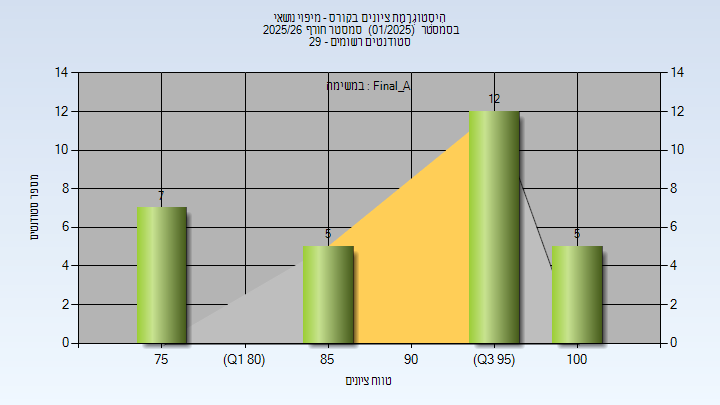

# 00140879 - מיפוי נושאי

**הערה**: מאגר ההיסטוגרמות הוקם עבור [CheeseFork](https://cheesefork.cf/), כלי בניית מערכת שעות עבור סטודנטים בטכניון. באתר בו אתם גולשים ניתן לעיין בהיסטוגרמות, אך הדרך היותר נוחה היא לעיין בהיסטוגרמות, ובמידע נוסף כגון חוות דעת של סטודנטים, באתר CheeseFork.

* [חורף 2025-2026](#202501)
  * [סופי מועד א'](#202501-Final_A)
* [חורף 2023-2024](#202301)
* [אביב 2021](#202002)

<h2 id="202501">חורף 2025-2026</h2>

| איש סגל | תפקיד |
| ---- | ---- |
| רגב אלמוג אופיר | מרצה - אחראי מקצוע |
| פרידמן יפעת | סגל מנהלי - עם הרשאות מרצה אחראי |

<h3 id="202501-Final_A">סופי מועד א'</h3>

| סטודנטים | עברו/נכשלו | אחוז עוברים | ציון מינימלי | ציון מקסימלי | ממוצע | חציון |
| ---- | ---- | ---- | ---- | ---- | ---- | ---- |
| 29 | 29/0 | 100 | 79 | 100 | 91.448 | 96 |

<h2 id="202301">חורף 2023-2024</h2>

| איש סגל | תפקיד |
| ---- | ---- |
| רגב אלמוג אופיר | מרצה - אחראי מקצוע |
| בלסברג עליזה | סגל מנהלי - עם הרשאות מרצה אחראי |

<h2 id="202002">אביב 2021</h2>

| איש סגל | תפקיד |
| ---- | ---- |
| רגב אלמוג אופיר | מרצה - אחראי מקצוע |
| בלסברג עליזה | סגל מנהלי - עם הרשאות מרצה אחראי |
| בן-סימון ציפורה | סגל מנהלי - עם הרשאות מרצה אחראי |

