# 00140881 - יסודות המיפוי והמדידה 1ג'

**הערה**: מאגר ההיסטוגרמות הוקם עבור [CheeseFork](https://cheesefork.cf/), כלי בניית מערכת שעות עבור סטודנטים בטכניון. באתר בו אתם גולשים ניתן לעיין בהיסטוגרמות, אך הדרך היותר נוחה היא לעיין בהיסטוגרמות, ובמידע נוסף כגון חוות דעת של סטודנטים, באתר CheeseFork.

* [אביב 2024](#202302)
  * [סופי מועד א'](#202302-Final_A)
  * [סופי](#202302-Finals)
* [חורף 2023-2024](#202301)
* [אביב 2023](#202202)
  * [סופי מועד א'](#202202-Final_A)
  * [סופי](#202202-Finals)
* [אביב 2022](#202102)
  * [סופי מועד א'](#202102-Final_A)
  * [סופי](#202102-Finals)
* [אביב 2021](#202002)
  * [מבחן מועד א'](#202002-Exam_A)
  * [סופי מועד א'](#202002-Final_A)
  * [סופי](#202002-Finals)
* [אביב 2020](#201902)
  * [סופי מועד א'](#201902-Final_A)
  * [סופי](#201902-Finals)
* [אביב 2019](#201802)
  * [סופי מועד א'](#201802-Final_A)
  * [סופי](#201802-Finals)
* [אביב 2018](#201702)
  * [סופי מועד א'](#201702-Final_A)
  * [סופי מועד ב'](#201702-Final_B)
  * [סופי](#201702-Finals)
* [אביב 2017](#201602)
  * [סופי מועד א'](#201602-Final_A)
  * [סופי](#201602-Finals)

<h2 id="202302">אביב 2024</h2>

| איש סגל | תפקיד |
| ---- | ---- |
| רגב אלמוג אופיר | מרצה - אחראי מקצוע |
| שביט שרית | סגל מנהלי - עם הרשאות מרצה אחראי |
| בלסברג עליזה | סגל מנהלי - עם הרשאות מרצה אחראי |
| צאצאשוילי תמי | סגל מנהלי - עם הרשאות מרצה אחראי |

<h3 id="202302-Final_A">סופי מועד א'</h3>

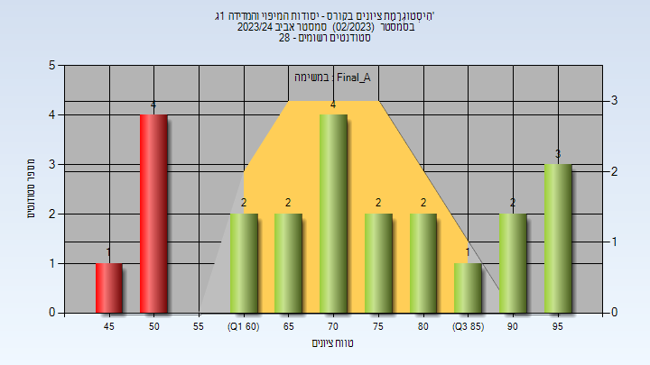

| סטודנטים | עברו/נכשלו | אחוז עוברים | ציון מינימלי | ציון מקסימלי | ממוצע | חציון |
| ---- | ---- | ---- | ---- | ---- | ---- | ---- |
| 23 | 18/5 | 78 | 49 | 98 | 73.522 | 71 |

<h3 id="202302-Finals">סופי</h3>

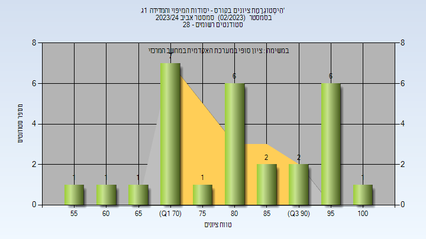

| סטודנטים | עברו/נכשלו | אחוז עוברים | ציון מינימלי | ציון מקסימלי | ממוצע | חציון |
| ---- | ---- | ---- | ---- | ---- | ---- | ---- |
| 28 | 28/0 | 100 | 55 | 100 | 81.964 | 81.5 |

<h2 id="202301">חורף 2023-2024</h2>

<h2 id="202202">אביב 2023</h2>

| איש סגל | תפקיד |
| ---- | ---- |
| בלסברג עליזה | סגל מנהלי - עם הרשאות מרצה אחראי |

<h3 id="202202-Final_A">סופי מועד א'</h3>

| סטודנטים | עברו/נכשלו | אחוז עוברים | ציון מינימלי | ציון מקסימלי | ממוצע | חציון |
| ---- | ---- | ---- | ---- | ---- | ---- | ---- |
| 29 | 29/0 | 100 | 70 | 93 | 82.172 | 83 |

<h3 id="202202-Finals">סופי</h3>

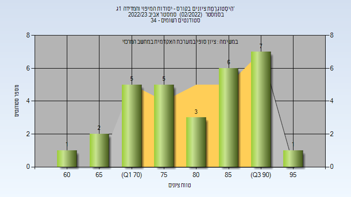

| סטודנטים | עברו/נכשלו | אחוז עוברים | ציון מינימלי | ציון מקסימלי | ממוצע | חציון |
| ---- | ---- | ---- | ---- | ---- | ---- | ---- |
| 33 | 33/0 | 100 | 63 | 96 | 81.467 | 82 |

<h2 id="202102">אביב 2022</h2>

| איש סגל | תפקיד |
| ---- | ---- |
| רגב אלמוג אופיר | מרצה - אחראי מקצוע |
| בן-סימון ציפורה | סגל מנהלי - עם הרשאות מרצה אחראי |
| בלסברג עליזה | סגל מנהלי - עם הרשאות מרצה אחראי |

<h3 id="202102-Final_A">סופי מועד א'</h3>

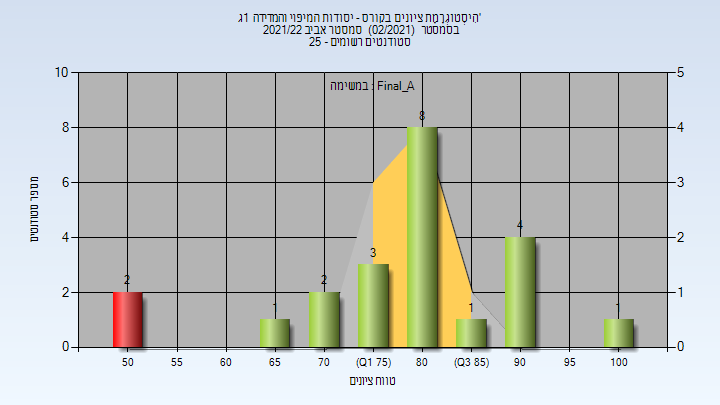

| סטודנטים | עברו/נכשלו | אחוז עוברים | ציון מינימלי | ציון מקסימלי | ממוצע | חציון |
| ---- | ---- | ---- | ---- | ---- | ---- | ---- |
| 22 | 20/2 | 91 | 54 | 100 | 79.727 | 80.5 |

<h3 id="202102-Finals">סופי</h3>

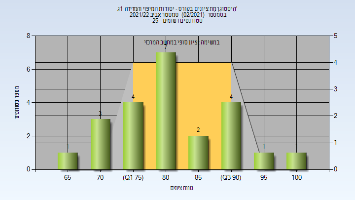

| סטודנטים | עברו/נכשלו | אחוז עוברים | ציון מינימלי | ציון מקסימלי | ממוצע | חציון |
| ---- | ---- | ---- | ---- | ---- | ---- | ---- |
| 23 | 23/0 | 100 | 65 | 100 | 82.696 | 80 |

<h2 id="202002">אביב 2021</h2>

| איש סגל | תפקיד |
| ---- | ---- |
| דליות שגיא | מרצה - אחראי מקצוע |
| ג'לג'ולה רובא | מתרגל |
| אבו האני ג'ואל | מתרגל |
| מלכה אופירה | סגל מנהלי - עם הרשאות מרצה אחראי |
| שביט שרית | סגל מנהלי - עם הרשאות מרצה אחראי |
| קובלר קרן | סגל מנהלי - עם הרשאות מרצה אחראי |
| צאצאשוילי תמי | סגל מנהלי - עם הרשאות מרצה אחראי |
| בלסברג עליזה | סגל מנהלי - עם הרשאות מרצה אחראי |

<h3 id="202002-Exam_A">מבחן מועד א'</h3>

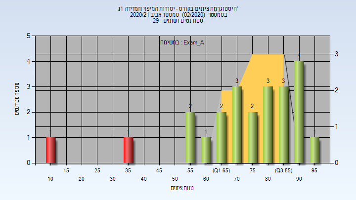

| סטודנטים | עברו/נכשלו | אחוז עוברים | ציון מינימלי | ציון מקסימלי | ממוצע | חציון |
| ---- | ---- | ---- | ---- | ---- | ---- | ---- |
| 23 | 21/2 | 91 | 11 | 95 | 73.652 | 76 |

<h3 id="202002-Final_A">סופי מועד א'</h3>

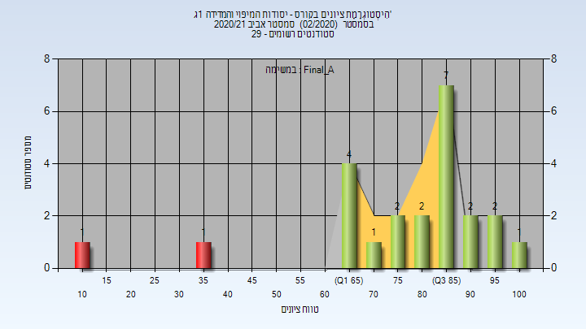

| סטודנטים | עברו/נכשלו | אחוז עוברים | ציון מינימלי | ציון מקסימלי | ממוצע | חציון |
| ---- | ---- | ---- | ---- | ---- | ---- | ---- |
| 23 | 21/2 | 91 | 11 | 100 | 78.261 | 83 |

<h3 id="202002-Finals">סופי</h3>

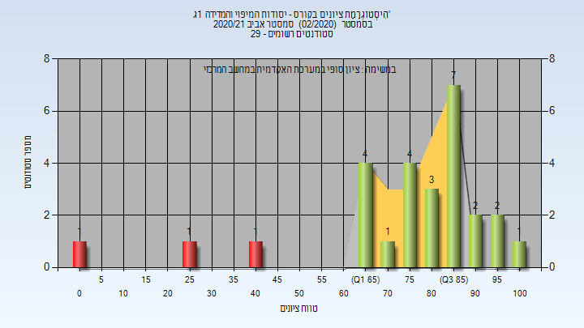

| סטודנטים | עברו/נכשלו | אחוז עוברים | ציון מינימלי | ציון מקסימלי | ממוצע | חציון |
| ---- | ---- | ---- | ---- | ---- | ---- | ---- |
| 27 | 24/3 | 89 | 3 | 100 | 76.296 | 81 |

<h2 id="201902">אביב 2020</h2>

| איש סגל | תפקיד |
| ---- | ---- |
| דליות שגיא | מרצה - אחראי מקצוע |
| אבו האני ג'ואל | מתרגל |
| דרור טליה | מתרגל |
| עזרן עדי | מתרגל |
| וייל זטלמן שחף | מתרגל |
| אבו מפלח פיראס | מתרגל |
| קלר מוריה | מתרגל |
| וידרו יוליה | מתרגל |
| ג'לג'ולה רובא | מתרגל |
| עווד רידא | מתרגל |
| גנאים עלאא | מתרגל |
| בלסברג עליזה | סגל מנהלי - עם הרשאות מרצה אחראי |

<h3 id="201902-Final_A">סופי מועד א'</h3>

| סטודנטים | עברו/נכשלו | אחוז עוברים | ציון מינימלי | ציון מקסימלי | ממוצע | חציון |
| ---- | ---- | ---- | ---- | ---- | ---- | ---- |
| 21 | 16/5 | 76 | 32 | 102 | 73.19 | 77 |

<h3 id="201902-Finals">סופי</h3>

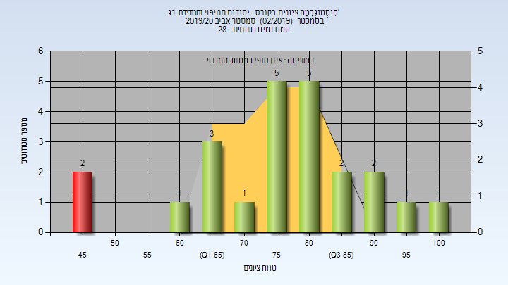

| סטודנטים | עברו/נכשלו | אחוז עוברים | ציון מינימלי | ציון מקסימלי | ממוצע | חציון |
| ---- | ---- | ---- | ---- | ---- | ---- | ---- |
| 23 | 21/2 | 91 | 45 | 100 | 76.957 | 77 |

<h2 id="201802">אביב 2019</h2>

| איש סגל | תפקיד |
| ---- | ---- |
| דליות שגיא | מרצה - אחראי מקצוע |
| עווד רידא | מתרגל |
| גנאים עלאא | מתרגל |
| קלר מוריה | מתרגל |
| אלנאשף בשאר | מתרגל |
| ג'לג'ולה רובא | מתרגל |
| וידרו יוליה | מתרגל |
| דרור טליה | מתרגל |

<h3 id="201802-Final_A">סופי מועד א'</h3>

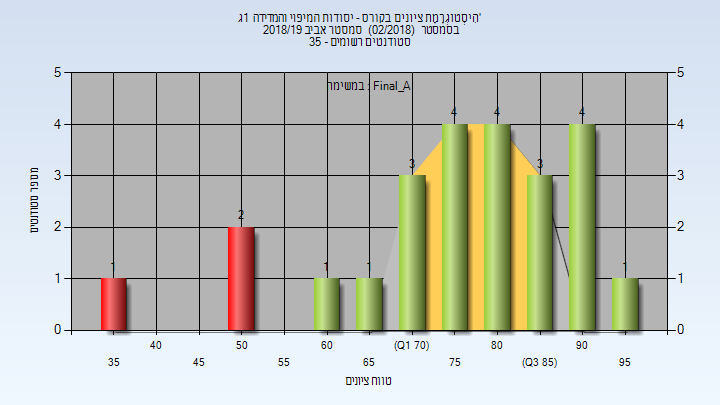

| סטודנטים | עברו/נכשלו | אחוז עוברים | ציון מינימלי | ציון מקסימלי | ממוצע | חציון |
| ---- | ---- | ---- | ---- | ---- | ---- | ---- |
| 24 | 21/3 | 88 | 36 | 95 | 76.708 | 79 |

<h3 id="201802-Finals">סופי</h3>

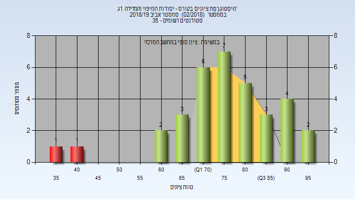

| סטודנטים | עברו/נכשלו | אחוז עוברים | ציון מינימלי | ציון מקסימלי | ממוצע | חציון |
| ---- | ---- | ---- | ---- | ---- | ---- | ---- |
| 34 | 32/2 | 94 | 36 | 96 | 76.441 | 76.5 |

<h2 id="201702">אביב 2018</h2>

| איש סגל | תפקיד |
| ---- | ---- |
| דליות שגיא | מרצה - אחראי מקצוע |
| דרור טליה | מתרגל |
| ח'ורי ניזאר | מתרגל |
| בינסקי נועה | מתרגל |
| כהן אחיטוב | מתרגל |
| מסד עדו | מתרגל |
| שכטר מור | מתרגל |
| קלר מוריה | מתרגל |
| שכטר חן | מתרגל |

<h3 id="201702-Final_A">סופי מועד א'</h3>

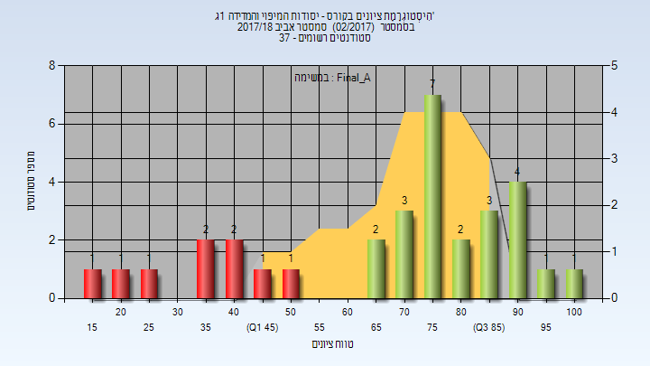

| סטודנטים | עברו/נכשלו | אחוז עוברים | ציון מינימלי | ציון מקסימלי | ממוצע | חציון |
| ---- | ---- | ---- | ---- | ---- | ---- | ---- |
| 32 | 23/9 | 72 | 18 | 101 | 68.656 | 75.5 |

<h3 id="201702-Final_B">סופי מועד ב'</h3>

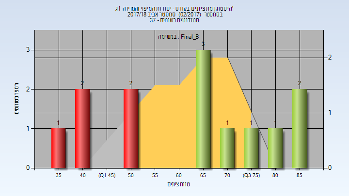

| סטודנטים | עברו/נכשלו | אחוז עוברים | ציון מינימלי | ציון מקסימלי | ממוצע | חציון |
| ---- | ---- | ---- | ---- | ---- | ---- | ---- |
| 13 | 8/5 | 62 | 35 | 86 | 63.385 | 65 |

<h3 id="201702-Finals">סופי</h3>

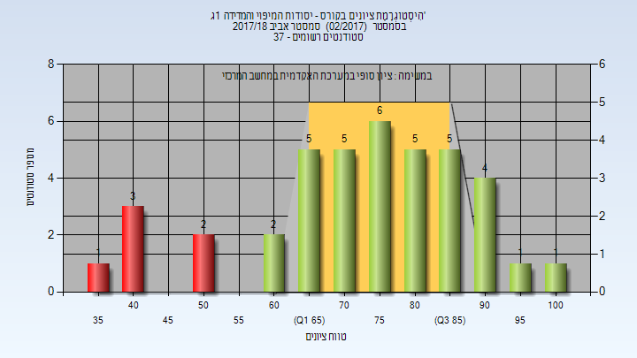

| סטודנטים | עברו/נכשלו | אחוז עוברים | ציון מינימלי | ציון מקסימלי | ממוצע | חציון |
| ---- | ---- | ---- | ---- | ---- | ---- | ---- |
| 40 | 34/6 | 85 | 35 | 100 | 73.575 | 76 |

<h2 id="201602">אביב 2017</h2>

| איש סגל | תפקיד |
| ---- | ---- |
| דליות שגיא | מרצה - אחראי מקצוע |
| מסד עדו | מתרגל |
| קלר מוריה | מתרגל |
| כהן אחיטוב | מתרגל |
| שחף מרדכי עודד | מתרגל |
| ג'לג'ולה רובא | מתרגל |

<h3 id="201602-Final_A">סופי מועד א'</h3>

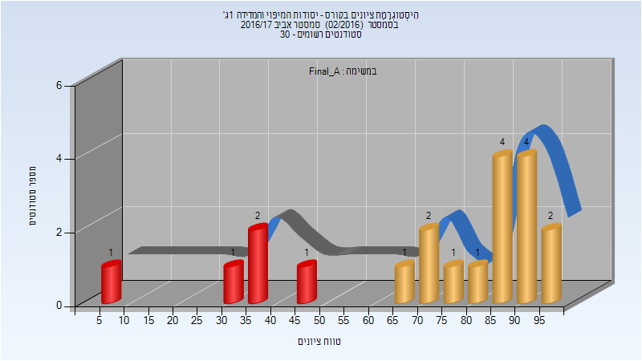

| סטודנטים | עברו/נכשלו | אחוז עוברים | ציון מינימלי | ציון מקסימלי | ממוצע | חציון |
| ---- | ---- | ---- | ---- | ---- | ---- | ---- |
| 20 | 15/5 | 75 | 6 | 95 | 71.9 | 84 |

<h3 id="201602-Finals">סופי</h3>

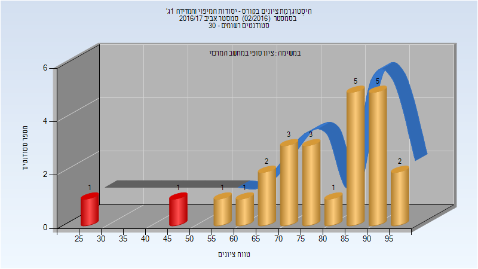

| סטודנטים | עברו/נכשלו | אחוז עוברים | ציון מינימלי | ציון מקסימלי | ממוצע | חציון |
| ---- | ---- | ---- | ---- | ---- | ---- | ---- |
| 25 | 23/2 | 92 | 29 | 95 | 77.84 | 82 |

