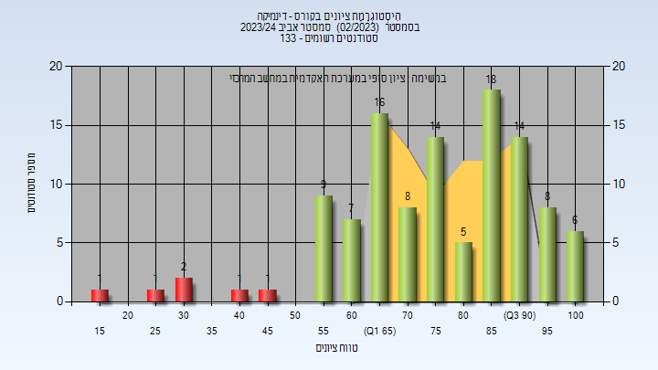
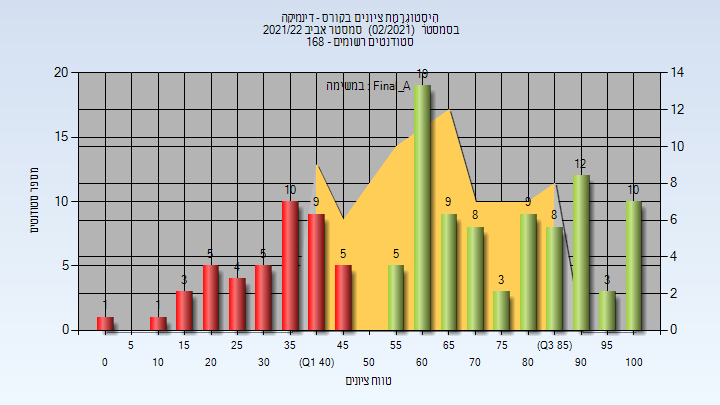
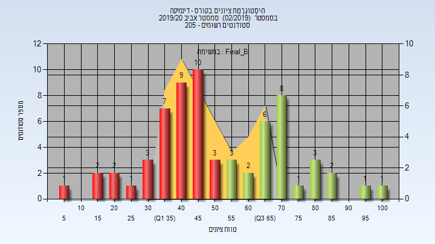
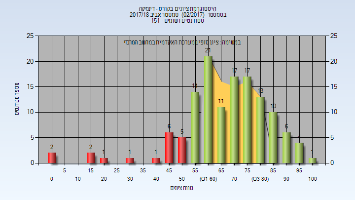

# 00340010 - דינמיקה

**הערה**: מאגר ההיסטוגרמות הוקם עבור [CheeseFork](https://cheesefork.cf/), כלי בניית מערכת שעות עבור סטודנטים בטכניון. באתר בו אתם גולשים ניתן לעיין בהיסטוגרמות, אך הדרך היותר נוחה היא לעיין בהיסטוגרמות, ובמידע נוסף כגון חוות דעת של סטודנטים, באתר CheeseFork.

* [חורף 2024-2025](#202401)
* [אביב 2024](#202302)
  * [מבחן מועד א'](#202302-Exam_A)
  * [סופי מועד א'](#202302-Final_A)
  * [מבחן מועד ב'](#202302-Exam_B)
  * [סופי מועד ב'](#202302-Final_B)
  * [סופי](#202302-Finals)
* [חורף 2023-2024](#202301)
  * [מבחן מועד א'](#202301-Exam_A)
  * [סופי מועד א'](#202301-Final_A)
  * [סופי](#202301-Finals)
* [אביב 2023](#202202)
  * [מבחן מועד א'](#202202-Exam_A)
  * [סופי מועד א'](#202202-Final_A)
  * [מבחן מועד ב'](#202202-Exam_B)
  * [סופי מועד ב'](#202202-Final_B)
  * [סופי](#202202-Finals)
* [חורף 2022-2023](#202201)
  * [מבחן מועד א'](#202201-Exam_A)
  * [סופי מועד א'](#202201-Final_A)
  * [סופי](#202201-Finals)
* [אביב 2022](#202102)
  * [מבחן מועד א'](#202102-Exam_A)
  * [סופי מועד א'](#202102-Final_A)
  * [מבחן מועד ב'](#202102-Exam_B)
  * [סופי מועד ב'](#202102-Final_B)
  * [סופי](#202102-Finals)
* [חורף 2021-2022](#202101)
* [אביב 2021](#202002)
  * [מבחן מועד א'](#202002-Exam_A)
  * [סופי מועד א'](#202002-Final_A)
  * [סופי מועד ב'](#202002-Final_B)
  * [סופי](#202002-Finals)
* [חורף 2020-2021](#202001)
* [אביב 2020](#201902)
  * [מבחן מועד א'](#201902-Exam_A)
  * [סופי מועד א'](#201902-Final_A)
  * [מבחן מועד ב'](#201902-Exam_B)
  * [סופי מועד ב'](#201902-Final_B)
  * [סופי](#201902-Finals)
* [אביב 2019](#201802)
  * [מבחן מועד א'](#201802-Exam_A)
  * [סופי מועד א'](#201802-Final_A)
  * [סופי מועד ב'](#201802-Final_B)
  * [סופי](#201802-Finals)
* [חורף 2018-2019](#201801)
  * [מבחן מועד א'](#201801-Exam_A)
  * [סופי מועד א'](#201801-Final_A)
  * [מבחן מועד ב'](#201801-Exam_B)
  * [סופי מועד ב'](#201801-Final_B)
  * [סופי](#201801-Finals)
* [אביב 2018](#201702)
  * [מבחן מועד א'](#201702-Exam_A)
  * [סופי מועד א'](#201702-Final_A)
  * [מבחן מועד ב'](#201702-Exam_B)
  * [סופי מועד ב'](#201702-Final_B)
  * [סופי](#201702-Finals)
* [חורף 2017-2018](#201701)
  * [מבחן מועד א'](#201701-Exam_A)
  * [סופי מועד א'](#201701-Final_A)
  * [מבחן מועד ב'](#201701-Exam_B)
  * [סופי מועד ב'](#201701-Final_B)
  * [סופי](#201701-Finals)
* [אביב 2017](#201602)
  * [מבחן מועד א'](#201602-Exam_A)
  * [סופי מועד א'](#201602-Final_A)
  * [מבחן מועד ב'](#201602-Exam_B)
  * [סופי מועד ב'](#201602-Final_B)
  * [סופי](#201602-Finals)
* [חורף 2016-2017](#201601)
  * [מבחן מועד א'](#201601-Exam_A)
  * [סופי מועד א'](#201601-Final_A)
  * [מבחן מועד ב'](#201601-Exam_B)
  * [סופי מועד ב'](#201601-Final_B)
  * [סופי](#201601-Finals)
* [אביב 2016](#201502)
  * [סופי מועד א'](#201502-Final_A)
  * [סופי מועד ב'](#201502-Final_B)
  * [סופי](#201502-Finals)
* [אביב 2015](#201402)
  * [מבחן מועד א'](#201402-Exam_A)
  * [סופי מועד א'](#201402-Final_A)
  * [מבחן מועד ב'](#201402-Exam_B)
  * [סופי מועד ב'](#201402-Final_B)
  * [סופי](#201402-Finals)
* [חורף 2014-2015](#201401)
  * [סופי מועד א'](#201401-Final_A)
  * [סופי מועד ב'](#201401-Final_B)
  * [סופי](#201401-Finals)
* [אביב 2013](#201202)
  * [סופי מועד א'](#201202-Final_A)
  * [סופי מועד ב'](#201202-Final_B)

<h2 id="202401">חורף 2024-2025</h2>

| איש סגל | תפקיד |
| ---- | ---- |
| ספדי מחמוד | מרצה |
| סטרוסבצקי יולי | מרצה |
| לוי-אור אוהד | מתרגל |

<h2 id="202302">אביב 2024</h2>

| איש סגל | תפקיד |
| ---- | ---- |
| אור יזהר | מרצה - אחראי מקצוע |
| דואר מירון | מתרגל - עם הרשאות מרצה אחראי |
| דוידסון עקיבא | מתרגל - עם הרשאות מרצה אחראי |
| קלדור אייל | מתרגל - עם הרשאות מרצה אחראי |
| כהן אמיר | מתרגל - עם הרשאות מרצה אחראי |
| פאעל דניאל | מתרגל - עם הרשאות מרצה אחראי |

<h3 id="202302-Exam_A">מבחן מועד א'</h3>

| סטודנטים | עברו/נכשלו | אחוז עוברים | ציון מינימלי | ציון מקסימלי | ממוצע | חציון |
| ---- | ---- | ---- | ---- | ---- | ---- | ---- |
| 93 | 75/18 | 81 | 13 | 105 | 66.634 | 69 |

<h3 id="202302-Final_A">סופי מועד א'</h3>

| סטודנטים | עברו/נכשלו | אחוז עוברים | ציון מינימלי | ציון מקסימלי | ממוצע | חציון |
| ---- | ---- | ---- | ---- | ---- | ---- | ---- |
| 93 | 75/18 | 81 | 22 | 100 | 71.312 | 72 |

<h3 id="202302-Exam_B">מבחן מועד ב'</h3>

| סטודנטים | עברו/נכשלו | אחוז עוברים | ציון מינימלי | ציון מקסימלי | ממוצע | חציון |
| ---- | ---- | ---- | ---- | ---- | ---- | ---- |
| 27 | 20/7 | 74 | 49 | 105 | 71.333 | 66 |

<h3 id="202302-Final_B">סופי מועד ב'</h3>

| סטודנטים | עברו/נכשלו | אחוז עוברים | ציון מינימלי | ציון מקסימלי | ממוצע | חציון |
| ---- | ---- | ---- | ---- | ---- | ---- | ---- |
| 27 | 27/0 | 100 | 55 | 100 | 74.593 | 69 |

<h3 id="202302-Finals">סופי</h3>

| סטודנטים | עברו/נכשלו | אחוז עוברים | ציון מינימלי | ציון מקסימלי | ממוצע | חציון |
| ---- | ---- | ---- | ---- | ---- | ---- | ---- |
| 118 | 112/6 | 95 | 18 | 100 | 76.593 | 78 |

<h2 id="202301">חורף 2023-2024</h2>

| איש סגל | תפקיד |
| ---- | ---- |
| ספדי מחמוד | מרצה - אחראי מקצוע |

<h3 id="202301-Exam_A">מבחן מועד א'</h3>

| סטודנטים | עברו/נכשלו | אחוז עוברים | ציון מינימלי | ציון מקסימלי | ממוצע | חציון |
| ---- | ---- | ---- | ---- | ---- | ---- | ---- |
| 14 | 14/0 | 100 | 61 | 100 | 82 | 84 |

<h3 id="202301-Final_A">סופי מועד א'</h3>

| סטודנטים | עברו/נכשלו | אחוז עוברים | ציון מינימלי | ציון מקסימלי | ממוצע | חציון |
| ---- | ---- | ---- | ---- | ---- | ---- | ---- |
| 14 | 14/0 | 100 | 65 | 100 | 83.786 | 85.5 |

<h3 id="202301-Finals">סופי</h3>

| סטודנטים | עברו/נכשלו | אחוז עוברים | ציון מינימלי | ציון מקסימלי | ממוצע | חציון |
| ---- | ---- | ---- | ---- | ---- | ---- | ---- |
| 15 | 15/0 | 100 | 65 | 100 | 85.533 | 84 |

<h2 id="202202">אביב 2023</h2>

| איש סגל | תפקיד |
| ---- | ---- |
| אור יזהר | מרצה - אחראי מקצוע |
| דואר מירון | מתרגל - עם הרשאות מרצה אחראי |
| לוי-אור אוהד | מתרגל - עם הרשאות מרצה אחראי |
| דוידסון עקיבא | מתרגל - עם הרשאות מרצה אחראי |

<h3 id="202202-Exam_A">מבחן מועד א'</h3>

| סטודנטים | עברו/נכשלו | אחוז עוברים | ציון מינימלי | ציון מקסימלי | ממוצע | חציון |
| ---- | ---- | ---- | ---- | ---- | ---- | ---- |
| 136 | 89/47 | 65 | 12 | 110 | 66.353 | 68 |

<h3 id="202202-Final_A">סופי מועד א'</h3>

| סטודנטים | עברו/נכשלו | אחוז עוברים | ציון מינימלי | ציון מקסימלי | ממוצע | חציון |
| ---- | ---- | ---- | ---- | ---- | ---- | ---- |
| 136 | 104/32 | 76 | 27 | 100 | 70.022 | 71 |

<h3 id="202202-Exam_B">מבחן מועד ב'</h3>

| סטודנטים | עברו/נכשלו | אחוז עוברים | ציון מינימלי | ציון מקסימלי | ממוצע | חציון |
| ---- | ---- | ---- | ---- | ---- | ---- | ---- |
| 22 | 21/1 | 95 | 50 | 92 | 73.864 | 71 |

<h3 id="202202-Final_B">סופי מועד ב'</h3>

| סטודנטים | עברו/נכשלו | אחוז עוברים | ציון מינימלי | ציון מקסימלי | ממוצע | חציון |
| ---- | ---- | ---- | ---- | ---- | ---- | ---- |
| 22 | 22/0 | 100 | 55 | 93 | 75.955 | 74 |

<h3 id="202202-Finals">סופי</h3>

| סטודנטים | עברו/נכשלו | אחוז עוברים | ציון מינימלי | ציון מקסימלי | ממוצע | חציון |
| ---- | ---- | ---- | ---- | ---- | ---- | ---- |
| 135 | 135/0 | 100 | 57 | 100 | 81.735 | 83.5 |

<h2 id="202201">חורף 2022-2023</h2>

| איש סגל | תפקיד |
| ---- | ---- |
| ספדי מחמוד | מרצה - אחראי מקצוע |

<h3 id="202201-Exam_A">מבחן מועד א'</h3>

| סטודנטים | עברו/נכשלו | אחוז עוברים | ציון מינימלי | ציון מקסימלי | ממוצע | חציון |
| ---- | ---- | ---- | ---- | ---- | ---- | ---- |
| 13 | 6/7 | 46 | 40 | 96 | 62 | 49 |

<h3 id="202201-Final_A">סופי מועד א'</h3>

| סטודנטים | עברו/נכשלו | אחוז עוברים | ציון מינימלי | ציון מקסימלי | ממוצע | חציון |
| ---- | ---- | ---- | ---- | ---- | ---- | ---- |
| 13 | 6/7 | 46 | 40 | 96 | 62 | 49 |

<h3 id="202201-Finals">סופי</h3>

| סטודנטים | עברו/נכשלו | אחוז עוברים | ציון מינימלי | ציון מקסימלי | ממוצע | חציון |
| ---- | ---- | ---- | ---- | ---- | ---- | ---- |
| 13 | 12/1 | 92 | 43 | 96 | 76.846 | 79 |

<h2 id="202102">אביב 2022</h2>

| איש סגל | תפקיד |
| ---- | ---- |
| סטרוסבצקי יולי | מרצה - אחראי מקצוע |
| דואר מירון | מתרגל - עם הרשאות מרצה אחראי |
| כרמלי שניר | מתרגל - עם הרשאות מרצה אחראי |
| גזאל מג'די | מתרגל - עם הרשאות מרצה אחראי |
| קלדור אייל | מתרגל - עם הרשאות מרצה אחראי |
| לוי-אור אוהד | מתרגל - עם הרשאות מרצה אחראי |

<h3 id="202102-Exam_A">מבחן מועד א'</h3>

| סטודנטים | עברו/נכשלו | אחוז עוברים | ציון מינימלי | ציון מקסימלי | ממוצע | חציון |
| ---- | ---- | ---- | ---- | ---- | ---- | ---- |
| 129 | 55/74 | 43 | 0 | 111 | 52.403 | 50 |

<h3 id="202102-Final_A">סופי מועד א'</h3>

| סטודנטים | עברו/נכשלו | אחוז עוברים | ציון מינימלי | ציון מקסימלי | ממוצע | חציון |
| ---- | ---- | ---- | ---- | ---- | ---- | ---- |
| 129 | 86/43 | 67 | 4 | 100 | 62.977 | 64 |

<h3 id="202102-Exam_B">מבחן מועד ב'</h3>

| סטודנטים | עברו/נכשלו | אחוז עוברים | ציון מינימלי | ציון מקסימלי | ממוצע | חציון |
| ---- | ---- | ---- | ---- | ---- | ---- | ---- |
| 66 | 41/25 | 62 | 1 | 100 | 55.288 | 57 |

<h3 id="202102-Final_B">סופי מועד ב'</h3>

| סטודנטים | עברו/נכשלו | אחוז עוברים | ציון מינימלי | ציון מקסימלי | ממוצע | חציון |
| ---- | ---- | ---- | ---- | ---- | ---- | ---- |
| 66 | 44/22 | 67 | 11 | 100 | 60.879 | 64.5 |

<h3 id="202102-Finals">סופי</h3>

| סטודנטים | עברו/נכשלו | אחוז עוברים | ציון מינימלי | ציון מקסימלי | ממוצע | חציון |
| ---- | ---- | ---- | ---- | ---- | ---- | ---- |
| 153 | 128/25 | 84 | 11 | 100 | 70.562 | 72 |

<h2 id="202101">חורף 2021-2022</h2>

| איש סגל | תפקיד |
| ---- | ---- |
| ספדי מחמוד | מרצה - אחראי מקצוע |
| היימן עדי | מרצה |

<h2 id="202002">אביב 2021</h2>

| איש סגל | תפקיד |
| ---- | ---- |
| גנדלמן אולג | מרצה - אחראי מקצוע |
| ניצן עידו | מתרגל - עם הרשאות מרצה אחראי |
| רחמן גלינה | מתרגל - עם הרשאות מרצה אחראי |
| כהן יגאל | מתרגל - עם הרשאות מרצה אחראי |
| גזאל מג'די | מתרגל - עם הרשאות מרצה אחראי |

<h3 id="202002-Exam_A">מבחן מועד א'</h3>

| סטודנטים | עברו/נכשלו | אחוז עוברים | ציון מינימלי | ציון מקסימלי | ממוצע | חציון |
| ---- | ---- | ---- | ---- | ---- | ---- | ---- |
| 126 | 26/100 | 21 | 5 | 97 | 39.778 | 36.5 |

<h3 id="202002-Final_A">סופי מועד א'</h3>

| סטודנטים | עברו/נכשלו | אחוז עוברים | ציון מינימלי | ציון מקסימלי | ממוצע | חציון |
| ---- | ---- | ---- | ---- | ---- | ---- | ---- |
| 126 | 93/33 | 74 | 28 | 100 | 60.659 | 57 |

<h3 id="202002-Final_B">סופי מועד ב'</h3>

| סטודנטים | עברו/נכשלו | אחוז עוברים | ציון מינימלי | ציון מקסימלי | ממוצע | חציון |
| ---- | ---- | ---- | ---- | ---- | ---- | ---- |
| 51 | 38/13 | 75 | 35 | 100 | 60.078 | 55 |

<h3 id="202002-Finals">סופי</h3>

| סטודנטים | עברו/נכשלו | אחוז עוברים | ציון מינימלי | ציון מקסימלי | ממוצע | חציון |
| ---- | ---- | ---- | ---- | ---- | ---- | ---- |
| 145 | 129/16 | 89 | 28 | 100 | 64.524 | 61 |

<h2 id="202001">חורף 2020-2021</h2>

| איש סגל | תפקיד |
| ---- | ---- |
| ספדי מחמוד | מרצה - אחראי מקצוע |

<h2 id="201902">אביב 2020</h2>

| איש סגל | תפקיד |
| ---- | ---- |
| סטרוסבצקי יולי | מרצה - אחראי מקצוע |
| רוזנשטוק דוד | מתרגל - עם הרשאות מרצה אחראי |
| שטיינר מתן | מתרגל - עם הרשאות מרצה אחראי |
| אהרוני זיו | מתרגל - עם הרשאות מרצה אחראי |
| רחמן גלינה | מתרגל - עם הרשאות מרצה אחראי |

<h3 id="201902-Exam_A">מבחן מועד א'</h3>

| סטודנטים | עברו/נכשלו | אחוז עוברים | ציון מינימלי | ציון מקסימלי | ממוצע | חציון |
| ---- | ---- | ---- | ---- | ---- | ---- | ---- |
| 157 | 133/24 | 85 | 29 | 100 | 68.857 | 68.8 |

<h3 id="201902-Final_A">סופי מועד א'</h3>

| סטודנטים | עברו/נכשלו | אחוז עוברים | ציון מינימלי | ציון מקסימלי | ממוצע | חציון |
| ---- | ---- | ---- | ---- | ---- | ---- | ---- |
| 157 | 133/24 | 85 | 29 | 100 | 71.363 | 73 |

<h3 id="201902-Exam_B">מבחן מועד ב'</h3>

| סטודנטים | עברו/נכשלו | אחוז עוברים | ציון מינימלי | ציון מקסימלי | ממוצע | חציון |
| ---- | ---- | ---- | ---- | ---- | ---- | ---- |
| 65 | 27/38 | 42 | 6 | 100 | 51.015 | 47 |

<h3 id="201902-Final_B">סופי מועד ב'</h3>

| סטודנטים | עברו/נכשלו | אחוז עוברים | ציון מינימלי | ציון מקסימלי | ממוצע | חציון |
| ---- | ---- | ---- | ---- | ---- | ---- | ---- |
| 65 | 27/38 | 42 | 6 | 100 | 52.877 | 47 |

<h3 id="201902-Finals">סופי</h3>

| סטודנטים | עברו/נכשלו | אחוז עוברים | ציון מינימלי | ציון מקסימלי | ממוצע | חציון |
| ---- | ---- | ---- | ---- | ---- | ---- | ---- |
| 185 | 147/38 | 79 | 6 | 100 | 69.546 | 72 |

<h2 id="201802">אביב 2019</h2>

| איש סגל | תפקיד |
| ---- | ---- |
| שמואל גל | מרצה - אחראי מקצוע |
| ויזל אורן | מתרגל - עם הרשאות מרצה אחראי |
| סאלם ליאור | מתרגל - עם הרשאות מרצה אחראי |
| אהרוני זיו | מתרגל - עם הרשאות מרצה אחראי |

<h3 id="201802-Exam_A">מבחן מועד א'</h3>

| סטודנטים | עברו/נכשלו | אחוז עוברים | ציון מינימלי | ציון מקסימלי | ממוצע | חציון |
| ---- | ---- | ---- | ---- | ---- | ---- | ---- |
| 118 | 66/52 | 56 | 1 | 100 | 54.136 | 56 |

<h3 id="201802-Final_A">סופי מועד א'</h3>

| סטודנטים | עברו/נכשלו | אחוז עוברים | ציון מינימלי | ציון מקסימלי | ממוצע | חציון |
| ---- | ---- | ---- | ---- | ---- | ---- | ---- |
| 118 | 66/52 | 56 | 1 | 100 | 54.678 | 58 |

<h3 id="201802-Final_B">סופי מועד ב'</h3>

| סטודנטים | עברו/נכשלו | אחוז עוברים | ציון מינימלי | ציון מקסימלי | ממוצע | חציון |
| ---- | ---- | ---- | ---- | ---- | ---- | ---- |
| 82 | 48/34 | 59 | 7 | 100 | 57.171 | 59 |

<h3 id="201802-Finals">סופי</h3>

| סטודנטים | עברו/נכשלו | אחוז עוברים | ציון מינימלי | ציון מקסימלי | ממוצע | חציון |
| ---- | ---- | ---- | ---- | ---- | ---- | ---- |
| 142 | 103/39 | 73 | 1 | 100 | 62.908 | 65 |

<h2 id="201801">חורף 2018-2019</h2>

| איש סגל | תפקיד |
| ---- | ---- |
| גנדלמן אולג | מרצה - אחראי מקצוע |
| ויזל אורן | מתרגל - עם הרשאות מרצה אחראי |
| שירוקי יצחק | מתרגל - עם הרשאות מרצה אחראי |

<h3 id="201801-Exam_A">מבחן מועד א'</h3>

| סטודנטים | עברו/נכשלו | אחוז עוברים | ציון מינימלי | ציון מקסימלי | ממוצע | חציון |
| ---- | ---- | ---- | ---- | ---- | ---- | ---- |
| 25 | 21/4 | 84 | 10 | 100 | 66.96 | 69 |

<h3 id="201801-Final_A">סופי מועד א'</h3>

| סטודנטים | עברו/נכשלו | אחוז עוברים | ציון מינימלי | ציון מקסימלי | ממוצע | חציון |
| ---- | ---- | ---- | ---- | ---- | ---- | ---- |
| 25 | 21/4 | 84 | 10 | 100 | 71.08 | 72 |

<h3 id="201801-Exam_B">מבחן מועד ב'</h3>

| סטודנטים | עברו/נכשלו | אחוז עוברים | ציון מינימלי | ציון מקסימלי | ממוצע | חציון |
| ---- | ---- | ---- | ---- | ---- | ---- | ---- |
| 17 | 15/2 | 88 | 33 | 100 | 67.824 | 63 |

<h3 id="201801-Final_B">סופי מועד ב'</h3>

| סטודנטים | עברו/נכשלו | אחוז עוברים | ציון מינימלי | ציון מקסימלי | ממוצע | חציון |
| ---- | ---- | ---- | ---- | ---- | ---- | ---- |
| 17 | 15/2 | 88 | 33 | 100 | 70.353 | 66 |

<h3 id="201801-Finals">סופי</h3>

| סטודנטים | עברו/נכשלו | אחוז עוברים | ציון מינימלי | ציון מקסימלי | ממוצע | חציון |
| ---- | ---- | ---- | ---- | ---- | ---- | ---- |
| 34 | 31/3 | 91 | 33 | 100 | 74.941 | 75.5 |

<h2 id="201702">אביב 2018</h2>

| איש סגל | תפקיד |
| ---- | ---- |
| שמואל גל | מרצה - אחראי מקצוע |
| סאלם ליאור | מתרגל - עם הרשאות מרצה אחראי |
| ויזל אורן | מתרגל - עם הרשאות מרצה אחראי |
| קיסלובסקי ויקטור | מתרגל - עם הרשאות מרצה אחראי |

<h3 id="201702-Exam_A">מבחן מועד א'</h3>

| סטודנטים | עברו/נכשלו | אחוז עוברים | ציון מינימלי | ציון מקסימלי | ממוצע | חציון |
| ---- | ---- | ---- | ---- | ---- | ---- | ---- |
| 109 | 59/50 | 54 | 4 | 92 | 55.963 | 57 |

<h3 id="201702-Final_A">סופי מועד א'</h3>

| סטודנטים | עברו/נכשלו | אחוז עוברים | ציון מינימלי | ציון מקסימלי | ממוצע | חציון |
| ---- | ---- | ---- | ---- | ---- | ---- | ---- |
| 109 | 59/50 | 54 | 4 | 94 | 57.385 | 59 |

<h3 id="201702-Exam_B">מבחן מועד ב'</h3>

| סטודנטים | עברו/נכשלו | אחוז עוברים | ציון מינימלי | ציון מקסימלי | ממוצע | חציון |
| ---- | ---- | ---- | ---- | ---- | ---- | ---- |
| 78 | 63/15 | 81 | 3 | 97 | 63.038 | 62 |

<h3 id="201702-Final_B">סופי מועד ב'</h3>

| סטודנטים | עברו/נכשלו | אחוז עוברים | ציון מינימלי | ציון מקסימלי | ממוצע | חציון |
| ---- | ---- | ---- | ---- | ---- | ---- | ---- |
| 78 | 63/15 | 81 | 3 | 97 | 64.615 | 64.5 |

<h3 id="201702-Finals">סופי</h3>

| סטודנטים | עברו/נכשלו | אחוז עוברים | ציון מינימלי | ציון מקסימלי | ממוצע | חציון |
| ---- | ---- | ---- | ---- | ---- | ---- | ---- |
| 132 | 114/18 | 86 | 3 | 100 | 68.235 | 70 |

<h2 id="201701">חורף 2017-2018</h2>

| איש סגל | תפקיד |
| ---- | ---- |
| אור יזהר | מרצה - אחראי מקצוע |
| ויזל אורן | מתרגל - עם הרשאות מרצה אחראי |
| סאלם ליאור | מתרגל - עם הרשאות מרצה אחראי |

<h3 id="201701-Exam_A">מבחן מועד א'</h3>

| סטודנטים | עברו/נכשלו | אחוז עוברים | ציון מינימלי | ציון מקסימלי | ממוצע | חציון |
| ---- | ---- | ---- | ---- | ---- | ---- | ---- |
| 59 | 31/28 | 53 | 15 | 98 | 58.797 | 60 |

<h3 id="201701-Final_A">סופי מועד א'</h3>

| סטודנטים | עברו/נכשלו | אחוז עוברים | ציון מינימלי | ציון מקסימלי | ממוצע | חציון |
| ---- | ---- | ---- | ---- | ---- | ---- | ---- |
| 59 | 45/14 | 76 | 24 | 98 | 63.593 | 63 |

<h3 id="201701-Exam_B">מבחן מועד ב'</h3>

| סטודנטים | עברו/נכשלו | אחוז עוברים | ציון מינימלי | ציון מקסימלי | ממוצע | חציון |
| ---- | ---- | ---- | ---- | ---- | ---- | ---- |
| 36 | 23/13 | 64 | 5 | 95 | 60.625 | 68.75 |

<h3 id="201701-Final_B">סופי מועד ב'</h3>

| סטודנטים | עברו/נכשלו | אחוז עוברים | ציון מינימלי | ציון מקסימלי | ממוצע | חציון |
| ---- | ---- | ---- | ---- | ---- | ---- | ---- |
| 36 | 29/7 | 81 | 15 | 96 | 64.444 | 69.5 |

<h3 id="201701-Finals">סופי</h3>

| סטודנטים | עברו/נכשלו | אחוז עוברים | ציון מינימלי | ציון מקסימלי | ממוצע | חציון |
| ---- | ---- | ---- | ---- | ---- | ---- | ---- |
| 71 | 63/8 | 89 | 15 | 98 | 69.324 | 74 |

<h2 id="201602">אביב 2017</h2>

| איש סגל | תפקיד |
| ---- | ---- |
| שמואל גל | מרצה - אחראי מקצוע |
| קיסלובסקי ויקטור | מתרגל - עם הרשאות מרצה אחראי |
| שטיין יונתן | מתרגל - עם הרשאות מרצה אחראי |
| ויזל אורן | מתרגל - עם הרשאות מרצה אחראי |

<h3 id="201602-Exam_A">מבחן מועד א'</h3>

| סטודנטים | עברו/נכשלו | אחוז עוברים | ציון מינימלי | ציון מקסימלי | ממוצע | חציון |
| ---- | ---- | ---- | ---- | ---- | ---- | ---- |
| 109 | 69/40 | 63 | 8 | 99 | 60.44 | 60 |

<h3 id="201602-Final_A">סופי מועד א'</h3>

| סטודנטים | עברו/נכשלו | אחוז עוברים | ציון מינימלי | ציון מקסימלי | ממוצע | חציון |
| ---- | ---- | ---- | ---- | ---- | ---- | ---- |
| 109 | 69/40 | 63 | 8 | 99.2 | 62.196 | 62.8 |

<h3 id="201602-Exam_B">מבחן מועד ב'</h3>

| סטודנטים | עברו/נכשלו | אחוז עוברים | ציון מינימלי | ציון מקסימלי | ממוצע | חציון |
| ---- | ---- | ---- | ---- | ---- | ---- | ---- |
| 70 | 50/20 | 71 | 12 | 93 | 61.343 | 63 |

<h3 id="201602-Final_B">סופי מועד ב'</h3>

| סטודנטים | עברו/נכשלו | אחוז עוברים | ציון מינימלי | ציון מקסימלי | ממוצע | חציון |
| ---- | ---- | ---- | ---- | ---- | ---- | ---- |
| 70 | 54/16 | 77 | 12 | 93 | 64.129 | 65.5 |

<h3 id="201602-Finals">סופי</h3>

| סטודנטים | עברו/נכשלו | אחוז עוברים | ציון מינימלי | ציון מקסימלי | ממוצע | חציון |
| ---- | ---- | ---- | ---- | ---- | ---- | ---- |
| 126 | 108/18 | 86 | 12 | 99 | 69.675 | 73 |

<h2 id="201601">חורף 2016-2017</h2>

| איש סגל | תפקיד |
| ---- | ---- |
| אור יזהר | מרצה - אחראי מקצוע |
| גרינברג ענבר | מתרגל - עם הרשאות מרצה אחראי |
| ויזל אורן | מתרגל - עם הרשאות מרצה אחראי |

<h3 id="201601-Exam_A">מבחן מועד א'</h3>

| סטודנטים | עברו/נכשלו | אחוז עוברים | ציון מינימלי | ציון מקסימלי | ממוצע | חציון |
| ---- | ---- | ---- | ---- | ---- | ---- | ---- |
| 85 | 76/9 | 89 | 14 | 105 | 73.753 | 77 |

<h3 id="201601-Final_A">סופי מועד א'</h3>

| סטודנטים | עברו/נכשלו | אחוז עוברים | ציון מינימלי | ציון מקסימלי | ממוצע | חציון |
| ---- | ---- | ---- | ---- | ---- | ---- | ---- |
| 84 | 78/6 | 93 | 23 | 100 | 76.571 | 79 |

<h3 id="201601-Exam_B">מבחן מועד ב'</h3>

| סטודנטים | עברו/נכשלו | אחוז עוברים | ציון מינימלי | ציון מקסימלי | ממוצע | חציון |
| ---- | ---- | ---- | ---- | ---- | ---- | ---- |
| 35 | 18/17 | 51 | 17 | 91 | 55.086 | 54 |

<h3 id="201601-Final_B">סופי מועד ב'</h3>

| סטודנטים | עברו/נכשלו | אחוז עוברים | ציון מינימלי | ציון מקסימלי | ממוצע | חציון |
| ---- | ---- | ---- | ---- | ---- | ---- | ---- |
| 35 | 22/13 | 63 | 25 | 92 | 59.314 | 59 |

<h3 id="201601-Finals">סופי</h3>

| סטודנטים | עברו/נכשלו | אחוז עוברים | ציון מינימלי | ציון מקסימלי | ממוצע | חציון |
| ---- | ---- | ---- | ---- | ---- | ---- | ---- |
| 104 | 91/13 | 88 | 25 | 100 | 74.75 | 77 |

<h2 id="201502">אביב 2016</h2>

| איש סגל | תפקיד |
| ---- | ---- |
| גנדלמן אולג | מרצה - אחראי מקצוע |
| שמואל גל | מרצה |
| גרינברג ענבר | מתרגל - עם הרשאות מרצה אחראי |
| ספדי מחמוד | מתרגל |

<h3 id="201502-Final_A">סופי מועד א'</h3>

| סטודנטים | עברו/נכשלו | אחוז עוברים | ציון מינימלי | ציון מקסימלי | ממוצע | חציון |
| ---- | ---- | ---- | ---- | ---- | ---- | ---- |
| 57 | 29/28 | 51 | 50 | 100 | 62.513 | 58.375 |

<h3 id="201502-Final_B">סופי מועד ב'</h3>

| סטודנטים | עברו/נכשלו | אחוז עוברים | ציון מינימלי | ציון מקסימלי | ממוצע | חציון |
| ---- | ---- | ---- | ---- | ---- | ---- | ---- |
| 30 | 17/13 | 57 | 13 | 87 | 52.7 | 59.5 |

<h3 id="201502-Finals">סופי</h3>

| סטודנטים | עברו/נכשלו | אחוז עוברים | ציון מינימלי | ציון מקסימלי | ממוצע | חציון |
| ---- | ---- | ---- | ---- | ---- | ---- | ---- |
| 62 | 44/18 | 71 | 9 | 100 | 62.065 | 66.5 |

<h2 id="201402">אביב 2015</h2>

| איש סגל | תפקיד |
| ---- | ---- |
| רובין מילס | מרצה - אחראי מקצוע |

<h3 id="201402-Exam_A">מבחן מועד א'</h3>

| סטודנטים | עברו/נכשלו | אחוז עוברים | ציון מינימלי | ציון מקסימלי | ממוצע | חציון |
| ---- | ---- | ---- | ---- | ---- | ---- | ---- |
| 148 | 140/8 | 95 | 14.5 | 100 | 79.976 | 83.75 |

<h3 id="201402-Final_A">סופי מועד א'</h3>

| סטודנטים | עברו/נכשלו | אחוז עוברים | ציון מינימלי | ציון מקסימלי | ממוצע | חציון |
| ---- | ---- | ---- | ---- | ---- | ---- | ---- |
| 148 | 142/6 | 96 | 15 | 100 | 82.061 | 86 |

<h3 id="201402-Exam_B">מבחן מועד ב'</h3>

| סטודנטים | עברו/נכשלו | אחוז עוברים | ציון מינימלי | ציון מקסימלי | ממוצע | חציון |
| ---- | ---- | ---- | ---- | ---- | ---- | ---- |
| 45 | 35/10 | 78 | 25 | 85 | 61.75 | 63.75 |

<h3 id="201402-Final_B">סופי מועד ב'</h3>

| סטודנטים | עברו/נכשלו | אחוז עוברים | ציון מינימלי | ציון מקסימלי | ממוצע | חציון |
| ---- | ---- | ---- | ---- | ---- | ---- | ---- |
| 45 | 38/7 | 84 | 25 | 88 | 65.689 | 68 |

<h3 id="201402-Finals">סופי</h3>

| סטודנטים | עברו/נכשלו | אחוז עוברים | ציון מינימלי | ציון מקסימלי | ממוצע | חציון |
| ---- | ---- | ---- | ---- | ---- | ---- | ---- |
| 171 | 167/4 | 98 | 25 | 100 | 81.135 | 84 |

<h2 id="201401">חורף 2014-2015</h2>

| איש סגל | תפקיד |
| ---- | ---- |
| אור יזהר | מרצה - אחראי מקצוע |

<h3 id="201401-Final_A">סופי מועד א'</h3>

| סטודנטים | עברו/נכשלו | אחוז עוברים | ציון מינימלי | ציון מקסימלי | ממוצע | חציון |
| ---- | ---- | ---- | ---- | ---- | ---- | ---- |
| 75 | 53/22 | 71 | 25 | 95 | 63.413 | 63 |

<h3 id="201401-Final_B">סופי מועד ב'</h3>

| סטודנטים | עברו/נכשלו | אחוז עוברים | ציון מינימלי | ציון מקסימלי | ממוצע | חציון |
| ---- | ---- | ---- | ---- | ---- | ---- | ---- |
| 46 | 42/4 | 91 | 42 | 100 | 80.109 | 79 |

<h3 id="201401-Finals">סופי</h3>

| סטודנטים | עברו/נכשלו | אחוז עוברים | ציון מינימלי | ציון מקסימלי | ממוצע | חציון |
| ---- | ---- | ---- | ---- | ---- | ---- | ---- |
| 82 | 78/4 | 95 | 42 | 100 | 77.646 | 79 |

<h2 id="201202">אביב 2013</h2>

| איש סגל | תפקיד |
| ---- | ---- |
| גנדלמן אולג | מרצה - אחראי מקצוע |

<h3 id="201202-Final_A">סופי מועד א'</h3>

| סטודנטים | עברו/נכשלו | אחוז עוברים | ציון מינימלי | ציון מקסימלי | ממוצע | חציון |
| ---- | ---- | ---- | ---- | ---- | ---- | ---- |
| 109 | 75/34 | 69 | 20 | 100 | 67.083 | 72 |

<h3 id="201202-Final_B">סופי מועד ב'</h3>

| סטודנטים | עברו/נכשלו | אחוז עוברים | ציון מינימלי | ציון מקסימלי | ממוצע | חציון |
| ---- | ---- | ---- | ---- | ---- | ---- | ---- |
| 36 | 27/9 | 75 | 16 | 87 | 60.194 | 60.5 |

