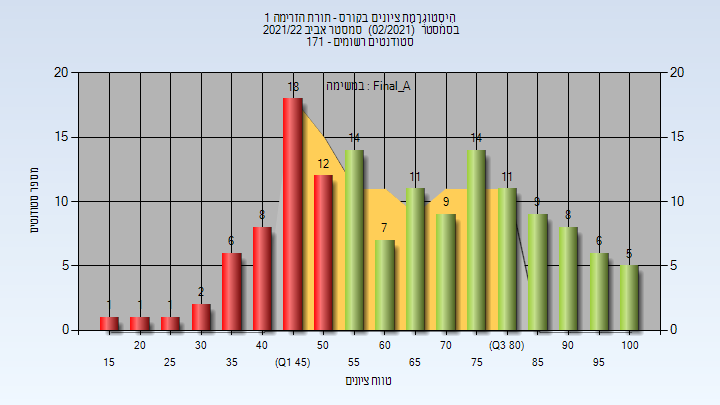
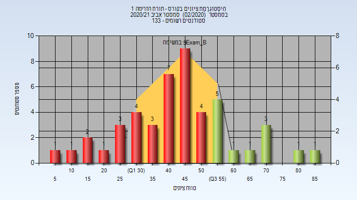
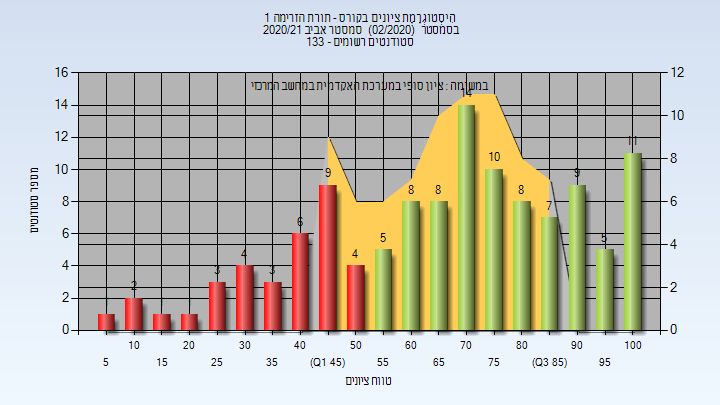
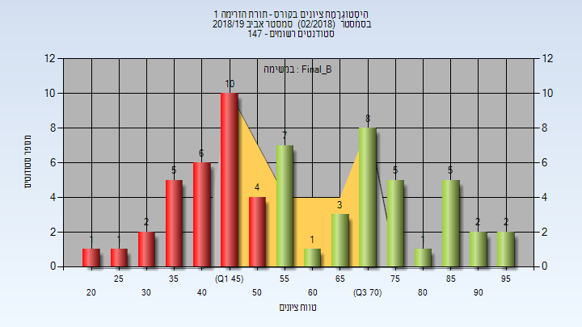
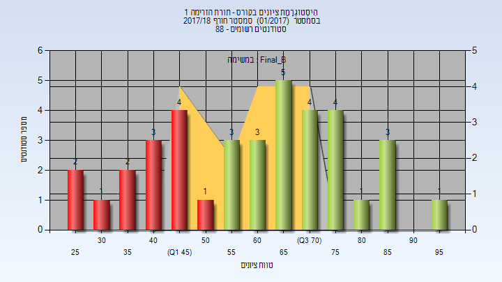
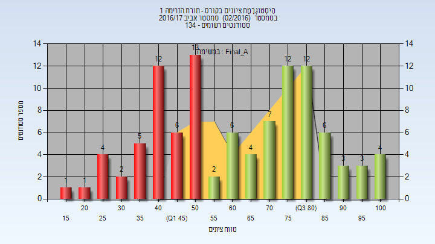
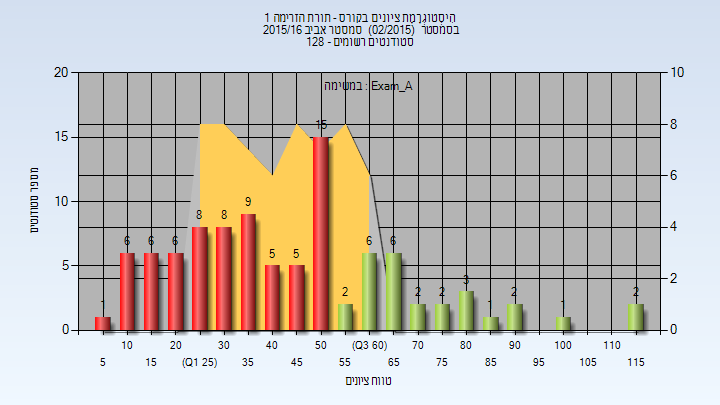

# 00340013 - תורת הזרימה 1

**הערה**: מאגר ההיסטוגרמות הוקם עבור [CheeseFork](https://cheesefork.cf/), כלי בניית מערכת שעות עבור סטודנטים בטכניון. באתר בו אתם גולשים ניתן לעיין בהיסטוגרמות, אך הדרך היותר נוחה היא לעיין בהיסטוגרמות, ובמידע נוסף כגון חוות דעת של סטודנטים, באתר CheeseFork.

* [אביב 2022](#202102)
  * [סופי מועד א'](#202102-Final_A)
  * [סופי מועד ב'](#202102-Final_B)
  * [סופי](#202102-Finals)
* [חורף 2021-2022](#202101)
  * [מבחן מועד א'](#202101-Exam_A)
  * [סופי מועד א'](#202101-Final_A)
  * [סופי](#202101-Finals)
* [אביב 2021](#202002)
  * [מבחן מועד א'](#202002-Exam_A)
  * [סופי מועד א'](#202002-Final_A)
  * [מבחן מועד ב'](#202002-Exam_B)
  * [סופי מועד ב'](#202002-Final_B)
  * [סופי](#202002-Finals)
* [חורף 2020-2021](#202001)
  * [סופי מועד א'](#202001-Final_A)
  * [סופי](#202001-Finals)
* [אביב 2020](#201902)
  * [סופי מועד א'](#201902-Final_A)
  * [סופי מועד ב'](#201902-Final_B)
  * [סופי](#201902-Finals)
* [חורף 2019-2020](#201901)
  * [מבחן מועד א'](#201901-Exam_A)
  * [סופי מועד א'](#201901-Final_A)
  * [סופי](#201901-Finals)
* [אביב 2019](#201802)
  * [מבחן מועד א'](#201802-Exam_A)
  * [סופי מועד א'](#201802-Final_A)
  * [מבחן מועד ב'](#201802-Exam_B)
  * [סופי מועד ב'](#201802-Final_B)
  * [סופי](#201802-Finals)
* [חורף 2018-2019](#201801)
  * [מבחן מועד א'](#201801-Exam_A)
  * [סופי מועד א'](#201801-Final_A)
  * [מבחן מועד ב'](#201801-Exam_B)
  * [סופי מועד ב'](#201801-Final_B)
  * [סופי](#201801-Finals)
* [אביב 2018](#201702)
  * [מבחן מועד א'](#201702-Exam_A)
  * [סופי מועד א'](#201702-Final_A)
  * [מבחן מועד ב'](#201702-Exam_B)
  * [סופי מועד ב'](#201702-Final_B)
  * [סופי](#201702-Finals)
* [חורף 2017-2018](#201701)
  * [מבחן מועד א'](#201701-Exam_A)
  * [סופי מועד א'](#201701-Final_A)
  * [מבחן מועד ב'](#201701-Exam_B)
  * [סופי מועד ב'](#201701-Final_B)
  * [סופי](#201701-Finals)
* [אביב 2017](#201602)
  * [מבחן מועד א'](#201602-Exam_A)
  * [סופי מועד א'](#201602-Final_A)
  * [סופי מועד ב'](#201602-Final_B)
  * [סופי](#201602-Finals)
* [חורף 2016-2017](#201601)
  * [סופי מועד א'](#201601-Final_A)
  * [מבחן מועד ב'](#201601-Exam_B)
  * [סופי מועד ב'](#201601-Final_B)
  * [סופי](#201601-Finals)
* [אביב 2016](#201502)
  * [מבחן מועד א'](#201502-Exam_A)
  * [סופי מועד א'](#201502-Final_A)
  * [סופי מועד ב'](#201502-Final_B)
  * [סופי](#201502-Finals)
* [אביב 2015](#201402)
  * [סופי מועד א'](#201402-Final_A)
  * [סופי מועד ב'](#201402-Final_B)
  * [סופי](#201402-Finals)
* [חורף 2014-2015](#201401)
  * [סופי מועד א'](#201401-Final_A)
  * [סופי מועד ב'](#201401-Final_B)
  * [סופי](#201401-Finals)

<h2 id="202102">אביב 2022</h2>

| איש סגל | תפקיד |
| ---- | ---- |
| ברקוביץ מורן | מרצה - אחראי מקצוע |
| וידקר דניאל | מתרגל - עם הרשאות מרצה אחראי |
| אלגריסי מור | מתרגל - עם הרשאות מרצה אחראי |
| גבאי ישראל | מתרגל - עם הרשאות מרצה אחראי |

<h3 id="202102-Final_A">סופי מועד א'</h3>

| סטודנטים | עברו/נכשלו | אחוז עוברים | ציון מינימלי | ציון מקסימלי | ממוצע | חציון |
| ---- | ---- | ---- | ---- | ---- | ---- | ---- |
| 143 | 94/49 | 66 | 16 | 100 | 65.343 | 66 |

<h3 id="202102-Final_B">סופי מועד ב'</h3>

| סטודנטים | עברו/נכשלו | אחוז עוברים | ציון מינימלי | ציון מקסימלי | ממוצע | חציון |
| ---- | ---- | ---- | ---- | ---- | ---- | ---- |
| 74 | 36/38 | 49 | 12 | 93 | 55.527 | 52.5 |

<h3 id="202102-Finals">סופי</h3>

| סטודנטים | עברו/נכשלו | אחוז עוברים | ציון מינימלי | ציון מקסימלי | ממוצע | חציון |
| ---- | ---- | ---- | ---- | ---- | ---- | ---- |
| 165 | 125/40 | 76 | 12 | 100 | 67.927 | 72 |

<h2 id="202101">חורף 2021-2022</h2>

| איש סגל | תפקיד |
| ---- | ---- |
| גת אמיר | מרצה - אחראי מקצוע |
| פרץ אופק | מרצה |

<h3 id="202101-Exam_A">מבחן מועד א'</h3>

| סטודנטים | עברו/נכשלו | אחוז עוברים | ציון מינימלי | ציון מקסימלי | ממוצע | חציון |
| ---- | ---- | ---- | ---- | ---- | ---- | ---- |
| 27 | 22/5 | 81 | 26 | 101 | 65.889 | 63 |

<h3 id="202101-Final_A">סופי מועד א'</h3>

| סטודנטים | עברו/נכשלו | אחוז עוברים | ציון מינימלי | ציון מקסימלי | ממוצע | חציון |
| ---- | ---- | ---- | ---- | ---- | ---- | ---- |
| 27 | 22/5 | 81 | 26 | 100 | 70.704 | 69 |

<h3 id="202101-Finals">סופי</h3>

| סטודנטים | עברו/נכשלו | אחוז עוברים | ציון מינימלי | ציון מקסימלי | ממוצע | חציון |
| ---- | ---- | ---- | ---- | ---- | ---- | ---- |
| 36 | 29/7 | 81 | 35 | 100 | 69.694 | 70.5 |

<h2 id="202002">אביב 2021</h2>

| איש סגל | תפקיד |
| ---- | ---- |
| ברקוביץ מורן | מרצה - אחראי מקצוע |
| וידקר דניאל | מתרגל - עם הרשאות מרצה אחראי |
| גבאי ישראל | מתרגל - עם הרשאות מרצה אחראי |
| אלגריסי מור | מתרגל - עם הרשאות מרצה אחראי |

<h3 id="202002-Exam_A">מבחן מועד א'</h3>

| סטודנטים | עברו/נכשלו | אחוז עוברים | ציון מינימלי | ציון מקסימלי | ממוצע | חציון |
| ---- | ---- | ---- | ---- | ---- | ---- | ---- |
| 93 | 69/24 | 74 | 5 | 98 | 63.011 | 64 |

<h3 id="202002-Final_A">סופי מועד א'</h3>

| סטודנטים | עברו/נכשלו | אחוז עוברים | ציון מינימלי | ציון מקסימלי | ממוצע | חציון |
| ---- | ---- | ---- | ---- | ---- | ---- | ---- |
| 93 | 69/24 | 74 | 5 | 100 | 68.677 | 72 |

<h3 id="202002-Exam_B">מבחן מועד ב'</h3>

| סטודנטים | עברו/נכשלו | אחוז עוברים | ציון מינימלי | ציון מקסימלי | ממוצע | חציון |
| ---- | ---- | ---- | ---- | ---- | ---- | ---- |
| 47 | 12/35 | 26 | 7 | 85 | 44.936 | 45 |

<h3 id="202002-Final_B">סופי מועד ב'</h3>

| סטודנטים | עברו/נכשלו | אחוז עוברים | ציון מינימלי | ציון מקסימלי | ממוצע | חציון |
| ---- | ---- | ---- | ---- | ---- | ---- | ---- |
| 47 | 12/35 | 26 | 7 | 95 | 46.723 | 45 |

<h3 id="202002-Finals">סופי</h3>

| סטודנטים | עברו/נכשלו | אחוז עוברים | ציון מינימלי | ציון מקסימלי | ממוצע | חציון |
| ---- | ---- | ---- | ---- | ---- | ---- | ---- |
| 119 | 85/34 | 71 | 7 | 100 | 67.647 | 70 |

<h2 id="202001">חורף 2020-2021</h2>

| איש סגל | תפקיד |
| ---- | ---- |
| גת אמיר | מרצה - אחראי מקצוע |
| אלגריסי מור | מרצה |
| פרץ אופק | מרצה |

<h3 id="202001-Final_A">סופי מועד א'</h3>

| סטודנטים | עברו/נכשלו | אחוז עוברים | ציון מינימלי | ציון מקסימלי | ממוצע | חציון |
| ---- | ---- | ---- | ---- | ---- | ---- | ---- |
| 37 | 34/3 | 92 | 34 | 100 | 71.676 | 70 |

<h3 id="202001-Finals">סופי</h3>

| סטודנטים | עברו/נכשלו | אחוז עוברים | ציון מינימלי | ציון מקסימלי | ממוצע | חציון |
| ---- | ---- | ---- | ---- | ---- | ---- | ---- |
| 42 | 39/3 | 93 | 41 | 100 | 71.381 | 70 |

<h2 id="201902">אביב 2020</h2>

| איש סגל | תפקיד |
| ---- | ---- |
| ברקוביץ מורן | מרצה - אחראי מקצוע |
| בויקו יבגני | מתרגל - עם הרשאות מרצה אחראי |
| אלגריסי מור | מתרגל - עם הרשאות מרצה אחראי |
| גבאי ישראל | מתרגל - עם הרשאות מרצה אחראי |
| אשל רן | מתרגל - עם הרשאות מרצה אחראי |

<h3 id="201902-Final_A">סופי מועד א'</h3>

| סטודנטים | עברו/נכשלו | אחוז עוברים | ציון מינימלי | ציון מקסימלי | ממוצע | חציון |
| ---- | ---- | ---- | ---- | ---- | ---- | ---- |
| 112 | 78/34 | 70 | 12 | 100 | 63.438 | 65 |

<h3 id="201902-Final_B">סופי מועד ב'</h3>

| סטודנטים | עברו/נכשלו | אחוז עוברים | ציון מינימלי | ציון מקסימלי | ממוצע | חציון |
| ---- | ---- | ---- | ---- | ---- | ---- | ---- |
| 71 | 24/47 | 34 | 7 | 90 | 47.197 | 44 |

<h3 id="201902-Finals">סופי</h3>

| סטודנטים | עברו/נכשלו | אחוז עוברים | ציון מינימלי | ציון מקסימלי | ממוצע | חציון |
| ---- | ---- | ---- | ---- | ---- | ---- | ---- |
| 144 | 98/46 | 68 | 7 | 100 | 61.556 | 63.5 |

<h2 id="201901">חורף 2019-2020</h2>

| איש סגל | תפקיד |
| ---- | ---- |
| אלפיסי דניאל | מרצה - אחראי מקצוע |
| פרנקל סטיבן | מרצה |

<h3 id="201901-Exam_A">מבחן מועד א'</h3>

| סטודנטים | עברו/נכשלו | אחוז עוברים | ציון מינימלי | ציון מקסימלי | ממוצע | חציון |
| ---- | ---- | ---- | ---- | ---- | ---- | ---- |
| 34 | 21/13 | 62 | 28 | 97 | 63.529 | 66.5 |

<h3 id="201901-Final_A">סופי מועד א'</h3>

| סטודנטים | עברו/נכשלו | אחוז עוברים | ציון מינימלי | ציון מקסימלי | ממוצע | חציון |
| ---- | ---- | ---- | ---- | ---- | ---- | ---- |
| 34 | 34/0 | 100 | 57 | 97 | 78.735 | 79.5 |

<h3 id="201901-Finals">סופי</h3>

| סטודנטים | עברו/נכשלו | אחוז עוברים | ציון מינימלי | ציון מקסימלי | ממוצע | חציון |
| ---- | ---- | ---- | ---- | ---- | ---- | ---- |
| 37 | 37/0 | 100 | 57 | 97 | 80.27 | 82 |

<h2 id="201802">אביב 2019</h2>

| איש סגל | תפקיד |
| ---- | ---- |
| גרינבלט דוד | מרצה - אחראי מקצוע |
| בויקו יבגני | מתרגל - עם הרשאות מרצה אחראי |
| גבאי ישראל | מתרגל - עם הרשאות מרצה אחראי |
| נוף אלירם | מתרגל - עם הרשאות מרצה אחראי |

<h3 id="201802-Exam_A">מבחן מועד א'</h3>

| סטודנטים | עברו/נכשלו | אחוז עוברים | ציון מינימלי | ציון מקסימלי | ממוצע | חציון |
| ---- | ---- | ---- | ---- | ---- | ---- | ---- |
| 116 | 82/34 | 71 | 12 | 97 | 64.224 | 65.5 |

<h3 id="201802-Final_A">סופי מועד א'</h3>

| סטודנטים | עברו/נכשלו | אחוז עוברים | ציון מינימלי | ציון מקסימלי | ממוצע | חציון |
| ---- | ---- | ---- | ---- | ---- | ---- | ---- |
| 116 | 83/33 | 72 | 12 | 100 | 68.931 | 71 |

<h3 id="201802-Exam_B">מבחן מועד ב'</h3>

| סטודנטים | עברו/נכשלו | אחוז עוברים | ציון מינימלי | ציון מקסימלי | ממוצע | חציון |
| ---- | ---- | ---- | ---- | ---- | ---- | ---- |
| 63 | 32/31 | 51 | 24 | 96 | 57.27 | 53 |

<h3 id="201802-Final_B">סופי מועד ב'</h3>

| סטודנטים | עברו/נכשלו | אחוז עוברים | ציון מינימלי | ציון מקסימלי | ממוצע | חציון |
| ---- | ---- | ---- | ---- | ---- | ---- | ---- |
| 63 | 34/29 | 54 | 24 | 98 | 59.698 | 55 |

<h3 id="201802-Finals">סופי</h3>

| סטודנטים | עברו/נכשלו | אחוז עוברים | ציון מינימלי | ציון מקסימלי | ממוצע | חציון |
| ---- | ---- | ---- | ---- | ---- | ---- | ---- |
| 142 | 112/30 | 79 | 12 | 100 | 72.606 | 74 |

<h2 id="201801">חורף 2018-2019</h2>

| איש סגל | תפקיד |
| ---- | ---- |
| גת אמיר | מרצה - אחראי מקצוע |
| בויקו יבגני | מתרגל - עם הרשאות מרצה אחראי |
| גבאי ישראל | מתרגל - עם הרשאות מרצה אחראי |

<h3 id="201801-Exam_A">מבחן מועד א'</h3>

| סטודנטים | עברו/נכשלו | אחוז עוברים | ציון מינימלי | ציון מקסימלי | ממוצע | חציון |
| ---- | ---- | ---- | ---- | ---- | ---- | ---- |
| 54 | 25/29 | 46 | 40 | 98 | 54.944 | 47 |

<h3 id="201801-Final_A">סופי מועד א'</h3>

| סטודנטים | עברו/נכשלו | אחוז עוברים | ציון מינימלי | ציון מקסימלי | ממוצע | חציון |
| ---- | ---- | ---- | ---- | ---- | ---- | ---- |
| 54 | 39/15 | 72 | 40 | 100 | 64.667 | 61.5 |

<h3 id="201801-Exam_B">מבחן מועד ב'</h3>

| סטודנטים | עברו/נכשלו | אחוז עוברים | ציון מינימלי | ציון מקסימלי | ממוצע | חציון |
| ---- | ---- | ---- | ---- | ---- | ---- | ---- |
| 43 | 20/23 | 47 | 0 | 83 | 49.116 | 52 |

<h3 id="201801-Final_B">סופי מועד ב'</h3>

| סטודנטים | עברו/נכשלו | אחוז עוברים | ציון מינימלי | ציון מקסימלי | ממוצע | חציון |
| ---- | ---- | ---- | ---- | ---- | ---- | ---- |
| 43 | 29/14 | 67 | 40 | 93 | 63.628 | 63 |

<h3 id="201801-Finals">סופי</h3>

| סטודנטים | עברו/נכשלו | אחוז עוברים | ציון מינימלי | ציון מקסימלי | ממוצע | חציון |
| ---- | ---- | ---- | ---- | ---- | ---- | ---- |
| 82 | 66/16 | 80 | 40 | 100 | 68.854 | 70 |

<h2 id="201702">אביב 2018</h2>

| איש סגל | תפקיד |
| ---- | ---- |
| ברקוביץ מורן | מרצה - אחראי מקצוע |
| גבאי ישראל | מתרגל - עם הרשאות מרצה אחראי |
| אשל רן | מתרגל - עם הרשאות מרצה אחראי |
| בויקו יבגני | מתרגל - עם הרשאות מרצה אחראי |

<h3 id="201702-Exam_A">מבחן מועד א'</h3>

| סטודנטים | עברו/נכשלו | אחוז עוברים | ציון מינימלי | ציון מקסימלי | ממוצע | חציון |
| ---- | ---- | ---- | ---- | ---- | ---- | ---- |
| 103 | 55/48 | 53 | 5 | 100 | 56.864 | 55 |

<h3 id="201702-Final_A">סופי מועד א'</h3>

| סטודנטים | עברו/נכשלו | אחוז עוברים | ציון מינימלי | ציון מקסימלי | ממוצע | חציון |
| ---- | ---- | ---- | ---- | ---- | ---- | ---- |
| 103 | 58/45 | 56 | 7 | 100 | 60.087 | 59 |

<h3 id="201702-Exam_B">מבחן מועד ב'</h3>

| סטודנטים | עברו/נכשלו | אחוז עוברים | ציון מינימלי | ציון מקסימלי | ממוצע | חציון |
| ---- | ---- | ---- | ---- | ---- | ---- | ---- |
| 72 | 38/34 | 53 | 8 | 88 | 52.417 | 56 |

<h3 id="201702-Final_B">סופי מועד ב'</h3>

| סטודנטים | עברו/נכשלו | אחוז עוברים | ציון מינימלי | ציון מקסימלי | ממוצע | חציון |
| ---- | ---- | ---- | ---- | ---- | ---- | ---- |
| 72 | 40/32 | 56 | 10 | 100 | 54.333 | 57.5 |

<h3 id="201702-Finals">סופי</h3>

| סטודנטים | עברו/נכשלו | אחוז עוברים | ציון מינימלי | ציון מקסימלי | ממוצע | חציון |
| ---- | ---- | ---- | ---- | ---- | ---- | ---- |
| 130 | 96/34 | 74 | 10 | 100 | 65.823 | 66 |

<h2 id="201701">חורף 2017-2018</h2>

| איש סגל | תפקיד |
| ---- | ---- |
| ברקוביץ מורן | מרצה - אחראי מקצוע |
| בויקו יבגני | מתרגל - עם הרשאות מרצה אחראי |
| רופמן ברוך | מתרגל - עם הרשאות מרצה אחראי |
| נוף אלירם | מתרגל - עם הרשאות מרצה אחראי |

<h3 id="201701-Exam_A">מבחן מועד א'</h3>

| סטודנטים | עברו/נכשלו | אחוז עוברים | ציון מינימלי | ציון מקסימלי | ממוצע | חציון |
| ---- | ---- | ---- | ---- | ---- | ---- | ---- |
| 56 | 32/24 | 57 | 15 | 83 | 54.929 | 57 |

<h3 id="201701-Final_A">סופי מועד א'</h3>

| סטודנטים | עברו/נכשלו | אחוז עוברים | ציון מינימלי | ציון מקסימלי | ממוצע | חציון |
| ---- | ---- | ---- | ---- | ---- | ---- | ---- |
| 56 | 32/24 | 57 | 17 | 95 | 60 | 60.5 |

<h3 id="201701-Exam_B">מבחן מועד ב'</h3>

| סטודנטים | עברו/נכשלו | אחוז עוברים | ציון מינימלי | ציון מקסימלי | ממוצע | חציון |
| ---- | ---- | ---- | ---- | ---- | ---- | ---- |
| 38 | 25/13 | 66 | 27 | 93 | 58.132 | 60.5 |

<h3 id="201701-Final_B">סופי מועד ב'</h3>

| סטודנטים | עברו/נכשלו | אחוז עוברים | ציון מינימלי | ציון מקסימלי | ממוצע | חציון |
| ---- | ---- | ---- | ---- | ---- | ---- | ---- |
| 37 | 24/13 | 65 | 28 | 98 | 60.865 | 64 |

<h3 id="201701-Finals">סופי</h3>

| סטודנטים | עברו/נכשלו | אחוז עוברים | ציון מינימלי | ציון מקסימלי | ממוצע | חציון |
| ---- | ---- | ---- | ---- | ---- | ---- | ---- |
| 72 | 56/16 | 78 | 22 | 98 | 65.736 | 68.5 |

<h2 id="201602">אביב 2017</h2>

| איש סגל | תפקיד |
| ---- | ---- |
| ברקוביץ מורן | מרצה - אחראי מקצוע |
| נוף אלירם | מתרגל - עם הרשאות מרצה אחראי |
| בויקו יבגני | מתרגל - עם הרשאות מרצה אחראי |

<h3 id="201602-Exam_A">מבחן מועד א'</h3>

| סטודנטים | עברו/נכשלו | אחוז עוברים | ציון מינימלי | ציון מקסימלי | ממוצע | חציון |
| ---- | ---- | ---- | ---- | ---- | ---- | ---- |
| 103 | 55/48 | 53 | 16 | 100 | 56.583 | 55 |

<h3 id="201602-Final_A">סופי מועד א'</h3>

| סטודנטים | עברו/נכשלו | אחוז עוברים | ציון מינימלי | ציון מקסימלי | ממוצע | חציון |
| ---- | ---- | ---- | ---- | ---- | ---- | ---- |
| 103 | 59/44 | 57 | 18 | 100 | 63.019 | 62 |

<h3 id="201602-Final_B">סופי מועד ב'</h3>

| סטודנטים | עברו/נכשלו | אחוז עוברים | ציון מינימלי | ציון מקסימלי | ממוצע | חציון |
| ---- | ---- | ---- | ---- | ---- | ---- | ---- |
| 59 | 28/31 | 47 | 7 | 99 | 54.237 | 53 |

<h3 id="201602-Finals">סופי</h3>

| סטודנטים | עברו/נכשלו | אחוז עוברים | ציון מינימלי | ציון מקסימלי | ממוצע | חציון |
| ---- | ---- | ---- | ---- | ---- | ---- | ---- |
| 125 | 87/38 | 70 | 7 | 100 | 65.64 | 73 |

<h2 id="201601">חורף 2016-2017</h2>

| איש סגל | תפקיד |
| ---- | ---- |
| גת אמיר | מרצה - אחראי מקצוע |
| בויקו יבגני | מתרגל - עם הרשאות מרצה אחראי |

<h3 id="201601-Final_A">סופי מועד א'</h3>

| סטודנטים | עברו/נכשלו | אחוז עוברים | ציון מינימלי | ציון מקסימלי | ממוצע | חציון |
| ---- | ---- | ---- | ---- | ---- | ---- | ---- |
| 63 | 47/16 | 75 | 26 | 100 | 63.302 | 61 |

<h3 id="201601-Exam_B">מבחן מועד ב'</h3>

| סטודנטים | עברו/נכשלו | אחוז עוברים | ציון מינימלי | ציון מקסימלי | ממוצע | חציון |
| ---- | ---- | ---- | ---- | ---- | ---- | ---- |
| 34 | 15/19 | 44 | 6 | 87 | 49.529 | 49.5 |

<h3 id="201601-Final_B">סופי מועד ב'</h3>

| סטודנטים | עברו/נכשלו | אחוז עוברים | ציון מינימלי | ציון מקסימלי | ממוצע | חציון |
| ---- | ---- | ---- | ---- | ---- | ---- | ---- |
| 34 | 23/11 | 68 | 40 | 88 | 60.735 | 55.5 |

<h3 id="201601-Finals">סופי</h3>

| סטודנטים | עברו/נכשלו | אחוז עוברים | ציון מינימלי | ציון מקסימלי | ממוצע | חציון |
| ---- | ---- | ---- | ---- | ---- | ---- | ---- |
| 74 | 64/10 | 86 | 40 | 100 | 68.297 | 68.5 |

<h2 id="201502">אביב 2016</h2>

| איש סגל | תפקיד |
| ---- | ---- |
| ברקוביץ מורן | מרצה - אחראי מקצוע |

<h3 id="201502-Exam_A">מבחן מועד א'</h3>

| סטודנטים | עברו/נכשלו | אחוז עוברים | ציון מינימלי | ציון מקסימלי | ממוצע | חציון |
| ---- | ---- | ---- | ---- | ---- | ---- | ---- |
| 96 | 27/69 | 28 | 9.1 | 118.3 | 46.055 | 42.9 |

<h3 id="201502-Final_A">סופי מועד א'</h3>

| סטודנטים | עברו/נכשלו | אחוז עוברים | ציון מינימלי | ציון מקסימלי | ממוצע | חציון |
| ---- | ---- | ---- | ---- | ---- | ---- | ---- |
| 96 | 47/49 | 49 | 20 | 115 | 53.281 | 51 |

<h3 id="201502-Final_B">סופי מועד ב'</h3>

| סטודנטים | עברו/נכשלו | אחוז עוברים | ציון מינימלי | ציון מקסימלי | ממוצע | חציון |
| ---- | ---- | ---- | ---- | ---- | ---- | ---- |
| 62 | 48/14 | 77 | 29 | 113 | 67.823 | 70 |

<h3 id="201502-Finals">סופי</h3>

| סטודנטים | עברו/נכשלו | אחוז עוברים | ציון מינימלי | ציון מקסימלי | ממוצע | חציון |
| ---- | ---- | ---- | ---- | ---- | ---- | ---- |
| 108 | 89/19 | 82 | 22 | 100 | 68.213 | 68.5 |

<h2 id="201402">אביב 2015</h2>

| איש סגל | תפקיד |
| ---- | ---- |
| גת אמיר | מרצה - אחראי מקצוע |

<h3 id="201402-Final_A">סופי מועד א'</h3>

| סטודנטים | עברו/נכשלו | אחוז עוברים | ציון מינימלי | ציון מקסימלי | ממוצע | חציון |
| ---- | ---- | ---- | ---- | ---- | ---- | ---- |
| 92 | 80/12 | 87 | 27 | 100 | 73.25 | 76 |

<h3 id="201402-Final_B">סופי מועד ב'</h3>

| סטודנטים | עברו/נכשלו | אחוז עוברים | ציון מינימלי | ציון מקסימלי | ממוצע | חציון |
| ---- | ---- | ---- | ---- | ---- | ---- | ---- |
| 46 | 41/5 | 89 | 26 | 95 | 69.957 | 70 |

<h3 id="201402-Finals">סופי</h3>

| סטודנטים | עברו/נכשלו | אחוז עוברים | ציון מינימלי | ציון מקסימלי | ממוצע | חציון |
| ---- | ---- | ---- | ---- | ---- | ---- | ---- |
| 117 | 110/7 | 94 | 26 | 100 | 75.701 | 79 |

<h2 id="201401">חורף 2014-2015</h2>

| איש סגל | תפקיד |
| ---- | ---- |
| ברקוביץ מורן | מרצה - אחראי מקצוע |

<h3 id="201401-Final_A">סופי מועד א'</h3>

| סטודנטים | עברו/נכשלו | אחוז עוברים | ציון מינימלי | ציון מקסימלי | ממוצע | חציון |
| ---- | ---- | ---- | ---- | ---- | ---- | ---- |
| 69 | 66/3 | 96 | 47 | 100 | 78.391 | 81 |

<h3 id="201401-Final_B">סופי מועד ב'</h3>

| סטודנטים | עברו/נכשלו | אחוז עוברים | ציון מינימלי | ציון מקסימלי | ממוצע | חציון |
| ---- | ---- | ---- | ---- | ---- | ---- | ---- |
| 19 | 18/1 | 95 | 52 | 93 | 71.895 | 71 |

<h3 id="201401-Finals">סופי</h3>

| סטודנטים | עברו/נכשלו | אחוז עוברים | ציון מינימלי | ציון מקסימלי | ממוצע | חציון |
| ---- | ---- | ---- | ---- | ---- | ---- | ---- |
| 79 | 77/2 | 97 | 47 | 100 | 78.684 | 80 |

