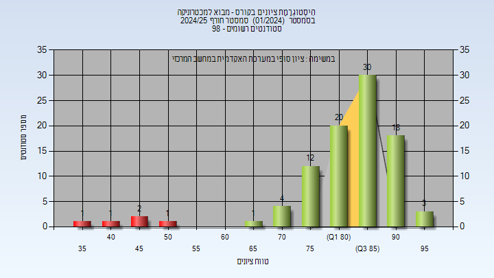
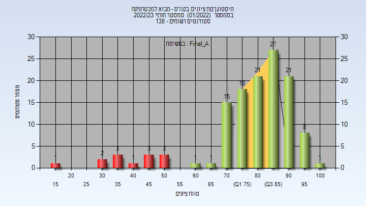
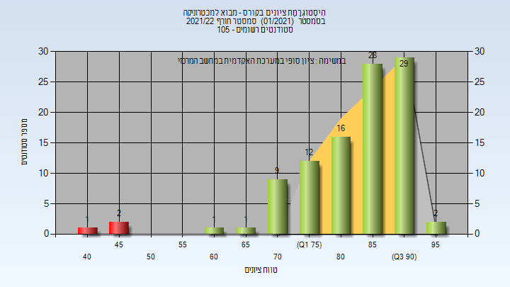
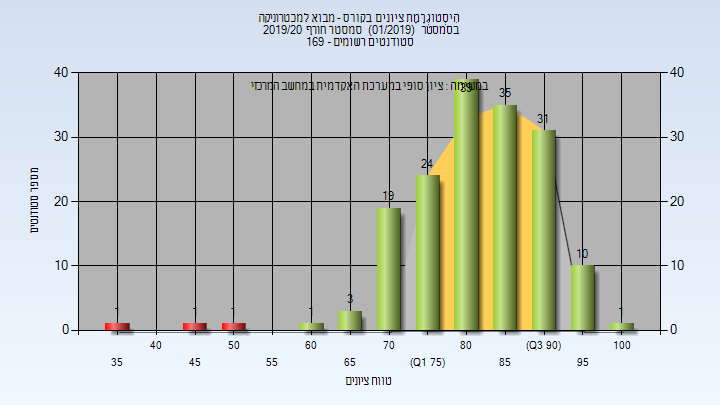

# 00340022 - מבוא למכטרוניקה

**הערה**: מאגר ההיסטוגרמות הוקם עבור [CheeseFork](https://cheesefork.cf/), כלי בניית מערכת שעות עבור סטודנטים בטכניון. באתר בו אתם גולשים ניתן לעיין בהיסטוגרמות, אך הדרך היותר נוחה היא לעיין בהיסטוגרמות, ובמידע נוסף כגון חוות דעת של סטודנטים, באתר CheeseFork.

* [חורף 2024-2025](#202401)
  * [מבחן מועד א'](#202401-Exam_A)
  * [סופי מועד א'](#202401-Final_A)
  * [מבחן מועד ב'](#202401-Exam_B)
  * [סופי מועד ב'](#202401-Final_B)
  * [סופי](#202401-Finals)
* [אביב 2024](#202302)
  * [מבחן מועד א'](#202302-Exam_A)
  * [סופי מועד א'](#202302-Final_A)
  * [סופי](#202302-Finals)
* [חורף 2023-2024](#202301)
  * [סופי מועד א'](#202301-Final_A)
  * [סופי](#202301-Finals)
* [חורף 2022-2023](#202201)
  * [מבחן מועד א'](#202201-Exam_A)
  * [סופי מועד א'](#202201-Final_A)
  * [מבחן מועד ב'](#202201-Exam_B)
  * [סופי מועד ב'](#202201-Final_B)
  * [סופי](#202201-Finals)
* [אביב 2022](#202102)
  * [סופי מועד א'](#202102-Final_A)
  * [סופי](#202102-Finals)
* [חורף 2021-2022](#202101)
  * [מבחן מועד א'](#202101-Exam_A)
  * [סופי מועד א'](#202101-Final_A)
  * [סופי](#202101-Finals)
* [אביב 2021](#202002)
* [חורף 2020-2021](#202001)
  * [סופי מועד א'](#202001-Final_A)
  * [סופי מועד ב'](#202001-Final_B)
  * [סופי](#202001-Finals)
* [אביב 2020](#201902)
  * [מבחן מועד א'](#201902-Exam_A)
  * [סופי מועד א'](#201902-Final_A)
* [חורף 2019-2020](#201901)
  * [מבחן מועד א'](#201901-Exam_A)
  * [סופי מועד א'](#201901-Final_A)
  * [סופי מועד ב'](#201901-Final_B)
  * [סופי](#201901-Finals)
* [חורף 2018-2019](#201801)
  * [מבחן מועד א'](#201801-Exam_A)
  * [סופי מועד א'](#201801-Final_A)
  * [מבחן מועד ב'](#201801-Exam_B)
  * [סופי מועד ב'](#201801-Final_B)
  * [סופי](#201801-Finals)
* [אביב 2018](#201702)
  * [מבחן מועד א'](#201702-Exam_A)
  * [סופי מועד א'](#201702-Final_A)
  * [סופי](#201702-Finals)
* [חורף 2017-2018](#201701)
  * [מבחן מועד א'](#201701-Exam_A)
  * [סופי מועד א'](#201701-Final_A)
  * [סופי](#201701-Finals)
* [אביב 2017](#201602)
  * [סופי מועד א'](#201602-Final_A)
  * [סופי מועד ב'](#201602-Final_B)
  * [סופי](#201602-Finals)
* [חורף 2016-2017](#201601)
  * [מבחן מועד א'](#201601-Exam_A)
  * [סופי מועד א'](#201601-Final_A)
  * [מבחן מועד ב'](#201601-Exam_B)
  * [סופי מועד ב'](#201601-Final_B)
  * [סופי](#201601-Finals)
* [חורף 2015-2016](#201501)
  * [סופי מועד א'](#201501-Final_A)
  * [סופי](#201501-Finals)
* [חורף 2014-2015](#201401)
  * [סופי מועד א'](#201401-Final_A)
  * [סופי מועד ב'](#201401-Final_B)
  * [סופי](#201401-Finals)

<h2 id="202401">חורף 2024-2025</h2>

| איש סגל | תפקיד |
| ---- | ---- |
| רימון אילון | מרצה - אחראי מקצוע |
| לנג רעי | מתרגל |
| קלדור אייל | מתרגל |

<h3 id="202401-Exam_A">מבחן מועד א'</h3>

| סטודנטים | עברו/נכשלו | אחוז עוברים | ציון מינימלי | ציון מקסימלי | ממוצע | חציון |
| ---- | ---- | ---- | ---- | ---- | ---- | ---- |
| 70 | 58/12 | 83 | 22 | 93 | 71.557 | 77.5 |

<h3 id="202401-Final_A">סופי מועד א'</h3>

| סטודנטים | עברו/נכשלו | אחוז עוברים | ציון מינימלי | ציון מקסימלי | ממוצע | חציון |
| ---- | ---- | ---- | ---- | ---- | ---- | ---- |
| 70 | 58/12 | 83 | 22 | 95 | 77.371 | 84.5 |

<h3 id="202401-Exam_B">מבחן מועד ב'</h3>

| סטודנטים | עברו/נכשלו | אחוז עוברים | ציון מינימלי | ציון מקסימלי | ממוצע | חציון |
| ---- | ---- | ---- | ---- | ---- | ---- | ---- |
| 38 | 33/5 | 87 | 38 | 98 | 72.026 | 73 |

<h3 id="202401-Final_B">סופי מועד ב'</h3>

| סטודנטים | עברו/נכשלו | אחוז עוברים | ציון מינימלי | ציון מקסימלי | ממוצע | חציון |
| ---- | ---- | ---- | ---- | ---- | ---- | ---- |
| 38 | 33/5 | 87 | 38 | 98 | 78.342 | 81 |

<h3 id="202401-Finals">סופי</h3>

| סטודנטים | עברו/נכשלו | אחוז עוברים | ציון מינימלי | ציון מקסימלי | ממוצע | חציון |
| ---- | ---- | ---- | ---- | ---- | ---- | ---- |
| 99 | 88/11 | 89 | 38 | 98 | 82.882 | 85 |

<h2 id="202302">אביב 2024</h2>

| איש סגל | תפקיד |
| ---- | ---- |
| גומיד חאלד | מרצה - אחראי מקצוע |
| או גינטאו | מרצה |

<h3 id="202302-Exam_A">מבחן מועד א'</h3>

| סטודנטים | עברו/נכשלו | אחוז עוברים | ציון מינימלי | ציון מקסימלי | ממוצע | חציון |
| ---- | ---- | ---- | ---- | ---- | ---- | ---- |
| 13 | 12/1 | 92 | 32 | 100 | 78.615 | 86 |

<h3 id="202302-Final_A">סופי מועד א'</h3>

| סטודנטים | עברו/נכשלו | אחוז עוברים | ציון מינימלי | ציון מקסימלי | ממוצע | חציון |
| ---- | ---- | ---- | ---- | ---- | ---- | ---- |
| 13 | 12/1 | 92 | 39 | 100 | 80.308 | 87 |

<h3 id="202302-Finals">סופי</h3>

| סטודנטים | עברו/נכשלו | אחוז עוברים | ציון מינימלי | ציון מקסימלי | ממוצע | חציון |
| ---- | ---- | ---- | ---- | ---- | ---- | ---- |
| 13 | 13/0 | 100 | 60 | 100 | 81.923 | 87 |

<h2 id="202301">חורף 2023-2024</h2>

| איש סגל | תפקיד |
| ---- | ---- |
| רימון אילון | מרצה - אחראי מקצוע |
| קלדור אייל | מתרגל - עם הרשאות מרצה אחראי |
| רוזנשטוק דוד | מתרגל - עם הרשאות מרצה אחראי |
| שיריזלי אלון | מתרגל - עם הרשאות מרצה אחראי |

<h3 id="202301-Final_A">סופי מועד א'</h3>

| סטודנטים | עברו/נכשלו | אחוז עוברים | ציון מינימלי | ציון מקסימלי | ממוצע | חציון |
| ---- | ---- | ---- | ---- | ---- | ---- | ---- |
| 99 | 98/1 | 99 | 48 | 99 | 86.889 | 89 |

<h3 id="202301-Finals">סופי</h3>

| סטודנטים | עברו/נכשלו | אחוז עוברים | ציון מינימלי | ציון מקסימלי | ממוצע | חציון |
| ---- | ---- | ---- | ---- | ---- | ---- | ---- |
| 136 | 135/1 | 99 | 24 | 100 | 89.211 | 90 |

<h2 id="202201">חורף 2022-2023</h2>

| איש סגל | תפקיד |
| ---- | ---- |
| רימון אילון | מרצה - אחראי מקצוע |
| רוזנשטוק דוד | מתרגל - עם הרשאות מרצה אחראי |
| גרינברג איתי | מתרגל - עם הרשאות מרצה אחראי |
| שיריזלי אלון | מתרגל - עם הרשאות מרצה אחראי |

<h3 id="202201-Exam_A">מבחן מועד א'</h3>

| סטודנטים | עברו/נכשלו | אחוז עוברים | ציון מינימלי | ציון מקסימלי | ממוצע | חציון |
| ---- | ---- | ---- | ---- | ---- | ---- | ---- |
| 126 | 112/14 | 89 | 18 | 100 | 72.992 | 76 |

<h3 id="202201-Final_A">סופי מועד א'</h3>

| סטודנטים | עברו/נכשלו | אחוז עוברים | ציון מינימלי | ציון מקסימלי | ממוצע | חציון |
| ---- | ---- | ---- | ---- | ---- | ---- | ---- |
| 126 | 113/13 | 90 | 18 | 100 | 79.262 | 83.5 |

<h3 id="202201-Exam_B">מבחן מועד ב'</h3>

| סטודנטים | עברו/נכשלו | אחוז עוברים | ציון מינימלי | ציון מקסימלי | ממוצע | חציון |
| ---- | ---- | ---- | ---- | ---- | ---- | ---- |
| 26 | 19/7 | 73 | 26 | 95 | 62.962 | 64.5 |

<h3 id="202201-Final_B">סופי מועד ב'</h3>

| סטודנטים | עברו/נכשלו | אחוז עוברים | ציון מינימלי | ציון מקסימלי | ממוצע | חציון |
| ---- | ---- | ---- | ---- | ---- | ---- | ---- |
| 26 | 19/7 | 73 | 26 | 96 | 69.115 | 77 |

<h3 id="202201-Finals">סופי</h3>

| סטודנטים | עברו/נכשלו | אחוז עוברים | ציון מינימלי | ציון מקסימלי | ממוצע | חציון |
| ---- | ---- | ---- | ---- | ---- | ---- | ---- |
| 134 | 127/7 | 95 | 26 | 100 | 81.343 | 84 |

<h2 id="202102">אביב 2022</h2>

| איש סגל | תפקיד |
| ---- | ---- |
| גומיד חאלד | מרצה - אחראי מקצוע |
| אלפיסי דניאל | מרצה |
| היימן עדי | מרצה |

<h3 id="202102-Final_A">סופי מועד א'</h3>

| סטודנטים | עברו/נכשלו | אחוז עוברים | ציון מינימלי | ציון מקסימלי | ממוצע | חציון |
| ---- | ---- | ---- | ---- | ---- | ---- | ---- |
| 17 | 17/0 | 100 | 62.2 | 100 | 77.106 | 74.8 |

<h3 id="202102-Finals">סופי</h3>

| סטודנטים | עברו/נכשלו | אחוז עוברים | ציון מינימלי | ציון מקסימלי | ממוצע | חציון |
| ---- | ---- | ---- | ---- | ---- | ---- | ---- |
| 18 | 18/0 | 100 | 62 | 100 | 79.167 | 77.5 |

<h2 id="202101">חורף 2021-2022</h2>

| איש סגל | תפקיד |
| ---- | ---- |
| רימון אילון | מרצה - אחראי מקצוע |
| שיריזלי אלון | מתרגל - עם הרשאות מרצה אחראי |
| פריגוזין עמית | מתרגל - עם הרשאות מרצה אחראי |
| הרבסט יאיר | מתרגל - עם הרשאות מרצה אחראי |

<h3 id="202101-Exam_A">מבחן מועד א'</h3>

| סטודנטים | עברו/נכשלו | אחוז עוברים | ציון מינימלי | ציון מקסימלי | ממוצע | חציון |
| ---- | ---- | ---- | ---- | ---- | ---- | ---- |
| 88 | 81/7 | 92 | 36 | 92 | 75.489 | 78.5 |

<h3 id="202101-Final_A">סופי מועד א'</h3>

| סטודנטים | עברו/נכשלו | אחוז עוברים | ציון מינימלי | ציון מקסימלי | ממוצע | חציון |
| ---- | ---- | ---- | ---- | ---- | ---- | ---- |
| 88 | 88/0 | 100 | 61 | 96 | 84.455 | 86 |

<h3 id="202101-Finals">סופי</h3>

| סטודנטים | עברו/נכשלו | אחוז עוברים | ציון מינימלי | ציון מקסימלי | ממוצע | חציון |
| ---- | ---- | ---- | ---- | ---- | ---- | ---- |
| 101 | 98/3 | 97 | 40 | 96 | 83.475 | 86 |

<h2 id="202002">אביב 2021</h2>

| איש סגל | תפקיד |
| ---- | ---- |
| גומיד חאלד | מרצה - אחראי מקצוע |

<h2 id="202001">חורף 2020-2021</h2>

| איש סגל | תפקיד |
| ---- | ---- |
| רימון אילון | מרצה - אחראי מקצוע |
| שאוליאן הדר | מתרגל - עם הרשאות מרצה אחראי |
| הרבסט יאיר | מתרגל - עם הרשאות מרצה אחראי |
| שיריזלי אלון | מתרגל - עם הרשאות מרצה אחראי |
| פריגוזין עמית | מתרגל - עם הרשאות מרצה אחראי |

<h3 id="202001-Final_A">סופי מועד א'</h3>

| סטודנטים | עברו/נכשלו | אחוז עוברים | ציון מינימלי | ציון מקסימלי | ממוצע | חציון |
| ---- | ---- | ---- | ---- | ---- | ---- | ---- |
| 123 | 117/6 | 95 | 23 | 100 | 83.228 | 85 |

<h3 id="202001-Final_B">סופי מועד ב'</h3>

| סטודנטים | עברו/נכשלו | אחוז עוברים | ציון מינימלי | ציון מקסימלי | ממוצע | חציון |
| ---- | ---- | ---- | ---- | ---- | ---- | ---- |
| 19 | 14/5 | 74 | 32 | 99 | 73.368 | 76 |

<h3 id="202001-Finals">סופי</h3>

| סטודנטים | עברו/נכשלו | אחוז עוברים | ציון מינימלי | ציון מקסימלי | ממוצע | חציון |
| ---- | ---- | ---- | ---- | ---- | ---- | ---- |
| 130 | 123/7 | 95 | 32 | 100 | 83.685 | 86 |

<h2 id="201902">אביב 2020</h2>

| איש סגל | תפקיד |
| ---- | ---- |
| גומיד חאלד | מרצה - אחראי מקצוע |
| אלפיסי דניאל | מרצה |

<h3 id="201902-Exam_A">מבחן מועד א'</h3>

| סטודנטים | עברו/נכשלו | אחוז עוברים | ציון מינימלי | ציון מקסימלי | ממוצע | חציון |
| ---- | ---- | ---- | ---- | ---- | ---- | ---- |
| 24 | 21/3 | 88 | 35 | 90 | 71.25 | 72.5 |

<h3 id="201902-Final_A">סופי מועד א'</h3>

| סטודנטים | עברו/נכשלו | אחוז עוברים | ציון מינימלי | ציון מקסימלי | ממוצע | חציון |
| ---- | ---- | ---- | ---- | ---- | ---- | ---- |
| 24 | 21/3 | 88 | 35 | 91 | 72.583 | 73.5 |

<h2 id="201901">חורף 2019-2020</h2>

| איש סגל | תפקיד |
| ---- | ---- |
| רימון אילון | מרצה - אחראי מקצוע |
| הרבסט יאיר | מתרגל - עם הרשאות מרצה אחראי |
| ויזל אורן | מתרגל - עם הרשאות מרצה אחראי |
| פריגוזין עמית | מתרגל - עם הרשאות מרצה אחראי |

<h3 id="201901-Exam_A">מבחן מועד א'</h3>

| סטודנטים | עברו/נכשלו | אחוז עוברים | ציון מינימלי | ציון מקסימלי | ממוצע | חציון |
| ---- | ---- | ---- | ---- | ---- | ---- | ---- |
| 152 | 122/30 | 80 | 10 | 99 | 67.822 | 70 |

<h3 id="201901-Final_A">סופי מועד א'</h3>

| סטודנטים | עברו/נכשלו | אחוז עוברים | ציון מינימלי | ציון מקסימלי | ממוצע | חציון |
| ---- | ---- | ---- | ---- | ---- | ---- | ---- |
| 151 | 123/28 | 81 | 10 | 98 | 75.219 | 81 |

<h3 id="201901-Final_B">סופי מועד ב'</h3>

| סטודנטים | עברו/נכשלו | אחוז עוברים | ציון מינימלי | ציון מקסימלי | ממוצע | חציון |
| ---- | ---- | ---- | ---- | ---- | ---- | ---- |
| 46 | 45/1 | 98 | 54 | 99 | 84.065 | 85 |

<h3 id="201901-Finals">סופי</h3>

| סטודנטים | עברו/נכשלו | אחוז עוברים | ציון מינימלי | ציון מקסימלי | ממוצע | חציון |
| ---- | ---- | ---- | ---- | ---- | ---- | ---- |
| 166 | 163/3 | 98 | 39 | 100 | 82.988 | 84 |

<h2 id="201801">חורף 2018-2019</h2>

| איש סגל | תפקיד |
| ---- | ---- |
| רימון אילון | מרצה - אחראי מקצוע |
| שיריזלי אלון | מתרגל - עם הרשאות מרצה אחראי |
| פריגוזין עמית | מתרגל - עם הרשאות מרצה אחראי |
| הרבסט יאיר | מתרגל - עם הרשאות מרצה אחראי |

<h3 id="201801-Exam_A">מבחן מועד א'</h3>

| סטודנטים | עברו/נכשלו | אחוז עוברים | ציון מינימלי | ציון מקסימלי | ממוצע | חציון |
| ---- | ---- | ---- | ---- | ---- | ---- | ---- |
| 108 | 95/13 | 88 | 32 | 100 | 76.315 | 79.5 |

<h3 id="201801-Final_A">סופי מועד א'</h3>

| סטודנטים | עברו/נכשלו | אחוז עוברים | ציון מינימלי | ציון מקסימלי | ממוצע | חציון |
| ---- | ---- | ---- | ---- | ---- | ---- | ---- |
| 108 | 95/13 | 88 | 32 | 100 | 81.38 | 85 |

<h3 id="201801-Exam_B">מבחן מועד ב'</h3>

| סטודנטים | עברו/נכשלו | אחוז עוברים | ציון מינימלי | ציון מקסימלי | ממוצע | חציון |
| ---- | ---- | ---- | ---- | ---- | ---- | ---- |
| 16 | 14/2 | 88 | 36 | 97 | 71.938 | 75.5 |

<h3 id="201801-Final_B">סופי מועד ב'</h3>

| סטודנטים | עברו/נכשלו | אחוז עוברים | ציון מינימלי | ציון מקסימלי | ממוצע | חציון |
| ---- | ---- | ---- | ---- | ---- | ---- | ---- |
| 16 | 13/3 | 81 | 36 | 96 | 77.312 | 84 |

<h3 id="201801-Finals">סופי</h3>

| סטודנטים | עברו/נכשלו | אחוז עוברים | ציון מינימלי | ציון מקסימלי | ממוצע | חציון |
| ---- | ---- | ---- | ---- | ---- | ---- | ---- |
| 110 | 106/4 | 96 | 36 | 100 | 85.2 | 86 |

<h2 id="201702">אביב 2018</h2>

| איש סגל | תפקיד |
| ---- | ---- |
| רימון אילון | מרצה - אחראי מקצוע |
| פריגוזין עמית | מתרגל - עם הרשאות מרצה אחראי |

<h3 id="201702-Exam_A">מבחן מועד א'</h3>

| סטודנטים | עברו/נכשלו | אחוז עוברים | ציון מינימלי | ציון מקסימלי | ממוצע | חציון |
| ---- | ---- | ---- | ---- | ---- | ---- | ---- |
| 28 | 25/3 | 89 | 42 | 92 | 70.25 | 72 |

<h3 id="201702-Final_A">סופי מועד א'</h3>

| סטודנטים | עברו/נכשלו | אחוז עוברים | ציון מינימלי | ציון מקסימלי | ממוצע | חציון |
| ---- | ---- | ---- | ---- | ---- | ---- | ---- |
| 26 | 22/4 | 85 | 42 | 94 | 78 | 81.5 |

<h3 id="201702-Finals">סופי</h3>

| סטודנטים | עברו/נכשלו | אחוז עוברים | ציון מינימלי | ציון מקסימלי | ממוצע | חציון |
| ---- | ---- | ---- | ---- | ---- | ---- | ---- |
| 32 | 31/1 | 97 | 15 | 94 | 81.719 | 83 |

<h2 id="201701">חורף 2017-2018</h2>

| איש סגל | תפקיד |
| ---- | ---- |
| רימון אילון | מרצה - אחראי מקצוע |
| הרבסט יאיר | מתרגל - עם הרשאות מרצה אחראי |
| שיריזלי אלון | מתרגל - עם הרשאות מרצה אחראי |
| פסקה שיר ים | מתרגל - עם הרשאות מרצה אחראי |

<h3 id="201701-Exam_A">מבחן מועד א'</h3>

| סטודנטים | עברו/נכשלו | אחוז עוברים | ציון מינימלי | ציון מקסימלי | ממוצע | חציון |
| ---- | ---- | ---- | ---- | ---- | ---- | ---- |
| 105 | 104/1 | 99 | 45 | 99 | 82.733 | 84 |

<h3 id="201701-Final_A">סופי מועד א'</h3>

| סטודנטים | עברו/נכשלו | אחוז עוברים | ציון מינימלי | ציון מקסימלי | ממוצע | חציון |
| ---- | ---- | ---- | ---- | ---- | ---- | ---- |
| 105 | 104/1 | 99 | 45 | 98 | 87.943 | 89 |

<h3 id="201701-Finals">סופי</h3>

| סטודנטים | עברו/נכשלו | אחוז עוברים | ציון מינימלי | ציון מקסימלי | ממוצע | חציון |
| ---- | ---- | ---- | ---- | ---- | ---- | ---- |
| 108 | 106/2 | 98 | 35 | 98 | 87.593 | 89 |

<h2 id="201602">אביב 2017</h2>

| איש סגל | תפקיד |
| ---- | ---- |
| וולף אלון | מרצה - אחראי מקצוע |
| פריגוזין עמית | מתרגל - עם הרשאות מרצה אחראי |

<h3 id="201602-Final_A">סופי מועד א'</h3>

| סטודנטים | עברו/נכשלו | אחוז עוברים | ציון מינימלי | ציון מקסימלי | ממוצע | חציון |
| ---- | ---- | ---- | ---- | ---- | ---- | ---- |
| 51 | 51/0 | 100 | 63 | 100 | 86.216 | 87 |

<h3 id="201602-Final_B">סופי מועד ב'</h3>

| סטודנטים | עברו/נכשלו | אחוז עוברים | ציון מינימלי | ציון מקסימלי | ממוצע | חציון |
| ---- | ---- | ---- | ---- | ---- | ---- | ---- |
| 11 | 10/1 | 91 | 42 | 85 | 68 | 67 |

<h3 id="201602-Finals">סופי</h3>

| סטודנטים | עברו/נכשלו | אחוז עוברים | ציון מינימלי | ציון מקסימלי | ממוצע | חציון |
| ---- | ---- | ---- | ---- | ---- | ---- | ---- |
| 69 | 69/0 | 100 | 57 | 100 | 84 | 85 |

<h2 id="201601">חורף 2016-2017</h2>

| איש סגל | תפקיד |
| ---- | ---- |
| רימון אילון | מרצה - אחראי מקצוע |
| ויזל אורן | מתרגל - עם הרשאות מרצה אחראי |

<h3 id="201601-Exam_A">מבחן מועד א'</h3>

| סטודנטים | עברו/נכשלו | אחוז עוברים | ציון מינימלי | ציון מקסימלי | ממוצע | חציון |
| ---- | ---- | ---- | ---- | ---- | ---- | ---- |
| 93 | 72/21 | 77 | 29 | 100 | 66.374 | 67 |

<h3 id="201601-Final_A">סופי מועד א'</h3>

| סטודנטים | עברו/נכשלו | אחוז עוברים | ציון מינימלי | ציון מקסימלי | ממוצע | חציון |
| ---- | ---- | ---- | ---- | ---- | ---- | ---- |
| 95 | 72/23 | 76 | 0 | 100 | 71.789 | 78 |

<h3 id="201601-Exam_B">מבחן מועד ב'</h3>

| סטודנטים | עברו/נכשלו | אחוז עוברים | ציון מינימלי | ציון מקסימלי | ממוצע | חציון |
| ---- | ---- | ---- | ---- | ---- | ---- | ---- |
| 33 | 22/11 | 67 | 32 | 96 | 65.879 | 71 |

<h3 id="201601-Final_B">סופי מועד ב'</h3>

| סטודנטים | עברו/נכשלו | אחוז עוברים | ציון מינימלי | ציון מקסימלי | ממוצע | חציון |
| ---- | ---- | ---- | ---- | ---- | ---- | ---- |
| 33 | 24/9 | 73 | 33 | 95.8 | 73.014 | 80.1 |

<h3 id="201601-Finals">סופי</h3>

| סטודנטים | עברו/נכשלו | אחוז עוברים | ציון מינימלי | ציון מקסימלי | ממוצע | חציון |
| ---- | ---- | ---- | ---- | ---- | ---- | ---- |
| 103 | 92/11 | 89 | 29 | 100 | 79.146 | 83 |

<h2 id="201501">חורף 2015-2016</h2>

| איש סגל | תפקיד |
| ---- | ---- |
| וולף אלון | מרצה - אחראי מקצוע |

<h3 id="201501-Final_A">סופי מועד א'</h3>

| סטודנטים | עברו/נכשלו | אחוז עוברים | ציון מינימלי | ציון מקסימלי | ממוצע | חציון |
| ---- | ---- | ---- | ---- | ---- | ---- | ---- |
| 143 | 138/5 | 97 | 42 | 100 | 80.734 | 82 |

<h3 id="201501-Finals">סופי</h3>

| סטודנטים | עברו/נכשלו | אחוז עוברים | ציון מינימלי | ציון מקסימלי | ממוצע | חציון |
| ---- | ---- | ---- | ---- | ---- | ---- | ---- |
| 145 | 141/4 | 97 | 42 | 100 | 81.51 | 82 |

<h2 id="201401">חורף 2014-2015</h2>

| איש סגל | תפקיד |
| ---- | ---- |
| וולף אלון | מרצה - אחראי מקצוע |

<h3 id="201401-Final_A">סופי מועד א'</h3>

| סטודנטים | עברו/נכשלו | אחוז עוברים | ציון מינימלי | ציון מקסימלי | ממוצע | חציון |
| ---- | ---- | ---- | ---- | ---- | ---- | ---- |
| 86 | 79/7 | 92 | 40 | 100 | 78.605 | 80 |

<h3 id="201401-Final_B">סופי מועד ב'</h3>

| סטודנטים | עברו/נכשלו | אחוז עוברים | ציון מינימלי | ציון מקסימלי | ממוצע | חציון |
| ---- | ---- | ---- | ---- | ---- | ---- | ---- |
| 45 | 42/3 | 93 | 40 | 100 | 77.667 | 80 |

<h3 id="201401-Finals">סופי</h3>

| סטודנטים | עברו/נכשלו | אחוז עוברים | ציון מינימלי | ציון מקסימלי | ממוצע | חציון |
| ---- | ---- | ---- | ---- | ---- | ---- | ---- |
| 120 | 118/2 | 98 | 40 | 100 | 81.667 | 80 |

