# 00340028 - מכניקת מוצקים 1

**הערה**: מאגר ההיסטוגרמות הוקם עבור [CheeseFork](https://cheesefork.cf/), כלי בניית מערכת שעות עבור סטודנטים בטכניון. באתר בו אתם גולשים ניתן לעיין בהיסטוגרמות, אך הדרך היותר נוחה היא לעיין בהיסטוגרמות, ובמידע נוסף כגון חוות דעת של סטודנטים, באתר CheeseFork.

* [אביב 2025](#202402)
  * [מבחן מועד א'](#202402-Exam_A)
  * [סופי מועד א'](#202402-Final_A)
  * [מבחן מועד ב'](#202402-Exam_B)
  * [סופי מועד ב'](#202402-Final_B)
* [אביב 2024](#202302)
  * [מבחן מועד א'](#202302-Exam_A)
  * [סופי מועד א'](#202302-Final_A)
  * [מבחן מועד ב'](#202302-Exam_B)
  * [סופי מועד ב'](#202302-Final_B)
  * [סופי](#202302-Finals)
* [חורף 2023-2024](#202301)
  * [מבחן מועד א'](#202301-Exam_A)
  * [סופי מועד א'](#202301-Final_A)
  * [סופי](#202301-Finals)
* [אביב 2023](#202202)
  * [מבחן מועד א'](#202202-Exam_A)
  * [סופי מועד א'](#202202-Final_A)
  * [מבחן מועד ב'](#202202-Exam_B)
  * [סופי מועד ב'](#202202-Final_B)
  * [סופי](#202202-Finals)
* [חורף 2022-2023](#202201)
  * [מבחן מועד א'](#202201-Exam_A)
  * [סופי מועד א'](#202201-Final_A)
  * [סופי](#202201-Finals)
* [אביב 2022](#202102)
  * [מבחן מועד א'](#202102-Exam_A)
  * [סופי מועד א'](#202102-Final_A)
  * [מבחן מועד ב'](#202102-Exam_B)
  * [סופי מועד ב'](#202102-Final_B)
  * [סופי](#202102-Finals)
* [חורף 2021-2022](#202101)
  * [מבחן מועד א'](#202101-Exam_A)
  * [סופי מועד א'](#202101-Final_A)
  * [מבחן מועד ב'](#202101-Exam_B)
  * [סופי מועד ב'](#202101-Final_B)
  * [סופי](#202101-Finals)
* [אביב 2021](#202002)
  * [סופי מועד א'](#202002-Final_A)
  * [סופי מועד ב'](#202002-Final_B)
  * [סופי](#202002-Finals)
* [חורף 2020-2021](#202001)
  * [מבחן מועד א'](#202001-Exam_A)
  * [סופי מועד א'](#202001-Final_A)
  * [מבחן מועד ב'](#202001-Exam_B)
  * [סופי מועד ב'](#202001-Final_B)
  * [סופי](#202001-Finals)
* [אביב 2020](#201902)
  * [מבחן מועד א'](#201902-Exam_A)
  * [סופי מועד א'](#201902-Final_A)
  * [מבחן מועד ב'](#201902-Exam_B)
  * [סופי מועד ב'](#201902-Final_B)
  * [סופי](#201902-Finals)
* [חורף 2019-2020](#201901)
* [אביב 2019](#201802)
  * [מבחן מועד א'](#201802-Exam_A)
  * [סופי מועד א'](#201802-Final_A)
  * [מבחן מועד ב'](#201802-Exam_B)
  * [סופי מועד ב'](#201802-Final_B)
  * [סופי](#201802-Finals)
* [חורף 2018-2019](#201801)
  * [סופי מועד א'](#201801-Final_A)
  * [סופי מועד ב'](#201801-Final_B)
  * [סופי](#201801-Finals)
* [אביב 2018](#201702)
  * [מבחן מועד א'](#201702-Exam_A)
  * [סופי מועד א'](#201702-Final_A)
  * [מבחן מועד ב'](#201702-Exam_B)
  * [סופי מועד ב'](#201702-Final_B)
  * [סופי](#201702-Finals)
* [חורף 2017-2018](#201701)
  * [מבחן מועד א'](#201701-Exam_A)
  * [סופי מועד א'](#201701-Final_A)
  * [מבחן מועד ב'](#201701-Exam_B)
  * [סופי מועד ב'](#201701-Final_B)
  * [סופי](#201701-Finals)
* [אביב 2017](#201602)
  * [מבחן מועד א'](#201602-Exam_A)
  * [סופי מועד א'](#201602-Final_A)
  * [מבחן מועד ב'](#201602-Exam_B)
  * [סופי מועד ב'](#201602-Final_B)
  * [סופי](#201602-Finals)
* [חורף 2016-2017](#201601)
  * [מבחן מועד א'](#201601-Exam_A)
  * [סופי מועד א'](#201601-Final_A)
  * [מבחן מועד ב'](#201601-Exam_B)
  * [סופי מועד ב'](#201601-Final_B)
  * [סופי](#201601-Finals)
* [אביב 2016](#201502)
  * [מבחן מועד א'](#201502-Exam_A)
  * [סופי מועד א'](#201502-Final_A)
  * [מבחן מועד ב'](#201502-Exam_B)
  * [סופי מועד ב'](#201502-Final_B)
  * [סופי](#201502-Finals)
* [חורף 2015-2016](#201501)
  * [סופי מועד א'](#201501-Final_A)
  * [סופי מועד ב'](#201501-Final_B)
  * [סופי](#201501-Finals)
* [אביב 2015](#201402)
  * [סופי מועד א'](#201402-Final_A)
  * [סופי מועד ב'](#201402-Final_B)
  * [סופי](#201402-Finals)
* [חורף 2014-2015](#201401)
  * [סופי](#201401-Finals)
* [אביב 2014](#201302)
  * [סופי מועד א'](#201302-Final_A)
  * [סופי מועד ב'](#201302-Final_B)
* [חורף 2013-2014](#201301)
  * [סופי מועד א'](#201301-Final_A)
  * [סופי מועד ב'](#201301-Final_B)
* [אביב 2012](#201102)
  * [מבחן מועד א'](#201102-Exam_A)
  * [סופי מועד א'](#201102-Final_A)

<h2 id="202402">אביב 2025</h2>

| איש סגל | תפקיד |
| ---- | ---- |
| סולב קולנשר דנה | מרצה - אחראי מקצוע |
| הוכמן ארז | מתרגל |
| אודס זוהר | מתרגל |
| בנבניסטי אלעזר | מתרגל |
| שומינוב מאור | מתרגל |

<h3 id="202402-Exam_A">מבחן מועד א'</h3>

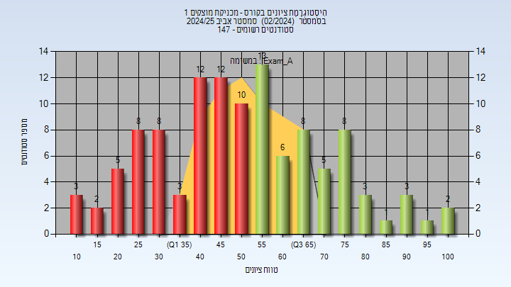

| סטודנטים | עברו/נכשלו | אחוז עוברים | ציון מינימלי | ציון מקסימלי | ממוצע | חציון |
| ---- | ---- | ---- | ---- | ---- | ---- | ---- |
| 113 | 50/63 | 44 | 10 | 100 | 52.425 | 51 |

<h3 id="202402-Final_A">סופי מועד א'</h3>

| סטודנטים | עברו/נכשלו | אחוז עוברים | ציון מינימלי | ציון מקסימלי | ממוצע | חציון |
| ---- | ---- | ---- | ---- | ---- | ---- | ---- |
| 113 | 58/55 | 51 | 11 | 100 | 54.726 | 57 |

<h3 id="202402-Exam_B">מבחן מועד ב'</h3>

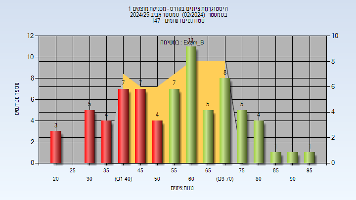

| סטודנטים | עברו/נכשלו | אחוז עוברים | ציון מינימלי | ציון מקסימלי | ממוצע | חציון |
| ---- | ---- | ---- | ---- | ---- | ---- | ---- |
| 73 | 43/30 | 59 | 23.9 | 95.5 | 57.937 | 59.1 |

<h3 id="202402-Final_B">סופי מועד ב'</h3>

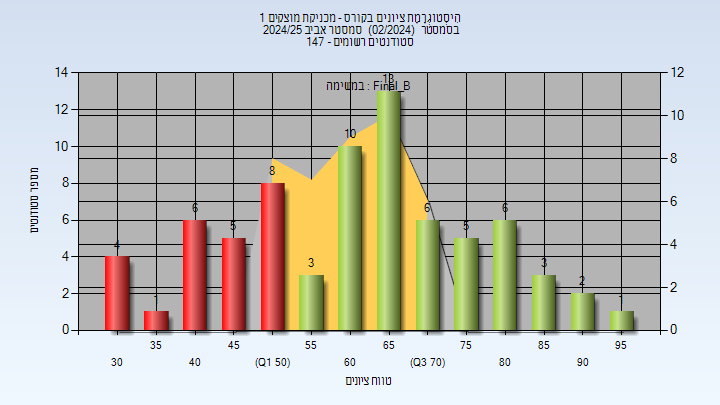

| סטודנטים | עברו/נכשלו | אחוז עוברים | ציון מינימלי | ציון מקסימלי | ממוצע | חציון |
| ---- | ---- | ---- | ---- | ---- | ---- | ---- |
| 73 | 49/24 | 67 | 31 | 97 | 62.507 | 64 |

<h2 id="202302">אביב 2024</h2>

| איש סגל | תפקיד |
| ---- | ---- |
| סולב קולנשר דנה | מרצה - אחראי מקצוע |
| בן הרוש אביאל | מתרגל - עם הרשאות מרצה אחראי |
| שומינוב מאור | מתרגל - עם הרשאות מרצה אחראי |
| אודס זוהר | מתרגל - עם הרשאות מרצה אחראי |
| הוכמן ארז | מתרגל - עם הרשאות מרצה אחראי |

<h3 id="202302-Exam_A">מבחן מועד א'</h3>

| סטודנטים | עברו/נכשלו | אחוז עוברים | ציון מינימלי | ציון מקסימלי | ממוצע | חציון |
| ---- | ---- | ---- | ---- | ---- | ---- | ---- |
| 94 | 56/38 | 60 | 17.25 | 93.15 | 58.759 | 57.5 |

<h3 id="202302-Final_A">סופי מועד א'</h3>

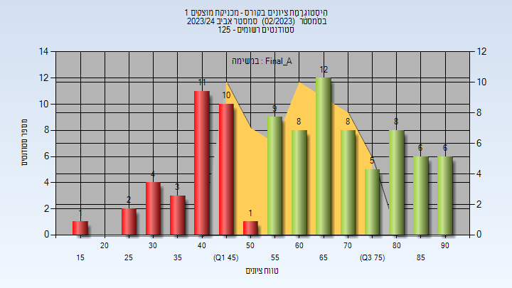

| סטודנטים | עברו/נכשלו | אחוז עוברים | ציון מינימלי | ציון מקסימלי | ממוצע | חציון |
| ---- | ---- | ---- | ---- | ---- | ---- | ---- |
| 94 | 62/32 | 66 | 18 | 94 | 61.16 | 62 |

<h3 id="202302-Exam_B">מבחן מועד ב'</h3>

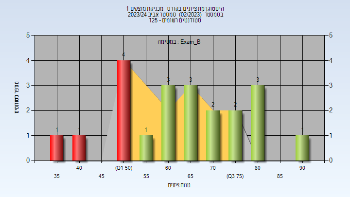

| סטודנטים | עברו/נכשלו | אחוז עוברים | ציון מינימלי | ציון מקסימלי | ממוצע | חציון |
| ---- | ---- | ---- | ---- | ---- | ---- | ---- |
| 21 | 15/6 | 71 | 36.5 | 90.476 | 65.084 | 65.313 |

<h3 id="202302-Final_B">סופי מועד ב'</h3>

| סטודנטים | עברו/נכשלו | אחוז עוברים | ציון מינימלי | ציון מקסימלי | ממוצע | חציון |
| ---- | ---- | ---- | ---- | ---- | ---- | ---- |
| 20 | 18/2 | 90 | 37 | 92 | 68.3 | 68 |

<h3 id="202302-Finals">סופי</h3>

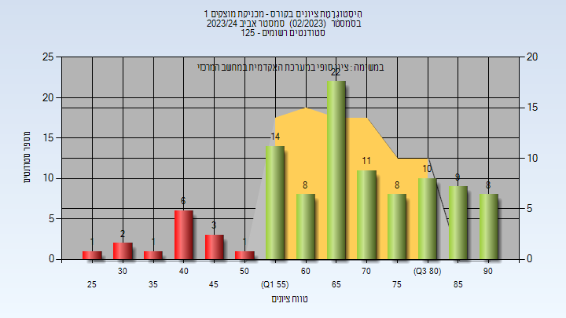

| סטודנטים | עברו/נכשלו | אחוז עוברים | ציון מינימלי | ציון מקסימלי | ממוצע | חציון |
| ---- | ---- | ---- | ---- | ---- | ---- | ---- |
| 106 | 92/14 | 87 | 28 | 94 | 67.856 | 67 |

<h2 id="202301">חורף 2023-2024</h2>

| איש סגל | תפקיד |
| ---- | ---- |
| פארן אילון | מרצה - אחראי מקצוע |

<h3 id="202301-Exam_A">מבחן מועד א'</h3>

| סטודנטים | עברו/נכשלו | אחוז עוברים | ציון מינימלי | ציון מקסימלי | ממוצע | חציון |
| ---- | ---- | ---- | ---- | ---- | ---- | ---- |
| 14 | 8/6 | 57 | 29 | 100 | 61.857 | 57 |

<h3 id="202301-Final_A">סופי מועד א'</h3>

| סטודנטים | עברו/נכשלו | אחוז עוברים | ציון מינימלי | ציון מקסימלי | ממוצע | חציון |
| ---- | ---- | ---- | ---- | ---- | ---- | ---- |
| 14 | 11/3 | 79 | 39 | 100 | 67.357 | 63 |

<h3 id="202301-Finals">סופי</h3>

| סטודנטים | עברו/נכשלו | אחוז עוברים | ציון מינימלי | ציון מקסימלי | ממוצע | חציון |
| ---- | ---- | ---- | ---- | ---- | ---- | ---- |
| 17 | 17/0 | 100 | 55 | 100 | 77.882 | 78 |

<h2 id="202202">אביב 2023</h2>

| איש סגל | תפקיד |
| ---- | ---- |
| סולב קולנשר דנה | מרצה - אחראי מקצוע |
| שומינוב מאור | מתרגל - עם הרשאות מרצה אחראי |
| שפירא דורין | מתרגל - עם הרשאות מרצה אחראי |
| בן הרוש אביאל | מתרגל - עם הרשאות מרצה אחראי |
| הוכמן ארז | מתרגל - עם הרשאות מרצה אחראי |

<h3 id="202202-Exam_A">מבחן מועד א'</h3>

| סטודנטים | עברו/נכשלו | אחוז עוברים | ציון מינימלי | ציון מקסימלי | ממוצע | חציון |
| ---- | ---- | ---- | ---- | ---- | ---- | ---- |
| 138 | 99/39 | 72 | 21.75 | 100 | 64.643 | 64.75 |

<h3 id="202202-Final_A">סופי מועד א'</h3>

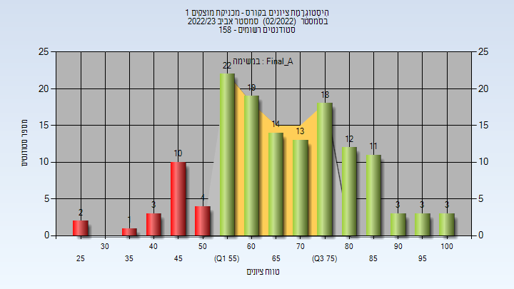

| סטודנטים | עברו/נכשלו | אחוז עוברים | ציון מינימלי | ציון מקסימלי | ממוצע | חציון |
| ---- | ---- | ---- | ---- | ---- | ---- | ---- |
| 138 | 118/20 | 86 | 29 | 100 | 68.007 | 68.5 |

<h3 id="202202-Exam_B">מבחן מועד ב'</h3>

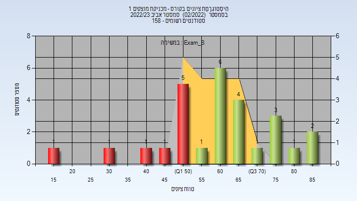

| סטודנטים | עברו/נכשלו | אחוז עוברים | ציון מינימלי | ציון מקסימלי | ממוצע | חציון |
| ---- | ---- | ---- | ---- | ---- | ---- | ---- |
| 27 | 18/9 | 67 | 15.5 | 85 | 60.778 | 61.5 |

<h3 id="202202-Final_B">סופי מועד ב'</h3>

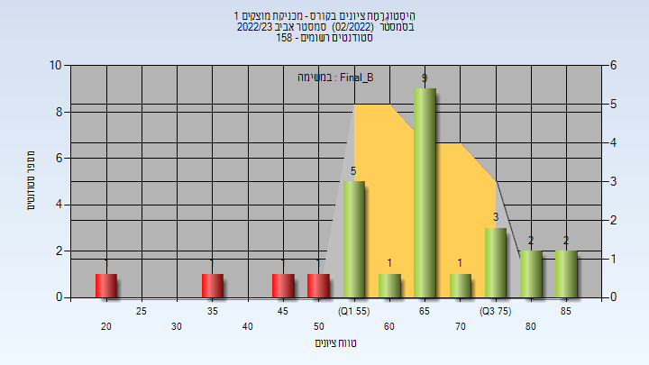

| סטודנטים | עברו/נכשלו | אחוז עוברים | ציון מינימלי | ציון מקסימלי | ממוצע | חציון |
| ---- | ---- | ---- | ---- | ---- | ---- | ---- |
| 27 | 23/4 | 85 | 24 | 87 | 64.593 | 65 |

<h3 id="202202-Finals">סופי</h3>

| סטודנטים | עברו/נכשלו | אחוז עוברים | ציון מינימלי | ציון מקסימלי | ממוצע | חציון |
| ---- | ---- | ---- | ---- | ---- | ---- | ---- |
| 146 | 140/6 | 96 | 24 | 100 | 75.242 | 77 |

<h2 id="202201">חורף 2022-2023</h2>

| איש סגל | תפקיד |
| ---- | ---- |
| פארן אילון | מרצה - אחראי מקצוע |
| ברונשטיין אמיל | מרצה |

<h3 id="202201-Exam_A">מבחן מועד א'</h3>

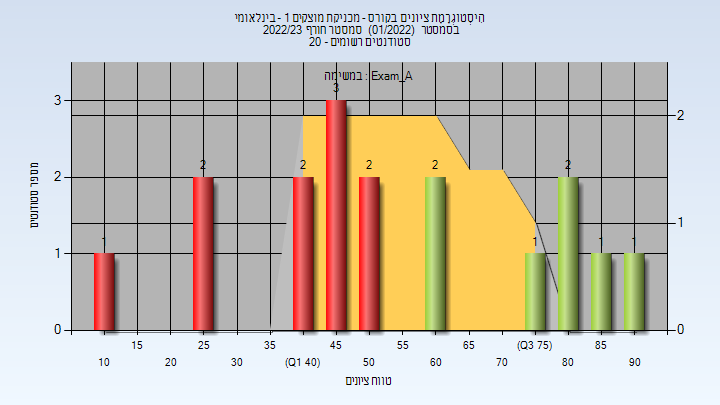

| סטודנטים | עברו/נכשלו | אחוז עוברים | ציון מינימלי | ציון מקסימלי | ממוצע | חציון |
| ---- | ---- | ---- | ---- | ---- | ---- | ---- |
| 17 | 7/10 | 41 | 10 | 93 | 55.118 | 51 |

<h3 id="202201-Final_A">סופי מועד א'</h3>

| סטודנטים | עברו/נכשלו | אחוז עוברים | ציון מינימלי | ציון מקסימלי | ממוצע | חציון |
| ---- | ---- | ---- | ---- | ---- | ---- | ---- |
| 17 | 9/8 | 53 | 21 | 94 | 60.118 | 56 |

<h3 id="202201-Finals">סופי</h3>

| סטודנטים | עברו/נכשלו | אחוז עוברים | ציון מינימלי | ציון מקסימלי | ממוצע | חציון |
| ---- | ---- | ---- | ---- | ---- | ---- | ---- |
| 18 | 13/5 | 72 | 17 | 94 | 62.167 | 66.5 |

<h2 id="202102">אביב 2022</h2>

| איש סגל | תפקיד |
| ---- | ---- |
| צליל שלי | מרצה - אחראי מקצוע |
| גזאל מג'די | מתרגל - עם הרשאות מרצה אחראי |
| געתון אדר | מתרגל - עם הרשאות מרצה אחראי |
| ניצן עידו | מתרגל - עם הרשאות מרצה אחראי |

<h3 id="202102-Exam_A">מבחן מועד א'</h3>

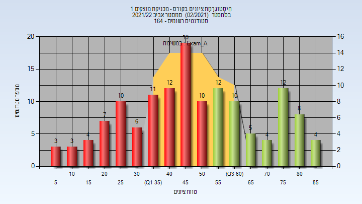

| סטודנטים | עברו/נכשלו | אחוז עוברים | ציון מינימלי | ציון מקסימלי | ממוצע | חציון |
| ---- | ---- | ---- | ---- | ---- | ---- | ---- |
| 140 | 55/85 | 39 | 6.05 | 89.65 | 49.801 | 48.4 |

<h3 id="202102-Final_A">סופי מועד א'</h3>

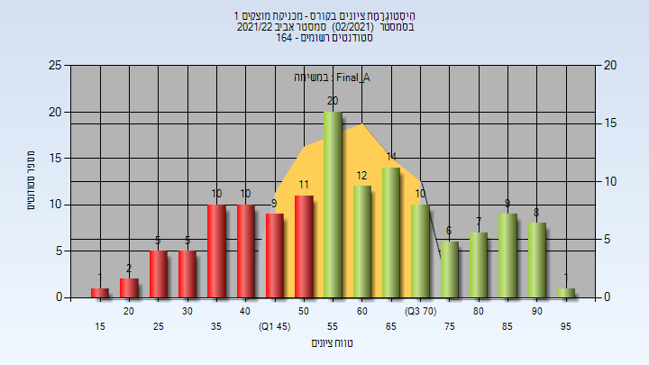

| סטודנטים | עברו/נכשלו | אחוז עוברים | ציון מינימלי | ציון מקסימלי | ממוצע | חציון |
| ---- | ---- | ---- | ---- | ---- | ---- | ---- |
| 140 | 87/53 | 62 | 15 | 96 | 59.621 | 59 |

<h3 id="202102-Exam_B">מבחן מועד ב'</h3>

| סטודנטים | עברו/נכשלו | אחוז עוברים | ציון מינימלי | ציון מקסימלי | ממוצע | חציון |
| ---- | ---- | ---- | ---- | ---- | ---- | ---- |
| 60 | 21/39 | 35 | 1.4 | 83.7 | 45.392 | 46 |

<h3 id="202102-Final_B">סופי מועד ב'</h3>

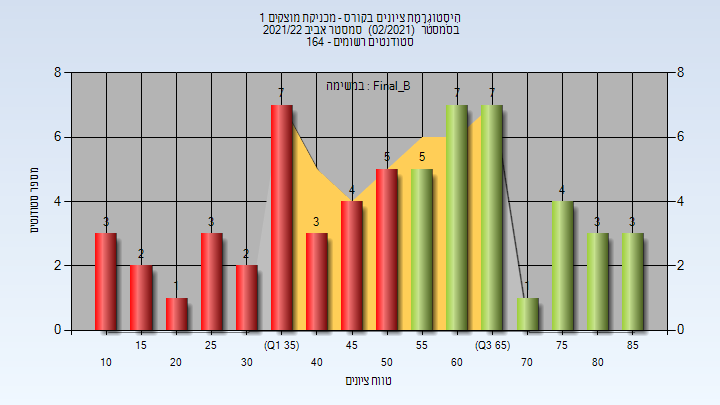

| סטודנטים | עברו/נכשלו | אחוז עוברים | ציון מינימלי | ציון מקסימלי | ממוצע | חציון |
| ---- | ---- | ---- | ---- | ---- | ---- | ---- |
| 60 | 30/30 | 50 | 10 | 86 | 52.6 | 54.5 |

<h3 id="202102-Finals">סופי</h3>

| סטודנטים | עברו/נכשלו | אחוז עוברים | ציון מינימלי | ציון מקסימלי | ממוצע | חציון |
| ---- | ---- | ---- | ---- | ---- | ---- | ---- |
| 153 | 112/41 | 73 | 10 | 100 | 62.163 | 63 |

<h2 id="202101">חורף 2021-2022</h2>

| איש סגל | תפקיד |
| ---- | ---- |
| פארן אילון | מרצה - אחראי מקצוע |
| שומינוב מאור | מרצה |

<h3 id="202101-Exam_A">מבחן מועד א'</h3>

| סטודנטים | עברו/נכשלו | אחוז עוברים | ציון מינימלי | ציון מקסימלי | ממוצע | חציון |
| ---- | ---- | ---- | ---- | ---- | ---- | ---- |
| 29 | 18/11 | 62 | 11 | 98 | 59.069 | 59 |

<h3 id="202101-Final_A">סופי מועד א'</h3>

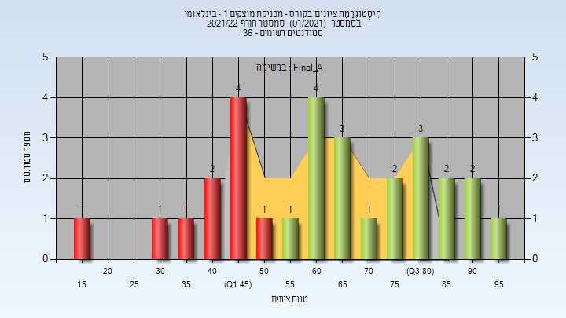

| סטודנטים | עברו/נכשלו | אחוז עוברים | ציון מינימלי | ציון מקסימלי | ממוצע | חציון |
| ---- | ---- | ---- | ---- | ---- | ---- | ---- |
| 29 | 19/10 | 66 | 19 | 98 | 63.276 | 64 |

<h3 id="202101-Exam_B">מבחן מועד ב'</h3>

| סטודנטים | עברו/נכשלו | אחוז עוברים | ציון מינימלי | ציון מקסימלי | ממוצע | חציון |
| ---- | ---- | ---- | ---- | ---- | ---- | ---- |
| 13 | 7/6 | 54 | 9 | 90 | 54.077 | 57 |

<h3 id="202101-Final_B">סופי מועד ב'</h3>

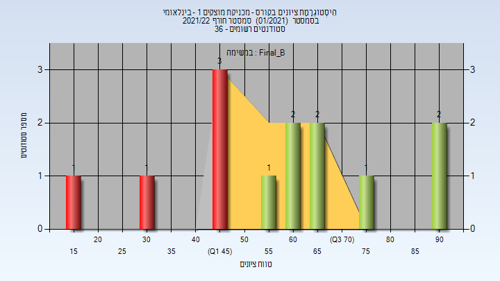

| סטודנטים | עברו/נכשלו | אחוז עוברים | ציון מינימלי | ציון מקסימלי | ממוצע | חציון |
| ---- | ---- | ---- | ---- | ---- | ---- | ---- |
| 13 | 8/5 | 62 | 17 | 92 | 58.308 | 61 |

<h3 id="202101-Finals">סופי</h3>

| סטודנטים | עברו/נכשלו | אחוז עוברים | ציון מינימלי | ציון מקסימלי | ממוצע | חציון |
| ---- | ---- | ---- | ---- | ---- | ---- | ---- |
| 35 | 29/6 | 83 | 17 | 98 | 66.514 | 65 |

<h2 id="202002">אביב 2021</h2>

| איש סגל | תפקיד |
| ---- | ---- |
| צליל שלי | מרצה - אחראי מקצוע |
| שומינוב מאור | מתרגל - עם הרשאות מרצה אחראי |
| ניצן עידו | מתרגל - עם הרשאות מרצה אחראי |
| ברונשטיין אמיל | מתרגל - עם הרשאות מרצה אחראי |

<h3 id="202002-Final_A">סופי מועד א'</h3>

| סטודנטים | עברו/נכשלו | אחוז עוברים | ציון מינימלי | ציון מקסימלי | ממוצע | חציון |
| ---- | ---- | ---- | ---- | ---- | ---- | ---- |
| 160 | 104/56 | 65 | 27 | 100 | 59.512 | 58 |

<h3 id="202002-Final_B">סופי מועד ב'</h3>

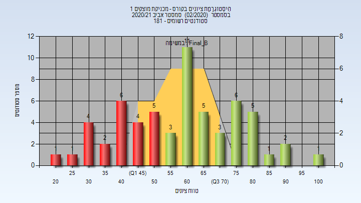

| סטודנטים | עברו/נכשלו | אחוז עוברים | ציון מינימלי | ציון מקסימלי | ממוצע | חציון |
| ---- | ---- | ---- | ---- | ---- | ---- | ---- |
| 60 | 37/23 | 62 | 24 | 100 | 60.2 | 61 |

<h3 id="202002-Finals">סופי</h3>

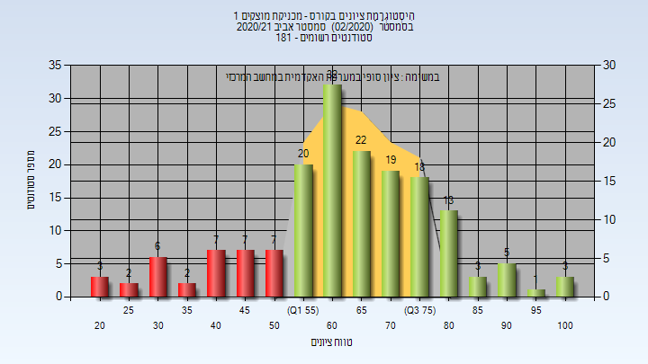

| סטודנטים | עברו/נכשלו | אחוז עוברים | ציון מינימלי | ציון מקסימלי | ממוצע | חציון |
| ---- | ---- | ---- | ---- | ---- | ---- | ---- |
| 170 | 136/34 | 80 | 23 | 100 | 64.188 | 64 |

<h2 id="202001">חורף 2020-2021</h2>

| איש סגל | תפקיד |
| ---- | ---- |
| פארן אילון | מרצה - אחראי מקצוע |
| ברונשטיין אמיל | מרצה |

<h3 id="202001-Exam_A">מבחן מועד א'</h3>

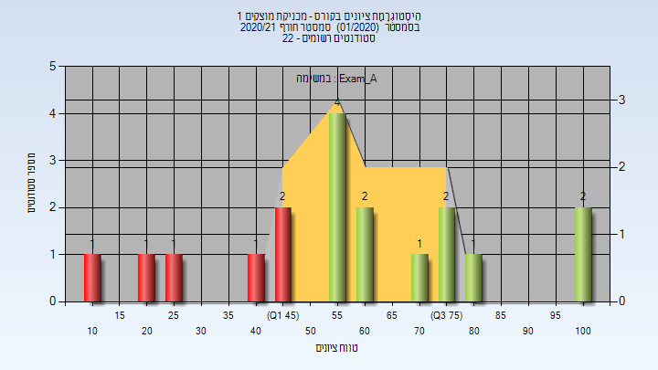

| סטודנטים | עברו/נכשלו | אחוז עוברים | ציון מינימלי | ציון מקסימלי | ממוצע | חציון |
| ---- | ---- | ---- | ---- | ---- | ---- | ---- |
| 18 | 12/6 | 67 | 14 | 100 | 59.389 | 59 |

<h3 id="202001-Final_A">סופי מועד א'</h3>

| סטודנטים | עברו/נכשלו | אחוז עוברים | ציון מינימלי | ציון מקסימלי | ממוצע | חציון |
| ---- | ---- | ---- | ---- | ---- | ---- | ---- |
| 18 | 12/6 | 67 | 23 | 100 | 63.667 | 63 |

<h3 id="202001-Exam_B">מבחן מועד ב'</h3>

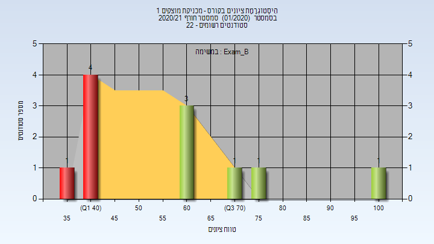

| סטודנטים | עברו/נכשלו | אחוז עוברים | ציון מינימלי | ציון מקסימלי | ממוצע | חציון |
| ---- | ---- | ---- | ---- | ---- | ---- | ---- |
| 11 | 6/5 | 55 | 39 | 100 | 58.364 | 43 |

<h3 id="202001-Final_B">סופי מועד ב'</h3>

| סטודנטים | עברו/נכשלו | אחוז עוברים | ציון מינימלי | ציון מקסימלי | ממוצע | חציון |
| ---- | ---- | ---- | ---- | ---- | ---- | ---- |
| 11 | 6/5 | 55 | 44 | 100 | 62.545 | 49 |

<h3 id="202001-Finals">סופי</h3>

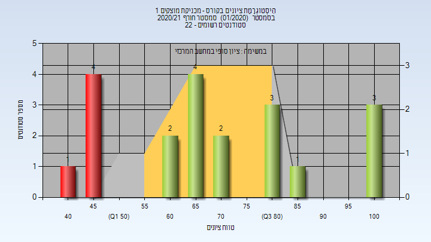

| סטודנטים | עברו/נכשלו | אחוז עוברים | ציון מינימלי | ציון מקסימלי | ממוצע | חציון |
| ---- | ---- | ---- | ---- | ---- | ---- | ---- |
| 20 | 15/5 | 75 | 44 | 100 | 70.05 | 68 |

<h2 id="201902">אביב 2020</h2>

| איש סגל | תפקיד |
| ---- | ---- |
| גבלי יוסף | מרצה - אחראי מקצוע |
| ברונשטיין אמיל | מתרגל - עם הרשאות מרצה אחראי |
| ניצן עידו | מתרגל - עם הרשאות מרצה אחראי |
| שומינוב מאור | מתרגל - עם הרשאות מרצה אחראי |
| גזאל מג'די | מתרגל - עם הרשאות מרצה אחראי |

<h3 id="201902-Exam_A">מבחן מועד א'</h3>

| סטודנטים | עברו/נכשלו | אחוז עוברים | ציון מינימלי | ציון מקסימלי | ממוצע | חציון |
| ---- | ---- | ---- | ---- | ---- | ---- | ---- |
| 106 | 64/42 | 60 | 25 | 100 | 62.623 | 60 |

<h3 id="201902-Final_A">סופי מועד א'</h3>

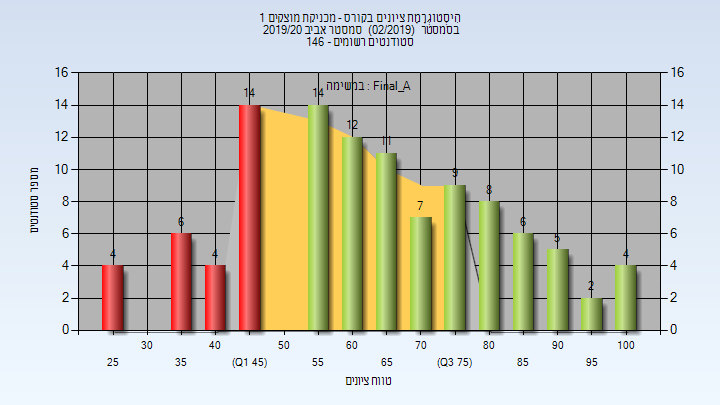

| סטודנטים | עברו/נכשלו | אחוז עוברים | ציון מינימלי | ציון מקסימלי | ממוצע | חציון |
| ---- | ---- | ---- | ---- | ---- | ---- | ---- |
| 106 | 78/28 | 74 | 25 | 100 | 64.774 | 63.5 |

<h3 id="201902-Exam_B">מבחן מועד ב'</h3>

| סטודנטים | עברו/נכשלו | אחוז עוברים | ציון מינימלי | ציון מקסימלי | ממוצע | חציון |
| ---- | ---- | ---- | ---- | ---- | ---- | ---- |
| 58 | 33/25 | 57 | 14.6 | 95 | 60.055 | 62.6 |

<h3 id="201902-Final_B">סופי מועד ב'</h3>

| סטודנטים | עברו/נכשלו | אחוז עוברים | ציון מינימלי | ציון מקסימלי | ממוצע | חציון |
| ---- | ---- | ---- | ---- | ---- | ---- | ---- |
| 58 | 40/18 | 69 | 15 | 95 | 62.121 | 64.5 |

<h3 id="201902-Finals">סופי</h3>

| סטודנטים | עברו/נכשלו | אחוז עוברים | ציון מינימלי | ציון מקסימלי | ממוצע | חציון |
| ---- | ---- | ---- | ---- | ---- | ---- | ---- |
| 135 | 115/20 | 85 | 15 | 100 | 68.585 | 68 |

<h2 id="201901">חורף 2019-2020</h2>

| איש סגל | תפקיד |
| ---- | ---- |
| פארן אילון | מרצה - אחראי מקצוע |
| דאנה אסף | מרצה |

<h2 id="201802">אביב 2019</h2>

| איש סגל | תפקיד |
| ---- | ---- |
| גבלי יוסף | מרצה - אחראי מקצוע |
| צליל שלי | מרצה |
| כץ שמואל | מתרגל - עם הרשאות מרצה אחראי |
| גזאל מג'די | מתרגל - עם הרשאות מרצה אחראי |
| חן שגיא | מתרגל - עם הרשאות מרצה אחראי |
| ניצן עידו | מתרגל - עם הרשאות מרצה אחראי |

<h3 id="201802-Exam_A">מבחן מועד א'</h3>

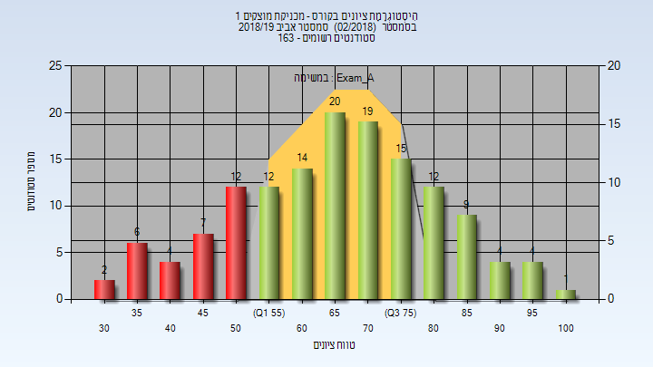

| סטודנטים | עברו/נכשלו | אחוז עוברים | ציון מינימלי | ציון מקסימלי | ממוצע | חציון |
| ---- | ---- | ---- | ---- | ---- | ---- | ---- |
| 141 | 110/31 | 78 | 33 | 100 | 66.681 | 67 |

<h3 id="201802-Final_A">סופי מועד א'</h3>

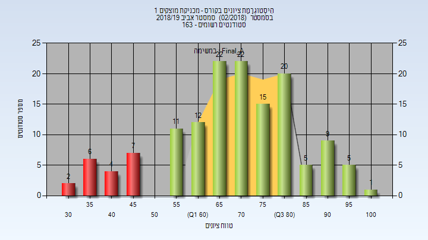

| סטודנטים | עברו/נכשלו | אחוז עוברים | ציון מינימלי | ציון מקסימלי | ממוצע | חציון |
| ---- | ---- | ---- | ---- | ---- | ---- | ---- |
| 141 | 122/19 | 87 | 33 | 100 | 69.809 | 71 |

<h3 id="201802-Exam_B">מבחן מועד ב'</h3>

| סטודנטים | עברו/נכשלו | אחוז עוברים | ציון מינימלי | ציון מקסימלי | ממוצע | חציון |
| ---- | ---- | ---- | ---- | ---- | ---- | ---- |
| 41 | 26/15 | 63 | 35 | 96 | 65.293 | 65 |

<h3 id="201802-Final_B">סופי מועד ב'</h3>

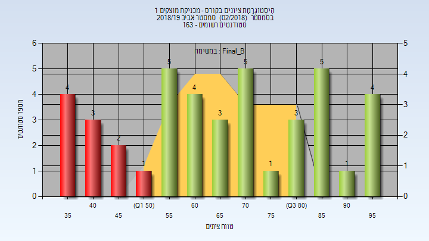

| סטודנטים | עברו/נכשלו | אחוז עוברים | ציון מינימלי | ציון מקסימלי | ממוצע | חציון |
| ---- | ---- | ---- | ---- | ---- | ---- | ---- |
| 41 | 31/10 | 76 | 35 | 97 | 67.366 | 66 |

<h3 id="201802-Finals">סופי</h3>

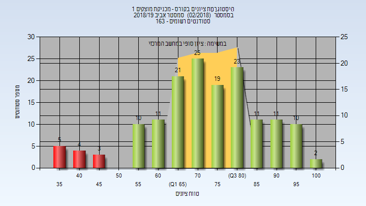

| סטודנטים | עברו/נכשלו | אחוז עוברים | ציון מינימלי | ציון מקסימלי | ממוצע | חציון |
| ---- | ---- | ---- | ---- | ---- | ---- | ---- |
| 155 | 143/12 | 92 | 35 | 100 | 73.723 | 74 |

<h2 id="201801">חורף 2018-2019</h2>

| איש סגל | תפקיד |
| ---- | ---- |
| פארן אילון | מרצה - אחראי מקצוע |
| נוף אלירם | מרצה |

<h3 id="201801-Final_A">סופי מועד א'</h3>

| סטודנטים | עברו/נכשלו | אחוז עוברים | ציון מינימלי | ציון מקסימלי | ממוצע | חציון |
| ---- | ---- | ---- | ---- | ---- | ---- | ---- |
| 32 | 25/7 | 78 | 0 | 100 | 67.719 | 69.5 |

<h3 id="201801-Final_B">סופי מועד ב'</h3>

| סטודנטים | עברו/נכשלו | אחוז עוברים | ציון מינימלי | ציון מקסימלי | ממוצע | חציון |
| ---- | ---- | ---- | ---- | ---- | ---- | ---- |
| 11 | 11/0 | 100 | 55 | 100 | 72 | 67 |

<h3 id="201801-Finals">סופי</h3>

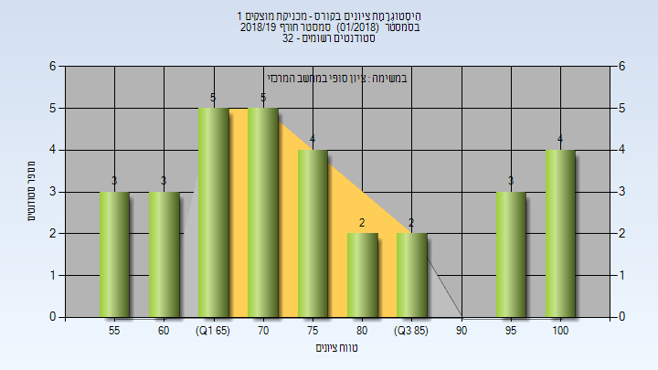

| סטודנטים | עברו/נכשלו | אחוז עוברים | ציון מינימלי | ציון מקסימלי | ממוצע | חציון |
| ---- | ---- | ---- | ---- | ---- | ---- | ---- |
| 31 | 31/0 | 100 | 55 | 100 | 76.774 | 71 |

<h2 id="201702">אביב 2018</h2>

| איש סגל | תפקיד |
| ---- | ---- |
| גבלי יוסף | מרצה - אחראי מקצוע |
| ניצן עידו | מתרגל - עם הרשאות מרצה אחראי |
| ברונשטיין אמיל | מתרגל - עם הרשאות מרצה אחראי |
| חן שגיא | מתרגל - עם הרשאות מרצה אחראי |
| כץ שמואל | מתרגל - עם הרשאות מרצה אחראי |
| גזאל מג'די | מתרגל - עם הרשאות מרצה אחראי |

<h3 id="201702-Exam_A">מבחן מועד א'</h3>

| סטודנטים | עברו/נכשלו | אחוז עוברים | ציון מינימלי | ציון מקסימלי | ממוצע | חציון |
| ---- | ---- | ---- | ---- | ---- | ---- | ---- |
| 141 | 98/43 | 70 | 32 | 100 | 63.773 | 65 |

<h3 id="201702-Final_A">סופי מועד א'</h3>

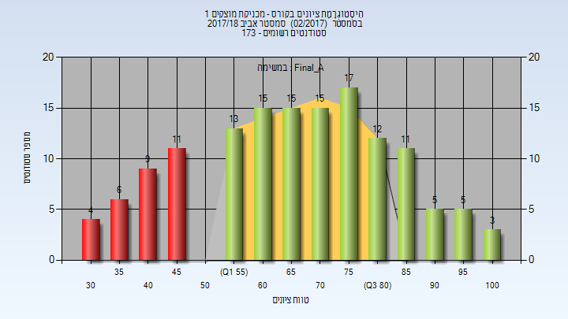

| סטודנטים | עברו/נכשלו | אחוז עוברים | ציון מינימלי | ציון מקסימלי | ממוצע | חציון |
| ---- | ---- | ---- | ---- | ---- | ---- | ---- |
| 141 | 111/30 | 79 | 32 | 100 | 67.156 | 69 |

<h3 id="201702-Exam_B">מבחן מועד ב'</h3>

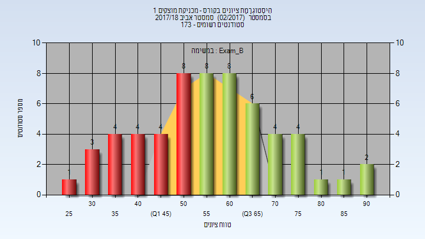

| סטודנטים | עברו/נכשלו | אחוז עוברים | ציון מינימלי | ציון מקסימלי | ממוצע | חציון |
| ---- | ---- | ---- | ---- | ---- | ---- | ---- |
| 58 | 34/24 | 59 | 27 | 90 | 57.621 | 58 |

<h3 id="201702-Final_B">סופי מועד ב'</h3>

| סטודנטים | עברו/נכשלו | אחוז עוברים | ציון מינימלי | ציון מקסימלי | ממוצע | חציון |
| ---- | ---- | ---- | ---- | ---- | ---- | ---- |
| 58 | 42/16 | 72 | 27 | 91 | 60.517 | 63 |

<h3 id="201702-Finals">סופי</h3>

| סטודנטים | עברו/נכשלו | אחוז עוברים | ציון מינימלי | ציון מקסימלי | ממוצע | חציון |
| ---- | ---- | ---- | ---- | ---- | ---- | ---- |
| 164 | 144/20 | 88 | 27 | 100 | 69.598 | 71 |

<h2 id="201701">חורף 2017-2018</h2>

| איש סגל | תפקיד |
| ---- | ---- |
| צליל שלי | מרצה - אחראי מקצוע |
| חן שגיא | מתרגל - עם הרשאות מרצה אחראי |

<h3 id="201701-Exam_A">מבחן מועד א'</h3>

| סטודנטים | עברו/נכשלו | אחוז עוברים | ציון מינימלי | ציון מקסימלי | ממוצע | חציון |
| ---- | ---- | ---- | ---- | ---- | ---- | ---- |
| 30 | 25/5 | 83 | 43 | 83 | 61.767 | 60 |

<h3 id="201701-Final_A">סופי מועד א'</h3>

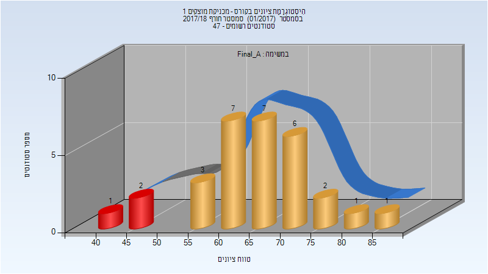

| סטודנטים | עברו/נכשלו | אחוז עוברים | ציון מינימלי | ציון מקסימלי | ממוצע | חציון |
| ---- | ---- | ---- | ---- | ---- | ---- | ---- |
| 30 | 27/3 | 90 | 43 | 85 | 65.9 | 67.5 |

<h3 id="201701-Exam_B">מבחן מועד ב'</h3>

| סטודנטים | עברו/נכשלו | אחוז עוברים | ציון מינימלי | ציון מקסימלי | ממוצע | חציון |
| ---- | ---- | ---- | ---- | ---- | ---- | ---- |
| 27 | 16/11 | 59 | 38 | 100 | 64.148 | 64 |

<h3 id="201701-Final_B">סופי מועד ב'</h3>

| סטודנטים | עברו/נכשלו | אחוז עוברים | ציון מינימלי | ציון מקסימלי | ממוצע | חציון |
| ---- | ---- | ---- | ---- | ---- | ---- | ---- |
| 27 | 18/9 | 67 | 38 | 99 | 66.333 | 68 |

<h3 id="201701-Finals">סופי</h3>

| סטודנטים | עברו/נכשלו | אחוז עוברים | ציון מינימלי | ציון מקסימלי | ממוצע | חציון |
| ---- | ---- | ---- | ---- | ---- | ---- | ---- |
| 44 | 35/9 | 80 | 38 | 99 | 67.659 | 69 |

<h2 id="201602">אביב 2017</h2>

| איש סגל | תפקיד |
| ---- | ---- |
| גבלי יוסף | מרצה - אחראי מקצוע |
| כץ שמואל | מתרגל - עם הרשאות מרצה אחראי |
| חן שגיא | מתרגל - עם הרשאות מרצה אחראי |
| ברונשטיין אמיל | מתרגל - עם הרשאות מרצה אחראי |
| ראוף קורבי | מתרגל - עם הרשאות מרצה אחראי |

<h3 id="201602-Exam_A">מבחן מועד א'</h3>

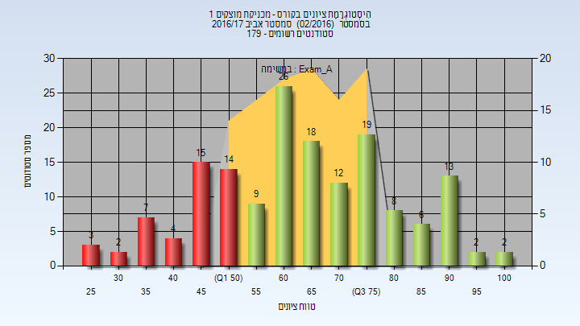

| סטודנטים | עברו/נכשלו | אחוז עוברים | ציון מינימלי | ציון מקסימלי | ממוצע | חציון |
| ---- | ---- | ---- | ---- | ---- | ---- | ---- |
| 160 | 115/45 | 72 | 27 | 100 | 64.994 | 64.5 |

<h3 id="201602-Final_A">סופי מועד א'</h3>

| סטודנטים | עברו/נכשלו | אחוז עוברים | ציון מינימלי | ציון מקסימלי | ממוצע | חציון |
| ---- | ---- | ---- | ---- | ---- | ---- | ---- |
| 160 | 128/32 | 80 | 27 | 100 | 68.012 | 69.5 |

<h3 id="201602-Exam_B">מבחן מועד ב'</h3>

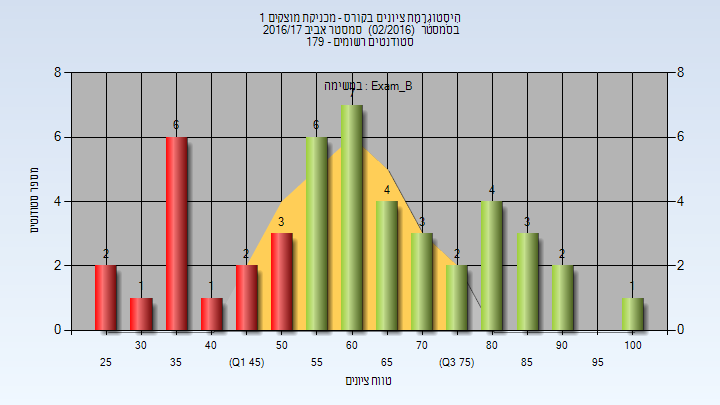

| סטודנטים | עברו/נכשלו | אחוז עוברים | ציון מינימלי | ציון מקסימלי | ממוצע | חציון |
| ---- | ---- | ---- | ---- | ---- | ---- | ---- |
| 47 | 32/15 | 68 | 26 | 100 | 61.043 | 61 |

<h3 id="201602-Final_B">סופי מועד ב'</h3>

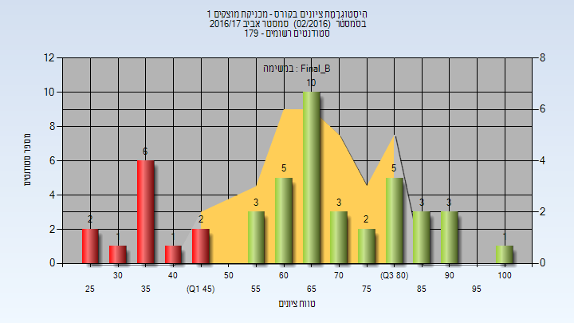

| סטודנטים | עברו/נכשלו | אחוז עוברים | ציון מינימלי | ציון מקסימלי | ממוצע | חציון |
| ---- | ---- | ---- | ---- | ---- | ---- | ---- |
| 47 | 35/12 | 74 | 26 | 100 | 63.638 | 65 |

<h3 id="201602-Finals">סופי</h3>

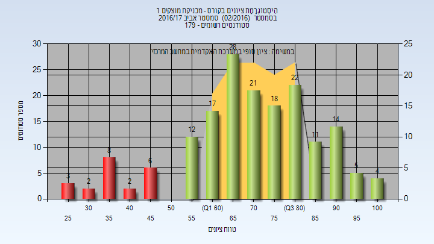

| סטודנטים | עברו/נכשלו | אחוז עוברים | ציון מינימלי | ציון מקסימלי | ממוצע | חציון |
| ---- | ---- | ---- | ---- | ---- | ---- | ---- |
| 173 | 152/21 | 88 | 26 | 100 | 70.734 | 72 |

<h2 id="201601">חורף 2016-2017</h2>

| איש סגל | תפקיד |
| ---- | ---- |
| צליל שלי | מרצה - אחראי מקצוע |
| חן שגיא | מתרגל - עם הרשאות מרצה אחראי |

<h3 id="201601-Exam_A">מבחן מועד א'</h3>

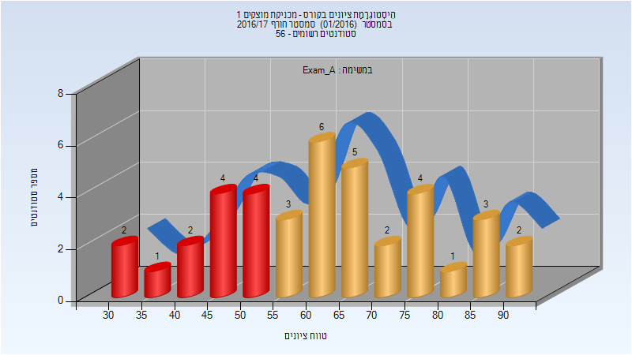

| סטודנטים | עברו/נכשלו | אחוז עוברים | ציון מינימלי | ציון מקסימלי | ממוצע | חציון |
| ---- | ---- | ---- | ---- | ---- | ---- | ---- |
| 39 | 26/13 | 67 | 30 | 91 | 62.487 | 62 |

<h3 id="201601-Final_A">סופי מועד א'</h3>

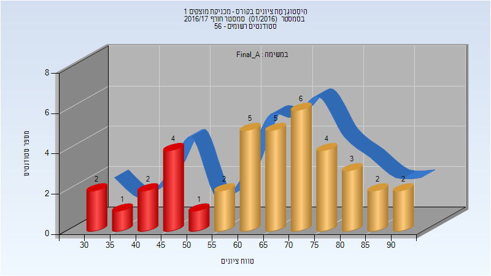

| סטודנטים | עברו/נכשלו | אחוז עוברים | ציון מינימלי | ציון מקסימלי | ממוצע | חציון |
| ---- | ---- | ---- | ---- | ---- | ---- | ---- |
| 39 | 29/10 | 74 | 30 | 91.9 | 65.062 | 65.8 |

<h3 id="201601-Exam_B">מבחן מועד ב'</h3>

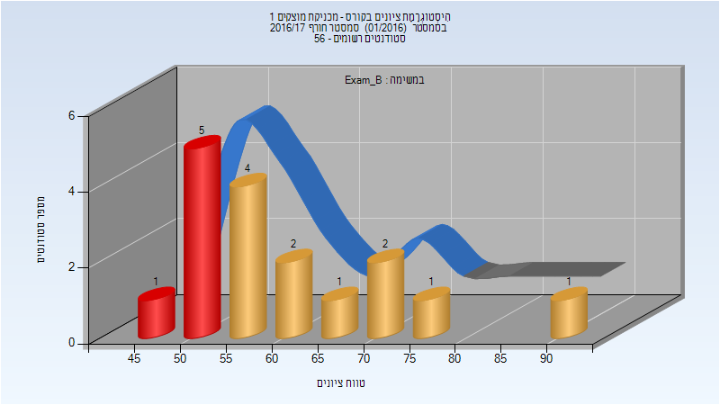

| סטודנטים | עברו/נכשלו | אחוז עוברים | ציון מינימלי | ציון מקסימלי | ממוצע | חציון |
| ---- | ---- | ---- | ---- | ---- | ---- | ---- |
| 17 | 11/6 | 65 | 46 | 90 | 61.235 | 58 |

<h3 id="201601-Final_B">סופי מועד ב'</h3>

| סטודנטים | עברו/נכשלו | אחוז עוברים | ציון מינימלי | ציון מקסימלי | ממוצע | חציון |
| ---- | ---- | ---- | ---- | ---- | ---- | ---- |
| 17 | 16/1 | 94 | 46 | 91 | 64.524 | 62.2 |

<h3 id="201601-Finals">סופי</h3>

| סטודנטים | עברו/נכשלו | אחוז עוברים | ציון מינימלי | ציון מקסימלי | ממוצע | חציון |
| ---- | ---- | ---- | ---- | ---- | ---- | ---- |
| 45 | 42/3 | 93 | 30 | 92 | 68.289 | 67 |

<h2 id="201502">אביב 2016</h2>

| איש סגל | תפקיד |
| ---- | ---- |
| גבלי יוסף | מרצה - אחראי מקצוע |
| פישר אריאל | מתרגל - עם הרשאות מרצה אחראי |

<h3 id="201502-Exam_A">מבחן מועד א'</h3>

| סטודנטים | עברו/נכשלו | אחוז עוברים | ציון מינימלי | ציון מקסימלי | ממוצע | חציון |
| ---- | ---- | ---- | ---- | ---- | ---- | ---- |
| 135 | 98/37 | 73 | 26 | 98 | 64.563 | 67 |

<h3 id="201502-Final_A">סופי מועד א'</h3>

| סטודנטים | עברו/נכשלו | אחוז עוברים | ציון מינימלי | ציון מקסימלי | ממוצע | חציון |
| ---- | ---- | ---- | ---- | ---- | ---- | ---- |
| 135 | 108/27 | 80 | 26 | 99 | 66.993 | 70 |

<h3 id="201502-Exam_B">מבחן מועד ב'</h3>

| סטודנטים | עברו/נכשלו | אחוז עוברים | ציון מינימלי | ציון מקסימלי | ממוצע | חציון |
| ---- | ---- | ---- | ---- | ---- | ---- | ---- |
| 51 | 28/23 | 55 | 29 | 100 | 55.706 | 55 |

<h3 id="201502-Final_B">סופי מועד ב'</h3>

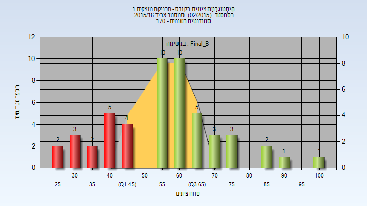

| סטודנטים | עברו/נכשלו | אחוז עוברים | ציון מינימלי | ציון מקסימלי | ממוצע | חציון |
| ---- | ---- | ---- | ---- | ---- | ---- | ---- |
| 51 | 35/16 | 69 | 29 | 100 | 58.373 | 59 |

<h3 id="201502-Finals">סופי</h3>

| סטודנטים | עברו/נכשלו | אחוז עוברים | ציון מינימלי | ציון מקסימלי | ממוצע | חציון |
| ---- | ---- | ---- | ---- | ---- | ---- | ---- |
| 154 | 134/20 | 87 | 26 | 100 | 69.396 | 72 |

<h2 id="201501">חורף 2015-2016</h2>

| איש סגל | תפקיד |
| ---- | ---- |
| מרדכי דן | מרצה - אחראי מקצוע |

<h3 id="201501-Final_A">סופי מועד א'</h3>

| סטודנטים | עברו/נכשלו | אחוז עוברים | ציון מינימלי | ציון מקסימלי | ממוצע | חציון |
| ---- | ---- | ---- | ---- | ---- | ---- | ---- |
| 52 | 41/11 | 79 | 25 | 100 | 67.192 | 66.5 |

<h3 id="201501-Final_B">סופי מועד ב'</h3>

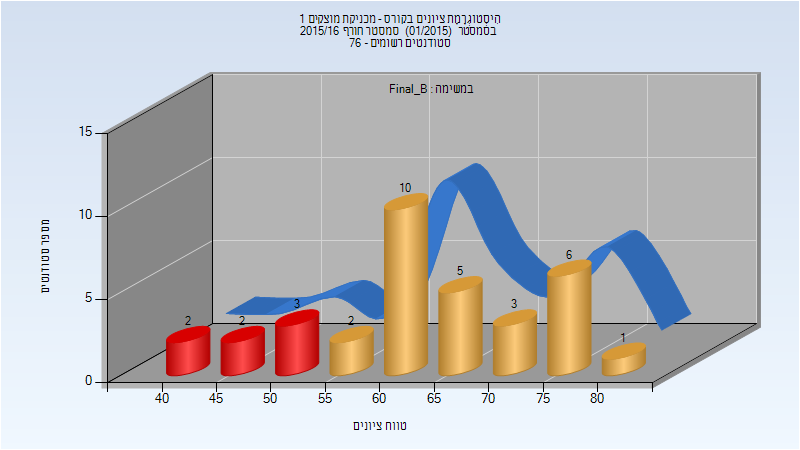

| סטודנטים | עברו/נכשלו | אחוז עוברים | ציון מינימלי | ציון מקסימלי | ממוצע | חציון |
| ---- | ---- | ---- | ---- | ---- | ---- | ---- |
| 34 | 27/7 | 79 | 43 | 80 | 63.088 | 64 |

<h3 id="201501-Finals">סופי</h3>

| סטודנטים | עברו/נכשלו | אחוז עוברים | ציון מינימלי | ציון מקסימלי | ממוצע | חציון |
| ---- | ---- | ---- | ---- | ---- | ---- | ---- |
| 65 | 55/10 | 85 | 25 | 100 | 68.231 | 67 |

<h2 id="201402">אביב 2015</h2>

| איש סגל | תפקיד |
| ---- | ---- |
| גבלי יוסף | מרצה - אחראי מקצוע |

<h3 id="201402-Final_A">סופי מועד א'</h3>

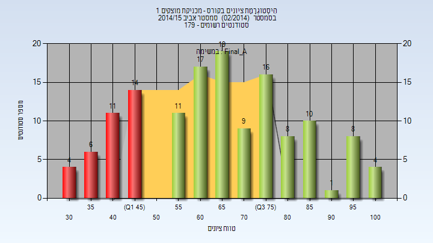

| סטודנטים | עברו/נכשלו | אחוז עוברים | ציון מינימלי | ציון מקסימלי | ממוצע | חציון |
| ---- | ---- | ---- | ---- | ---- | ---- | ---- |
| 138 | 103/35 | 75 | 31 | 100 | 65.884 | 67 |

<h3 id="201402-Final_B">סופי מועד ב'</h3>

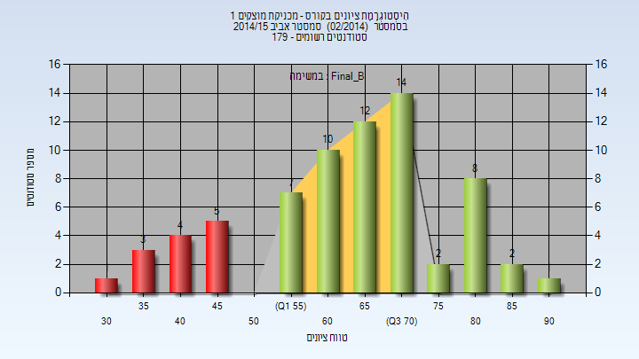

| סטודנטים | עברו/נכשלו | אחוז עוברים | ציון מינימלי | ציון מקסימלי | ממוצע | חציון |
| ---- | ---- | ---- | ---- | ---- | ---- | ---- |
| 69 | 56/13 | 81 | 33 | 91 | 64.493 | 65 |

<h3 id="201402-Finals">סופי</h3>

| סטודנטים | עברו/נכשלו | אחוז עוברים | ציון מינימלי | ציון מקסימלי | ממוצע | חציון |
| ---- | ---- | ---- | ---- | ---- | ---- | ---- |
| 164 | 146/18 | 89 | 33 | 100 | 69.5 | 69 |

<h2 id="201401">חורף 2014-2015</h2>

| איש סגל | תפקיד |
| ---- | ---- |
| גבלי יוסף | מרצה - אחראי מקצוע |

<h3 id="201401-Finals">סופי</h3>

| סטודנטים | עברו/נכשלו | אחוז עוברים | ציון מינימלי | ציון מקסימלי | ממוצע | חציון |
| ---- | ---- | ---- | ---- | ---- | ---- | ---- |
| 38 | 37/1 | 97 | 41 | 94 | 70.132 | 68.5 |

<h2 id="201302">אביב 2014</h2>

| איש סגל | תפקיד |
| ---- | ---- |
| מרדכי דן | מרצה - אחראי מקצוע |
| פישר אריאל | מתרגל |

<h3 id="201302-Final_A">סופי מועד א'</h3>

| סטודנטים | עברו/נכשלו | אחוז עוברים | ציון מינימלי | ציון מקסימלי | ממוצע | חציון |
| ---- | ---- | ---- | ---- | ---- | ---- | ---- |
| 153 | 120/33 | 78 | 3 | 100 | 65.745 | 65 |

<h3 id="201302-Final_B">סופי מועד ב'</h3>

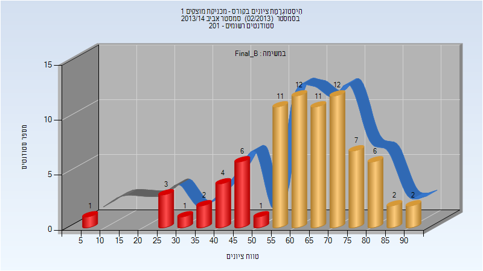

| סטודנטים | עברו/נכשלו | אחוז עוברים | ציון מינימלי | ציון מקסימלי | ממוצע | חציון |
| ---- | ---- | ---- | ---- | ---- | ---- | ---- |
| 81 | 63/18 | 78 | 5 | 92 | 62.296 | 64 |

<h2 id="201301">חורף 2013-2014</h2>

| איש סגל | תפקיד |
| ---- | ---- |
| מרדכי דן | מרצה - אחראי מקצוע |
| פישר אריאל | מתרגל |

<h3 id="201301-Final_A">סופי מועד א'</h3>

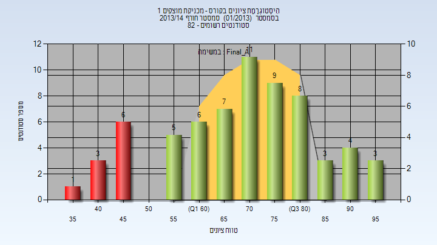

| סטודנטים | עברו/נכשלו | אחוז עוברים | ציון מינימלי | ציון מקסימלי | ממוצע | חציון |
| ---- | ---- | ---- | ---- | ---- | ---- | ---- |
| 66 | 56/10 | 85 | 39 | 98 | 70.197 | 73 |

<h3 id="201301-Final_B">סופי מועד ב'</h3>

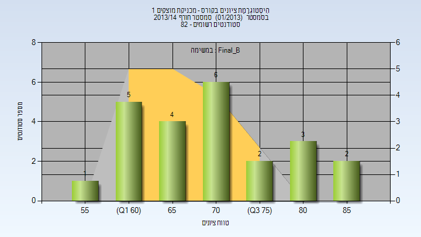

| סטודנטים | עברו/נכשלו | אחוז עוברים | ציון מינימלי | ציון מקסימלי | ממוצע | חציון |
| ---- | ---- | ---- | ---- | ---- | ---- | ---- |
| 23 | 23/0 | 100 | 59 | 86 | 71.217 | 70 |

<h2 id="201102">אביב 2012</h2>

| איש סגל | תפקיד |
| ---- | ---- |
| גבלי יוסף | מרצה - אחראי מקצוע |

<h3 id="201102-Exam_A">מבחן מועד א'</h3>

| סטודנטים | עברו/נכשלו | אחוז עוברים | ציון מינימלי | ציון מקסימלי | ממוצע | חציון |
| ---- | ---- | ---- | ---- | ---- | ---- | ---- |
| 134 | 99/35 | 74 | 23 | 100 | 64.716 | 63 |

<h3 id="201102-Final_A">סופי מועד א'</h3>

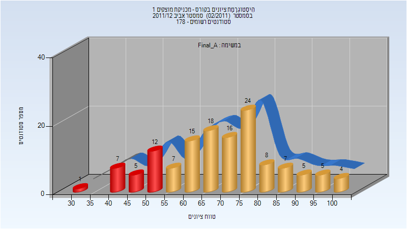

| סטודנטים | עברו/נכשלו | אחוז עוברים | ציון מינימלי | ציון מקסימלי | ממוצע | חציון |
| ---- | ---- | ---- | ---- | ---- | ---- | ---- |
| 134 | 109/25 | 81 | 30 | 100 | 69.776 | 70.5 |

