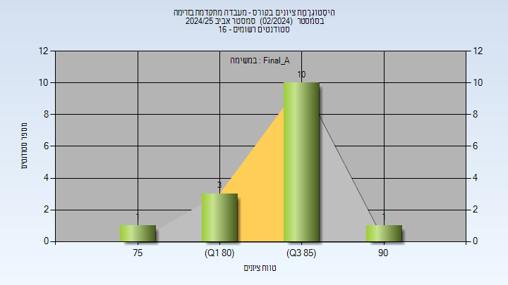
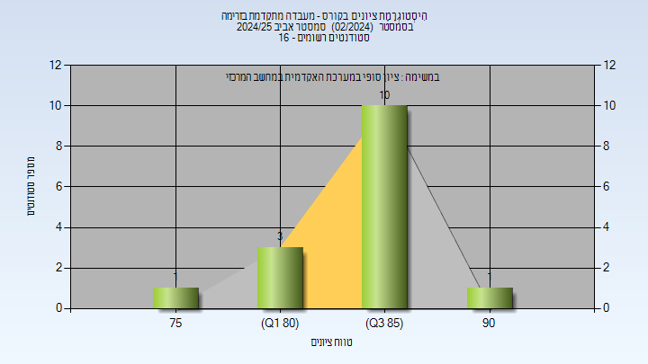

# 00340047 - מעבדה מתקדמת בזרימה

**הערה**: מאגר ההיסטוגרמות הוקם עבור [CheeseFork](https://cheesefork.cf/), כלי בניית מערכת שעות עבור סטודנטים בטכניון. באתר בו אתם גולשים ניתן לעיין בהיסטוגרמות, אך הדרך היותר נוחה היא לעיין בהיסטוגרמות, ובמידע נוסף כגון חוות דעת של סטודנטים, באתר CheeseFork.

* [אביב 2025](#202402)
  * [סופי מועד א'](#202402-Final_A)
  * [סופי](#202402-Finals)
* [אביב 2023](#202202)
* [אביב 2020](#201902)

<h2 id="202402">אביב 2025</h2>

| איש סגל | תפקיד |
| ---- | ---- |
| ואן האוט רנה | מרצה |
| גרינבלט דוד | מרצה |
| רם עומרי | מרצה |
| קוזמנקו קונסטנטין | מתרגל |
| ג'וסה ג'יבו טום | סגל מנהלי - עם הרשאות מרצה אחראי |

<h3 id="202402-Final_A">סופי מועד א'</h3>

| סטודנטים | עברו/נכשלו | אחוז עוברים | ציון מינימלי | ציון מקסימלי | ממוצע | חציון |
| ---- | ---- | ---- | ---- | ---- | ---- | ---- |
| 15 | 15/0 | 100 | 75 | 90 | 85.4 | 86 |

<h3 id="202402-Finals">סופי</h3>

| סטודנטים | עברו/נכשלו | אחוז עוברים | ציון מינימלי | ציון מקסימלי | ממוצע | חציון |
| ---- | ---- | ---- | ---- | ---- | ---- | ---- |
| 15 | 15/0 | 100 | 75 | 90 | 85.4 | 86 |

<h2 id="202202">אביב 2023</h2>

| איש סגל | תפקיד |
| ---- | ---- |
| גרינבלט דוד | מרצה - אחראי מקצוע |

<h2 id="201902">אביב 2020</h2>

| איש סגל | תפקיד |
| ---- | ---- |
| גרינבלט דוד | מרצה - אחראי מקצוע |
| גרזוזי ענאן |  |

