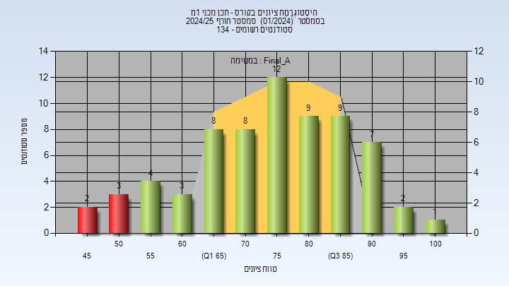

# 00340054 - תכן מכני 1מ

**הערה**: מאגר ההיסטוגרמות הוקם עבור [CheeseFork](https://cheesefork.cf/), כלי בניית מערכת שעות עבור סטודנטים בטכניון. באתר בו אתם גולשים ניתן לעיין בהיסטוגרמות, אך הדרך היותר נוחה היא לעיין בהיסטוגרמות, ובמידע נוסף כגון חוות דעת של סטודנטים, באתר CheeseFork.

* [חורף 2024-2025](#202401)
  * [סופי מועד א'](#202401-Final_A)
* [חורף 2023-2024](#202301)
  * [סופי מועד א'](#202301-Final_A)
  * [סופי מועד ב'](#202301-Final_B)
  * [סופי](#202301-Finals)

<h2 id="202401">חורף 2024-2025</h2>

| איש סגל | תפקיד |
| ---- | ---- |
| זריהן נועם | מרצה - אחראי מקצוע |
| בן חיים עמרי | מתרגל |
| שומינוב מאור | מתרגל |
| חנינה נועה | מתרגל |
| לנצר יעקב | מתרגל |

<h3 id="202401-Final_A">סופי מועד א'</h3>

| סטודנטים | עברו/נכשלו | אחוז עוברים | ציון מינימלי | ציון מקסימלי | ממוצע | חציון |
| ---- | ---- | ---- | ---- | ---- | ---- | ---- |
| 68 | 63/5 | 93 | 46 | 100 | 76.015 | 76 |

<h2 id="202301">חורף 2023-2024</h2>

| איש סגל | תפקיד |
| ---- | ---- |
| זריהן נועם | מרצה - אחראי מקצוע |
| כץ ראובן | מרצה |
| אשבל ליאור | מתרגל - עם הרשאות מרצה אחראי |
| שומינוב מאור | מתרגל - עם הרשאות מרצה אחראי |
| חנינה נועה | מתרגל - עם הרשאות מרצה אחראי |
| לנצר יעקב | מתרגל - עם הרשאות מרצה אחראי |

<h3 id="202301-Final_A">סופי מועד א'</h3>

| סטודנטים | עברו/נכשלו | אחוז עוברים | ציון מינימלי | ציון מקסימלי | ממוצע | חציון |
| ---- | ---- | ---- | ---- | ---- | ---- | ---- |
| 56 | 51/5 | 91 | 21 | 100 | 72.018 | 72.5 |

<h3 id="202301-Final_B">סופי מועד ב'</h3>

| סטודנטים | עברו/נכשלו | אחוז עוברים | ציון מינימלי | ציון מקסימלי | ממוצע | חציון |
| ---- | ---- | ---- | ---- | ---- | ---- | ---- |
| 27 | 21/6 | 78 | 29 | 97 | 64.259 | 65 |

<h3 id="202301-Finals">סופי</h3>

| סטודנטים | עברו/נכשלו | אחוז עוברים | ציון מינימלי | ציון מקסימלי | ממוצע | חציון |
| ---- | ---- | ---- | ---- | ---- | ---- | ---- |
| 89 | 84/5 | 94 | 29 | 100 | 76.738 | 77 |

