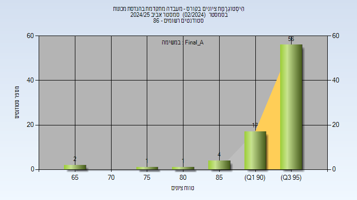
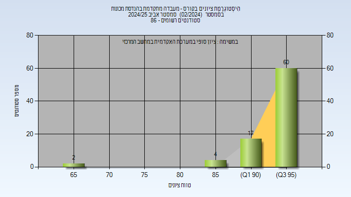
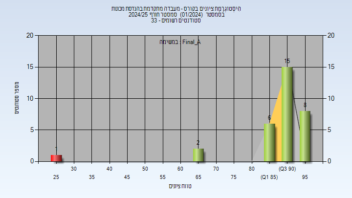
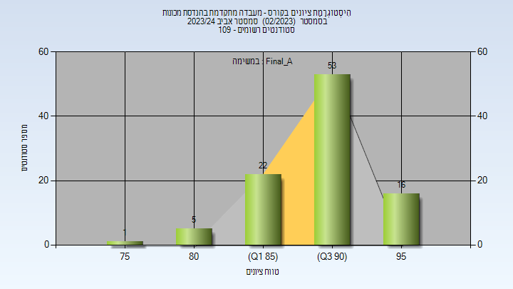
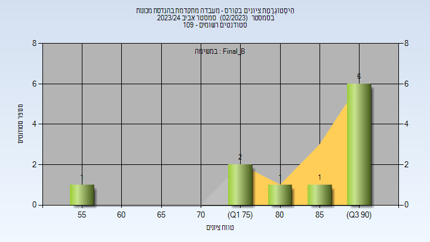
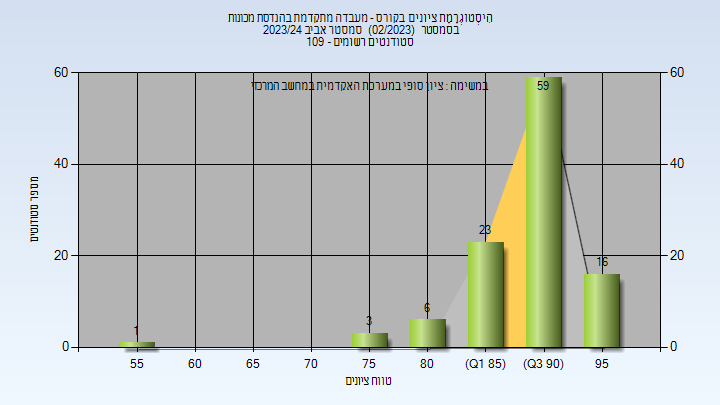

# 00340057 - מעבדה מתקדמת בהנדסת מכונות

**הערה**: מאגר ההיסטוגרמות הוקם עבור [CheeseFork](https://cheesefork.cf/), כלי בניית מערכת שעות עבור סטודנטים בטכניון. באתר בו אתם גולשים ניתן לעיין בהיסטוגרמות, אך הדרך היותר נוחה היא לעיין בהיסטוגרמות, ובמידע נוסף כגון חוות דעת של סטודנטים, באתר CheeseFork.

* [אביב 2025](#202402)
  * [סופי מועד א'](#202402-Final_A)
  * [סופי](#202402-Finals)
* [חורף 2024-2025](#202401)
  * [סופי מועד א'](#202401-Final_A)
  * [סופי](#202401-Finals)
* [אביב 2024](#202302)
  * [סופי מועד א'](#202302-Final_A)
  * [סופי מועד ב'](#202302-Final_B)
  * [סופי](#202302-Finals)

<h2 id="202402">אביב 2025</h2>

| איש סגל | תפקיד |
| ---- | ---- |
| שילה דורון | מרצה - אחראי מקצוע |
| כהן מיכאל | מתרגל - עם הרשאות מרצה אחראי |
| ספורי אשראק | מתרגל |
| צרפתי בנימין | מתרגל |
| בן דוד הולצר בן | מתרגל |
| לוין אהרן | מתרגל |
| רייזמן אביטל | מתרגל |
| גבריאל בועז יוסף | מתרגל |
| אריקסון יונתן | מתרגל |
| רינסקי ולדיסלב | מתרגל |
| פארן אילון | מתרגל |
| דבי ליאור | מתרגל |
| אלגריסי מור | מתרגל |

<h3 id="202402-Final_A">סופי מועד א'</h3>

| סטודנטים | עברו/נכשלו | אחוז עוברים | ציון מינימלי | ציון מקסימלי | ממוצע | חציון |
| ---- | ---- | ---- | ---- | ---- | ---- | ---- |
| 82 | 82/0 | 100 | 66 | 99 | 94.085 | 96 |

<h3 id="202402-Finals">סופי</h3>

| סטודנטים | עברו/נכשלו | אחוז עוברים | ציון מינימלי | ציון מקסימלי | ממוצע | חציון |
| ---- | ---- | ---- | ---- | ---- | ---- | ---- |
| 82 | 82/0 | 100 | 66 | 99 | 94.5 | 96 |

<h2 id="202401">חורף 2024-2025</h2>

| איש סגל | תפקיד |
| ---- | ---- |
| שילה דורון | מרצה |
| אנגל ליה | מרצה |

<h3 id="202401-Final_A">סופי מועד א'</h3>

| סטודנטים | עברו/נכשלו | אחוז עוברים | ציון מינימלי | ציון מקסימלי | ממוצע | חציון |
| ---- | ---- | ---- | ---- | ---- | ---- | ---- |
| 32 | 31/1 | 97 | 26 | 97 | 89 | 93 |

<h3 id="202401-Finals">סופי</h3>

| סטודנטים | עברו/נכשלו | אחוז עוברים | ציון מינימלי | ציון מקסימלי | ממוצע | חציון |
| ---- | ---- | ---- | ---- | ---- | ---- | ---- |
| 34 | 31/3 | 91 | 26 | 97 | 89 | 93 |

<h2 id="202302">אביב 2024</h2>

| איש סגל | תפקיד |
| ---- | ---- |
| שילה דורון | מרצה - אחראי מקצוע |

<h3 id="202302-Final_A">סופי מועד א'</h3>

| סטודנטים | עברו/נכשלו | אחוז עוברים | ציון מינימלי | ציון מקסימלי | ממוצע | חציון |
| ---- | ---- | ---- | ---- | ---- | ---- | ---- |
| 97 | 97/0 | 100 | 79 | 98 | 91.32 | 92 |

<h3 id="202302-Final_B">סופי מועד ב'</h3>

| סטודנטים | עברו/נכשלו | אחוז עוברים | ציון מינימלי | ציון מקסימלי | ממוצע | חציון |
| ---- | ---- | ---- | ---- | ---- | ---- | ---- |
| 11 | 11/0 | 100 | 57 | 93 | 85.091 | 85 |

<h3 id="202302-Finals">סופי</h3>

| סטודנטים | עברו/נכשלו | אחוז עוברים | ציון מינימלי | ציון מקסימלי | ממוצע | חציון |
| ---- | ---- | ---- | ---- | ---- | ---- | ---- |
| 108 | 108/0 | 100 | 57 | 98 | 90.685 | 92 |

