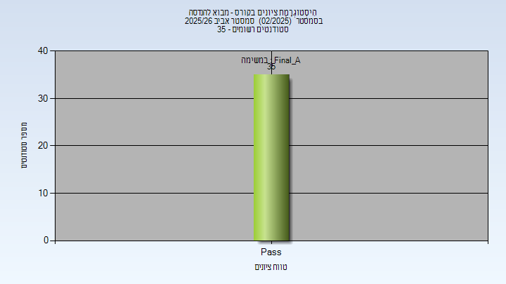
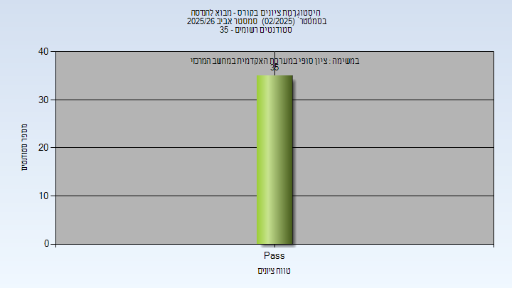
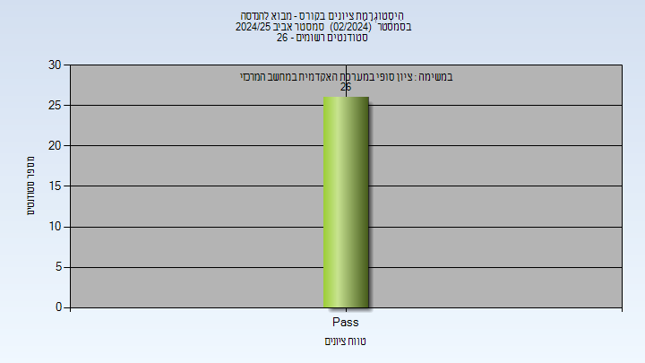

# 00340059 - מבוא להנדסה

**הערה**: מאגר ההיסטוגרמות הוקם עבור [CheeseFork](https://cheesefork.cf/), כלי בניית מערכת שעות עבור סטודנטים בטכניון. באתר בו אתם גולשים ניתן לעיין בהיסטוגרמות, אך הדרך היותר נוחה היא לעיין בהיסטוגרמות, ובמידע נוסף כגון חוות דעת של סטודנטים, באתר CheeseFork.

* [אביב 2026](#202502)
  * [סופי מועד א'](#202502-Final_A)
  * [סופי](#202502-Finals)
* [אביב 2025](#202402)
  * [סופי](#202402-Finals)
* [אביב 2024](#202302)

<h2 id="202502">אביב 2026</h2>

| איש סגל | תפקיד |
| ---- | ---- |
| אמיר עודד | מרצה - אחראי מקצוע |

<h3 id="202502-Final_A">סופי מועד א'</h3>

| סטודנטים | עברו/נכשלו | אחוז עוברים | ציון מינימלי | ציון מקסימלי | ממוצע | חציון |
| ---- | ---- | ---- | ---- | ---- | ---- | ---- |
|  |  |  |  |  |  |  |

<h3 id="202502-Finals">סופי</h3>

| סטודנטים | עברו/נכשלו | אחוז עוברים | ציון מינימלי | ציון מקסימלי | ממוצע | חציון |
| ---- | ---- | ---- | ---- | ---- | ---- | ---- |
|  |  |  |  |  |  |  |

<h2 id="202402">אביב 2025</h2>

<h3 id="202402-Finals">סופי</h3>

| סטודנטים | עברו/נכשלו | אחוז עוברים | ציון מינימלי | ציון מקסימלי | ממוצע | חציון |
| ---- | ---- | ---- | ---- | ---- | ---- | ---- |
|  |  |  |  |  |  |  |

<h2 id="202302">אביב 2024</h2>

| איש סגל | תפקיד |
| ---- | ---- |
| צימרמן יהונתן | מרצה - אחראי מקצוע |

