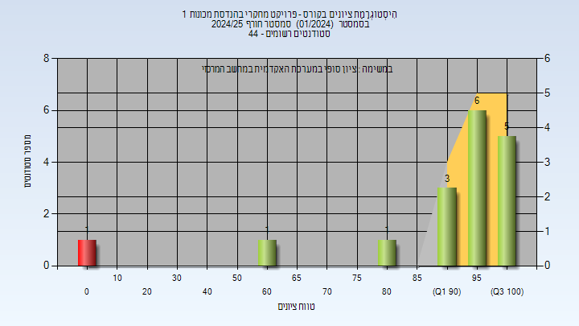

# 00340355 - פרויקט מחקרי בהנדסת מכונות 1

**הערה**: מאגר ההיסטוגרמות הוקם עבור [CheeseFork](https://cheesefork.cf/), כלי בניית מערכת שעות עבור סטודנטים בטכניון. באתר בו אתם גולשים ניתן לעיין בהיסטוגרמות, אך הדרך היותר נוחה היא לעיין בהיסטוגרמות, ובמידע נוסף כגון חוות דעת של סטודנטים, באתר CheeseFork.

* [חורף 2024-2025](#202401)
  * [סופי](#202401-Finals)
* [חורף 2023-2024](#202301)
  * [סופי](#202301-Finals)
* [חורף 2022-2023](#202201)
  * [סופי](#202201-Finals)
* [חורף 2021-2022](#202101)
  * [סופי](#202101-Finals)
* [חורף 2020-2021](#202001)
  * [סופי](#202001-Finals)
* [חורף 2019-2020](#201901)
  * [סופי](#201901-Finals)
* [חורף 2018-2019](#201801)
  * [סופי](#201801-Finals)
* [חורף 2017-2018](#201701)
  * [סופי](#201701-Finals)
* [חורף 2016-2017](#201601)

<h2 id="202401">חורף 2024-2025</h2>

<h3 id="202401-Finals">סופי</h3>

| סטודנטים | עברו/נכשלו | אחוז עוברים | ציון מינימלי | ציון מקסימלי | ממוצע | חציון |
| ---- | ---- | ---- | ---- | ---- | ---- | ---- |
| 45 | 19/26 | 42 | 0 | 100 | 90.526 | 95 |

<h2 id="202301">חורף 2023-2024</h2>

<h3 id="202301-Finals">סופי</h3>

| סטודנטים | עברו/נכשלו | אחוז עוברים | ציון מינימלי | ציון מקסימלי | ממוצע | חציון |
| ---- | ---- | ---- | ---- | ---- | ---- | ---- |
| 41 | 41/0 | 100 | 90 | 100 | 97.146 | 98 |

<h2 id="202201">חורף 2022-2023</h2>

<h3 id="202201-Finals">סופי</h3>

| סטודנטים | עברו/נכשלו | אחוז עוברים | ציון מינימלי | ציון מקסימלי | ממוצע | חציון |
| ---- | ---- | ---- | ---- | ---- | ---- | ---- |
| 48 | 48/0 | 100 | 85 | 100 | 94.5 | 95 |

<h2 id="202101">חורף 2021-2022</h2>

<h3 id="202101-Finals">סופי</h3>

| סטודנטים | עברו/נכשלו | אחוז עוברים | ציון מינימלי | ציון מקסימלי | ממוצע | חציון |
| ---- | ---- | ---- | ---- | ---- | ---- | ---- |
| 37 | 37/0 | 100 | 80 | 100 | 95.568 | 95 |

<h2 id="202001">חורף 2020-2021</h2>

<h3 id="202001-Finals">סופי</h3>

| סטודנטים | עברו/נכשלו | אחוז עוברים | ציון מינימלי | ציון מקסימלי | ממוצע | חציון |
| ---- | ---- | ---- | ---- | ---- | ---- | ---- |
| 49 | 49/0 | 100 | 75 | 100 | 95.898 | 96 |

<h2 id="201901">חורף 2019-2020</h2>

<h3 id="201901-Finals">סופי</h3>

| סטודנטים | עברו/נכשלו | אחוז עוברים | ציון מינימלי | ציון מקסימלי | ממוצע | חציון |
| ---- | ---- | ---- | ---- | ---- | ---- | ---- |
| 37 | 37/0 | 100 | 75 | 100 | 97.324 | 100 |

<h2 id="201801">חורף 2018-2019</h2>

<h3 id="201801-Finals">סופי</h3>

| סטודנטים | עברו/נכשלו | אחוז עוברים | ציון מינימלי | ציון מקסימלי | ממוצע | חציון |
| ---- | ---- | ---- | ---- | ---- | ---- | ---- |
| 47 | 47/0 | 100 | 60 | 100 | 95.702 | 96 |

<h2 id="201701">חורף 2017-2018</h2>

| איש סגל | תפקיד |
| ---- | ---- |
| אור יזהר | מרצה - אחראי מקצוע |

<h3 id="201701-Finals">סופי</h3>

| סטודנטים | עברו/נכשלו | אחוז עוברים | ציון מינימלי | ציון מקסימלי | ממוצע | חציון |
| ---- | ---- | ---- | ---- | ---- | ---- | ---- |
| 22 | 22/0 | 100 | 81 | 100 | 95.864 | 99 |

<h2 id="201601">חורף 2016-2017</h2>

