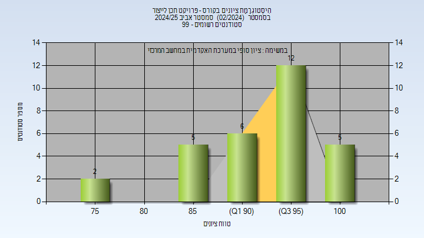
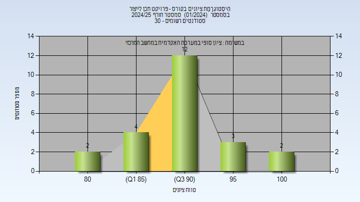

# 00340371 - פרויקט תכן לייצור

**הערה**: מאגר ההיסטוגרמות הוקם עבור [CheeseFork](https://cheesefork.cf/), כלי בניית מערכת שעות עבור סטודנטים בטכניון. באתר בו אתם גולשים ניתן לעיין בהיסטוגרמות, אך הדרך היותר נוחה היא לעיין בהיסטוגרמות, ובמידע נוסף כגון חוות דעת של סטודנטים, באתר CheeseFork.

* [אביב 2025](#202402)
  * [סופי](#202402-Finals)
* [חורף 2024-2025](#202401)
  * [סופי](#202401-Finals)
* [אביב 2024](#202302)
  * [סופי](#202302-Finals)
* [חורף 2023-2024](#202301)
  * [סופי מועד א'](#202301-Final_A)
  * [סופי](#202301-Finals)
* [אביב 2023](#202202)
  * [סופי](#202202-Finals)
* [חורף 2022-2023](#202201)
  * [סופי](#202201-Finals)
* [אביב 2022](#202102)
* [חורף 2021-2022](#202101)
  * [סופי](#202101-Finals)
* [חורף 2020-2021](#202001)
  * [סופי](#202001-Finals)
* [אביב 2020](#201902)
  * [סופי](#201902-Finals)
* [חורף 2019-2020](#201901)
  * [סופי](#201901-Finals)
* [אביב 2019](#201802)
  * [סופי](#201802-Finals)
* [חורף 2018-2019](#201801)
  * [סופי](#201801-Finals)
* [אביב 2018](#201702)
  * [סופי](#201702-Finals)
* [חורף 2017-2018](#201701)
  * [סופי](#201701-Finals)
* [אביב 2017](#201602)
  * [סופי](#201602-Finals)
* [חורף 2016-2017](#201601)
  * [סופי](#201601-Finals)
* [חורף 2015-2016](#201501)
  * [סופי](#201501-Finals)

<h2 id="202402">אביב 2025</h2>

| איש סגל | תפקיד |
| ---- | ---- |
| טננבאום עמי | מרצה |
| גרופר מורל | מרצה |
| גוטמנס יולי | מרצה |
| גוטניק יבגני | מתרגל - עם הרשאות מרצה אחראי |

<h3 id="202402-Finals">סופי</h3>

| סטודנטים | עברו/נכשלו | אחוז עוברים | ציון מינימלי | ציון מקסימלי | ממוצע | חציון |
| ---- | ---- | ---- | ---- | ---- | ---- | ---- |
| 30 | 30/0 | 100 | 77 | 100 | 93.833 | 95 |

<h2 id="202401">חורף 2024-2025</h2>

| איש סגל | תפקיד |
| ---- | ---- |
| גוטניק יבגני | מרצה |
| טננבאום עמי | מרצה |
| גוטמנס יולי | מרצה |

<h3 id="202401-Finals">סופי</h3>

| סטודנטים | עברו/נכשלו | אחוז עוברים | ציון מינימלי | ציון מקסימלי | ממוצע | חציון |
| ---- | ---- | ---- | ---- | ---- | ---- | ---- |
| 31 | 23/8 | 74 | 80 | 100 | 91.043 | 91 |

<h2 id="202302">אביב 2024</h2>

| איש סגל | תפקיד |
| ---- | ---- |
| גרופר מורל | מרצה - אחראי מקצוע |
| גוטניק יבגני | מרצה |
| צוק דב | מרצה |
| כץ ראובן | מרצה |
| טננבאום עמי | מרצה |
| ברכה עידו | מרצה |
| אלבז שי |  |

<h3 id="202302-Finals">סופי</h3>

| סטודנטים | עברו/נכשלו | אחוז עוברים | ציון מינימלי | ציון מקסימלי | ממוצע | חציון |
| ---- | ---- | ---- | ---- | ---- | ---- | ---- |
| 76 | 76/0 | 100 | 80 | 97 | 91.526 | 91 |

<h2 id="202301">חורף 2023-2024</h2>

| איש סגל | תפקיד |
| ---- | ---- |
| צוק דב | מרצה - אחראי מקצוע |
| בונן אריאל | מרצה |
| טננבאום עמי | מרצה |

<h3 id="202301-Final_A">סופי מועד א'</h3>

| סטודנטים | עברו/נכשלו | אחוז עוברים | ציון מינימלי | ציון מקסימלי | ממוצע | חציון |
| ---- | ---- | ---- | ---- | ---- | ---- | ---- |
| 15 | 15/0 | 100 | 88 | 97 | 91.533 | 91 |

<h3 id="202301-Finals">סופי</h3>

| סטודנטים | עברו/נכשלו | אחוז עוברים | ציון מינימלי | ציון מקסימלי | ממוצע | חציון |
| ---- | ---- | ---- | ---- | ---- | ---- | ---- |
| 37 | 37/0 | 100 | 79 | 97 | 88.676 | 89 |

<h2 id="202202">אביב 2023</h2>

| איש סגל | תפקיד |
| ---- | ---- |
| צוק דב | מרצה - אחראי מקצוע |
| טננבאום עמי | מרצה |
| כץ ראובן | מרצה |
| אלבז שי |  |

<h3 id="202202-Finals">סופי</h3>

| סטודנטים | עברו/נכשלו | אחוז עוברים | ציון מינימלי | ציון מקסימלי | ממוצע | חציון |
| ---- | ---- | ---- | ---- | ---- | ---- | ---- |
| 28 | 28/0 | 100 | 84 | 93 | 88.654 | 88 |

<h2 id="202201">חורף 2022-2023</h2>

| איש סגל | תפקיד |
| ---- | ---- |
| בונן אריאל | מרצה |
| צוק דב | מרצה |
| ארקה חבייר | מרצה |
| ברכה עידו | מרצה |
| טננבאום עמי | מרצה |

<h3 id="202201-Finals">סופי</h3>

| סטודנטים | עברו/נכשלו | אחוז עוברים | ציון מינימלי | ציון מקסימלי | ממוצע | חציון |
| ---- | ---- | ---- | ---- | ---- | ---- | ---- |
| 92 | 92/0 | 100 | 79 | 97 | 88.554 | 89 |

<h2 id="202102">אביב 2022</h2>

| איש סגל | תפקיד |
| ---- | ---- |
| אלבז שי | מרצה - אחראי מקצוע |

<h2 id="202101">חורף 2021-2022</h2>

| איש סגל | תפקיד |
| ---- | ---- |
| ארקה חבייר | מרצה |
| בונן אריאל | מרצה |
| צוק דב | מרצה |
| ברכה עידו | מרצה |
| טננבאום עמי | מרצה |

<h3 id="202101-Finals">סופי</h3>

| סטודנטים | עברו/נכשלו | אחוז עוברים | ציון מינימלי | ציון מקסימלי | ממוצע | חציון |
| ---- | ---- | ---- | ---- | ---- | ---- | ---- |
| 97 | 95/2 | 98 | 40 | 97 | 87.278 | 88 |

<h2 id="202001">חורף 2020-2021</h2>

| איש סגל | תפקיד |
| ---- | ---- |
| ארקה חבייר | מרצה |
| בונן אריאל | מרצה |
| צוק דב | מרצה |
| ברכה עידו | מרצה |
| טננבאום עמי | מרצה |

<h3 id="202001-Finals">סופי</h3>

| סטודנטים | עברו/נכשלו | אחוז עוברים | ציון מינימלי | ציון מקסימלי | ממוצע | חציון |
| ---- | ---- | ---- | ---- | ---- | ---- | ---- |
| 104 | 104/0 | 100 | 70 | 97 | 89.692 | 91 |

<h2 id="201902">אביב 2020</h2>

| איש סגל | תפקיד |
| ---- | ---- |
| צוק דב | מרצה |
| ארקה חבייר | מרצה |
| טננבאום עמי | מרצה |
| אקונס פרץ | מרצה |
| פישר דניאל | מרצה |

<h3 id="201902-Finals">סופי</h3>

| סטודנטים | עברו/נכשלו | אחוז עוברים | ציון מינימלי | ציון מקסימלי | ממוצע | חציון |
| ---- | ---- | ---- | ---- | ---- | ---- | ---- |
| 22 | 22/0 | 100 | 88 | 95 | 92.091 | 92 |

<h2 id="201901">חורף 2019-2020</h2>

| איש סגל | תפקיד |
| ---- | ---- |
| אקונס פרץ ז"ל | מרצה |
| טננבאום עמי | מרצה |
| פישר דניאל | מרצה |
| ארקה חבייר | מרצה |
| צוק דב | מרצה |

<h3 id="201901-Finals">סופי</h3>

| סטודנטים | עברו/נכשלו | אחוז עוברים | ציון מינימלי | ציון מקסימלי | ממוצע | חציון |
| ---- | ---- | ---- | ---- | ---- | ---- | ---- |
| 110 | 110/0 | 100 | 55 | 98 | 88.982 | 90 |

<h2 id="201802">אביב 2019</h2>

| איש סגל | תפקיד |
| ---- | ---- |
| ארקה חבייר | מרצה |
| צוק דב | מרצה |
| אקונס פרץ ז"ל | מרצה |
| פישר דניאל | מרצה |

<h3 id="201802-Finals">סופי</h3>

| סטודנטים | עברו/נכשלו | אחוז עוברים | ציון מינימלי | ציון מקסימלי | ממוצע | חציון |
| ---- | ---- | ---- | ---- | ---- | ---- | ---- |
| 47 | 46/1 | 98 | 50 | 98 | 89.83 | 95 |

<h2 id="201801">חורף 2018-2019</h2>

| איש סגל | תפקיד |
| ---- | ---- |
| צוק דב | מרצה |
| ארקה חבייר | מרצה |
| טננבאום עמי | מרצה |
| פישר דניאל | מרצה |
| אקונס פרץ ז"ל | מרצה |

<h3 id="201801-Finals">סופי</h3>

| סטודנטים | עברו/נכשלו | אחוז עוברים | ציון מינימלי | ציון מקסימלי | ממוצע | חציון |
| ---- | ---- | ---- | ---- | ---- | ---- | ---- |
| 103 | 103/0 | 100 | 70 | 96 | 86.524 | 86 |

<h2 id="201702">אביב 2018</h2>

| איש סגל | תפקיד |
| ---- | ---- |
| ארקה חבייר | מרצה |
| צוק דב | מרצה |
| פישר דניאל | מרצה |
| אקונס פרץ | מרצה |

<h3 id="201702-Finals">סופי</h3>

| סטודנטים | עברו/נכשלו | אחוז עוברים | ציון מינימלי | ציון מקסימלי | ממוצע | חציון |
| ---- | ---- | ---- | ---- | ---- | ---- | ---- |
| 57 | 57/0 | 100 | 60 | 100 | 88.719 | 91 |

<h2 id="201701">חורף 2017-2018</h2>

| איש סגל | תפקיד |
| ---- | ---- |
| ארקה חבייר | מרצה |
| צוק דב | מרצה |
| פישר דניאל | מרצה |

<h3 id="201701-Finals">סופי</h3>

| סטודנטים | עברו/נכשלו | אחוז עוברים | ציון מינימלי | ציון מקסימלי | ממוצע | חציון |
| ---- | ---- | ---- | ---- | ---- | ---- | ---- |
| 106 | 106/0 | 100 | 68 | 97 | 88.651 | 89 |

<h2 id="201602">אביב 2017</h2>

<h3 id="201602-Finals">סופי</h3>

| סטודנטים | עברו/נכשלו | אחוז עוברים | ציון מינימלי | ציון מקסימלי | ממוצע | חציון |
| ---- | ---- | ---- | ---- | ---- | ---- | ---- |
| 51 | 51/0 | 100 | 72 | 97 | 87.373 | 89 |

<h2 id="201601">חורף 2016-2017</h2>

<h3 id="201601-Finals">סופי</h3>

| סטודנטים | עברו/נכשלו | אחוז עוברים | ציון מינימלי | ציון מקסימלי | ממוצע | חציון |
| ---- | ---- | ---- | ---- | ---- | ---- | ---- |
| 91 | 89/2 | 98 | 24 | 100 | 87.549 | 91 |

<h2 id="201501">חורף 2015-2016</h2>

<h3 id="201501-Finals">סופי</h3>

| סטודנטים | עברו/נכשלו | אחוז עוברים | ציון מינימלי | ציון מקסימלי | ממוצע | חציון |
| ---- | ---- | ---- | ---- | ---- | ---- | ---- |
| 112 | 112/0 | 100 | 68 | 100 | 89.048 | 90 |

