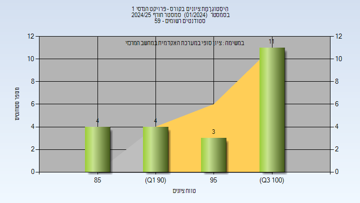
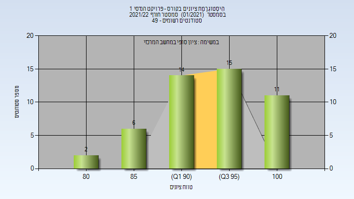

# 00340379 - פרויקט הנדסי 1

**הערה**: מאגר ההיסטוגרמות הוקם עבור [CheeseFork](https://cheesefork.cf/), כלי בניית מערכת שעות עבור סטודנטים בטכניון. באתר בו אתם גולשים ניתן לעיין בהיסטוגרמות, אך הדרך היותר נוחה היא לעיין בהיסטוגרמות, ובמידע נוסף כגון חוות דעת של סטודנטים, באתר CheeseFork.

* [חורף 2024-2025](#202401)
  * [סופי](#202401-Finals)
* [חורף 2022-2023](#202201)
  * [סופי](#202201-Finals)
* [חורף 2021-2022](#202101)
  * [סופי](#202101-Finals)
* [חורף 2020-2021](#202001)
  * [סופי](#202001-Finals)
* [חורף 2019-2020](#201901)
  * [סופי](#201901-Finals)
* [חורף 2018-2019](#201801)
  * [סופי](#201801-Finals)
* [חורף 2017-2018](#201701)
  * [סופי](#201701-Finals)

<h2 id="202401">חורף 2024-2025</h2>

<h3 id="202401-Finals">סופי</h3>

| סטודנטים | עברו/נכשלו | אחוז עוברים | ציון מינימלי | ציון מקסימלי | ממוצע | חציון |
| ---- | ---- | ---- | ---- | ---- | ---- | ---- |
| 64 | 44/20 | 69 | 65 | 100 | 94.455 | 95.5 |

<h2 id="202201">חורף 2022-2023</h2>

<h3 id="202201-Finals">סופי</h3>

| סטודנטים | עברו/נכשלו | אחוז עוברים | ציון מינימלי | ציון מקסימלי | ממוצע | חציון |
| ---- | ---- | ---- | ---- | ---- | ---- | ---- |
| 41 | 41/0 | 100 | 80 | 100 | 93.585 | 95 |

<h2 id="202101">חורף 2021-2022</h2>

<h3 id="202101-Finals">סופי</h3>

| סטודנטים | עברו/נכשלו | אחוז עוברים | ציון מינימלי | ציון מקסימלי | ממוצע | חציון |
| ---- | ---- | ---- | ---- | ---- | ---- | ---- |
| 48 | 48/0 | 100 | 84 | 100 | 94.458 | 95 |

<h2 id="202001">חורף 2020-2021</h2>

<h3 id="202001-Finals">סופי</h3>

| סטודנטים | עברו/נכשלו | אחוז עוברים | ציון מינימלי | ציון מקסימלי | ממוצע | חציון |
| ---- | ---- | ---- | ---- | ---- | ---- | ---- |
| 47 | 47/0 | 100 | 80 | 100 | 94.064 | 95 |

<h2 id="201901">חורף 2019-2020</h2>

<h3 id="201901-Finals">סופי</h3>

| סטודנטים | עברו/נכשלו | אחוז עוברים | ציון מינימלי | ציון מקסימלי | ממוצע | חציון |
| ---- | ---- | ---- | ---- | ---- | ---- | ---- |
| 56 | 56/0 | 100 | 55 | 100 | 94.036 | 96.5 |

<h2 id="201801">חורף 2018-2019</h2>

<h3 id="201801-Finals">סופי</h3>

| סטודנטים | עברו/נכשלו | אחוז עוברים | ציון מינימלי | ציון מקסימלי | ממוצע | חציון |
| ---- | ---- | ---- | ---- | ---- | ---- | ---- |
| 89 | 89/0 | 100 | 70 | 100 | 93.36 | 95 |

<h2 id="201701">חורף 2017-2018</h2>

<h3 id="201701-Finals">סופי</h3>

| סטודנטים | עברו/נכשלו | אחוז עוברים | ציון מינימלי | ציון מקסימלי | ממוצע | חציון |
| ---- | ---- | ---- | ---- | ---- | ---- | ---- |
| 60 | 60/0 | 100 | 80 | 100 | 93.317 | 95 |

