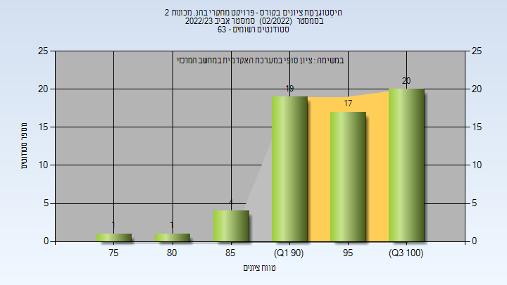

# 00340381 - פרויקט מחקרי בהנ. מכונות 2

**הערה**: מאגר ההיסטוגרמות הוקם עבור [CheeseFork](https://cheesefork.cf/), כלי בניית מערכת שעות עבור סטודנטים בטכניון. באתר בו אתם גולשים ניתן לעיין בהיסטוגרמות, אך הדרך היותר נוחה היא לעיין בהיסטוגרמות, ובמידע נוסף כגון חוות דעת של סטודנטים, באתר CheeseFork.

* [אביב 2025](#202402)
* [אביב 2024](#202302)
  * [סופי](#202302-Finals)
* [אביב 2023](#202202)
  * [סופי](#202202-Finals)
* [אביב 2022](#202102)
  * [סופי](#202102-Finals)
* [אביב 2021](#202002)
  * [סופי](#202002-Finals)
* [אביב 2020](#201902)
  * [סופי](#201902-Finals)
* [אביב 2019](#201802)
  * [סופי](#201802-Finals)
* [אביב 2018](#201702)
  * [סופי](#201702-Finals)

<h2 id="202402">אביב 2025</h2>

<h2 id="202302">אביב 2024</h2>

<h3 id="202302-Finals">סופי</h3>

| סטודנטים | עברו/נכשלו | אחוז עוברים | ציון מינימלי | ציון מקסימלי | ממוצע | חציון |
| ---- | ---- | ---- | ---- | ---- | ---- | ---- |
| 42 | 42/0 | 100 | 80 | 100 | 96.119 | 96.5 |

<h2 id="202202">אביב 2023</h2>

<h3 id="202202-Finals">סופי</h3>

| סטודנטים | עברו/נכשלו | אחוז עוברים | ציון מינימלי | ציון מקסימלי | ממוצע | חציון |
| ---- | ---- | ---- | ---- | ---- | ---- | ---- |
| 62 | 62/0 | 100 | 78 | 100 | 94.823 | 95 |

<h2 id="202102">אביב 2022</h2>

<h3 id="202102-Finals">סופי</h3>

| סטודנטים | עברו/נכשלו | אחוז עוברים | ציון מינימלי | ציון מקסימלי | ממוצע | חציון |
| ---- | ---- | ---- | ---- | ---- | ---- | ---- |
| 34 | 34/0 | 100 | 80 | 100 | 95.765 | 96 |

<h2 id="202002">אביב 2021</h2>

<h3 id="202002-Finals">סופי</h3>

| סטודנטים | עברו/נכשלו | אחוז עוברים | ציון מינימלי | ציון מקסימלי | ממוצע | חציון |
| ---- | ---- | ---- | ---- | ---- | ---- | ---- |
| 51 | 51/0 | 100 | 75 | 100 | 95.49 | 97 |

<h2 id="201902">אביב 2020</h2>

<h3 id="201902-Finals">סופי</h3>

| סטודנטים | עברו/נכשלו | אחוז עוברים | ציון מינימלי | ציון מקסימלי | ממוצע | חציון |
| ---- | ---- | ---- | ---- | ---- | ---- | ---- |
| 42 | 42/0 | 100 | 75 | 100 | 97.548 | 100 |

<h2 id="201802">אביב 2019</h2>

<h3 id="201802-Finals">סופי</h3>

| סטודנטים | עברו/נכשלו | אחוז עוברים | ציון מינימלי | ציון מקסימלי | ממוצע | חציון |
| ---- | ---- | ---- | ---- | ---- | ---- | ---- |
| 40 | 40/0 | 100 | 60 | 100 | 96.225 | 100 |

<h2 id="201702">אביב 2018</h2>

<h3 id="201702-Finals">סופי</h3>

| סטודנטים | עברו/נכשלו | אחוז עוברים | ציון מינימלי | ציון מקסימלי | ממוצע | חציון |
| ---- | ---- | ---- | ---- | ---- | ---- | ---- |
| 19 | 19/0 | 100 | 85 | 100 | 94.421 | 95 |

