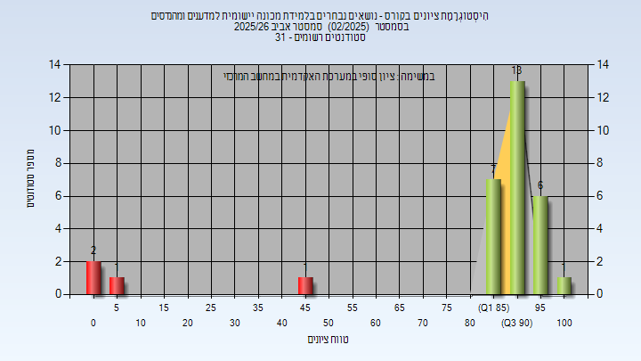

# 00360112 - נושאים נבחרים בלמידת מכונה יישומית למדענים ומהנדסים

**הערה**: מאגר ההיסטוגרמות הוקם עבור [CheeseFork](https://cheesefork.cf/), כלי בניית מערכת שעות עבור סטודנטים בטכניון. באתר בו אתם גולשים ניתן לעיין בהיסטוגרמות, אך הדרך היותר נוחה היא לעיין בהיסטוגרמות, ובמידע נוסף כגון חוות דעת של סטודנטים, באתר CheeseFork.

* [אביב 2026](#202502)
  * [סופי](#202502-Finals)

<h2 id="202502">אביב 2026</h2>

| איש סגל | תפקיד |
| ---- | ---- |
| פרנקל סטיבן | מרצה - אחראי מקצוע |

<h3 id="202502-Finals">סופי</h3>

| סטודנטים | עברו/נכשלו | אחוז עוברים | ציון מינימלי | ציון מקסימלי | ממוצע | חציון |
| ---- | ---- | ---- | ---- | ---- | ---- | ---- |
| 31 | 27/4 | 87 | 0 | 100 | 82.29 | 92 |

