# 00440167 - פרוייקט א'

**הערה**: מאגר ההיסטוגרמות הוקם עבור [CheeseFork](https://cheesefork.cf/), כלי בניית מערכת שעות עבור סטודנטים בטכניון. באתר בו אתם גולשים ניתן לעיין בהיסטוגרמות, אך הדרך היותר נוחה היא לעיין בהיסטוגרמות, ובמידע נוסף כגון חוות דעת של סטודנטים, באתר CheeseFork.

* [אביב 2024](#202302)
  * [סופי](#202302-Finals)
* [חורף 2023-2024](#202301)
  * [סופי](#202301-Finals)
* [אביב 2023](#202202)
  * [סופי](#202202-Finals)
* [חורף 2022-2023](#202201)
  * [סופי](#202201-Finals)
* [קיץ 2022](#202103)
* [אביב 2022](#202102)
  * [סופי](#202102-Finals)
* [חורף 2021-2022](#202101)
  * [סופי](#202101-Finals)
* [קיץ 2021](#202003)
* [אביב 2021](#202002)
  * [סופי](#202002-Finals)
* [חורף 2020-2021](#202001)
  * [סופי](#202001-Finals)
* [אביב 2020](#201902)
  * [סופי](#201902-Finals)
* [חורף 2019-2020](#201901)
  * [סופי](#201901-Finals)
* [אביב 2019](#201802)
  * [סופי](#201802-Finals)
* [חורף 2018-2019](#201801)
  * [סופי](#201801-Finals)
* [קיץ 2018](#201703)
* [אביב 2018](#201702)
  * [סופי](#201702-Finals)
* [חורף 2017-2018](#201701)
  * [סופי](#201701-Finals)
* [קיץ 2017](#201603)
* [אביב 2017](#201602)
  * [סופי](#201602-Finals)
* [חורף 2016-2017](#201601)
  * [סופי](#201601-Finals)
* [אביב 2016](#201502)
  * [סופי](#201502-Finals)
* [אביב 2015](#201402)
  * [סופי מועד א'](#201402-Final_A)
  * [סופי מועד ב'](#201402-Final_B)
  * [סופי](#201402-Finals)
* [חורף 2014-2015](#201401)
  * [סופי](#201401-Finals)

<h2 id="202302">אביב 2024</h2>

| איש סגל | תפקיד |
| ---- | ---- |
| ארז יוחנן | מרצה - אחראי מקצוע |
| פלג נימרוד | מרצה |

<h3 id="202302-Finals">סופי</h3>

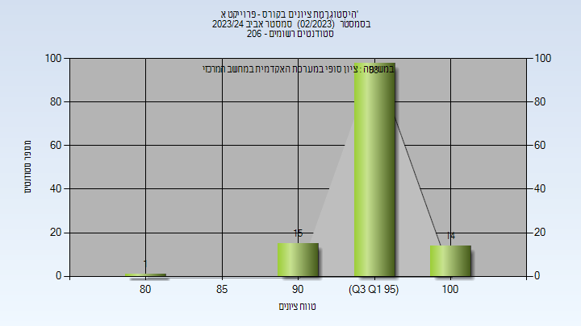

| סטודנטים | עברו/נכשלו | אחוז עוברים | ציון מינימלי | ציון מקסימלי | ממוצע | חציון |
| ---- | ---- | ---- | ---- | ---- | ---- | ---- |
| 74 | 74/0 | 100 | 92 | 100 | 97.27 | 97 |

<h2 id="202301">חורף 2023-2024</h2>

| איש סגל | תפקיד |
| ---- | ---- |
| ארז יוחנן | מרצה - אחראי מקצוע |
| פלג נימרוד | מרצה |

<h3 id="202301-Finals">סופי</h3>

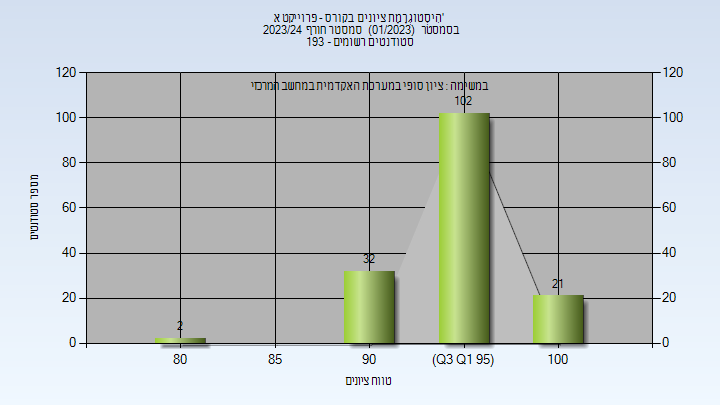

| סטודנטים | עברו/נכשלו | אחוז עוברים | ציון מינימלי | ציון מקסימלי | ממוצע | חציון |
| ---- | ---- | ---- | ---- | ---- | ---- | ---- |
| 153 | 153/0 | 100 | 55 | 100 | 96.026 | 96 |

<h2 id="202202">אביב 2023</h2>

| איש סגל | תפקיד |
| ---- | ---- |
| לברון יואש | מרצה - אחראי מקצוע |
| ארז יוחנן | מרצה |
| פלג נימרוד | מרצה |

<h3 id="202202-Finals">סופי</h3>

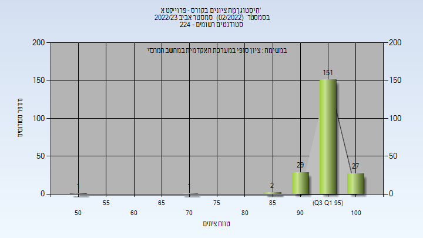

| סטודנטים | עברו/נכשלו | אחוז עוברים | ציון מינימלי | ציון מקסימלי | ממוצע | חציון |
| ---- | ---- | ---- | ---- | ---- | ---- | ---- |
| 200 | 199/1 | 100 | 50 | 100 | 96.216 | 97 |

<h2 id="202201">חורף 2022-2023</h2>

| איש סגל | תפקיד |
| ---- | ---- |
| לברון יואש | מרצה - אחראי מקצוע |
| ארז יוחנן | מרצה |
| פלג נימרוד | מרצה |

<h3 id="202201-Finals">סופי</h3>

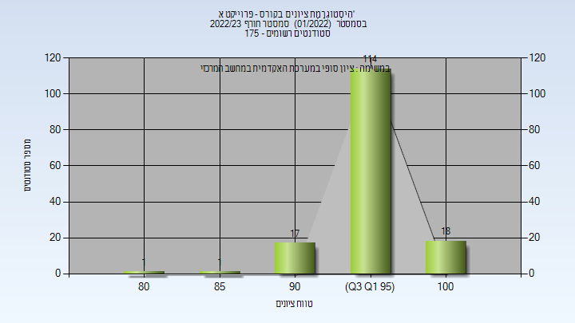

| סטודנטים | עברו/נכשלו | אחוז עוברים | ציון מינימלי | ציון מקסימלי | ממוצע | חציון |
| ---- | ---- | ---- | ---- | ---- | ---- | ---- |
| 155 | 155/0 | 100 | 80 | 100 | 96.566 | 97 |

<h2 id="202103">קיץ 2022</h2>

| איש סגל | תפקיד |
| ---- | ---- |
| לברון יואש | מרצה - אחראי מקצוע |
| פלג נימרוד | מרצה |
| ארז יוחנן | מרצה |

<h2 id="202102">אביב 2022</h2>

| איש סגל | תפקיד |
| ---- | ---- |
| לברון יואש | מרצה - אחראי מקצוע |
| פלג נימרוד | מרצה |
| ארז יוחנן | מרצה |

<h3 id="202102-Finals">סופי</h3>

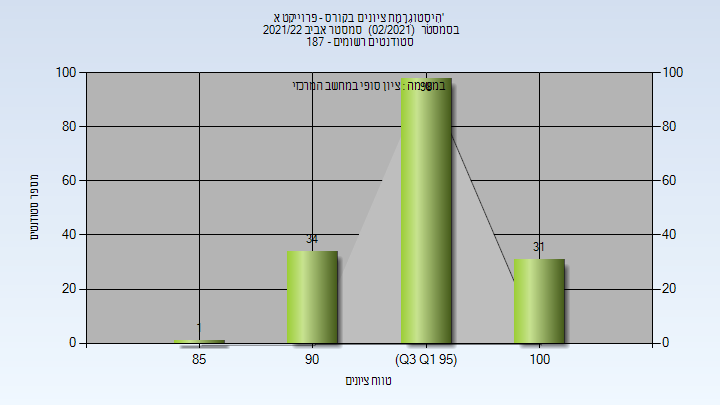

| סטודנטים | עברו/נכשלו | אחוז עוברים | ציון מינימלי | ציון מקסימלי | ממוצע | חציון |
| ---- | ---- | ---- | ---- | ---- | ---- | ---- |
| 164 | 164/0 | 100 | 88 | 100 | 96.482 | 96.5 |

<h2 id="202101">חורף 2021-2022</h2>

| איש סגל | תפקיד |
| ---- | ---- |
| לברון יואש | מרצה - אחראי מקצוע |
| ארז יוחנן | מתרגל |
| פלג נימרוד | מרצה |

<h3 id="202101-Finals">סופי</h3>

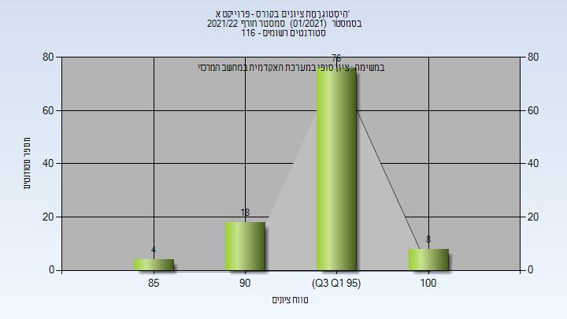

| סטודנטים | עברו/נכשלו | אחוז עוברים | ציון מינימלי | ציון מקסימלי | ממוצע | חציון |
| ---- | ---- | ---- | ---- | ---- | ---- | ---- |
| 106 | 106/0 | 100 | 85 | 100 | 95.84 | 96 |

<h2 id="202003">קיץ 2021</h2>

| איש סגל | תפקיד |
| ---- | ---- |
| כהן ישראל | מרצה - אחראי מקצוע |
| פלג נימרוד | מרצה |
| ארז יוחנן |  |

<h2 id="202002">אביב 2021</h2>

| איש סגל | תפקיד |
| ---- | ---- |
| כהן ישראל | מרצה - אחראי מקצוע |
| ארז יוחנן | מתרגל |
| פלג נימרוד | מדריך מעבדה |

<h3 id="202002-Finals">סופי</h3>

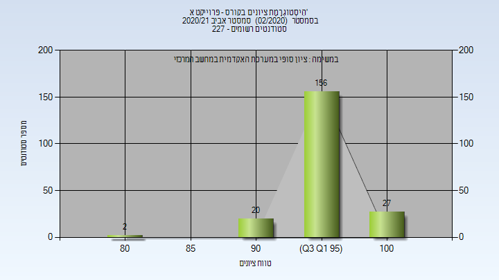

| סטודנטים | עברו/נכשלו | אחוז עוברים | ציון מינימלי | ציון מקסימלי | ממוצע | חציון |
| ---- | ---- | ---- | ---- | ---- | ---- | ---- |
| 205 | 205/0 | 100 | 80 | 100 | 96.639 | 97 |

<h2 id="202001">חורף 2020-2021</h2>

| איש סגל | תפקיד |
| ---- | ---- |
| כהן ישראל | מרצה - אחראי מקצוע |
| ארז יוחנן | מתרגל |

<h3 id="202001-Finals">סופי</h3>

| סטודנטים | עברו/נכשלו | אחוז עוברים | ציון מינימלי | ציון מקסימלי | ממוצע | חציון |
| ---- | ---- | ---- | ---- | ---- | ---- | ---- |
| 118 | 118/0 | 100 | 83 | 100 | 96.568 | 97 |

<h2 id="201902">אביב 2020</h2>

| איש סגל | תפקיד |
| ---- | ---- |
| כהן ישראל | מרצה - אחראי מקצוע |
| ארז יוחנן | מתרגל |

<h3 id="201902-Finals">סופי</h3>

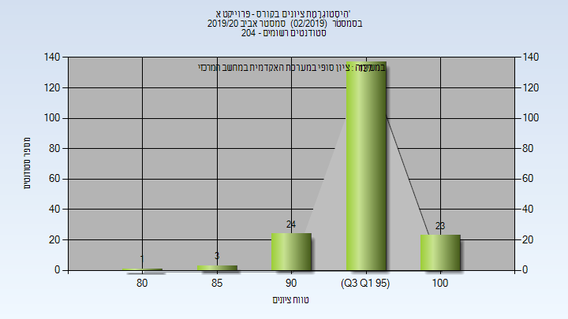

| סטודנטים | עברו/נכשלו | אחוז עוברים | ציון מינימלי | ציון מקסימלי | ממוצע | חציון |
| ---- | ---- | ---- | ---- | ---- | ---- | ---- |
| 188 | 188/0 | 100 | 80 | 100 | 96.5 | 96 |

<h2 id="201901">חורף 2019-2020</h2>

| איש סגל | תפקיד |
| ---- | ---- |
| כהן ישראל | מרצה - אחראי מקצוע |
| ארז יוחנן | מתרגל |

<h3 id="201901-Finals">סופי</h3>

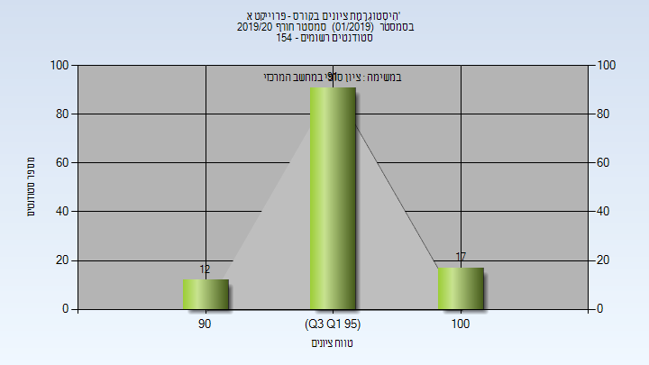

| סטודנטים | עברו/נכשלו | אחוז עוברים | ציון מינימלי | ציון מקסימלי | ממוצע | חציון |
| ---- | ---- | ---- | ---- | ---- | ---- | ---- |
| 120 | 120/0 | 100 | 90 | 100 | 96.858 | 97 |

<h2 id="201802">אביב 2019</h2>

| איש סגל | תפקיד |
| ---- | ---- |
| כהן ישראל | מרצה - אחראי מקצוע |
| ארז יוחנן | מתרגל |

<h3 id="201802-Finals">סופי</h3>

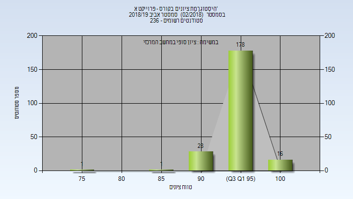

| סטודנטים | עברו/נכשלו | אחוז עוברים | ציון מינימלי | ציון מקסימלי | ממוצע | חציון |
| ---- | ---- | ---- | ---- | ---- | ---- | ---- |
| 224 | 224/0 | 100 | 75 | 100 | 96.312 | 96 |

<h2 id="201801">חורף 2018-2019</h2>

| איש סגל | תפקיד |
| ---- | ---- |
| כהן ישראל | מרצה - אחראי מקצוע |
| ארז יוחנן | מתרגל |

<h3 id="201801-Finals">סופי</h3>

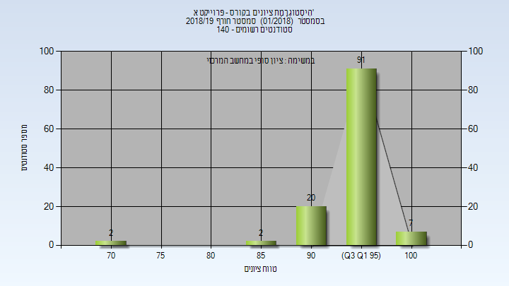

| סטודנטים | עברו/נכשלו | אחוז עוברים | ציון מינימלי | ציון מקסימלי | ממוצע | חציון |
| ---- | ---- | ---- | ---- | ---- | ---- | ---- |
| 122 | 122/0 | 100 | 70 | 100 | 95.746 | 97 |

<h2 id="201703">קיץ 2018</h2>

<h2 id="201702">אביב 2018</h2>

| איש סגל | תפקיד |
| ---- | ---- |
| כהן ישראל | מרצה - אחראי מקצוע |
| ארז יוחנן | מתרגל |

<h3 id="201702-Finals">סופי</h3>

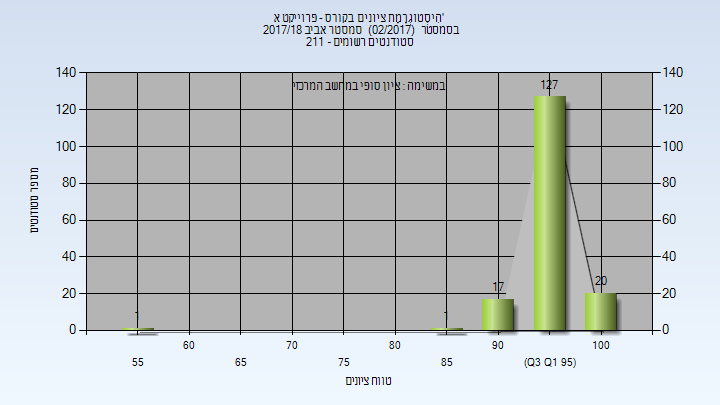

| סטודנטים | עברו/נכשלו | אחוז עוברים | ציון מינימלי | ציון מקסימלי | ממוצע | חציון |
| ---- | ---- | ---- | ---- | ---- | ---- | ---- |
| 166 | 166/0 | 100 | 55 | 100 | 96.373 | 97 |

<h2 id="201701">חורף 2017-2018</h2>

| איש סגל | תפקיד |
| ---- | ---- |
| כהן ישראל | מרצה - אחראי מקצוע |
| ארז יוחנן | מתרגל |

<h3 id="201701-Finals">סופי</h3>

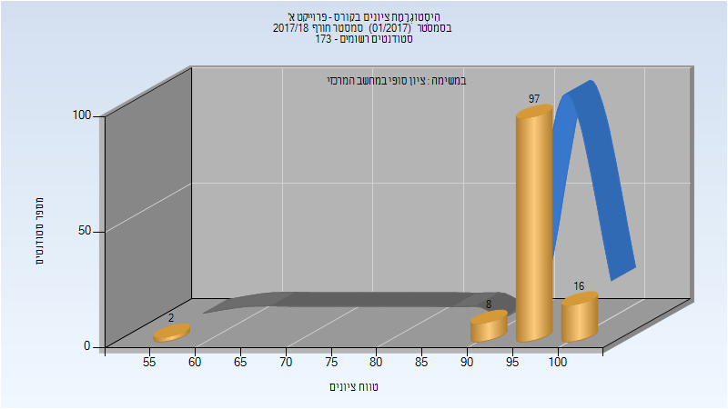

| סטודנטים | עברו/נכשלו | אחוז עוברים | ציון מינימלי | ציון מקסימלי | ממוצע | חציון |
| ---- | ---- | ---- | ---- | ---- | ---- | ---- |
| 123 | 123/0 | 100 | 55 | 100 | 96.463 | 97 |

<h2 id="201603">קיץ 2017</h2>

<h2 id="201602">אביב 2017</h2>

| איש סגל | תפקיד |
| ---- | ---- |
| כהן ישראל | מרצה - אחראי מקצוע |
| ארז יוחנן | מתרגל |

<h3 id="201602-Finals">סופי</h3>

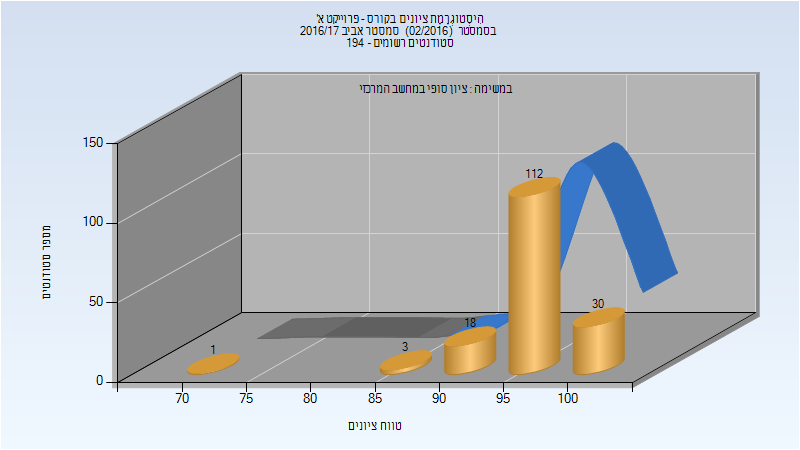

| סטודנטים | עברו/נכשלו | אחוז עוברים | ציון מינימלי | ציון מקסימלי | ממוצע | חציון |
| ---- | ---- | ---- | ---- | ---- | ---- | ---- |
| 164 | 164/0 | 100 | 70 | 100 | 96.75 | 97 |

<h2 id="201601">חורף 2016-2017</h2>

| איש סגל | תפקיד |
| ---- | ---- |
| כהן ישראל | מרצה - אחראי מקצוע |
| פלג נימרוד | מתרגל |
| ארז יוחנן | מתרגל |

<h3 id="201601-Finals">סופי</h3>

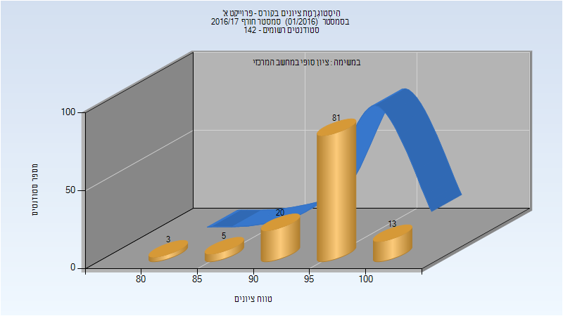

| סטודנטים | עברו/נכשלו | אחוז עוברים | ציון מינימלי | ציון מקסימלי | ממוצע | חציון |
| ---- | ---- | ---- | ---- | ---- | ---- | ---- |
| 122 | 122/0 | 100 | 80 | 100 | 95.82 | 97 |

<h2 id="201502">אביב 2016</h2>

| איש סגל | תפקיד |
| ---- | ---- |
| כהן ישראל | מרצה - אחראי מקצוע |
| ארז יוחנן | מתרגל |

<h3 id="201502-Finals">סופי</h3>

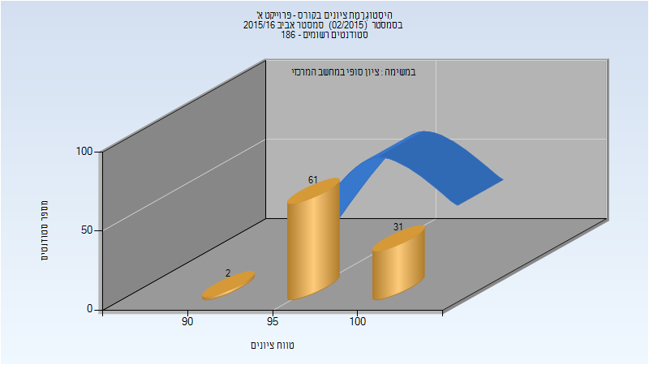

| סטודנטים | עברו/נכשלו | אחוז עוברים | ציון מינימלי | ציון מקסימלי | ממוצע | חציון |
| ---- | ---- | ---- | ---- | ---- | ---- | ---- |
| 94 | 94/0 | 100 | 90 | 100 | 98.106 | 98 |

<h2 id="201402">אביב 2015</h2>

| איש סגל | תפקיד |
| ---- | ---- |
| כהן ישראל | מרצה - אחראי מקצוע |
| ארז יוחנן |  |

<h3 id="201402-Final_A">סופי מועד א'</h3>

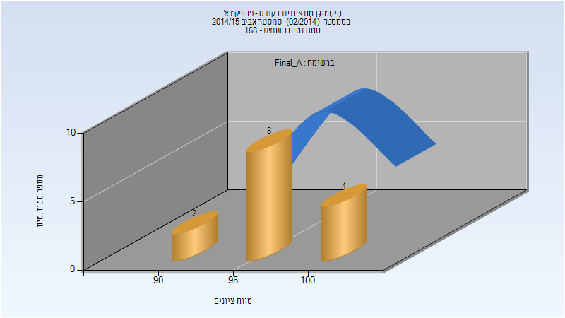

| סטודנטים | עברו/נכשלו | אחוז עוברים | ציון מינימלי | ציון מקסימלי | ממוצע | חציון |
| ---- | ---- | ---- | ---- | ---- | ---- | ---- |
| 14 | 14/0 | 100 | 94 | 100 | 97.857 | 98 |

<h3 id="201402-Final_B">סופי מועד ב'</h3>

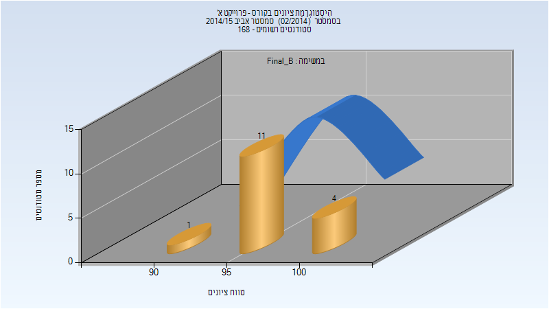

| סטודנטים | עברו/נכשלו | אחוז עוברים | ציון מינימלי | ציון מקסימלי | ממוצע | חציון |
| ---- | ---- | ---- | ---- | ---- | ---- | ---- |
| 16 | 16/0 | 100 | 90 | 100 | 97.812 | 98 |

<h3 id="201402-Finals">סופי</h3>

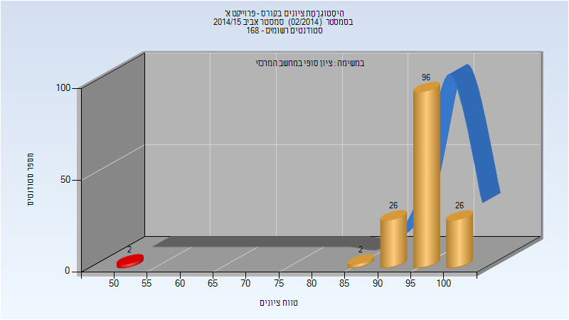

| סטודנטים | עברו/נכשלו | אחוז עוברים | ציון מינימלי | ציון מקסימלי | ממוצע | חציון |
| ---- | ---- | ---- | ---- | ---- | ---- | ---- |
| 152 | 150/2 | 99 | 50 | 100 | 96.046 | 97 |

<h2 id="201401">חורף 2014-2015</h2>

| איש סגל | תפקיד |
| ---- | ---- |
| כהן ישראל | מרצה - אחראי מקצוע |

<h3 id="201401-Finals">סופי</h3>

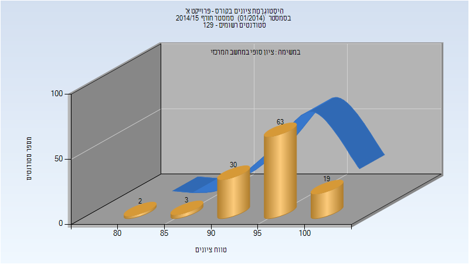

| סטודנטים | עברו/נכשלו | אחוז עוברים | ציון מינימלי | ציון מקסימלי | ממוצע | חציון |
| ---- | ---- | ---- | ---- | ---- | ---- | ---- |
| 117 | 117/0 | 100 | 82 | 100 | 95.897 | 97 |

