# 00440169 - פרויקט  ב

**הערה**: מאגר ההיסטוגרמות הוקם עבור [CheeseFork](https://cheesefork.cf/), כלי בניית מערכת שעות עבור סטודנטים בטכניון. באתר בו אתם גולשים ניתן לעיין בהיסטוגרמות, אך הדרך היותר נוחה היא לעיין בהיסטוגרמות, ובמידע נוסף כגון חוות דעת של סטודנטים, באתר CheeseFork.

* [חורף 2024-2025](#202401)
  * [סופי](#202401-Finals)
* [חורף 2023-2024](#202301)
  * [סופי](#202301-Finals)
* [אביב 2023](#202202)
  * [סופי](#202202-Finals)
* [חורף 2022-2023](#202201)
  * [סופי](#202201-Finals)
* [אביב 2022](#202102)
  * [סופי](#202102-Finals)
* [חורף 2021-2022](#202101)
  * [סופי](#202101-Finals)
* [אביב 2021](#202002)
  * [סופי](#202002-Finals)
* [חורף 2020-2021](#202001)
  * [סופי](#202001-Finals)
* [אביב 2020](#201902)
  * [סופי](#201902-Finals)
* [חורף 2019-2020](#201901)
  * [סופי](#201901-Finals)
* [אביב 2019](#201802)
  * [סופי](#201802-Finals)
* [חורף 2018-2019](#201801)
  * [סופי](#201801-Finals)
* [אביב 2018](#201702)
  * [סופי](#201702-Finals)
* [חורף 2017-2018](#201701)
  * [סופי](#201701-Finals)
* [אביב 2017](#201602)
  * [סופי](#201602-Finals)
* [חורף 2016-2017](#201601)
  * [סופי](#201601-Finals)
* [אביב 2016](#201502)
  * [סופי](#201502-Finals)
* [חורף 2015-2016](#201501)
  * [סופי](#201501-Finals)
* [אביב 2015](#201402)

<h2 id="202401">חורף 2024-2025</h2>

| איש סגל | תפקיד |
| ---- | ---- |
| ארז יוחנן | מרצה - אחראי מקצוע |
| פלג נימרוד | מדריך מעבדה |

<h3 id="202401-Finals">סופי</h3>

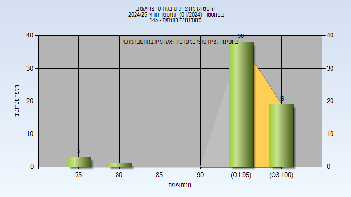

| סטודנטים | עברו/נכשלו | אחוז עוברים | ציון מינימלי | ציון מקסימלי | ממוצע | חציון |
| ---- | ---- | ---- | ---- | ---- | ---- | ---- |
| 146 | 34/112 | 23 | 90 | 100 | 97.971 | 98.5 |

<h2 id="202301">חורף 2023-2024</h2>

| איש סגל | תפקיד |
| ---- | ---- |
| ארז יוחנן | מנחה פרויקטים  - עם הרשאות מרצה אחראי |
| פלג נימרוד |  |

<h3 id="202301-Finals">סופי</h3>

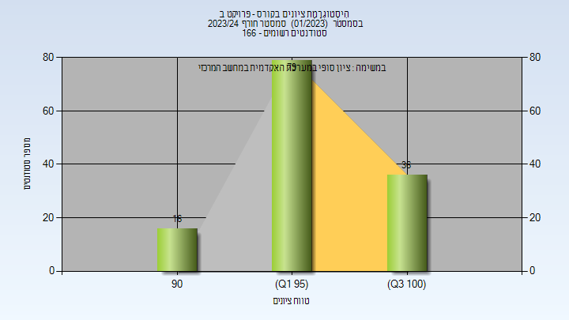

| סטודנטים | עברו/נכשלו | אחוז עוברים | ציון מינימלי | ציון מקסימלי | ממוצע | חציון |
| ---- | ---- | ---- | ---- | ---- | ---- | ---- |
| 132 | 132/0 | 100 | 90 | 100 | 97.115 | 97 |

<h2 id="202202">אביב 2023</h2>

| איש סגל | תפקיד |
| ---- | ---- |
| לברון יואש | מרצה - אחראי מקצוע |
| פלג נימרוד |  |
| ארז יוחנן |  |

<h3 id="202202-Finals">סופי</h3>

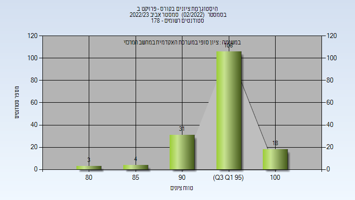

| סטודנטים | עברו/נכשלו | אחוז עוברים | ציון מינימלי | ציון מקסימלי | ממוצע | חציון |
| ---- | ---- | ---- | ---- | ---- | ---- | ---- |
| 157 | 157/0 | 100 | 80 | 100 | 96.221 | 97 |

<h2 id="202201">חורף 2022-2023</h2>

| איש סגל | תפקיד |
| ---- | ---- |
| לברון יואש | מרצה - אחראי מקצוע |
| פלג נימרוד |  |
| ארז יוחנן |  |

<h3 id="202201-Finals">סופי</h3>

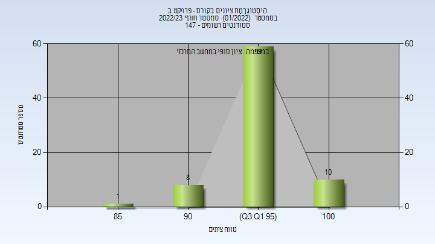

| סטודנטים | עברו/נכשלו | אחוז עוברים | ציון מינימלי | ציון מקסימלי | ממוצע | חציון |
| ---- | ---- | ---- | ---- | ---- | ---- | ---- |
| 78 | 78/0 | 100 | 88 | 100 | 96.923 | 97 |

<h2 id="202102">אביב 2022</h2>

| איש סגל | תפקיד |
| ---- | ---- |
| לברון יואש | מרצה - אחראי מקצוע |
| ארז יוחנן |  |
| פלג נימרוד |  |

<h3 id="202102-Finals">סופי</h3>

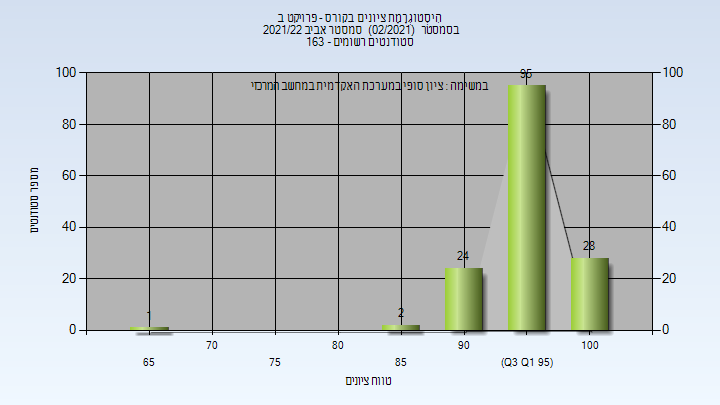

| סטודנטים | עברו/נכשלו | אחוז עוברים | ציון מינימלי | ציון מקסימלי | ממוצע | חציון |
| ---- | ---- | ---- | ---- | ---- | ---- | ---- |
| 150 | 150/0 | 100 | 67 | 100 | 96.513 | 97 |

<h2 id="202101">חורף 2021-2022</h2>

| איש סגל | תפקיד |
| ---- | ---- |
| לברון יואש | מרצה - אחראי מקצוע |
| ארז יוחנן | מתרגל |
| פלג נימרוד |  |

<h3 id="202101-Finals">סופי</h3>

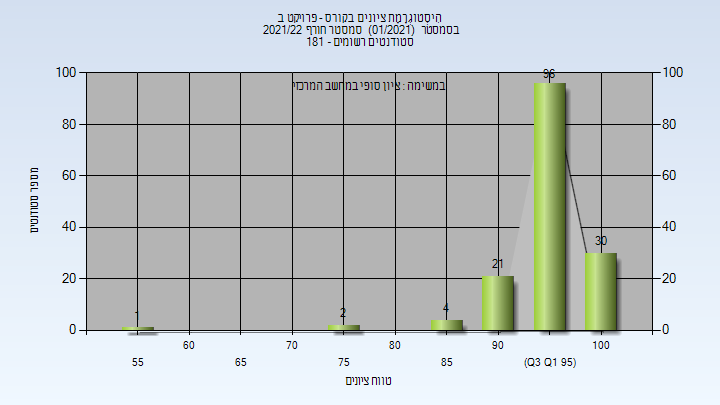

| סטודנטים | עברו/נכשלו | אחוז עוברים | ציון מינימלי | ציון מקסימלי | ממוצע | חציון |
| ---- | ---- | ---- | ---- | ---- | ---- | ---- |
| 154 | 154/0 | 100 | 55 | 100 | 96.162 | 97 |

<h2 id="202002">אביב 2021</h2>

| איש סגל | תפקיד |
| ---- | ---- |
| כהן ישראל | מרצה - אחראי מקצוע |
| ארז יוחנן | מתרגל |
| פלג נימרוד |  |

<h3 id="202002-Finals">סופי</h3>

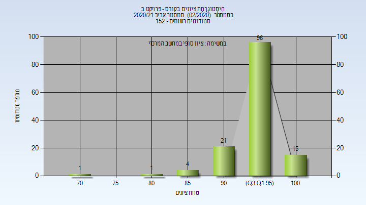

| סטודנטים | עברו/נכשלו | אחוז עוברים | ציון מינימלי | ציון מקסימלי | ממוצע | חציון |
| ---- | ---- | ---- | ---- | ---- | ---- | ---- |
| 138 | 138/0 | 100 | 70 | 100 | 96.08 | 97 |

<h2 id="202001">חורף 2020-2021</h2>

| איש סגל | תפקיד |
| ---- | ---- |
| כהן ישראל | מרצה - אחראי מקצוע |
| ארז יוחנן | מתרגל |

<h3 id="202001-Finals">סופי</h3>

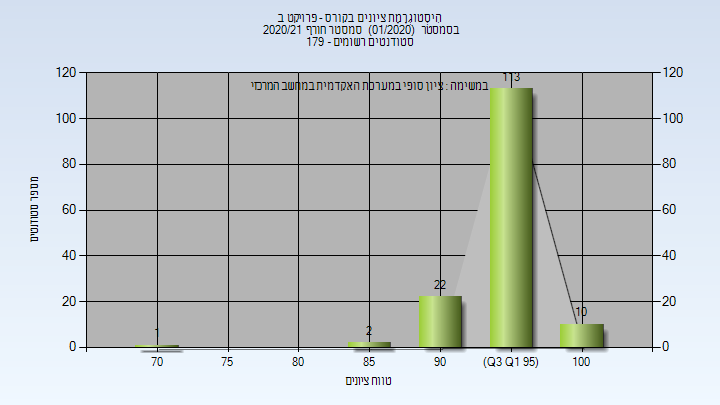

| סטודנטים | עברו/נכשלו | אחוז עוברים | ציון מינימלי | ציון מקסימלי | ממוצע | חציון |
| ---- | ---- | ---- | ---- | ---- | ---- | ---- |
| 148 | 148/0 | 100 | 70 | 100 | 96.108 | 97 |

<h2 id="201902">אביב 2020</h2>

| איש סגל | תפקיד |
| ---- | ---- |
| כהן ישראל | מרצה - אחראי מקצוע |
| ארז יוחנן | מתרגל |

<h3 id="201902-Finals">סופי</h3>

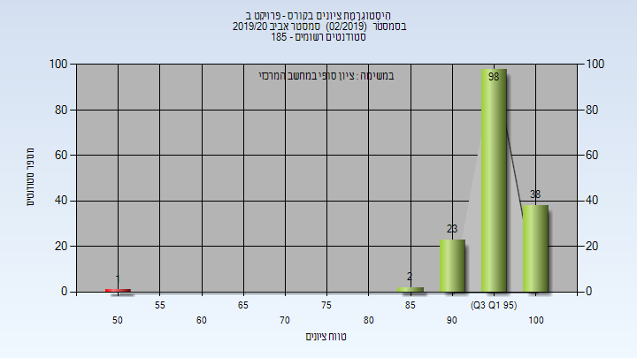

| סטודנטים | עברו/נכשלו | אחוז עוברים | ציון מינימלי | ציון מקסימלי | ממוצע | חציון |
| ---- | ---- | ---- | ---- | ---- | ---- | ---- |
| 162 | 161/1 | 99 | 50 | 100 | 96.784 | 97.5 |

<h2 id="201901">חורף 2019-2020</h2>

| איש סגל | תפקיד |
| ---- | ---- |
| כהן ישראל | מרצה - אחראי מקצוע |
| ארז יוחנן | מתרגל |

<h3 id="201901-Finals">סופי</h3>

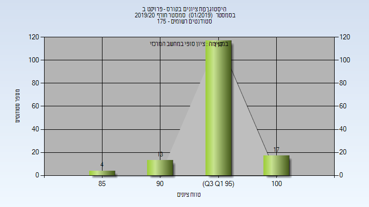

| סטודנטים | עברו/נכשלו | אחוז עוברים | ציון מינימלי | ציון מקסימלי | ממוצע | חציון |
| ---- | ---- | ---- | ---- | ---- | ---- | ---- |
| 151 | 151/0 | 100 | 85 | 100 | 96.536 | 97 |

<h2 id="201802">אביב 2019</h2>

| איש סגל | תפקיד |
| ---- | ---- |
| כהן ישראל | מרצה - אחראי מקצוע |
| ארז יוחנן | מתרגל |

<h3 id="201802-Finals">סופי</h3>

| סטודנטים | עברו/נכשלו | אחוז עוברים | ציון מינימלי | ציון מקסימלי | ממוצע | חציון |
| ---- | ---- | ---- | ---- | ---- | ---- | ---- |
| 117 | 117/0 | 100 | 88 | 100 | 96.496 | 97 |

<h2 id="201801">חורף 2018-2019</h2>

| איש סגל | תפקיד |
| ---- | ---- |
| כהן ישראל | מרצה - אחראי מקצוע |
| ארז יוחנן | מתרגל |

<h3 id="201801-Finals">סופי</h3>

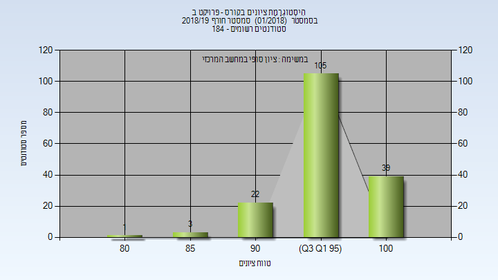

| סטודנטים | עברו/נכשלו | אחוז עוברים | ציון מינימלי | ציון מקסימלי | ממוצע | חציון |
| ---- | ---- | ---- | ---- | ---- | ---- | ---- |
| 170 | 170/0 | 100 | 80 | 100 | 96.794 | 97 |

<h2 id="201702">אביב 2018</h2>

| איש סגל | תפקיד |
| ---- | ---- |
| כהן ישראל | מרצה - אחראי מקצוע |
| ארז יוחנן | מתרגל |

<h3 id="201702-Finals">סופי</h3>

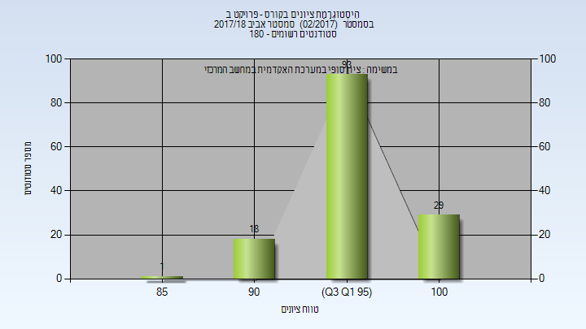

| סטודנטים | עברו/נכשלו | אחוז עוברים | ציון מינימלי | ציון מקסימלי | ממוצע | חציון |
| ---- | ---- | ---- | ---- | ---- | ---- | ---- |
| 141 | 141/0 | 100 | 85 | 100 | 97.184 | 98 |

<h2 id="201701">חורף 2017-2018</h2>

| איש סגל | תפקיד |
| ---- | ---- |
| כהן ישראל | מרצה - אחראי מקצוע |
| ארז יוחנן | מתרגל |

<h3 id="201701-Finals">סופי</h3>

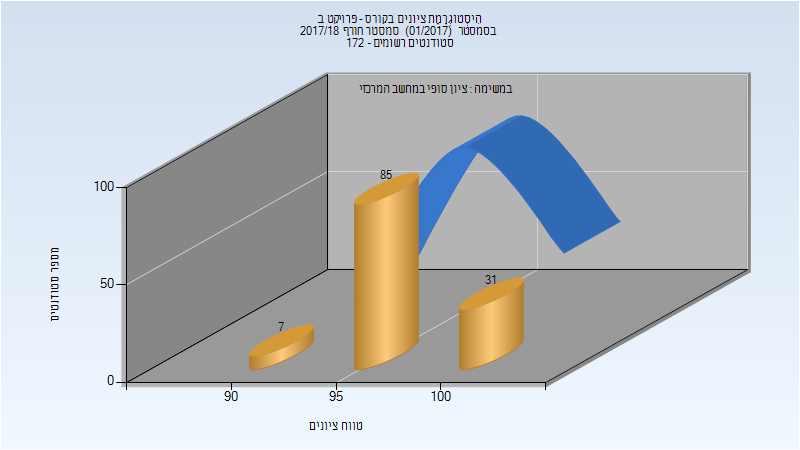

| סטודנטים | עברו/נכשלו | אחוז עוברים | ציון מינימלי | ציון מקסימלי | ממוצע | חציון |
| ---- | ---- | ---- | ---- | ---- | ---- | ---- |
| 123 | 123/0 | 100 | 90 | 100 | 97.358 | 97 |

<h2 id="201602">אביב 2017</h2>

| איש סגל | תפקיד |
| ---- | ---- |
| כהן ישראל | מרצה - אחראי מקצוע |
| ארז יוחנן | מתרגל |

<h3 id="201602-Finals">סופי</h3>

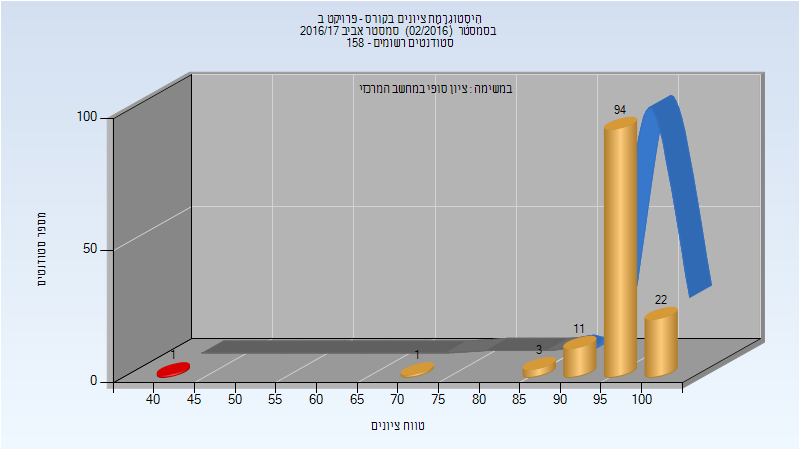

| סטודנטים | עברו/נכשלו | אחוז עוברים | ציון מינימלי | ציון מקסימלי | ממוצע | חציון |
| ---- | ---- | ---- | ---- | ---- | ---- | ---- |
| 132 | 131/1 | 99 | 40 | 100 | 96.311 | 97 |

<h2 id="201601">חורף 2016-2017</h2>

| איש סגל | תפקיד |
| ---- | ---- |
| כהן ישראל | מרצה - אחראי מקצוע |
| פלג נימרוד | מתרגל |
| ארז יוחנן | מתרגל |

<h3 id="201601-Finals">סופי</h3>

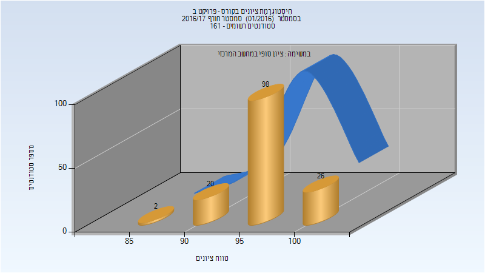

| סטודנטים | עברו/נכשלו | אחוז עוברים | ציון מינימלי | ציון מקסימלי | ממוצע | חציון |
| ---- | ---- | ---- | ---- | ---- | ---- | ---- |
| 146 | 146/0 | 100 | 85 | 100 | 96.781 | 97 |

<h2 id="201502">אביב 2016</h2>

| איש סגל | תפקיד |
| ---- | ---- |
| כהן ישראל | מרצה - אחראי מקצוע |
| ארז יוחנן | מתרגל |

<h3 id="201502-Finals">סופי</h3>

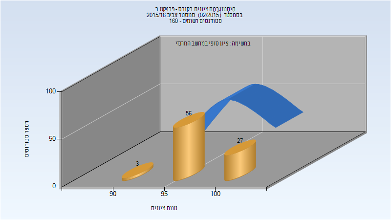

| סטודנטים | עברו/נכשלו | אחוז עוברים | ציון מינימלי | ציון מקסימלי | ממוצע | חציון |
| ---- | ---- | ---- | ---- | ---- | ---- | ---- |
| 86 | 86/0 | 100 | 93 | 100 | 98.174 | 98 |

<h2 id="201501">חורף 2015-2016</h2>

| איש סגל | תפקיד |
| ---- | ---- |
| כהן ישראל | מרצה - אחראי מקצוע |
| ארז יוחנן |  |

<h3 id="201501-Finals">סופי</h3>

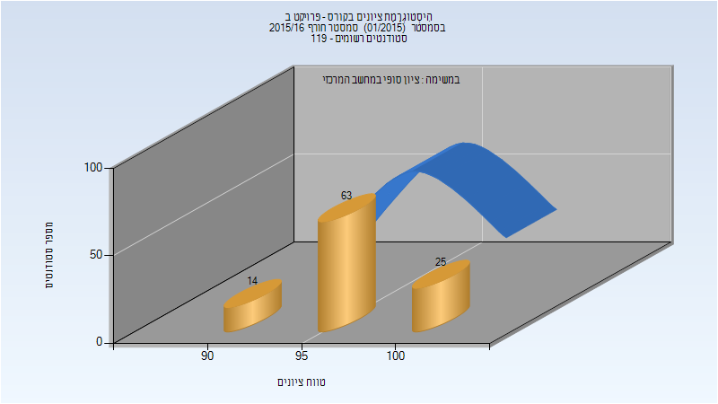

| סטודנטים | עברו/נכשלו | אחוז עוברים | ציון מינימלי | ציון מקסימלי | ממוצע | חציון |
| ---- | ---- | ---- | ---- | ---- | ---- | ---- |
| 102 | 102/0 | 100 | 90 | 100 | 97.088 | 98 |

<h2 id="201402">אביב 2015</h2>

| איש סגל | תפקיד |
| ---- | ---- |
| כהן ישראל | מרצה - אחראי מקצוע |
| ארז יוחנן |  |

