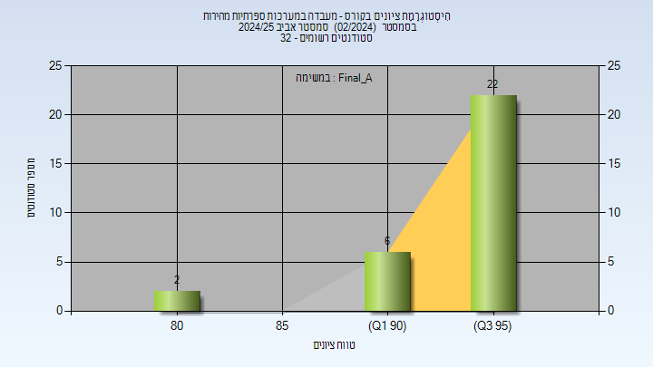
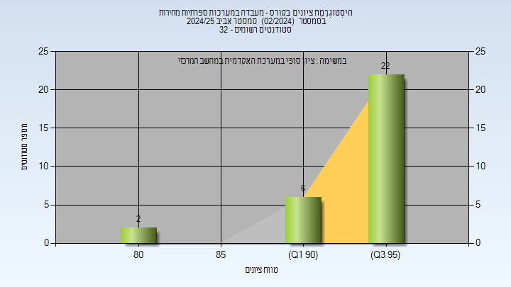
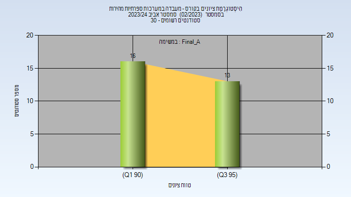
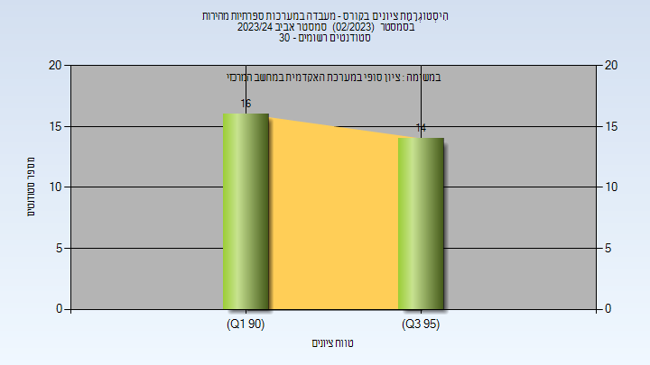

# 00450104 - מעבדה במערכות ספרתיות מהירות

**הערה**: מאגר ההיסטוגרמות הוקם עבור [CheeseFork](https://cheesefork.cf/), כלי בניית מערכת שעות עבור סטודנטים בטכניון. באתר בו אתם גולשים ניתן לעיין בהיסטוגרמות, אך הדרך היותר נוחה היא לעיין בהיסטוגרמות, ובמידע נוסף כגון חוות דעת של סטודנטים, באתר CheeseFork.

* [קיץ 2025](#202403)
* [אביב 2025](#202402)
  * [סופי מועד א'](#202402-Final_A)
  * [סופי](#202402-Finals)
* [אביב 2024](#202302)
  * [סופי מועד א'](#202302-Final_A)
  * [סופי](#202302-Finals)
* [חורף 2023-2024](#202301)

<h2 id="202403">קיץ 2025</h2>

| איש סגל | תפקיד |
| ---- | ---- |
| זילברשטיין מרק | מרצה |
| אורבך מרדכי | מרצה |
| פלג נימרוד | מדריך מעבדה |
| טלמון אינה | מדריך מעבדה |

<h2 id="202402">אביב 2025</h2>

| איש סגל | תפקיד |
| ---- | ---- |
| זילברשטיין מרק | מרצה |
| טלמון אינה | מרצה |
| אורבך מרדכי | מרצה |
| פלג נימרוד | מרצה |

<h3 id="202402-Final_A">סופי מועד א'</h3>

| סטודנטים | עברו/נכשלו | אחוז עוברים | ציון מינימלי | ציון מקסימלי | ממוצע | חציון |
| ---- | ---- | ---- | ---- | ---- | ---- | ---- |
| 30 | 30/0 | 100 | 83 | 97 | 94.6 | 95 |

<h3 id="202402-Finals">סופי</h3>

| סטודנטים | עברו/נכשלו | אחוז עוברים | ציון מינימלי | ציון מקסימלי | ממוצע | חציון |
| ---- | ---- | ---- | ---- | ---- | ---- | ---- |
| 30 | 30/0 | 100 | 83 | 97 | 94.6 | 95 |

<h2 id="202302">אביב 2024</h2>

| איש סגל | תפקיד |
| ---- | ---- |
| זילברשטיין מרק | מרצה - אחראי מקצוע |
| אורבך מרדכי | מדריך מעבדה |
| טלמון אינה | מדריך מעבדה |
| פלג נימרוד | מדריך מעבדה |

<h3 id="202302-Final_A">סופי מועד א'</h3>

| סטודנטים | עברו/נכשלו | אחוז עוברים | ציון מינימלי | ציון מקסימלי | ממוצע | חציון |
| ---- | ---- | ---- | ---- | ---- | ---- | ---- |
| 29 | 29/0 | 100 | 91 | 99 | 94.414 | 94 |

<h3 id="202302-Finals">סופי</h3>

| סטודנטים | עברו/נכשלו | אחוז עוברים | ציון מינימלי | ציון מקסימלי | ממוצע | חציון |
| ---- | ---- | ---- | ---- | ---- | ---- | ---- |
| 30 | 30/0 | 100 | 92 | 99 | 94.533 | 94 |

<h2 id="202301">חורף 2023-2024</h2>

| איש סגל | תפקיד |
| ---- | ---- |
| זילברשטיין מרק | מרצה - אחראי מקצוע |
| פלג נימרוד | מדריך מעבדה |
| טלמון אינה | מדריך מעבדה |
| אורבך מרדכי | מדריך מעבדה |

