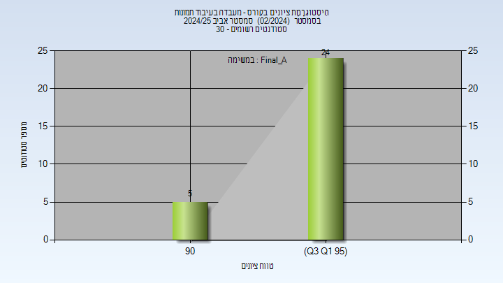
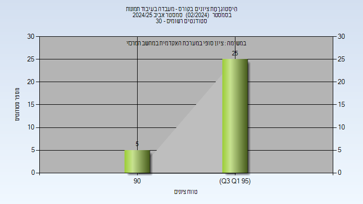
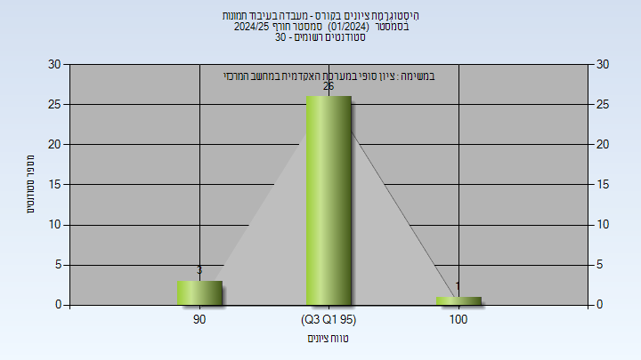
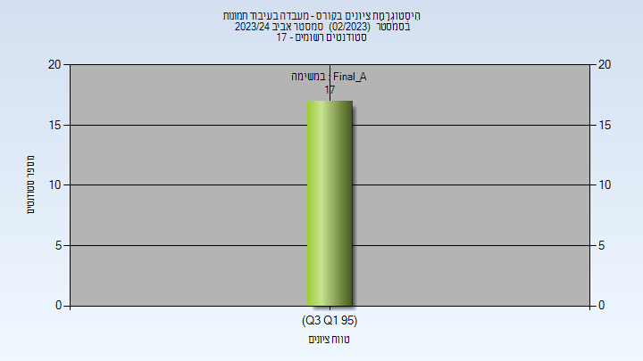
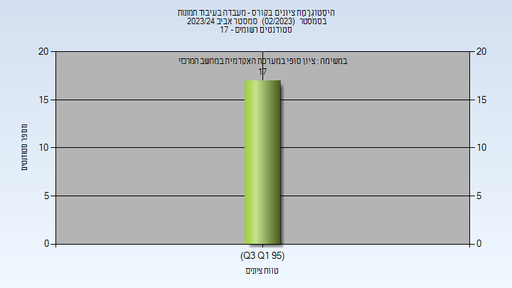
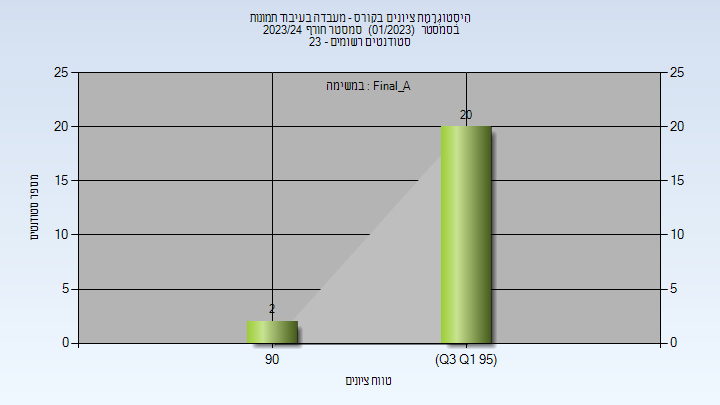

# 00450108 - מעבדה בעיבוד תמונות

**הערה**: מאגר ההיסטוגרמות הוקם עבור [CheeseFork](https://cheesefork.cf/), כלי בניית מערכת שעות עבור סטודנטים בטכניון. באתר בו אתם גולשים ניתן לעיין בהיסטוגרמות, אך הדרך היותר נוחה היא לעיין בהיסטוגרמות, ובמידע נוסף כגון חוות דעת של סטודנטים, באתר CheeseFork.

* [קיץ 2025](#202403)
* [אביב 2025](#202402)
  * [סופי מועד א'](#202402-Final_A)
  * [סופי](#202402-Finals)
* [חורף 2024-2025](#202401)
  * [סופי מועד א'](#202401-Final_A)
  * [סופי](#202401-Finals)
* [אביב 2024](#202302)
  * [סופי מועד א'](#202302-Final_A)
  * [סופי](#202302-Finals)
* [חורף 2023-2024](#202301)
  * [סופי מועד א'](#202301-Final_A)

<h2 id="202403">קיץ 2025</h2>

| איש סגל | תפקיד |
| ---- | ---- |
| טלמון אינה | מרצה |
| פלג נימרוד | מרצה |
| מיכאלי תומר | מרצה |
| אפלבוים אליעזר | מרצה |
| משה יאיר | מרצה |
| ארז יוחנן | מדריך מעבדה |
| אופיר הדס | מדריך מעבדה |

<h2 id="202402">אביב 2025</h2>

| איש סגל | תפקיד |
| ---- | ---- |
| גלבוע גיא | מרצה |
| פלג נימרוד | מרצה |
| משה יאיר | מרצה |
| אופיר הדס | מרצה |
| טלמון אינה | מרצה |
| אפלבוים אליעזר | מרצה |
| ארז יוחנן | מדריך מעבדה |

<h3 id="202402-Final_A">סופי מועד א'</h3>

| סטודנטים | עברו/נכשלו | אחוז עוברים | ציון מינימלי | ציון מקסימלי | ממוצע | חציון |
| ---- | ---- | ---- | ---- | ---- | ---- | ---- |
| 29 | 29/0 | 100 | 94 | 99 | 96.724 | 97 |

<h3 id="202402-Finals">סופי</h3>

| סטודנטים | עברו/נכשלו | אחוז עוברים | ציון מינימלי | ציון מקסימלי | ממוצע | חציון |
| ---- | ---- | ---- | ---- | ---- | ---- | ---- |
| 30 | 30/0 | 100 | 94 | 99 | 96.733 | 97 |

<h2 id="202401">חורף 2024-2025</h2>

| איש סגל | תפקיד |
| ---- | ---- |
| גלבוע גיא | מרצה - אחראי מקצוע |
| אפלבוים אליעזר | מדריך מעבדה |
| ארז יוחנן | מדריך מעבדה |
| טלמון אינה | מדריך מעבדה |
| משה יאיר | מדריך מעבדה |
| פלג נימרוד | מדריך מעבדה |

<h3 id="202401-Final_A">סופי מועד א'</h3>

| סטודנטים | עברו/נכשלו | אחוז עוברים | ציון מינימלי | ציון מקסימלי | ממוצע | חציון |
| ---- | ---- | ---- | ---- | ---- | ---- | ---- |
| 30 | 30/0 | 100 | 90 | 100 | 96.9 | 97 |

<h3 id="202401-Finals">סופי</h3>

| סטודנטים | עברו/נכשלו | אחוז עוברים | ציון מינימלי | ציון מקסימלי | ממוצע | חציון |
| ---- | ---- | ---- | ---- | ---- | ---- | ---- |
| 30 | 30/0 | 100 | 90 | 100 | 96.9 | 97 |

<h2 id="202302">אביב 2024</h2>

| איש סגל | תפקיד |
| ---- | ---- |
| גלבוע גיא | מרצה - אחראי מקצוע |
| משה יאיר | מדריך מעבדה |
| אפלבוים אליעזר | מדריך מעבדה |
| טלמון אינה | מדריך מעבדה |
| ארז יוחנן | מדריך מעבדה |

<h3 id="202302-Final_A">סופי מועד א'</h3>

| סטודנטים | עברו/נכשלו | אחוז עוברים | ציון מינימלי | ציון מקסימלי | ממוצע | חציון |
| ---- | ---- | ---- | ---- | ---- | ---- | ---- |
| 17 | 17/0 | 100 | 95 | 99 | 96.529 | 96 |

<h3 id="202302-Finals">סופי</h3>

| סטודנטים | עברו/נכשלו | אחוז עוברים | ציון מינימלי | ציון מקסימלי | ממוצע | חציון |
| ---- | ---- | ---- | ---- | ---- | ---- | ---- |
| 17 | 17/0 | 100 | 95 | 99 | 96.529 | 96 |

<h2 id="202301">חורף 2023-2024</h2>

| איש סגל | תפקיד |
| ---- | ---- |
| גלבוע גיא | מרצה - אחראי מקצוע |
| טלמון אינה |  |
| פלג נימרוד |  |
| אפלבוים אליעזר |  |
| ארז יוחנן |  |
| משה יאיר |  |

<h3 id="202301-Final_A">סופי מועד א'</h3>

| סטודנטים | עברו/נכשלו | אחוז עוברים | ציון מינימלי | ציון מקסימלי | ממוצע | חציון |
| ---- | ---- | ---- | ---- | ---- | ---- | ---- |
| 22 | 22/0 | 100 | 93.85 | 99.1 | 97.17 | 97.304 |

