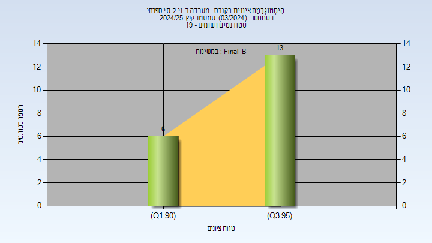
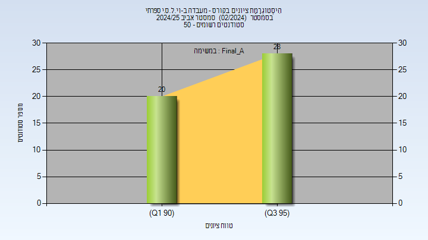
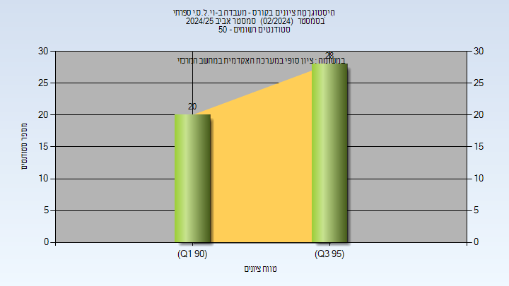
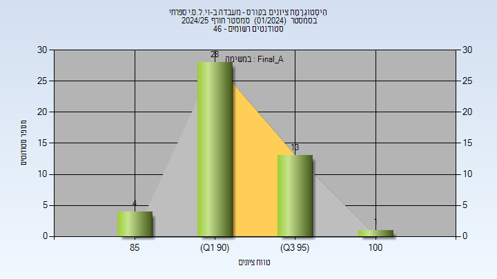
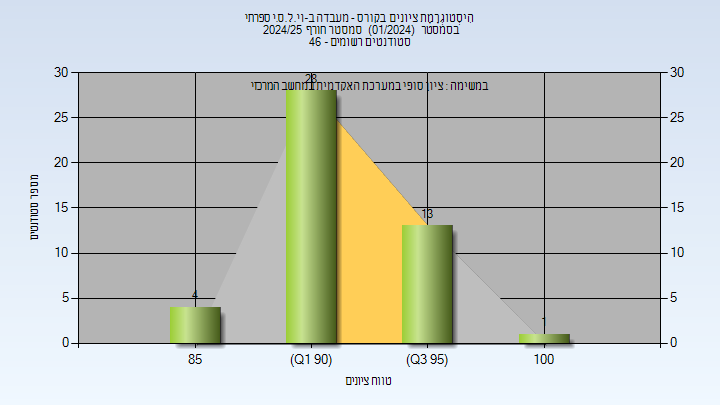
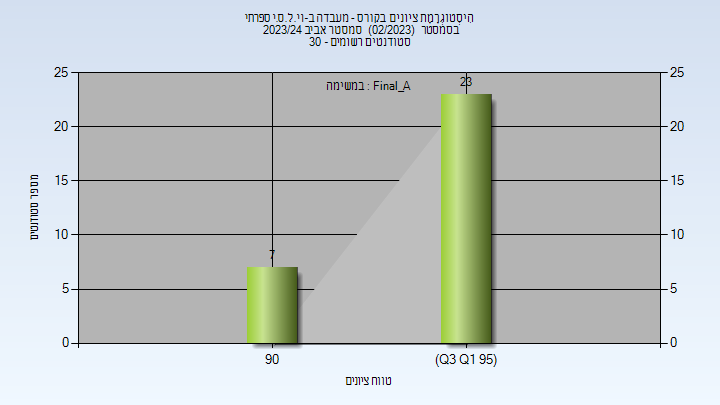
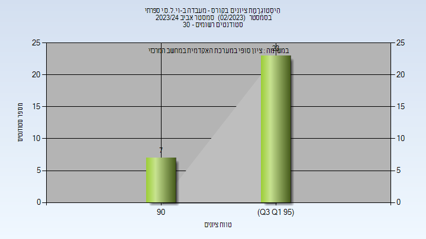

# 00450111 - מעבדה ב-וי.ל.ס.י ספרתי

**הערה**: מאגר ההיסטוגרמות הוקם עבור [CheeseFork](https://cheesefork.cf/), כלי בניית מערכת שעות עבור סטודנטים בטכניון. באתר בו אתם גולשים ניתן לעיין בהיסטוגרמות, אך הדרך היותר נוחה היא לעיין בהיסטוגרמות, ובמידע נוסף כגון חוות דעת של סטודנטים, באתר CheeseFork.

* [קיץ 2025](#202403)
  * [סופי מועד ב'](#202403-Final_B)
* [אביב 2025](#202402)
  * [סופי מועד א'](#202402-Final_A)
  * [סופי](#202402-Finals)
* [חורף 2024-2025](#202401)
  * [סופי מועד א'](#202401-Final_A)
  * [סופי](#202401-Finals)
* [אביב 2024](#202302)
  * [סופי מועד א'](#202302-Final_A)
  * [סופי](#202302-Finals)

<h2 id="202403">קיץ 2025</h2>

| איש סגל | תפקיד |
| ---- | ---- |
| פלג נימרוד | מרצה |
| גינוסר רן | מרצה |
| טלמון אינה | מרצה |
| סמואל גואל | מדריך מעבדה |
| נסראללה ריאד | מדריך מעבדה |

<h3 id="202403-Final_B">סופי מועד ב'</h3>

| סטודנטים | עברו/נכשלו | אחוז עוברים | ציון מינימלי | ציון מקסימלי | ממוצע | חציון |
| ---- | ---- | ---- | ---- | ---- | ---- | ---- |
| 19 | 19/0 | 100 | 91 | 99 | 95.947 | 96 |

<h2 id="202402">אביב 2025</h2>

| איש סגל | תפקיד |
| ---- | ---- |
| סמואל גואל | מרצה |
| נסראללה ריאד | מרצה |
| טלמון אינה | מרצה |
| גינוסר רן | מרצה |
| פלג נימרוד | מרצה |
| בן-חור רתם | סגל מנהלי - עם הרשאות מרצה אחראי |

<h3 id="202402-Final_A">סופי מועד א'</h3>

| סטודנטים | עברו/נכשלו | אחוז עוברים | ציון מינימלי | ציון מקסימלי | ממוצע | חציון |
| ---- | ---- | ---- | ---- | ---- | ---- | ---- |
| 48 | 48/0 | 100 | 92 | 99 | 95.188 | 95 |

<h3 id="202402-Finals">סופי</h3>

| סטודנטים | עברו/נכשלו | אחוז עוברים | ציון מינימלי | ציון מקסימלי | ממוצע | חציון |
| ---- | ---- | ---- | ---- | ---- | ---- | ---- |
| 48 | 48/0 | 100 | 92 | 99 | 95.188 | 95 |

<h2 id="202401">חורף 2024-2025</h2>

| איש סגל | תפקיד |
| ---- | ---- |
| גינוסר רן | מרצה - אחראי מקצוע |
| טלמון אינה | מדריך מעבדה |
| נסראללה ריאד | מדריך מעבדה |
| פלג נימרוד | מדריך מעבדה |
| סמואל גואל | מדריך מעבדה |

<h3 id="202401-Final_A">סופי מועד א'</h3>

| סטודנטים | עברו/נכשלו | אחוז עוברים | ציון מינימלי | ציון מקסימלי | ממוצע | חציון |
| ---- | ---- | ---- | ---- | ---- | ---- | ---- |
| 46 | 46/0 | 100 | 85 | 100 | 93.913 | 94 |

<h3 id="202401-Finals">סופי</h3>

| סטודנטים | עברו/נכשלו | אחוז עוברים | ציון מינימלי | ציון מקסימלי | ממוצע | חציון |
| ---- | ---- | ---- | ---- | ---- | ---- | ---- |
| 46 | 46/0 | 100 | 85 | 100 | 93.913 | 94 |

<h2 id="202302">אביב 2024</h2>

| איש סגל | תפקיד |
| ---- | ---- |
| גינוסר רן | מרצה - אחראי מקצוע |
| טלמון אינה | מדריך מעבדה |
| נסראללה ריאד | מדריך מעבדה |
| סמואל גואל | מדריך מעבדה |
| פלג נימרוד | מדריך מעבדה |

<h3 id="202302-Final_A">סופי מועד א'</h3>

| סטודנטים | עברו/נכשלו | אחוז עוברים | ציון מינימלי | ציון מקסימלי | ממוצע | חציון |
| ---- | ---- | ---- | ---- | ---- | ---- | ---- |
| 30 | 30/0 | 100 | 92 | 99 | 95.9 | 96 |

<h3 id="202302-Finals">סופי</h3>

| סטודנטים | עברו/נכשלו | אחוז עוברים | ציון מינימלי | ציון מקסימלי | ממוצע | חציון |
| ---- | ---- | ---- | ---- | ---- | ---- | ---- |
| 30 | 30/0 | 100 | 92 | 99 | 95.9 | 96 |

