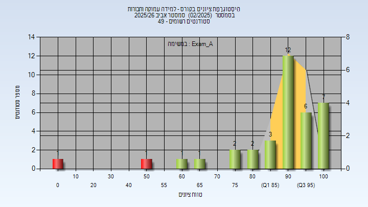
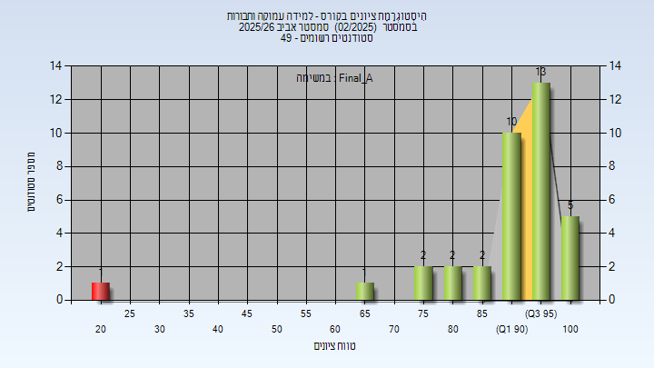
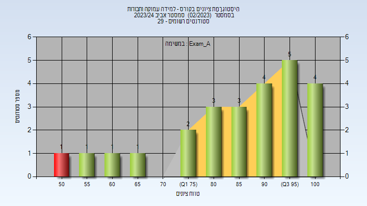

# 00460215 - למידה עמוקה וחבורות

**הערה**: מאגר ההיסטוגרמות הוקם עבור [CheeseFork](https://cheesefork.cf/), כלי בניית מערכת שעות עבור סטודנטים בטכניון. באתר בו אתם גולשים ניתן לעיין בהיסטוגרמות, אך הדרך היותר נוחה היא לעיין בהיסטוגרמות, ובמידע נוסף כגון חוות דעת של סטודנטים, באתר CheeseFork.

* [אביב 2026](#202502)
  * [מבחן מועד א'](#202502-Exam_A)
  * [סופי מועד א'](#202502-Final_A)
* [אביב 2024](#202302)
  * [מבחן מועד א'](#202302-Exam_A)

<h2 id="202502">אביב 2026</h2>

| איש סגל | תפקיד |
| ---- | ---- |
| מרון חגי | מרצה - אחראי מקצוע |
| הורדן שניר | מתרגל - עם הרשאות מרצה אחראי |

<h3 id="202502-Exam_A">מבחן מועד א'</h3>

| סטודנטים | עברו/נכשלו | אחוז עוברים | ציון מינימלי | ציון מקסימלי | ממוצע | חציון |
| ---- | ---- | ---- | ---- | ---- | ---- | ---- |
| 36 | 34/2 | 94 | 0 | 100 | 87.528 | 93 |

<h3 id="202502-Final_A">סופי מועד א'</h3>

| סטודנטים | עברו/נכשלו | אחוז עוברים | ציון מינימלי | ציון מקסימלי | ממוצע | חציון |
| ---- | ---- | ---- | ---- | ---- | ---- | ---- |
| 36 | 35/1 | 97 | 22 | 100 | 90.556 | 94.5 |

<h2 id="202302">אביב 2024</h2>

| איש סגל | תפקיד |
| ---- | ---- |
| מרון חגי | מרצה - אחראי מקצוע |
| הורדן שניר | מתרגל - עם הרשאות מרצה אחראי |

<h3 id="202302-Exam_A">מבחן מועד א'</h3>

| סטודנטים | עברו/נכשלו | אחוז עוברים | ציון מינימלי | ציון מקסימלי | ממוצע | חציון |
| ---- | ---- | ---- | ---- | ---- | ---- | ---- |
| 25 | 24/1 | 96 | 52 | 100 | 85.96 | 91 |

