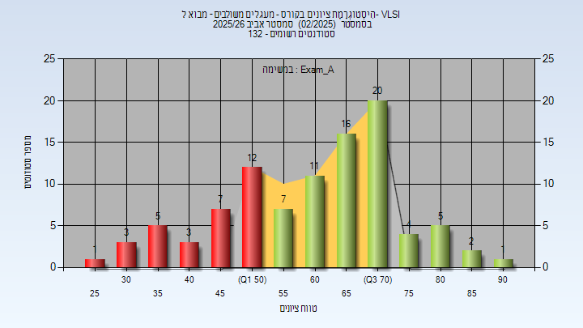
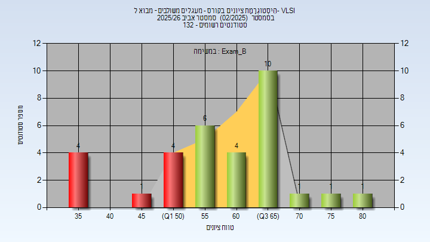
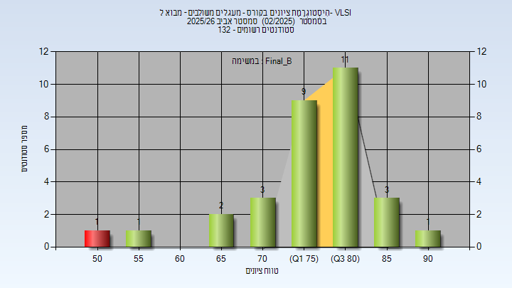
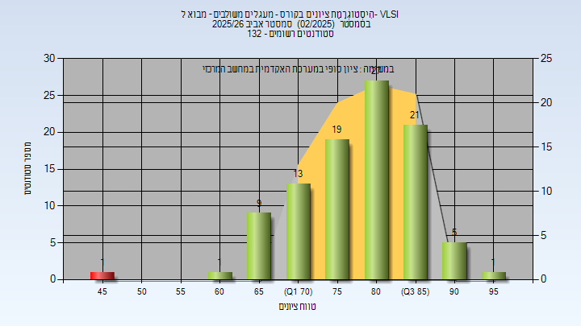

# 00460231 - מעגלים משולבים – מבוא ל- VLSI

**הערה**: מאגר ההיסטוגרמות הוקם עבור [CheeseFork](https://cheesefork.cf/), כלי בניית מערכת שעות עבור סטודנטים בטכניון. באתר בו אתם גולשים ניתן לעיין בהיסטוגרמות, אך הדרך היותר נוחה היא לעיין בהיסטוגרמות, ובמידע נוסף כגון חוות דעת של סטודנטים, באתר CheeseFork.

* [אביב 2026](#202502)
  * [מבחן מועד א'](#202502-Exam_A)
  * [סופי מועד א'](#202502-Final_A)
  * [מבחן מועד ב'](#202502-Exam_B)
  * [סופי מועד ב'](#202502-Final_B)
  * [סופי](#202502-Finals)

<h2 id="202502">אביב 2026</h2>

| איש סגל | תפקיד |
| ---- | ---- |
| כהן אריאל | מרצה - אחראי מקצוע |
| אחמד אסאלה | מתרגל - עם הרשאות מרצה אחראי |
| גבאי אורי | מתרגל - עם הרשאות מרצה אחראי |

<h3 id="202502-Exam_A">מבחן מועד א'</h3>

| סטודנטים | עברו/נכשלו | אחוז עוברים | ציון מינימלי | ציון מקסימלי | ממוצע | חציון |
| ---- | ---- | ---- | ---- | ---- | ---- | ---- |
| 97 | 66/31 | 68 | 26 | 90 | 61.546 | 64 |

<h3 id="202502-Final_A">סופי מועד א'</h3>

| סטודנטים | עברו/נכשלו | אחוז עוברים | ציון מינימלי | ציון מקסימלי | ממוצע | חציון |
| ---- | ---- | ---- | ---- | ---- | ---- | ---- |
| 97 | 96/1 | 99 | 47 | 95 | 79.361 | 81 |

<h3 id="202502-Exam_B">מבחן מועד ב'</h3>

| סטודנטים | עברו/נכשלו | אחוז עוברים | ציון מינימלי | ציון מקסימלי | ממוצע | חציון |
| ---- | ---- | ---- | ---- | ---- | ---- | ---- |
| 32 | 23/9 | 72 | 35 | 83 | 59.094 | 61 |

<h3 id="202502-Final_B">סופי מועד ב'</h3>

| סטודנטים | עברו/נכשלו | אחוז עוברים | ציון מינימלי | ציון מקסימלי | ממוצע | חציון |
| ---- | ---- | ---- | ---- | ---- | ---- | ---- |
| 31 | 30/1 | 97 | 50 | 91 | 77.903 | 79 |

<h3 id="202502-Finals">סופי</h3>

| סטודנטים | עברו/נכשלו | אחוז עוברים | ציון מינימלי | ציון מקסימלי | ממוצע | חציון |
| ---- | ---- | ---- | ---- | ---- | ---- | ---- |
| 97 | 96/1 | 99 | 47 | 95 | 79.361 | 81 |

