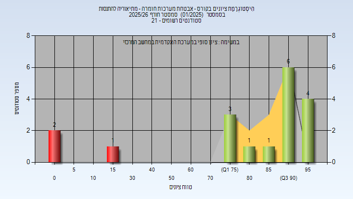

# 00480891 - אבטחת מערכות חומרה - מתיאוריה להתנסות

**הערה**: מאגר ההיסטוגרמות הוקם עבור [CheeseFork](https://cheesefork.cf/), כלי בניית מערכת שעות עבור סטודנטים בטכניון. באתר בו אתם גולשים ניתן לעיין בהיסטוגרמות, אך הדרך היותר נוחה היא לעיין בהיסטוגרמות, ובמידע נוסף כגון חוות דעת של סטודנטים, באתר CheeseFork.

* [חורף 2025-2026](#202501)
  * [סופי](#202501-Finals)
* [חורף 2021-2022](#202101)

<h2 id="202501">חורף 2025-2026</h2>

| איש סגל | תפקיד |
| ---- | ---- |
| מנדלסון אברהם | מרצה - אחראי מקצוע |
| עזריאל לאוניד | מרצה |

<h3 id="202501-Finals">סופי</h3>

| סטודנטים | עברו/נכשלו | אחוז עוברים | ציון מינימלי | ציון מקסימלי | ממוצע | חציון |
| ---- | ---- | ---- | ---- | ---- | ---- | ---- |
| 21 | 15/6 | 71 | 0 | 98 | 75.444 | 91 |

<h2 id="202101">חורף 2021-2022</h2>

| איש סגל | תפקיד |
| ---- | ---- |
| מנדלסון אברהם | מרצה - אחראי מקצוע |
| עזריאל לאוניד | מרצה |

