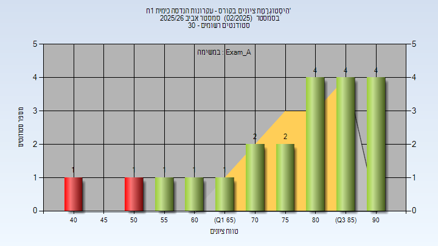
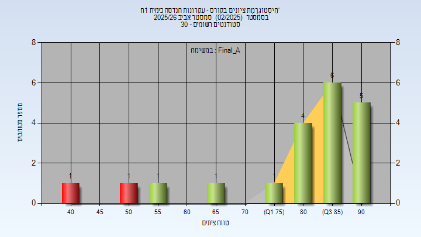

# 00540480 - עקרונות הנדסה כימית 1ח'

**הערה**: מאגר ההיסטוגרמות הוקם עבור [CheeseFork](https://cheesefork.cf/), כלי בניית מערכת שעות עבור סטודנטים בטכניון. באתר בו אתם גולשים ניתן לעיין בהיסטוגרמות, אך הדרך היותר נוחה היא לעיין בהיסטוגרמות, ובמידע נוסף כגון חוות דעת של סטודנטים, באתר CheeseFork.

* [אביב 2026](#202502)
  * [מבחן מועד א'](#202502-Exam_A)
  * [סופי מועד א'](#202502-Final_A)

<h2 id="202502">אביב 2026</h2>

| איש סגל | תפקיד |
| ---- | ---- |
| זינגר אסף יוסף | מרצה - אחראי מקצוע |
| פיצוטו עדן | מתרגל - עם הרשאות מרצה אחראי |
| ויזנבליט עופרי | מתרגל - עם הרשאות מרצה אחראי |
| אליזרוב אילנה | מתרגל - עם הרשאות מרצה אחראי |

<h3 id="202502-Exam_A">מבחן מועד א'</h3>

| סטודנטים | עברו/נכשלו | אחוז עוברים | ציון מינימלי | ציון מקסימלי | ממוצע | חציון |
| ---- | ---- | ---- | ---- | ---- | ---- | ---- |
| 21 | 19/2 | 90 | 43 | 93 | 76.952 | 82 |

<h3 id="202502-Final_A">סופי מועד א'</h3>

| סטודנטים | עברו/נכשלו | אחוז עוברים | ציון מינימלי | ציון מקסימלי | ממוצע | חציון |
| ---- | ---- | ---- | ---- | ---- | ---- | ---- |
| 20 | 18/2 | 90 | 43 | 94 | 80.25 | 86 |

