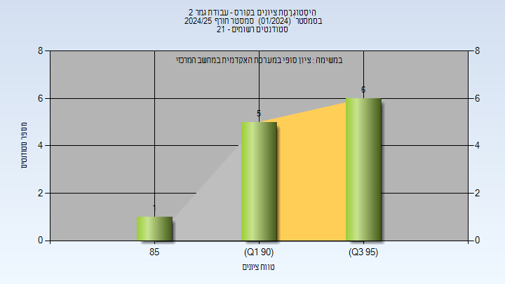

# 00640002 - עבודת גמר 2

**הערה**: מאגר ההיסטוגרמות הוקם עבור [CheeseFork](https://cheesefork.cf/), כלי בניית מערכת שעות עבור סטודנטים בטכניון. באתר בו אתם גולשים ניתן לעיין בהיסטוגרמות, אך הדרך היותר נוחה היא לעיין בהיסטוגרמות, ובמידע נוסף כגון חוות דעת של סטודנטים, באתר CheeseFork.

* [חורף 2024-2025](#202401)
  * [סופי](#202401-Finals)
* [חורף 2020-2021](#202001)
* [אביב 2020](#201902)
* [חורף 2018-2019](#201801)
  * [סופי](#201801-Finals)

<h2 id="202401">חורף 2024-2025</h2>

<h3 id="202401-Finals">סופי</h3>

| סטודנטים | עברו/נכשלו | אחוז עוברים | ציון מינימלי | ציון מקסימלי | ממוצע | חציון |
| ---- | ---- | ---- | ---- | ---- | ---- | ---- |
| 20 | 1/19 | 5 | 94 | 94 | 94 | 94 |

<h2 id="202001">חורף 2020-2021</h2>

<h2 id="201902">אביב 2020</h2>

<h2 id="201801">חורף 2018-2019</h2>

<h3 id="201801-Finals">סופי</h3>

| סטודנטים | עברו/נכשלו | אחוז עוברים | ציון מינימלי | ציון מקסימלי | ממוצע | חציון |
| ---- | ---- | ---- | ---- | ---- | ---- | ---- |
| 13 | 13/0 | 100 | 86 | 98 | 93.769 | 95 |

