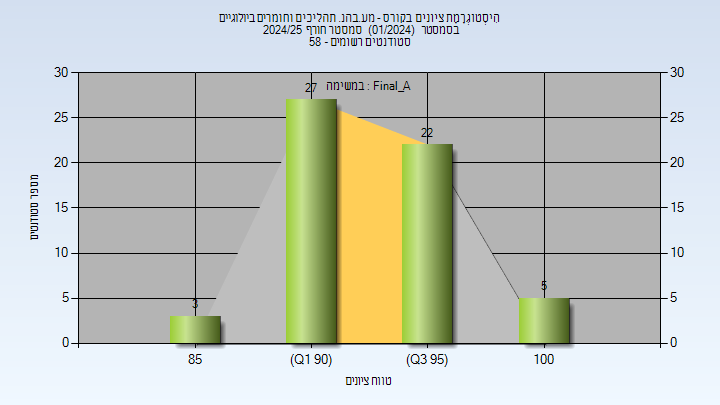

# 00640239 - מע.בהנ. תהליכים וחומרים ביולוגיים

**הערה**: מאגר ההיסטוגרמות הוקם עבור [CheeseFork](https://cheesefork.cf/), כלי בניית מערכת שעות עבור סטודנטים בטכניון. באתר בו אתם גולשים ניתן לעיין בהיסטוגרמות, אך הדרך היותר נוחה היא לעיין בהיסטוגרמות, ובמידע נוסף כגון חוות דעת של סטודנטים, באתר CheeseFork.

* [חורף 2024-2025](#202401)
  * [סופי מועד א'](#202401-Final_A)
  * [סופי](#202401-Finals)
* [חורף 2023-2024](#202301)
  * [סופי מועד א'](#202301-Final_A)
  * [סופי](#202301-Finals)
* [חורף 2022-2023](#202201)
  * [סופי מועד א'](#202201-Final_A)
  * [סופי](#202201-Finals)
* [חורף 2021-2022](#202101)
* [חורף 2020-2021](#202001)
  * [סופי מועד א'](#202001-Final_A)
  * [סופי](#202001-Finals)
* [חורף 2019-2020](#201901)
  * [סופי מועד א'](#201901-Final_A)
  * [סופי](#201901-Finals)
* [חורף 2018-2019](#201801)
  * [סופי מועד א'](#201801-Final_A)
  * [סופי](#201801-Finals)

<h2 id="202401">חורף 2024-2025</h2>

| איש סגל | תפקיד |
| ---- | ---- |
| לזמס אורי | מרצה - אחראי מקצוע |
| וייס ולריה | מתרגל |
| רוזנשטיין רו סימונה | מתרגל |
| ברנשטיין ליאורה | מתרגל |
| עואודה כיאן | מתרגל |
| ראשד בראאה | מתרגל |
| שטרית ליאור | מתרגל |

<h3 id="202401-Final_A">סופי מועד א'</h3>

| סטודנטים | עברו/נכשלו | אחוז עוברים | ציון מינימלי | ציון מקסימלי | ממוצע | חציון |
| ---- | ---- | ---- | ---- | ---- | ---- | ---- |
| 57 | 57/0 | 100 | 88 | 100 | 94.614 | 94 |

<h3 id="202401-Finals">סופי</h3>

| סטודנטים | עברו/נכשלו | אחוז עוברים | ציון מינימלי | ציון מקסימלי | ממוצע | חציון |
| ---- | ---- | ---- | ---- | ---- | ---- | ---- |
| 58 | 57/1 | 98 | 88 | 100 | 94.614 | 94 |

<h2 id="202301">חורף 2023-2024</h2>

| איש סגל | תפקיד |
| ---- | ---- |
| לזמס אורי | מרצה - אחראי מקצוע |
| הים רתם |  |
| וייס ולריה |  |
| שטרית ליאור |  |
| ברנשטיין ליאורה |  |
| עואודה כיאן |  |
| שקולניקוב חני |  |

<h3 id="202301-Final_A">סופי מועד א'</h3>

| סטודנטים | עברו/נכשלו | אחוז עוברים | ציון מינימלי | ציון מקסימלי | ממוצע | חציון |
| ---- | ---- | ---- | ---- | ---- | ---- | ---- |
| 55 | 55/0 | 100 | 82 | 100 | 94.036 | 94 |

<h3 id="202301-Finals">סופי</h3>

| סטודנטים | עברו/נכשלו | אחוז עוברים | ציון מינימלי | ציון מקסימלי | ממוצע | חציון |
| ---- | ---- | ---- | ---- | ---- | ---- | ---- |
| 55 | 55/0 | 100 | 82 | 100 | 94.036 | 94 |

<h2 id="202201">חורף 2022-2023</h2>

| איש סגל | תפקיד |
| ---- | ---- |
| שפיגלמן אבי | מרצה - אחראי מקצוע |
| סקרביאנסקיס ניב |  |
| נסייר ראוף |  |
| וייס ולריה |  |
| חלי קרוליין |  |
| צור יהונתן |  |
| ברנשטיין ליאורה |  |

<h3 id="202201-Final_A">סופי מועד א'</h3>

| סטודנטים | עברו/נכשלו | אחוז עוברים | ציון מינימלי | ציון מקסימלי | ממוצע | חציון |
| ---- | ---- | ---- | ---- | ---- | ---- | ---- |
| 44 | 44/0 | 100 | 82 | 97 | 91.682 | 92 |

<h3 id="202201-Finals">סופי</h3>

| סטודנטים | עברו/נכשלו | אחוז עוברים | ציון מינימלי | ציון מקסימלי | ממוצע | חציון |
| ---- | ---- | ---- | ---- | ---- | ---- | ---- |
| 44 | 44/0 | 100 | 82 | 97 | 91.682 | 92 |

<h2 id="202101">חורף 2021-2022</h2>

| איש סגל | תפקיד |
| ---- | ---- |
| לזמס אורי | מרצה - אחראי מקצוע |
| רומנו אלון |  |
| נסייר ראוף |  |
| הים רתם |  |
| שקולניקוב חני |  |
| חנוכה ענבל |  |
| חמלניק אולג |  |

<h2 id="202001">חורף 2020-2021</h2>

| איש סגל | תפקיד |
| ---- | ---- |
| לזמס אורי | מרצה - אחראי מקצוע |
| חמלניק אולג |  |
| אנגלברג שירה |  |
| שקולניקוב חני |  |
| חנוכה ענבל |  |
| רומנו אלון |  |
| נסייר ראוף |  |
| הים רתם |  |

<h3 id="202001-Final_A">סופי מועד א'</h3>

| סטודנטים | עברו/נכשלו | אחוז עוברים | ציון מינימלי | ציון מקסימלי | ממוצע | חציון |
| ---- | ---- | ---- | ---- | ---- | ---- | ---- |
| 52 | 52/0 | 100 | 82 | 100 | 90.538 | 91 |

<h3 id="202001-Finals">סופי</h3>

| סטודנטים | עברו/נכשלו | אחוז עוברים | ציון מינימלי | ציון מקסימלי | ממוצע | חציון |
| ---- | ---- | ---- | ---- | ---- | ---- | ---- |
| 52 | 52/0 | 100 | 82 | 100 | 90.538 | 91 |

<h2 id="201901">חורף 2019-2020</h2>

| איש סגל | תפקיד |
| ---- | ---- |
| לזמס אורי | מרצה - אחראי מקצוע |
| חמלניק אולג | מדריך מעבדה |
| חנוכה ענבל | מדריך מעבדה |
| רומנו אלון | מדריך מעבדה |
| נסייר ראוף | מדריך מעבדה |
| כהן שרי | מדריך מעבדה |
| הים רתם | מדריך מעבדה |

<h3 id="201901-Final_A">סופי מועד א'</h3>

| סטודנטים | עברו/נכשלו | אחוז עוברים | ציון מינימלי | ציון מקסימלי | ממוצע | חציון |
| ---- | ---- | ---- | ---- | ---- | ---- | ---- |
| 45 | 45/0 | 100 | 78 | 95 | 86.692 | 87 |

<h3 id="201901-Finals">סופי</h3>

| סטודנטים | עברו/נכשלו | אחוז עוברים | ציון מינימלי | ציון מקסימלי | ממוצע | חציון |
| ---- | ---- | ---- | ---- | ---- | ---- | ---- |
| 45 | 45/0 | 100 | 78 | 95 | 86.667 | 87 |

<h2 id="201801">חורף 2018-2019</h2>

| איש סגל | תפקיד |
| ---- | ---- |
| לזמס אורי | מרצה - אחראי מקצוע |
| רומנו אלון |  |
| קרויטורו סדג צוף | מדריך מעבדה |
| חנוכה ענבל | מדריך מעבדה |
| אנגלברג שירה | מדריך מעבדה |
| חמלניק אולג | מדריך מעבדה |

<h3 id="201801-Final_A">סופי מועד א'</h3>

| סטודנטים | עברו/נכשלו | אחוז עוברים | ציון מינימלי | ציון מקסימלי | ממוצע | חציון |
| ---- | ---- | ---- | ---- | ---- | ---- | ---- |
| 67 | 67/0 | 100 | 84 | 100 | 93.239 | 94 |

<h3 id="201801-Finals">סופי</h3>

| סטודנטים | עברו/נכשלו | אחוז עוברים | ציון מינימלי | ציון מקסימלי | ממוצע | חציון |
| ---- | ---- | ---- | ---- | ---- | ---- | ---- |
| 67 | 67/0 | 100 | 84 | 100 | 93.239 | 94 |

