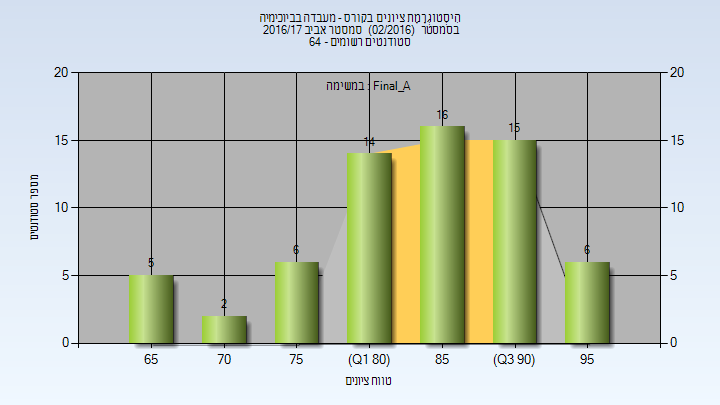

# 00640325 - מעבדה בביוכימיה

**הערה**: מאגר ההיסטוגרמות הוקם עבור [CheeseFork](https://cheesefork.cf/), כלי בניית מערכת שעות עבור סטודנטים בטכניון. באתר בו אתם גולשים ניתן לעיין בהיסטוגרמות, אך הדרך היותר נוחה היא לעיין בהיסטוגרמות, ובמידע נוסף כגון חוות דעת של סטודנטים, באתר CheeseFork.

* [אביב 2025](#202402)
* [אביב 2024](#202302)
  * [סופי מועד א'](#202302-Final_A)
  * [סופי](#202302-Finals)
* [אביב 2023](#202202)
  * [סופי מועד א'](#202202-Final_A)
  * [סופי](#202202-Finals)
* [אביב 2022](#202102)
  * [סופי מועד א'](#202102-Final_A)
  * [סופי](#202102-Finals)
* [אביב 2021](#202002)
  * [סופי מועד א'](#202002-Final_A)
  * [סופי](#202002-Finals)
* [אביב 2020](#201902)
  * [סופי מועד א'](#201902-Final_A)
  * [סופי](#201902-Finals)
* [אביב 2019](#201802)
  * [סופי מועד א'](#201802-Final_A)
  * [סופי](#201802-Finals)
* [אביב 2018](#201702)
  * [סופי מועד א'](#201702-Final_A)
  * [סופי](#201702-Finals)
* [אביב 2017](#201602)
  * [סופי מועד א'](#201602-Final_A)
  * [סופי](#201602-Finals)

<h2 id="202402">אביב 2025</h2>

| איש סגל | תפקיד |
| ---- | ---- |
| מזרחי בעז | מרצה - אחראי מקצוע |
| כהן גדול גלי מוחטרם | מתרגל |
| סכס אדהם | מתרגל |
| עמירם גבריאלה | מתרגל |
| פלד סתיו | מתרגל |
| וייס ולריה | מתרגל |
| שטרית ליאור | מתרגל |
| פרידמן ניצן | מתרגל |
| פרוינדליך עדן | מתרגל |

<h2 id="202302">אביב 2024</h2>

| איש סגל | תפקיד |
| ---- | ---- |
| מזרחי בעז | מדריך מעבדה - עם הרשאות מרצה אחראי |
| זיבק יארא | מדריך מעבדה |
| אשקר ערין | מדריך מעבדה |
| פלד סתיו | מדריך מעבדה |
| פרוינדליך עדן | מדריך מעבדה |
| וייס ולריה | מדריך מעבדה |
| סכס אדהם | מדריך מעבדה |
| כהן גדול גלי מוחטרם | מדריך מעבדה |

<h3 id="202302-Final_A">סופי מועד א'</h3>

| סטודנטים | עברו/נכשלו | אחוז עוברים | ציון מינימלי | ציון מקסימלי | ממוצע | חציון |
| ---- | ---- | ---- | ---- | ---- | ---- | ---- |
| 65 | 65/0 | 100 | 68 | 98 | 88.523 | 90 |

<h3 id="202302-Finals">סופי</h3>

| סטודנטים | עברו/נכשלו | אחוז עוברים | ציון מינימלי | ציון מקסימלי | ממוצע | חציון |
| ---- | ---- | ---- | ---- | ---- | ---- | ---- |
| 65 | 65/0 | 100 | 68 | 98 | 88.523 | 90 |

<h2 id="202202">אביב 2023</h2>

| איש סגל | תפקיד |
| ---- | ---- |
| שלוש עדן | מתרגל - עם הרשאות מרצה אחראי |
| וייס ולריה | מתרגל - עם הרשאות מרצה אחראי |
| צור יהונתן | מתרגל - עם הרשאות מרצה אחראי |
| אשקר ערין | מתרגל - עם הרשאות מרצה אחראי |
| זיבק יארא | מתרגל - עם הרשאות מרצה אחראי |
| משה מיכל | מתרגל - עם הרשאות מרצה אחראי |
| מזרחי בעז | מדריך מעבדה - עם הרשאות מרצה אחראי |

<h3 id="202202-Final_A">סופי מועד א'</h3>

| סטודנטים | עברו/נכשלו | אחוז עוברים | ציון מינימלי | ציון מקסימלי | ממוצע | חציון |
| ---- | ---- | ---- | ---- | ---- | ---- | ---- |
| 72 | 72/0 | 100 | 55 | 99 | 88.194 | 90 |

<h3 id="202202-Finals">סופי</h3>

| סטודנטים | עברו/נכשלו | אחוז עוברים | ציון מינימלי | ציון מקסימלי | ממוצע | חציון |
| ---- | ---- | ---- | ---- | ---- | ---- | ---- |
| 72 | 72/0 | 100 | 55 | 99 | 88.197 | 90 |

<h2 id="202102">אביב 2022</h2>

| איש סגל | תפקיד |
| ---- | ---- |
| פלד סתיו | מתרגל |
| וייס ולריה | מתרגל |
| אשקר ערין | מתרגל |
| פרוינדליך עדן | מתרגל |
| שלוש עדן | מתרגל |
| מזרחי בעז | מדריך מעבדה - עם הרשאות מרצה אחראי |

<h3 id="202102-Final_A">סופי מועד א'</h3>

| סטודנטים | עברו/נכשלו | אחוז עוברים | ציון מינימלי | ציון מקסימלי | ממוצע | חציון |
| ---- | ---- | ---- | ---- | ---- | ---- | ---- |
| 56 | 56/0 | 100 | 65 | 97 | 86.679 | 87.5 |

<h3 id="202102-Finals">סופי</h3>

| סטודנטים | עברו/נכשלו | אחוז עוברים | ציון מינימלי | ציון מקסימלי | ממוצע | חציון |
| ---- | ---- | ---- | ---- | ---- | ---- | ---- |
| 56 | 56/0 | 100 | 65 | 97 | 86.679 | 87.5 |

<h2 id="202002">אביב 2021</h2>

| איש סגל | תפקיד |
| ---- | ---- |
| מירון-הולץ אסתר | מרצה - אחראי מקצוע |
| פרידמן אברהם ברוך | מתרגל |
| חרזאללה נידאא | מתרגל |
| ביתן אביעד - מש | מתרגל |
| מלמוד מיטל | מתרגל |
| משה מיכל | מתרגל |
| כהן ליטל | מתרגל |

<h3 id="202002-Final_A">סופי מועד א'</h3>

| סטודנטים | עברו/נכשלו | אחוז עוברים | ציון מינימלי | ציון מקסימלי | ממוצע | חציון |
| ---- | ---- | ---- | ---- | ---- | ---- | ---- |
| 46 | 45/1 | 98 | 51 | 97 | 89.043 | 90.5 |

<h3 id="202002-Finals">סופי</h3>

| סטודנטים | עברו/נכשלו | אחוז עוברים | ציון מינימלי | ציון מקסימלי | ממוצע | חציון |
| ---- | ---- | ---- | ---- | ---- | ---- | ---- |
| 46 | 45/1 | 98 | 51 | 97 | 89.043 | 90.5 |

<h2 id="201902">אביב 2020</h2>

| איש סגל | תפקיד |
| ---- | ---- |
| מזרחי בעז | מרצה - אחראי מקצוע |
| חרזאללה נידאא | מתרגל |
| גרהם סופיה | מדריך מעבדה |
| מלמוד מיטל | מדריך מעבדה |
| גלי סיון | מדריך מעבדה |
| פרידמן אברהם ברוך | מדריך מעבדה |

<h3 id="201902-Final_A">סופי מועד א'</h3>

| סטודנטים | עברו/נכשלו | אחוז עוברים | ציון מינימלי | ציון מקסימלי | ממוצע | חציון |
| ---- | ---- | ---- | ---- | ---- | ---- | ---- |
| 36 | 36/0 | 100 | 58 | 96 | 86.556 | 89.5 |

<h3 id="201902-Finals">סופי</h3>

| סטודנטים | עברו/נכשלו | אחוז עוברים | ציון מינימלי | ציון מקסימלי | ממוצע | חציון |
| ---- | ---- | ---- | ---- | ---- | ---- | ---- |
| 36 | 36/0 | 100 | 58 | 96 | 86.556 | 89.5 |

<h2 id="201802">אביב 2019</h2>

| איש סגל | תפקיד |
| ---- | ---- |
| מזרחי בעז | מרצה - אחראי מקצוע |
| פרידמן אברהם ברוך | מדריך מעבדה |
| גלי סיון | מדריך מעבדה |
| טרזי הילה | מדריך מעבדה |
| מלמוד מיטל | מדריך מעבדה |
| רוזנברג מיכל | מדריך מעבדה |
| גרהם סופיה | מדריך מעבדה |

<h3 id="201802-Final_A">סופי מועד א'</h3>

| סטודנטים | עברו/נכשלו | אחוז עוברים | ציון מינימלי | ציון מקסימלי | ממוצע | חציון |
| ---- | ---- | ---- | ---- | ---- | ---- | ---- |
| 41 | 41/0 | 100 | 76 | 96 | 86.317 | 86 |

<h3 id="201802-Finals">סופי</h3>

| סטודנטים | עברו/נכשלו | אחוז עוברים | ציון מינימלי | ציון מקסימלי | ממוצע | חציון |
| ---- | ---- | ---- | ---- | ---- | ---- | ---- |
| 42 | 42/0 | 100 | 76 | 96 | 86.476 | 86.5 |

<h2 id="201702">אביב 2018</h2>

| איש סגל | תפקיד |
| ---- | ---- |
| מזרחי בעז | מדריך מעבדה - עם הרשאות מרצה אחראי |
| רוזנברג מיכל |  |
| קצב הדס |  |
| גלי סיון |  |
| טרזי הילה |  |
| גרהם סופיה |  |
| עליאן מוחמד |  |

<h3 id="201702-Final_A">סופי מועד א'</h3>

| סטודנטים | עברו/נכשלו | אחוז עוברים | ציון מינימלי | ציון מקסימלי | ממוצע | חציון |
| ---- | ---- | ---- | ---- | ---- | ---- | ---- |
| 62 | 62/0 | 100 | 64 | 94 | 83.355 | 85.5 |

<h3 id="201702-Finals">סופי</h3>

| סטודנטים | עברו/נכשלו | אחוז עוברים | ציון מינימלי | ציון מקסימלי | ממוצע | חציון |
| ---- | ---- | ---- | ---- | ---- | ---- | ---- |
| 62 | 62/0 | 100 | 64 | 94 | 83.355 | 85.5 |

<h2 id="201602">אביב 2017</h2>

| איש סגל | תפקיד |
| ---- | ---- |
| מזרחי בעז | מרצה - אחראי מקצוע |
| קצב הדס | מתרגל |
| חיימוב יורי | מתרגל |
| רוזנברג מיכל | מתרגל |
| כהן נועה | מתרגל |
| גרהם סופיה | מתרגל |
| טרזי הילה | מתרגל |
| גלי סיון |  |

<h3 id="201602-Final_A">סופי מועד א'</h3>

| סטודנטים | עברו/נכשלו | אחוז עוברים | ציון מינימלי | ציון מקסימלי | ממוצע | חציון |
| ---- | ---- | ---- | ---- | ---- | ---- | ---- |
| 64 | 64/0 | 100 | 66 | 97 | 85.094 | 86 |

<h3 id="201602-Finals">סופי</h3>

| סטודנטים | עברו/נכשלו | אחוז עוברים | ציון מינימלי | ציון מקסימלי | ממוצע | חציון |
| ---- | ---- | ---- | ---- | ---- | ---- | ---- |
| 64 | 64/0 | 100 | 66 | 97 | 85.094 | 86 |

