# 00640413 - מעבדה במיקרוביולוגיה

**הערה**: מאגר ההיסטוגרמות הוקם עבור [CheeseFork](https://cheesefork.cf/), כלי בניית מערכת שעות עבור סטודנטים בטכניון. באתר בו אתם גולשים ניתן לעיין בהיסטוגרמות, אך הדרך היותר נוחה היא לעיין בהיסטוגרמות, ובמידע נוסף כגון חוות דעת של סטודנטים, באתר CheeseFork.

* [אביב 2025](#202402)
* [אביב 2024](#202302)
  * [סופי מועד א'](#202302-Final_A)
  * [סופי](#202302-Finals)
* [אביב 2023](#202202)
  * [סופי מועד א'](#202202-Final_A)
  * [סופי](#202202-Finals)
* [אביב 2022](#202102)
  * [סופי מועד א'](#202102-Final_A)
  * [סופי](#202102-Finals)
* [אביב 2021](#202002)
  * [סופי מועד א'](#202002-Final_A)
  * [סופי](#202002-Finals)
* [אביב 2020](#201902)
  * [סופי מועד א'](#201902-Final_A)
  * [סופי](#201902-Finals)
* [אביב 2019](#201802)
  * [סופי מועד א'](#201802-Final_A)
  * [סופי](#201802-Finals)
* [אביב 2018](#201702)
  * [סופי מועד א'](#201702-Final_A)
  * [סופי](#201702-Finals)
* [אביב 2017](#201602)
  * [סופי מועד א'](#201602-Final_A)
  * [סופי](#201602-Finals)
* [אביב 2016](#201502)
  * [סופי מועד א'](#201502-Final_A)
  * [סופי](#201502-Finals)

<h2 id="202402">אביב 2025</h2>

| איש סגל | תפקיד |
| ---- | ---- |
| רייזל יצחק | מרצה - אחראי מקצוע |
| יהישלום ניצן | מתרגל |
| אבו חמד חנאן | מתרגל |
| גנון אור | מתרגל |
| גנץ מיכאלה | מתרגל |
| זלוטניק הדר | מתרגל |
| רפאל גילי | מתרגל |
| מחזומי מוחמד | מתרגל |
| אביטבול שנהב | מתרגל |

<h2 id="202302">אביב 2024</h2>

| איש סגל | תפקיד |
| ---- | ---- |
| רייזל יצחק | מדריך מעבדה - עם הרשאות מרצה אחראי |
| מחזומי מוחמד | מדריך מעבדה |
| יהישלום ניצן | מדריך מעבדה |
| אביטבול שנהב | מדריך מעבדה |
| קצלניק שקד | מדריך מעבדה |
| גנון אור | מדריך מעבדה |
| אבו חמד חנאן | מדריך מעבדה |
| שמש מור | מדריך מעבדה |
| יהודה נופר | מדריך מעבדה |

<h3 id="202302-Final_A">סופי מועד א'</h3>

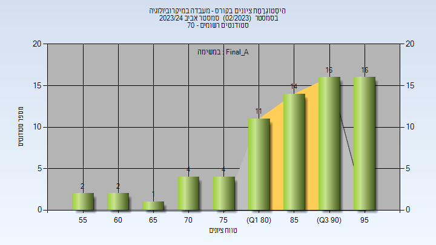

| סטודנטים | עברו/נכשלו | אחוז עוברים | ציון מינימלי | ציון מקסימלי | ממוצע | חציון |
| ---- | ---- | ---- | ---- | ---- | ---- | ---- |
| 70 | 70/0 | 100 | 55 | 99 | 86.1 | 87.5 |

<h3 id="202302-Finals">סופי</h3>

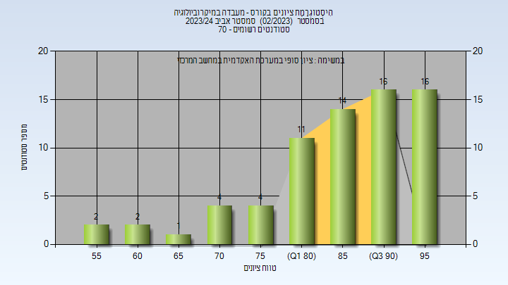

| סטודנטים | עברו/נכשלו | אחוז עוברים | ציון מינימלי | ציון מקסימלי | ממוצע | חציון |
| ---- | ---- | ---- | ---- | ---- | ---- | ---- |
| 70 | 70/0 | 100 | 55 | 99 | 86.1 | 87.5 |

<h2 id="202202">אביב 2023</h2>

| איש סגל | תפקיד |
| ---- | ---- |
| ירון סימה | מדריך מעבדה - עם הרשאות מרצה אחראי |
| יהודה נופר | מדריך מעבדה |
| שמש מור | מדריך מעבדה |
| כהן מאי | מדריך מעבדה |
| רש ענבל | מדריך מעבדה |
| דוידסון בר גני | מדריך מעבדה |
| אביטבול שנהב | מדריך מעבדה |
| אבוחצירה-כהן ירדן | מדריך מעבדה |

<h3 id="202202-Final_A">סופי מועד א'</h3>

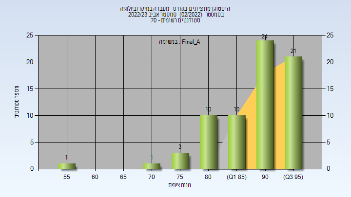

| סטודנטים | עברו/נכשלו | אחוז עוברים | ציון מינימלי | ציון מקסימלי | ממוצע | חציון |
| ---- | ---- | ---- | ---- | ---- | ---- | ---- |
| 70 | 70/0 | 100 | 55 | 99 | 90 | 92 |

<h3 id="202202-Finals">סופי</h3>

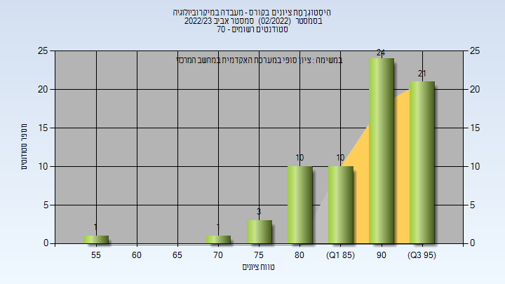

| סטודנטים | עברו/נכשלו | אחוז עוברים | ציון מינימלי | ציון מקסימלי | ממוצע | חציון |
| ---- | ---- | ---- | ---- | ---- | ---- | ---- |
| 70 | 70/0 | 100 | 55 | 99 | 90 | 92 |

<h2 id="202102">אביב 2022</h2>

| איש סגל | תפקיד |
| ---- | ---- |
| ירון סימה | מדריך מעבדה - עם הרשאות מרצה אחראי |
| דוידסון בר גני | מדריך מעבדה |
| יהודה נופר | מדריך מעבדה |
| הרשקוביץ איילת | מדריך מעבדה |
| אבוחצירה-כהן ירדן | מדריך מעבדה |
| רש ענבל | מדריך מעבדה |
| לייטרר קרולינה | מדריך מעבדה |

<h3 id="202102-Final_A">סופי מועד א'</h3>

| סטודנטים | עברו/נכשלו | אחוז עוברים | ציון מינימלי | ציון מקסימלי | ממוצע | חציון |
| ---- | ---- | ---- | ---- | ---- | ---- | ---- |
| 55 | 55/0 | 100 | 77 | 97 | 90.182 | 91 |

<h3 id="202102-Finals">סופי</h3>

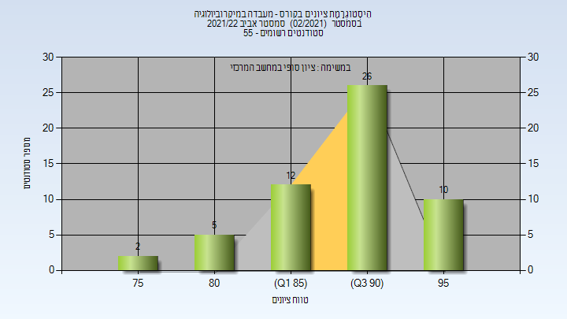

| סטודנטים | עברו/נכשלו | אחוז עוברים | ציון מינימלי | ציון מקסימלי | ממוצע | חציון |
| ---- | ---- | ---- | ---- | ---- | ---- | ---- |
| 55 | 55/0 | 100 | 77 | 97 | 90.182 | 91 |

<h2 id="202002">אביב 2021</h2>

| איש סגל | תפקיד |
| ---- | ---- |
| ירון סימה | מדריך מעבדה - עם הרשאות מרצה אחראי |
| נסייר ראוף | מדריך מעבדה |
| יהודה נופר | מדריך מעבדה |
| הרשקוביץ איילת | מדריך מעבדה |
| אבוחצירה-כהן ירדן | מדריך מעבדה |
| רש ענבל | מדריך מעבדה |

<h3 id="202002-Final_A">סופי מועד א'</h3>

| סטודנטים | עברו/נכשלו | אחוז עוברים | ציון מינימלי | ציון מקסימלי | ממוצע | חציון |
| ---- | ---- | ---- | ---- | ---- | ---- | ---- |
| 46 | 46/0 | 100 | 64 | 97 | 86.478 | 88 |

<h3 id="202002-Finals">סופי</h3>

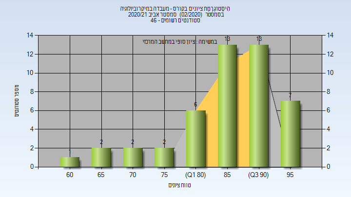

| סטודנטים | עברו/נכשלו | אחוז עוברים | ציון מינימלי | ציון מקסימלי | ממוצע | חציון |
| ---- | ---- | ---- | ---- | ---- | ---- | ---- |
| 46 | 46/0 | 100 | 64 | 97 | 86.478 | 88 |

<h2 id="201902">אביב 2020</h2>

| איש סגל | תפקיד |
| ---- | ---- |
| ירון סימה |  |
| קסטן ענבר | מדריך מעבדה |
| פרייליך שי | מדריך מעבדה |
| ריינהרדט נופר | מדריך מעבדה |
| אבוחצירה-כהן ירדן | מדריך מעבדה |
| הרשקוביץ איילת | מדריך מעבדה |

<h3 id="201902-Final_A">סופי מועד א'</h3>

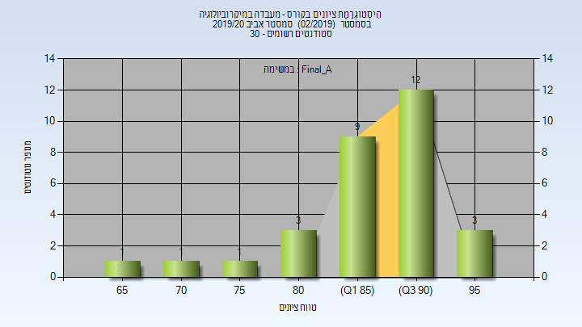

| סטודנטים | עברו/נכשלו | אחוז עוברים | ציון מינימלי | ציון מקסימלי | ממוצע | חציון |
| ---- | ---- | ---- | ---- | ---- | ---- | ---- |
| 30 | 30/0 | 100 | 67 | 96 | 87.867 | 89.5 |

<h3 id="201902-Finals">סופי</h3>

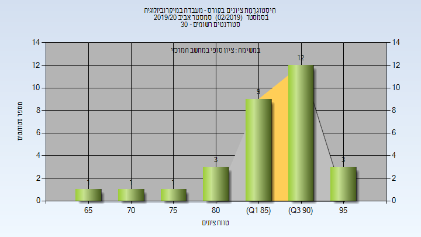

| סטודנטים | עברו/נכשלו | אחוז עוברים | ציון מינימלי | ציון מקסימלי | ממוצע | חציון |
| ---- | ---- | ---- | ---- | ---- | ---- | ---- |
| 30 | 30/0 | 100 | 67 | 96 | 87.867 | 89.5 |

<h2 id="201802">אביב 2019</h2>

| איש סגל | תפקיד |
| ---- | ---- |
| ירון סימה | מרצה - אחראי מקצוע |
| נסייר ראוף | מדריך מעבדה |
| קסטן ענבר | מדריך מעבדה |
| ריינהרדט נופר | מדריך מעבדה |
| שקולניקוב חני | מדריך מעבדה |
| אבוחצירה-כהן ירדן | מדריך מעבדה |
| הרשקוביץ איילת | מדריך מעבדה |

<h3 id="201802-Final_A">סופי מועד א'</h3>

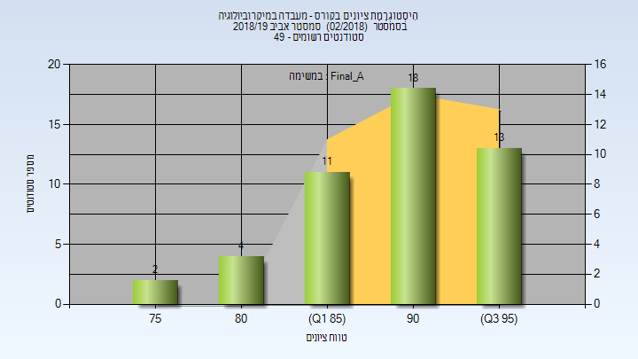

| סטודנטים | עברו/נכשלו | אחוז עוברים | ציון מינימלי | ציון מקסימלי | ממוצע | חציון |
| ---- | ---- | ---- | ---- | ---- | ---- | ---- |
| 48 | 48/0 | 100 | 77 | 97 | 90.542 | 91 |

<h3 id="201802-Finals">סופי</h3>

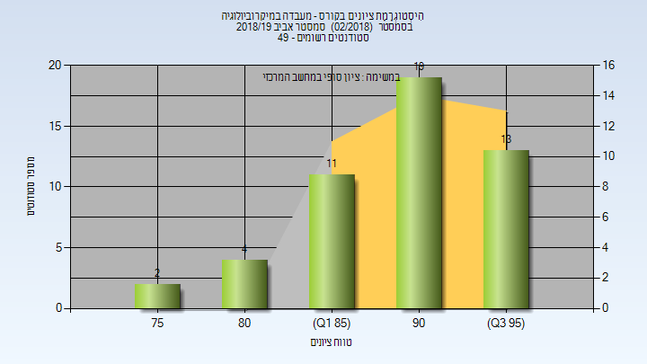

| סטודנטים | עברו/נכשלו | אחוז עוברים | ציון מינימלי | ציון מקסימלי | ממוצע | חציון |
| ---- | ---- | ---- | ---- | ---- | ---- | ---- |
| 49 | 49/0 | 100 | 77 | 97 | 90.592 | 91 |

<h2 id="201702">אביב 2018</h2>

| איש סגל | תפקיד |
| ---- | ---- |
| ירון סימה | מרצה - אחראי מקצוע |
| האס רוני | מרצה |
| קרח רכטמן הילה דינה | מרצה |
| סינואני פרתי אילנה |  |
| ג'מאל ג'ואנה |  |
| אבוחצירה-כהן ירדן |  |
| נפומניאשי אינה |  |
| קסטן ענבר |  |
| כירוג ליבי |  |

<h3 id="201702-Final_A">סופי מועד א'</h3>

| סטודנטים | עברו/נכשלו | אחוז עוברים | ציון מינימלי | ציון מקסימלי | ממוצע | חציון |
| ---- | ---- | ---- | ---- | ---- | ---- | ---- |
| 56 | 56/0 | 100 | 73 | 96 | 87.714 | 88.5 |

<h3 id="201702-Finals">סופי</h3>

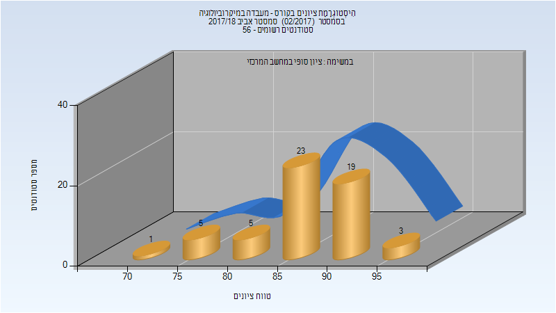

| סטודנטים | עברו/נכשלו | אחוז עוברים | ציון מינימלי | ציון מקסימלי | ממוצע | חציון |
| ---- | ---- | ---- | ---- | ---- | ---- | ---- |
| 56 | 56/0 | 100 | 73 | 96 | 87.714 | 88.5 |

<h2 id="201602">אביב 2017</h2>

| איש סגל | תפקיד |
| ---- | ---- |
| מור עמרם | מרצה - אחראי מקצוע |
| ג'מאל ג'ואנה | מתרגל |
| האס רוני | מתרגל |
| פרייליך שי | מתרגל |
| קורח-רכטמן הילה | מתרגל |
| סינואני פרתי אילנה | מתרגל |
| כצמן מרינה | מתרגל |
| פרכטל רוני | מתרגל |

<h3 id="201602-Final_A">סופי מועד א'</h3>

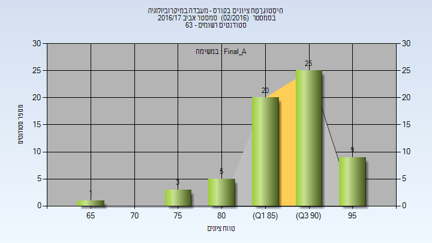

| סטודנטים | עברו/נכשלו | אחוז עוברים | ציון מינימלי | ציון מקסימלי | ממוצע | חציון |
| ---- | ---- | ---- | ---- | ---- | ---- | ---- |
| 63 | 63/0 | 100 | 69 | 98 | 89.27 | 90 |

<h3 id="201602-Finals">סופי</h3>

| סטודנטים | עברו/נכשלו | אחוז עוברים | ציון מינימלי | ציון מקסימלי | ממוצע | חציון |
| ---- | ---- | ---- | ---- | ---- | ---- | ---- |
| 63 | 63/0 | 100 | 69 | 98 | 89.27 | 90 |

<h2 id="201502">אביב 2016</h2>

| איש סגל | תפקיד |
| ---- | ---- |
| ירון סימה | מרצה - אחראי מקצוע |
| קוליק לובה | מתרגל |
| סינואני פרתי אילנה | מתרגל |
| קלמנסקי רגינה | מתרגל |
| האס רוני | מתרגל |
| חימוביץ יעל | מתרגל |
| כצמן מרינה | מתרגל |

<h3 id="201502-Final_A">סופי מועד א'</h3>

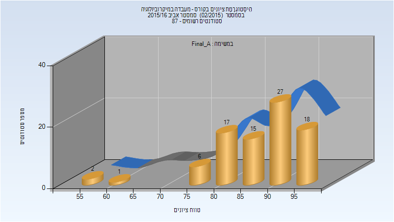

| סטודנטים | עברו/נכשלו | אחוז עוברים | ציון מינימלי | ציון מקסימלי | ממוצע | חציון |
| ---- | ---- | ---- | ---- | ---- | ---- | ---- |
| 86 | 86/0 | 100 | 55 | 98 | 87.663 | 90 |

<h3 id="201502-Finals">סופי</h3>

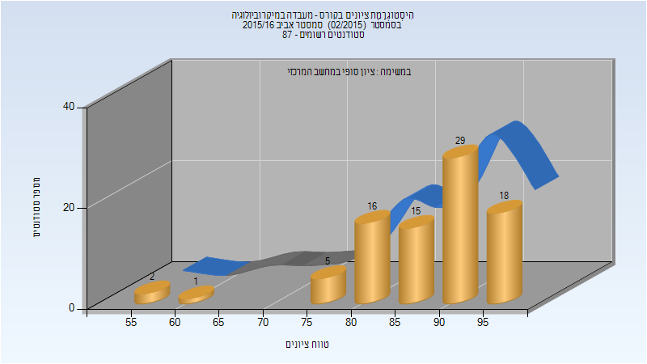

| סטודנטים | עברו/נכשלו | אחוז עוברים | ציון מינימלי | ציון מקסימלי | ממוצע | חציון |
| ---- | ---- | ---- | ---- | ---- | ---- | ---- |
| 86 | 86/0 | 100 | 55 | 98 | 87.919 | 90 |

