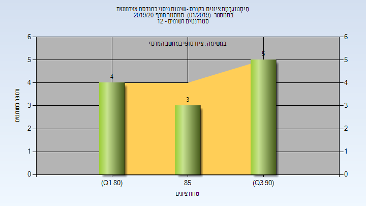

# 00840154 - שיטות ניסוי בהנדסה אוירונוטית

**הערה**: מאגר ההיסטוגרמות הוקם עבור [CheeseFork](https://cheesefork.cf/), כלי בניית מערכת שעות עבור סטודנטים בטכניון. באתר בו אתם גולשים ניתן לעיין בהיסטוגרמות, אך הדרך היותר נוחה היא לעיין בהיסטוגרמות, ובמידע נוסף כגון חוות דעת של סטודנטים, באתר CheeseFork.

* [חורף 2024-2025](#202401)
* [חורף 2023-2024](#202301)
  * [סופי מועד א'](#202301-Final_A)
  * [סופי](#202301-Finals)
* [קיץ 2023](#202203)
  * [סופי מועד א'](#202203-Final_A)
  * [סופי](#202203-Finals)
* [חורף 2022-2023](#202201)
  * [סופי מועד א'](#202201-Final_A)
  * [סופי](#202201-Finals)
* [קיץ 2022](#202103)
  * [סופי מועד א'](#202103-Final_A)
  * [סופי](#202103-Finals)
* [חורף 2021-2022](#202101)
  * [סופי מועד א'](#202101-Final_A)
  * [סופי](#202101-Finals)
* [קיץ 2021](#202003)
  * [סופי מועד א'](#202003-Final_A)
  * [סופי](#202003-Finals)
* [חורף 2020-2021](#202001)
  * [סופי מועד א'](#202001-Final_A)
  * [סופי](#202001-Finals)
* [קיץ 2020](#201903)
  * [סופי מועד א'](#201903-Final_A)
  * [סופי](#201903-Finals)
* [חורף 2019-2020](#201901)
  * [סופי מועד א'](#201901-Final_A)
  * [סופי](#201901-Finals)
* [קיץ 2019](#201803)
  * [סופי מועד א'](#201803-Final_A)
  * [סופי](#201803-Finals)
* [חורף 2018-2019](#201801)
  * [סופי מועד א'](#201801-Final_A)
  * [סופי](#201801-Finals)
* [קיץ 2018](#201703)
  * [סופי מועד א'](#201703-Final_A)
  * [סופי](#201703-Finals)
* [אביב 2018](#201702)
  * [סופי מועד א'](#201702-Final_A)
  * [סופי](#201702-Finals)
* [קיץ 2017](#201603)
  * [סופי מועד א'](#201603-Final_A)
  * [סופי](#201603-Finals)
* [קיץ 2016](#201503)
  * [סופי מועד א'](#201503-Final_A)
  * [סופי](#201503-Finals)

<h2 id="202401">חורף 2024-2025</h2>

| איש סגל | תפקיד |
| ---- | ---- |
| טרזיס אלכסנדרוס | מרצה - אחראי מקצוע |
| עפרים בעז | מתרגל |
| גיחון יואב | מתרגל |
| אריקסון יונתן | מתרגל |

<h2 id="202301">חורף 2023-2024</h2>

| איש סגל | תפקיד |
| ---- | ---- |
| טרזיס אלכסנדרוס | מרצה - אחראי מקצוע |
| אריקסון יונתן | מדריך מעבדה |

<h3 id="202301-Final_A">סופי מועד א'</h3>

| סטודנטים | עברו/נכשלו | אחוז עוברים | ציון מינימלי | ציון מקסימלי | ממוצע | חציון |
| ---- | ---- | ---- | ---- | ---- | ---- | ---- |
| 30 | 30/0 | 100 | 83 | 99 | 93.5 | 95 |

<h3 id="202301-Finals">סופי</h3>

| סטודנטים | עברו/נכשלו | אחוז עוברים | ציון מינימלי | ציון מקסימלי | ממוצע | חציון |
| ---- | ---- | ---- | ---- | ---- | ---- | ---- |
| 30 | 30/0 | 100 | 83 | 99 | 93.5 | 95 |

<h2 id="202203">קיץ 2023</h2>

| איש סגל | תפקיד |
| ---- | ---- |
| טרזיס אלכסנדרוס | מרצה - אחראי מקצוע |
| אריקסון יונתן | מדריך מעבדה |

<h3 id="202203-Final_A">סופי מועד א'</h3>

| סטודנטים | עברו/נכשלו | אחוז עוברים | ציון מינימלי | ציון מקסימלי | ממוצע | חציון |
| ---- | ---- | ---- | ---- | ---- | ---- | ---- |
| 66 | 66/0 | 100 | 76 | 98 | 92.939 | 94 |

<h3 id="202203-Finals">סופי</h3>

| סטודנטים | עברו/נכשלו | אחוז עוברים | ציון מינימלי | ציון מקסימלי | ממוצע | חציון |
| ---- | ---- | ---- | ---- | ---- | ---- | ---- |
| 66 | 66/0 | 100 | 83 | 98 | 93.391 | 94 |

<h2 id="202201">חורף 2022-2023</h2>

| איש סגל | תפקיד |
| ---- | ---- |
| טרזיס אלכסנדרוס | מרצה - אחראי מקצוע |
| אריקסון יונתן |  |
| אלגריסי מור |  |
| איזנברג אשל |  |
| ליפשיץ טום |  |
| אושקוב מיכאל |  |

<h3 id="202201-Final_A">סופי מועד א'</h3>

| סטודנטים | עברו/נכשלו | אחוז עוברים | ציון מינימלי | ציון מקסימלי | ממוצע | חציון |
| ---- | ---- | ---- | ---- | ---- | ---- | ---- |
| 12 | 12/0 | 100 | 81 | 95 | 90 | 90 |

<h3 id="202201-Finals">סופי</h3>

| סטודנטים | עברו/נכשלו | אחוז עוברים | ציון מינימלי | ציון מקסימלי | ממוצע | חציון |
| ---- | ---- | ---- | ---- | ---- | ---- | ---- |
| 12 | 12/0 | 100 | 81 | 95 | 90 | 90 |

<h2 id="202103">קיץ 2022</h2>

| איש סגל | תפקיד |
| ---- | ---- |
| טרזיס אלכסנדרוס | מרצה - אחראי מקצוע |
| אריקסון יונתן | מדריך מעבדה |
| גבאי ישראל | מדריך מעבדה |
| אלגריסי מור | מדריך מעבדה |
| פופלינגר ליאור | מדריך מעבדה |
| בן אשר תומר | מדריך מעבדה |

<h3 id="202103-Final_A">סופי מועד א'</h3>

| סטודנטים | עברו/נכשלו | אחוז עוברים | ציון מינימלי | ציון מקסימלי | ממוצע | חציון |
| ---- | ---- | ---- | ---- | ---- | ---- | ---- |
| 55 | 55/0 | 100 | 79.9 | 98.9 | 93.344 | 94.3 |

<h3 id="202103-Finals">סופי</h3>

| סטודנטים | עברו/נכשלו | אחוז עוברים | ציון מינימלי | ציון מקסימלי | ממוצע | חציון |
| ---- | ---- | ---- | ---- | ---- | ---- | ---- |
| 55 | 55/0 | 100 | 80 | 99 | 93.4 | 94 |

<h2 id="202101">חורף 2021-2022</h2>

| איש סגל | תפקיד |
| ---- | ---- |
| טרזיס אלכסנדרוס | מרצה - אחראי מקצוע |
| אריקסון יונתן |  |
| אלגריסי מור |  |

<h3 id="202101-Final_A">סופי מועד א'</h3>

| סטודנטים | עברו/נכשלו | אחוז עוברים | ציון מינימלי | ציון מקסימלי | ממוצע | חציון |
| ---- | ---- | ---- | ---- | ---- | ---- | ---- |
| 14 | 13/1 | 93 | 33.3 | 97.4 | 87.986 | 92.55 |

<h3 id="202101-Finals">סופי</h3>

| סטודנטים | עברו/נכשלו | אחוז עוברים | ציון מינימלי | ציון מקסימלי | ממוצע | חציון |
| ---- | ---- | ---- | ---- | ---- | ---- | ---- |
| 14 | 13/1 | 93 | 33 | 97 | 88.071 | 93 |

<h2 id="202003">קיץ 2021</h2>

| איש סגל | תפקיד |
| ---- | ---- |
| טרזיס אלכסנדרוס | מרצה - אחראי מקצוע |
| אשל רן | מדריך מעבדה |
| זמיר אינה | מדריך מעבדה |
| בן אשר תומר | מדריך מעבדה |
| יואלס צוף | מדריך מעבדה |

<h3 id="202003-Final_A">סופי מועד א'</h3>

| סטודנטים | עברו/נכשלו | אחוז עוברים | ציון מינימלי | ציון מקסימלי | ממוצע | חציון |
| ---- | ---- | ---- | ---- | ---- | ---- | ---- |
| 61 | 61/0 | 100 | 77.6 | 96 | 88.1 | 89 |

<h3 id="202003-Finals">סופי</h3>

| סטודנטים | עברו/נכשלו | אחוז עוברים | ציון מינימלי | ציון מקסימלי | ממוצע | חציון |
| ---- | ---- | ---- | ---- | ---- | ---- | ---- |
| 61 | 61/0 | 100 | 78 | 96 | 88.18 | 89 |

<h2 id="202001">חורף 2020-2021</h2>

| איש סגל | תפקיד |
| ---- | ---- |
| צוקורל בני | מרצה - אחראי מקצוע |
| אשל רן |  |
| שטיינר מתן |  |
| קליין גריגורי |  |
| אייזן נחום אל |  |
| זמיר אינה |  |

<h3 id="202001-Final_A">סופי מועד א'</h3>

| סטודנטים | עברו/נכשלו | אחוז עוברים | ציון מינימלי | ציון מקסימלי | ממוצע | חציון |
| ---- | ---- | ---- | ---- | ---- | ---- | ---- |
| 26 | 26/0 | 100 | 76 | 96 | 89.231 | 89 |

<h3 id="202001-Finals">סופי</h3>

| סטודנטים | עברו/נכשלו | אחוז עוברים | ציון מינימלי | ציון מקסימלי | ממוצע | חציון |
| ---- | ---- | ---- | ---- | ---- | ---- | ---- |
| 26 | 26/0 | 100 | 76 | 96 | 89.231 | 89 |

<h2 id="201903">קיץ 2020</h2>

| איש סגל | תפקיד |
| ---- | ---- |
| צוקורל בני | מרצה - אחראי מקצוע |

<h3 id="201903-Final_A">סופי מועד א'</h3>

| סטודנטים | עברו/נכשלו | אחוז עוברים | ציון מינימלי | ציון מקסימלי | ממוצע | חציון |
| ---- | ---- | ---- | ---- | ---- | ---- | ---- |
| 40 | 40/0 | 100 | 77 | 97 | 90 | 90 |

<h3 id="201903-Finals">סופי</h3>

| סטודנטים | עברו/נכשלו | אחוז עוברים | ציון מינימלי | ציון מקסימלי | ממוצע | חציון |
| ---- | ---- | ---- | ---- | ---- | ---- | ---- |
| 44 | 44/0 | 100 | 67 | 97 | 89.432 | 90 |

<h2 id="201901">חורף 2019-2020</h2>

| איש סגל | תפקיד |
| ---- | ---- |
| כהן יעקב | מרצה - אחראי מקצוע |
| אייזן נחום אל |  |
| שטיינר מתן |  |
| זמיר אינה |  |
| אשל רן |  |
| קליין גריגורי |  |

<h3 id="201901-Final_A">סופי מועד א'</h3>

| סטודנטים | עברו/נכשלו | אחוז עוברים | ציון מינימלי | ציון מקסימלי | ממוצע | חציון |
| ---- | ---- | ---- | ---- | ---- | ---- | ---- |
| 12 | 12/0 | 100 | 81 | 93 | 87.833 | 89 |

<h3 id="201901-Finals">סופי</h3>

| סטודנטים | עברו/נכשלו | אחוז עוברים | ציון מינימלי | ציון מקסימלי | ממוצע | חציון |
| ---- | ---- | ---- | ---- | ---- | ---- | ---- |
| 12 | 12/0 | 100 | 81 | 93 | 87.833 | 89 |

<h2 id="201803">קיץ 2019</h2>

| איש סגל | תפקיד |
| ---- | ---- |
| צוקורל בני | מרצה - אחראי מקצוע |
| שטיינר מתן | מרצה |
| קליין גריגורי | מדריך מעבדה |
| אשל רן | מדריך מעבדה |
| זמיר אינה | מדריך מעבדה |
| אייזן נחום אל | מדריך מעבדה |

<h3 id="201803-Final_A">סופי מועד א'</h3>

| סטודנטים | עברו/נכשלו | אחוז עוברים | ציון מינימלי | ציון מקסימלי | ממוצע | חציון |
| ---- | ---- | ---- | ---- | ---- | ---- | ---- |
| 67 | 67/0 | 100 | 75.21 | 96.12 | 90.257 | 90.86 |

<h3 id="201803-Finals">סופי</h3>

| סטודנטים | עברו/נכשלו | אחוז עוברים | ציון מינימלי | ציון מקסימלי | ממוצע | חציון |
| ---- | ---- | ---- | ---- | ---- | ---- | ---- |
| 69 | 69/0 | 100 | 75 | 96 | 89.855 | 91 |

<h2 id="201801">חורף 2018-2019</h2>

| איש סגל | תפקיד |
| ---- | ---- |
| צוקורל בני | מרצה - אחראי מקצוע |

<h3 id="201801-Final_A">סופי מועד א'</h3>

| סטודנטים | עברו/נכשלו | אחוז עוברים | ציון מינימלי | ציון מקסימלי | ממוצע | חציון |
| ---- | ---- | ---- | ---- | ---- | ---- | ---- |
| 12 | 12/0 | 100 | 59 | 100 | 91 | 93.5 |

<h3 id="201801-Finals">סופי</h3>

| סטודנטים | עברו/נכשלו | אחוז עוברים | ציון מינימלי | ציון מקסימלי | ממוצע | חציון |
| ---- | ---- | ---- | ---- | ---- | ---- | ---- |
| 12 | 12/0 | 100 | 59 | 100 | 91 | 93.5 |

<h2 id="201703">קיץ 2018</h2>

| איש סגל | תפקיד |
| ---- | ---- |
| צוקורל בני | מרצה - אחראי מקצוע |
| שטיינר מתן | מרצה |

<h3 id="201703-Final_A">סופי מועד א'</h3>

| סטודנטים | עברו/נכשלו | אחוז עוברים | ציון מינימלי | ציון מקסימלי | ממוצע | חציון |
| ---- | ---- | ---- | ---- | ---- | ---- | ---- |
| 46 | 46/0 | 100 | 82 | 100 | 91.413 | 91 |

<h3 id="201703-Finals">סופי</h3>

| סטודנטים | עברו/נכשלו | אחוז עוברים | ציון מינימלי | ציון מקסימלי | ממוצע | חציון |
| ---- | ---- | ---- | ---- | ---- | ---- | ---- |
| 46 | 46/0 | 100 | 83 | 100 | 91.87 | 91.5 |

<h2 id="201702">אביב 2018</h2>

| איש סגל | תפקיד |
| ---- | ---- |
| צוקורל בני | מרצה - אחראי מקצוע |

<h3 id="201702-Final_A">סופי מועד א'</h3>

| סטודנטים | עברו/נכשלו | אחוז עוברים | ציון מינימלי | ציון מקסימלי | ממוצע | חציון |
| ---- | ---- | ---- | ---- | ---- | ---- | ---- |
| 26 | 26/0 | 100 | 77 | 100 | 87.615 | 85.5 |

<h3 id="201702-Finals">סופי</h3>

| סטודנטים | עברו/נכשלו | אחוז עוברים | ציון מינימלי | ציון מקסימלי | ממוצע | חציון |
| ---- | ---- | ---- | ---- | ---- | ---- | ---- |
| 26 | 26/0 | 100 | 77 | 100 | 87.615 | 85.5 |

<h2 id="201603">קיץ 2017</h2>

| איש סגל | תפקיד |
| ---- | ---- |
| אברמוביץ חיים | מרצה - אחראי מקצוע |
| שטיינר מתן |  |

<h3 id="201603-Final_A">סופי מועד א'</h3>

| סטודנטים | עברו/נכשלו | אחוז עוברים | ציון מינימלי | ציון מקסימלי | ממוצע | חציון |
| ---- | ---- | ---- | ---- | ---- | ---- | ---- |
| 48 | 48/0 | 100 | 55 | 95 | 87.479 | 89 |

<h3 id="201603-Finals">סופי</h3>

| סטודנטים | עברו/נכשלו | אחוז עוברים | ציון מינימלי | ציון מקסימלי | ממוצע | חציון |
| ---- | ---- | ---- | ---- | ---- | ---- | ---- |
| 48 | 48/0 | 100 | 55 | 95 | 87.479 | 89 |

<h2 id="201503">קיץ 2016</h2>

| איש סגל | תפקיד |
| ---- | ---- |
| צוקורל בני | מרצה - אחראי מקצוע |

<h3 id="201503-Final_A">סופי מועד א'</h3>

| סטודנטים | עברו/נכשלו | אחוז עוברים | ציון מינימלי | ציון מקסימלי | ממוצע | חציון |
| ---- | ---- | ---- | ---- | ---- | ---- | ---- |
| 41 | 40/1 | 98 | 48 | 95 | 82.902 | 85 |

<h3 id="201503-Finals">סופי</h3>

| סטודנטים | עברו/נכשלו | אחוז עוברים | ציון מינימלי | ציון מקסימלי | ממוצע | חציון |
| ---- | ---- | ---- | ---- | ---- | ---- | ---- |
| 41 | 40/1 | 98 | 48 | 95 | 82.902 | 85 |

