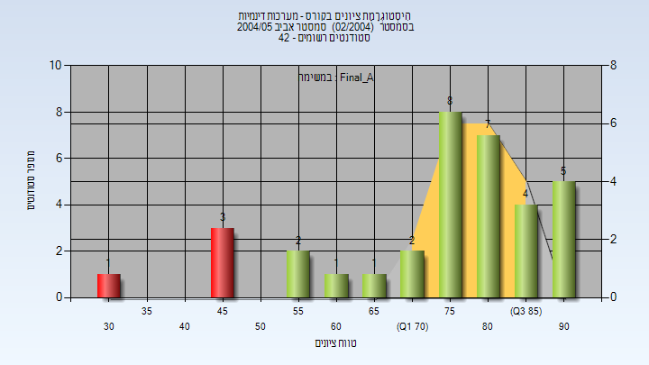
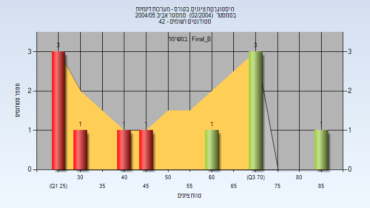

# 00840730 - מערכות דינמיות

**הערה**: מאגר ההיסטוגרמות הוקם עבור [CheeseFork](https://cheesefork.cf/), כלי בניית מערכת שעות עבור סטודנטים בטכניון. באתר בו אתם גולשים ניתן לעיין בהיסטוגרמות, אך הדרך היותר נוחה היא לעיין בהיסטוגרמות, ובמידע נוסף כגון חוות דעת של סטודנטים, באתר CheeseFork.

* [אביב 2010](#200902)
* [אביב 2005](#200402)
  * [סופי מועד א'](#200402-Final_A)
  * [סופי מועד ב'](#200402-Final_B)

<h2 id="200902">אביב 2010</h2>

| איש סגל | תפקיד |
| ---- | ---- |
| גרונוולד ארתור | מרצה - אחראי מקצוע |
| אינדלמן ואדים | מתרגל |

<h2 id="200402">אביב 2005</h2>

| איש סגל | תפקיד |
| ---- | ---- |
| אידן משה | מרצה - אחראי מקצוע |
| ירושלמי צפריר | מתרגל |

<h3 id="200402-Final_A">סופי מועד א'</h3>

| סטודנטים | עברו/נכשלו | אחוז עוברים | ציון מינימלי | ציון מקסימלי | ממוצע | חציון |
| ---- | ---- | ---- | ---- | ---- | ---- | ---- |
| 34 | 30/4 | 88 | 30 | 94 | 75.5 | 79 |

<h3 id="200402-Final_B">סופי מועד ב'</h3>

| סטודנטים | עברו/נכשלו | אחוז עוברים | ציון מינימלי | ציון מקסימלי | ממוצע | חציון |
| ---- | ---- | ---- | ---- | ---- | ---- | ---- |
| 11 | 5/6 | 45 | 28 | 87 | 52.091 | 44 |

