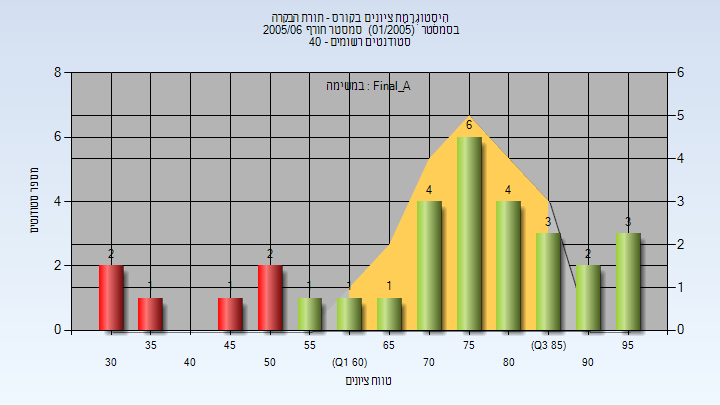
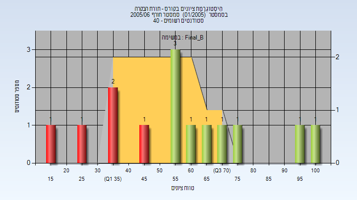

# 00840735 - תורת הבקרה

**הערה**: מאגר ההיסטוגרמות הוקם עבור [CheeseFork](https://cheesefork.cf/), כלי בניית מערכת שעות עבור סטודנטים בטכניון. באתר בו אתם גולשים ניתן לעיין בהיסטוגרמות, אך הדרך היותר נוחה היא לעיין בהיסטוגרמות, ובמידע נוסף כגון חוות דעת של סטודנטים, באתר CheeseFork.

* [אביב 2011](#201002)
* [חורף 2005-2006](#200501)
  * [סופי מועד א'](#200501-Final_A)
  * [סופי מועד ב'](#200501-Final_B)

<h2 id="201002">אביב 2011</h2>

| איש סגל | תפקיד |
| ---- | ---- |
| שימא טל | מרצה - אחראי מקצוע |
| בן-יעקב אהד | מתרגל |
| פרוקופוב אולג | מתרגל |

<h2 id="200501">חורף 2005-2006</h2>

| איש סגל | תפקיד |
| ---- | ---- |
| אידן משה | מרצה - אחראי מקצוע |
| פיסרבסקי דמיטרי | מתרגל |

<h3 id="200501-Final_A">סופי מועד א'</h3>

| סטודנטים | עברו/נכשלו | אחוז עוברים | ציון מינימלי | ציון מקסימלי | ממוצע | חציון |
| ---- | ---- | ---- | ---- | ---- | ---- | ---- |
| 31 | 25/6 | 81 | 31.2 | 99.775 | 73.58 | 76.282 |

<h3 id="200501-Final_B">סופי מועד ב'</h3>

| סטודנטים | עברו/נכשלו | אחוז עוברים | ציון מינימלי | ציון מקסימלי | ממוצע | חציון |
| ---- | ---- | ---- | ---- | ---- | ---- | ---- |
| 14 | 9/5 | 64 | 16.8 | 100 | 58.511 | 58.524 |

