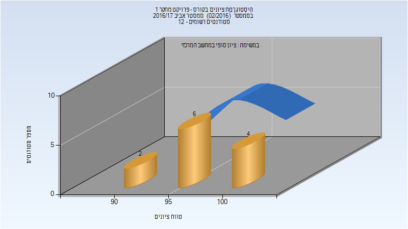

# 00850851 - פרויקט מחקר 1

**הערה**: מאגר ההיסטוגרמות הוקם עבור [CheeseFork](https://cheesefork.cf/), כלי בניית מערכת שעות עבור סטודנטים בטכניון. באתר בו אתם גולשים ניתן לעיין בהיסטוגרמות, אך הדרך היותר נוחה היא לעיין בהיסטוגרמות, ובמידע נוסף כגון חוות דעת של סטודנטים, באתר CheeseFork.

* [אביב 2025](#202402)
  * [סופי](#202402-Finals)
* [אביב 2022](#202102)
* [חורף 2021-2022](#202101)
* [אביב 2021](#202002)
* [חורף 2020-2021](#202001)
* [אביב 2020](#201902)
* [אביב 2019](#201802)
* [אביב 2017](#201602)
  * [סופי](#201602-Finals)

<h2 id="202402">אביב 2025</h2>

<h3 id="202402-Finals">סופי</h3>

| סטודנטים | עברו/נכשלו | אחוז עוברים | ציון מינימלי | ציון מקסימלי | ממוצע | חציון |
| ---- | ---- | ---- | ---- | ---- | ---- | ---- |
| 19 | 12/7 | 63 | 95 | 100 | 97.917 | 98.5 |

<h2 id="202102">אביב 2022</h2>

<h2 id="202101">חורף 2021-2022</h2>

<h2 id="202002">אביב 2021</h2>

<h2 id="202001">חורף 2020-2021</h2>

<h2 id="201902">אביב 2020</h2>

<h2 id="201802">אביב 2019</h2>

<h2 id="201602">אביב 2017</h2>

<h3 id="201602-Finals">סופי</h3>

| סטודנטים | עברו/נכשלו | אחוז עוברים | ציון מינימלי | ציון מקסימלי | ממוצע | חציון |
| ---- | ---- | ---- | ---- | ---- | ---- | ---- |
| 12 | 12/0 | 100 | 90 | 100 | 96.417 | 97 |

