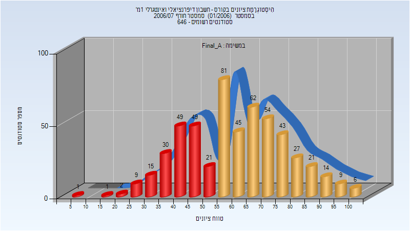
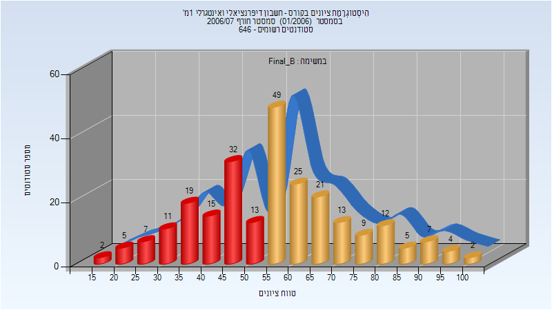

# 01040010 - חדו"א 1מ'

**הערה**: מאגר ההיסטוגרמות הוקם עבור [CheeseFork](https://cheesefork.cf/), כלי בניית מערכת שעות עבור סטודנטים בטכניון. באתר בו אתם גולשים ניתן לעיין בהיסטוגרמות, אך הדרך היותר נוחה היא לעיין בהיסטוגרמות, ובמידע נוסף כגון חוות דעת של סטודנטים, באתר CheeseFork.

* [חורף 2006-2007](#200601)
  * [סופי מועד א'](#200601-Final_A)
  * [סופי מועד ב'](#200601-Final_B)

<h2 id="200601">חורף 2006-2007</h2>

| איש סגל | תפקיד |
| ---- | ---- |
| בנימיני יואב | מרצה - אחראי מקצוע |
| בירן עומר | מתרגל |

<h3 id="200601-Final_A">סופי מועד א'</h3>

| סטודנטים | עברו/נכשלו | אחוז עוברים | ציון מינימלי | ציון מקסימלי | ממוצע | חציון |
| ---- | ---- | ---- | ---- | ---- | ---- | ---- |
| 539 | 362/177 | 67 | 9 | 100 | 60.831 | 60 |

<h3 id="200601-Final_B">סופי מועד ב'</h3>

| סטודנטים | עברו/נכשלו | אחוז עוברים | ציון מינימלי | ציון מקסימלי | ממוצע | חציון |
| ---- | ---- | ---- | ---- | ---- | ---- | ---- |
| 251 | 147/104 | 59 | 16 | 100 | 56.534 | 55 |

