# 01040012 - חשבון דיפרנציאלי ואינטגרלי 1ת'

**הערה**: מאגר ההיסטוגרמות הוקם עבור [CheeseFork](https://cheesefork.cf/), כלי בניית מערכת שעות עבור סטודנטים בטכניון. באתר בו אתם גולשים ניתן לעיין בהיסטוגרמות, אך הדרך היותר נוחה היא לעיין בהיסטוגרמות, ובמידע נוסף כגון חוות דעת של סטודנטים, באתר CheeseFork.

* [חורף 2024-2025](#202401)
  * [מבחן מועד א'](#202401-Exam_A)
  * [סופי מועד א'](#202401-Final_A)
  * [מבחן מועד ב'](#202401-Exam_B)
  * [סופי מועד ב'](#202401-Final_B)
  * [סופי](#202401-Finals)
* [אביב 2024](#202302)
  * [מבחן מועד א'](#202302-Exam_A)
  * [סופי מועד א'](#202302-Final_A)
  * [מבחן מועד ב'](#202302-Exam_B)
  * [סופי מועד ב'](#202302-Final_B)
  * [סופי](#202302-Finals)
* [חורף 2023-2024](#202301)
  * [מבחן מועד א'](#202301-Exam_A)
  * [סופי מועד א'](#202301-Final_A)
  * [מבחן מועד ב'](#202301-Exam_B)
  * [סופי מועד ב'](#202301-Final_B)
  * [סופי](#202301-Finals)
* [חורף 2014-2015](#201401)
  * [סופי מועד א'](#201401-Final_A)
  * [סופי מועד ב'](#201401-Final_B)
  * [סופי](#201401-Finals)
* [קיץ 2014](#201303)
  * [מבחן מועד א'](#201303-Exam_A)
  * [סופי מועד א'](#201303-Final_A)
* [אביב 2014](#201302)
  * [מבחן מועד א'](#201302-Exam_A)
  * [סופי מועד א'](#201302-Final_A)
  * [סופי מועד ב'](#201302-Final_B)
* [חורף 2013-2014](#201301)
  * [מבחן מועד א'](#201301-Exam_A)
  * [סופי מועד א'](#201301-Final_A)
  * [סופי מועד ב'](#201301-Final_B)
* [אביב 2013](#201202)
  * [מבחן מועד א'](#201202-Exam_A)
  * [סופי מועד א'](#201202-Final_A)
  * [סופי מועד ב'](#201202-Final_B)
* [חורף 2012-2013](#201201)
  * [מבחן מועד א'](#201201-Exam_A)
  * [סופי מועד א'](#201201-Final_A)
  * [סופי מועד ב'](#201201-Final_B)
* [קיץ 2012](#201103)
  * [סופי מועד א'](#201103-Final_A)
  * [סופי מועד ב'](#201103-Final_B)
* [אביב 2012](#201102)
  * [סופי מועד א'](#201102-Final_A)
  * [סופי מועד ב'](#201102-Final_B)
* [חורף 2011-2012](#201101)
  * [מבחן מועד א'](#201101-Exam_A)
  * [סופי מועד א'](#201101-Final_A)
  * [סופי מועד ב'](#201101-Final_B)
* [אביב 2011](#201002)
  * [סופי מועד א'](#201002-Final_A)
  * [סופי מועד ב'](#201002-Final_B)
* [חורף 2010-2011](#201001)
  * [סופי מועד א'](#201001-Final_A)
  * [סופי מועד ב'](#201001-Final_B)
* [אביב 2010](#200902)
  * [סופי מועד א'](#200902-Final_A)
  * [סופי מועד ב'](#200902-Final_B)
* [חורף 2009-2010](#200901)
  * [סופי מועד א'](#200901-Final_A)
  * [סופי מועד ב'](#200901-Final_B)
* [חורף 2008-2009](#200801)
  * [סופי מועד א'](#200801-Final_A)
  * [סופי מועד ב'](#200801-Final_B)
* [אביב 2008](#200702)
  * [סופי מועד ב'](#200702-Final_B)
* [אביב 2007](#200602)
  * [סופי מועד א'](#200602-Final_A)
  * [סופי מועד ב'](#200602-Final_B)

<h2 id="202401">חורף 2024-2025</h2>

| איש סגל | תפקיד |
| ---- | ---- |
| דמיטריוק אלון | מרצה - אחראי מקצוע |
| אביטל רבקה | מתרגל |

<h3 id="202401-Exam_A">מבחן מועד א'</h3>

| סטודנטים | עברו/נכשלו | אחוז עוברים | ציון מינימלי | ציון מקסימלי | ממוצע | חציון |
| ---- | ---- | ---- | ---- | ---- | ---- | ---- |
| 468 | 249/219 | 53 | 0 | 100 | 56.105 | 56 |

<h3 id="202401-Final_A">סופי מועד א'</h3>

| סטודנטים | עברו/נכשלו | אחוז עוברים | ציון מינימלי | ציון מקסימלי | ממוצע | חציון |
| ---- | ---- | ---- | ---- | ---- | ---- | ---- |
| 468 | 295/173 | 63 | 0 | 100 | 58.818 | 62 |

<h3 id="202401-Exam_B">מבחן מועד ב'</h3>

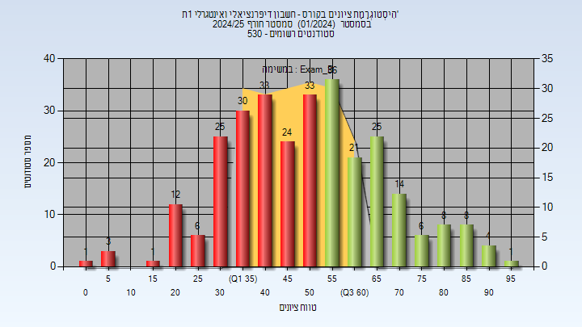

| סטודנטים | עברו/נכשלו | אחוז עוברים | ציון מינימלי | ציון מקסימלי | ממוצע | חציון |
| ---- | ---- | ---- | ---- | ---- | ---- | ---- |
| 291 | 123/168 | 42 | 0 | 97 | 51.244 | 51 |

<h3 id="202401-Final_B">סופי מועד ב'</h3>

| סטודנטים | עברו/נכשלו | אחוז עוברים | ציון מינימלי | ציון מקסימלי | ממוצע | חציון |
| ---- | ---- | ---- | ---- | ---- | ---- | ---- |
| 291 | 155/136 | 53 | 0 | 97 | 53.893 | 58 |

<h3 id="202401-Finals">סופי</h3>

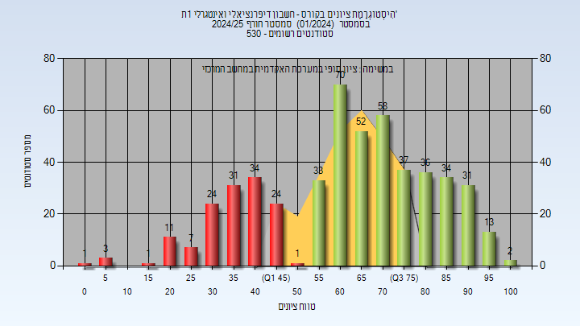

| סטודנטים | עברו/נכשלו | אחוז עוברים | ציון מינימלי | ציון מקסימלי | ממוצע | חציון |
| ---- | ---- | ---- | ---- | ---- | ---- | ---- |
| 530 | 367/163 | 69 | 0 | 100 | 63.478 | 65 |

<h2 id="202302">אביב 2024</h2>

| איש סגל | תפקיד |
| ---- | ---- |
| אביטל רבקה | מתרגל |
| דמיטריוק אלון | מרצה - אחראי מקצוע |

<h3 id="202302-Exam_A">מבחן מועד א'</h3>

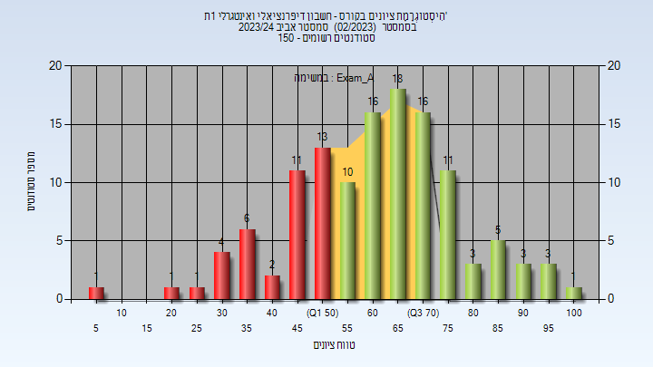

| סטודנטים | עברו/נכשלו | אחוז עוברים | ציון מינימלי | ציון מקסימלי | ממוצע | חציון |
| ---- | ---- | ---- | ---- | ---- | ---- | ---- |
| 125 | 86/39 | 69 | 8 | 100 | 62.144 | 63 |

<h3 id="202302-Final_A">סופי מועד א'</h3>

| סטודנטים | עברו/נכשלו | אחוז עוברים | ציון מינימלי | ציון מקסימלי | ממוצע | חציון |
| ---- | ---- | ---- | ---- | ---- | ---- | ---- |
| 125 | 99/26 | 79 | 8 | 100 | 65.328 | 68 |

<h3 id="202302-Exam_B">מבחן מועד ב'</h3>

| סטודנטים | עברו/נכשלו | אחוז עוברים | ציון מינימלי | ציון מקסימלי | ממוצע | חציון |
| ---- | ---- | ---- | ---- | ---- | ---- | ---- |
| 37 | 14/23 | 38 | 18 | 85 | 49.216 | 49 |

<h3 id="202302-Final_B">סופי מועד ב'</h3>

| סטודנטים | עברו/נכשלו | אחוז עוברים | ציון מינימלי | ציון מקסימלי | ממוצע | חציון |
| ---- | ---- | ---- | ---- | ---- | ---- | ---- |
| 37 | 23/14 | 62 | 23 | 91 | 56.622 | 61 |

<h3 id="202302-Finals">סופי</h3>

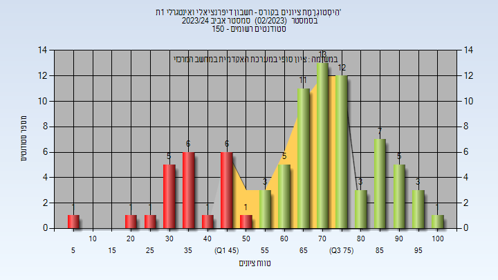

| סטודנטים | עברו/נכשלו | אחוז עוברים | ציון מינימלי | ציון מקסימלי | ממוצע | חציון |
| ---- | ---- | ---- | ---- | ---- | ---- | ---- |
| 133 | 111/22 | 83 | 8 | 100 | 66.149 | 70 |

<h2 id="202301">חורף 2023-2024</h2>

| איש סגל | תפקיד |
| ---- | ---- |
| אביטל רבקה | מתרגל |
| דמיטריוק אלון | מרצה - אחראי מקצוע |

<h3 id="202301-Exam_A">מבחן מועד א'</h3>

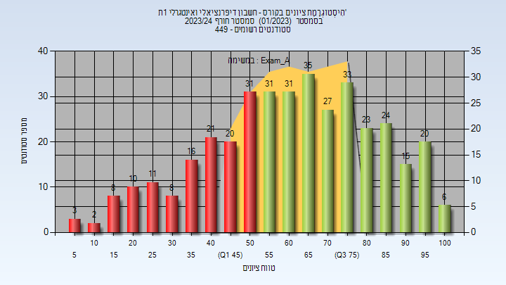

| סטודנטים | עברו/נכשלו | אחוז עוברים | ציון מינימלי | ציון מקסימלי | ממוצע | חציון |
| ---- | ---- | ---- | ---- | ---- | ---- | ---- |
| 375 | 245/130 | 65 | 8 | 100 | 62.331 | 64 |

<h3 id="202301-Final_A">סופי מועד א'</h3>

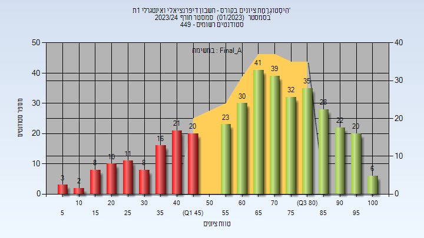

| סטודנטים | עברו/נכשלו | אחוז עוברים | ציון מינימלי | ציון מקסימלי | ממוצע | חציון |
| ---- | ---- | ---- | ---- | ---- | ---- | ---- |
| 375 | 276/99 | 74 | 8 | 100 | 65.133 | 69 |

<h3 id="202301-Exam_B">מבחן מועד ב'</h3>

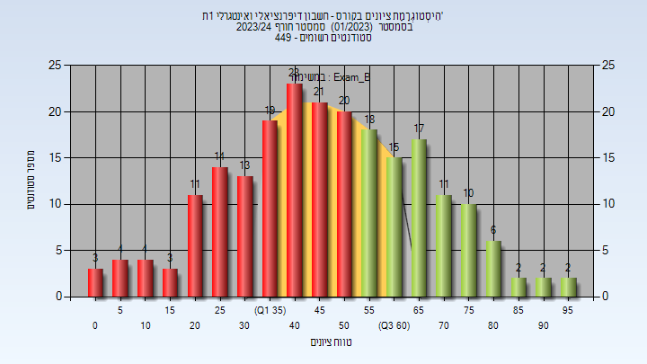

| סטודנטים | עברו/נכשלו | אחוז עוברים | ציון מינימלי | ציון מקסימלי | ממוצע | חציון |
| ---- | ---- | ---- | ---- | ---- | ---- | ---- |
| 218 | 83/135 | 38 | 0 | 99 | 48.482 | 48 |

<h3 id="202301-Final_B">סופי מועד ב'</h3>

| סטודנטים | עברו/נכשלו | אחוז עוברים | ציון מינימלי | ציון מקסימלי | ממוצע | חציון |
| ---- | ---- | ---- | ---- | ---- | ---- | ---- |
| 218 | 144/74 | 66 | 9 | 100 | 60.261 | 63 |

<h3 id="202301-Finals">סופי</h3>

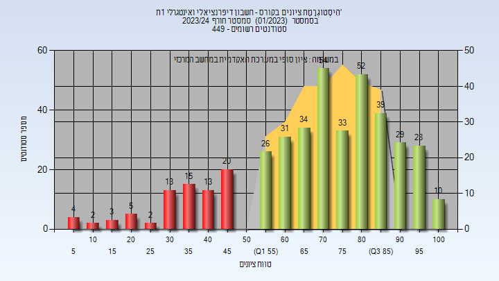

| סטודנטים | עברו/נכשלו | אחוז עוברים | ציון מינימלי | ציון מקסימלי | ממוצע | חציון |
| ---- | ---- | ---- | ---- | ---- | ---- | ---- |
| 435 | 358/77 | 82 | 8 | 100 | 69.973 | 73 |

<h2 id="201401">חורף 2014-2015</h2>

| איש סגל | תפקיד |
| ---- | ---- |
| הרי אסף ז"ל | מרצה - אחראי מקצוע |
| בן-דוד ניר | מתרגל - עם הרשאות מרצה אחראי |

<h3 id="201401-Final_A">סופי מועד א'</h3>

| סטודנטים | עברו/נכשלו | אחוז עוברים | ציון מינימלי | ציון מקסימלי | ממוצע | חציון |
| ---- | ---- | ---- | ---- | ---- | ---- | ---- |
| 63 | 46/17 | 73 | 11 | 100 | 67.106 | 67.44 |

<h3 id="201401-Final_B">סופי מועד ב'</h3>

| סטודנטים | עברו/נכשלו | אחוז עוברים | ציון מינימלי | ציון מקסימלי | ממוצע | חציון |
| ---- | ---- | ---- | ---- | ---- | ---- | ---- |
| 55 | 43/12 | 78 | 6.018 | 100 | 68.224 | 76.24 |

<h3 id="201401-Finals">סופי</h3>

| סטודנטים | עברו/נכשלו | אחוז עוברים | ציון מינימלי | ציון מקסימלי | ממוצע | חציון |
| ---- | ---- | ---- | ---- | ---- | ---- | ---- |
| 91 | 77/14 | 85 | 6 | 100 | 74.099 | 79 |

<h2 id="201303">קיץ 2014</h2>

| איש סגל | תפקיד |
| ---- | ---- |
| כהן יוסף | מרצה - אחראי מקצוע |
| יעקביאן אבירם | מתרגל |

<h3 id="201303-Exam_A">מבחן מועד א'</h3>

| סטודנטים | עברו/נכשלו | אחוז עוברים | ציון מינימלי | ציון מקסימלי | ממוצע | חציון |
| ---- | ---- | ---- | ---- | ---- | ---- | ---- |
| 18 | 10/8 | 56 | 9 | 97 | 54.167 | 58 |

<h3 id="201303-Final_A">סופי מועד א'</h3>

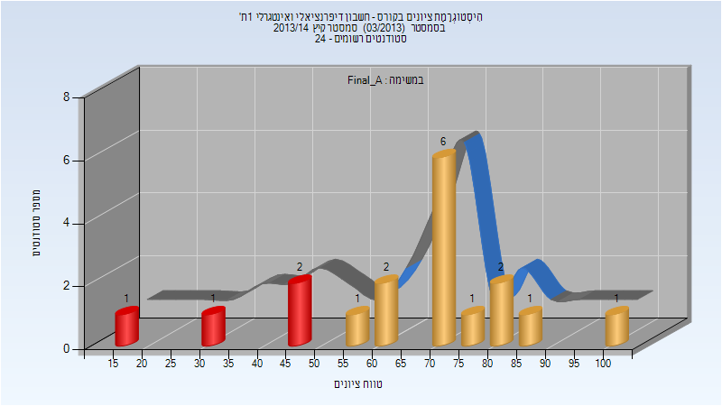

| סטודנטים | עברו/נכשלו | אחוז עוברים | ציון מינימלי | ציון מקסימלי | ממוצע | חציון |
| ---- | ---- | ---- | ---- | ---- | ---- | ---- |
| 18 | 14/4 | 78 | 15 | 100 | 65.111 | 71.5 |

<h2 id="201302">אביב 2014</h2>

| איש סגל | תפקיד |
| ---- | ---- |
| פנחסי רום | מרצה - אחראי מקצוע |
| בלקין אלכס | מתרגל |
| יעקביאן אבירם | מתרגל |

<h3 id="201302-Exam_A">מבחן מועד א'</h3>

| סטודנטים | עברו/נכשלו | אחוז עוברים | ציון מינימלי | ציון מקסימלי | ממוצע | חציון |
| ---- | ---- | ---- | ---- | ---- | ---- | ---- |
| 117 | 48/69 | 41 | 0 | 100 | 48.889 | 48 |

<h3 id="201302-Final_A">סופי מועד א'</h3>

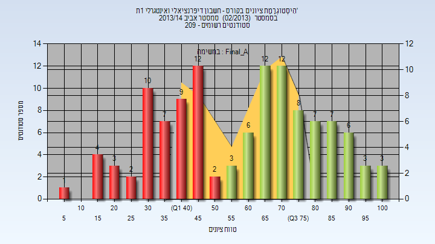

| סטודנטים | עברו/נכשלו | אחוז עוברים | ציון מינימלי | ציון מקסימלי | ממוצע | חציון |
| ---- | ---- | ---- | ---- | ---- | ---- | ---- |
| 117 | 67/50 | 57 | 5 | 100 | 59.855 | 64 |

<h3 id="201302-Final_B">סופי מועד ב'</h3>

| סטודנטים | עברו/נכשלו | אחוז עוברים | ציון מינימלי | ציון מקסימלי | ממוצע | חציון |
| ---- | ---- | ---- | ---- | ---- | ---- | ---- |
| 76 | 27/49 | 36 | 11 | 100 | 46.842 | 41.5 |

<h2 id="201301">חורף 2013-2014</h2>

| איש סגל | תפקיד |
| ---- | ---- |
| נבו עמוס | מרצה - אחראי מקצוע |
| הרי אסף ז"ל | מתרגל |
| פרומקין ולרי | מתרגל |
| רז אור | מתרגל |

<h3 id="201301-Exam_A">מבחן מועד א'</h3>

| סטודנטים | עברו/נכשלו | אחוז עוברים | ציון מינימלי | ציון מקסימלי | ממוצע | חציון |
| ---- | ---- | ---- | ---- | ---- | ---- | ---- |
| 642 | 283/359 | 44 | 0 | 100 | 50.763 | 50.5 |

<h3 id="201301-Final_A">סופי מועד א'</h3>

| סטודנטים | עברו/נכשלו | אחוז עוברים | ציון מינימלי | ציון מקסימלי | ממוצע | חציון |
| ---- | ---- | ---- | ---- | ---- | ---- | ---- |
| 642 | 428/214 | 67 | 3 | 100 | 56.776 | 60.5 |

<h3 id="201301-Final_B">סופי מועד ב'</h3>

| סטודנטים | עברו/נכשלו | אחוז עוברים | ציון מינימלי | ציון מקסימלי | ממוצע | חציון |
| ---- | ---- | ---- | ---- | ---- | ---- | ---- |
| 358 | 314/44 | 88 | 15 | 100 | 68.693 | 71 |

<h2 id="201202">אביב 2013</h2>

| איש סגל | תפקיד |
| ---- | ---- |
| נבו עמוס | מרצה - אחראי מקצוע |
| פרומקין ולרי | מתרגל |
| הרי אסף ז"ל | מתרגל |

<h3 id="201202-Exam_A">מבחן מועד א'</h3>

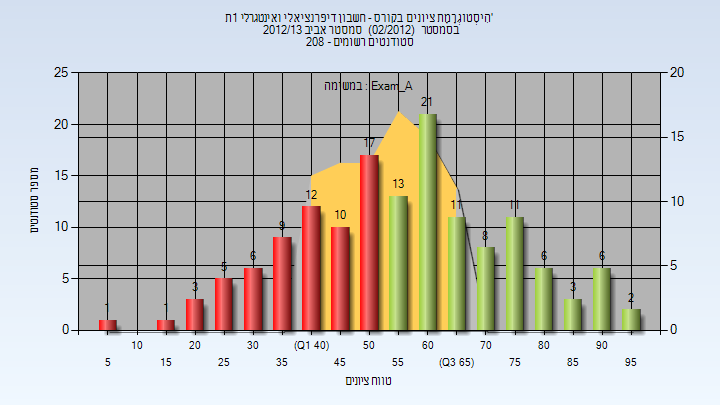

| סטודנטים | עברו/נכשלו | אחוז עוברים | ציון מינימלי | ציון מקסימלי | ממוצע | חציון |
| ---- | ---- | ---- | ---- | ---- | ---- | ---- |
| 145 | 81/64 | 56 | 8 | 95 | 57.083 | 57 |

<h3 id="201202-Final_A">סופי מועד א'</h3>

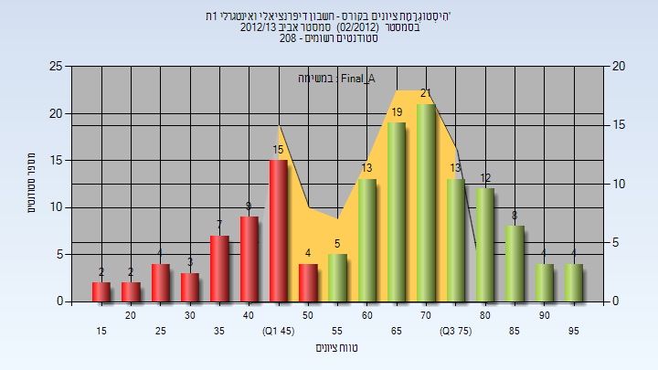

| סטודנטים | עברו/נכשלו | אחוז עוברים | ציון מינימלי | ציון מקסימלי | ממוצע | חציון |
| ---- | ---- | ---- | ---- | ---- | ---- | ---- |
| 145 | 99/46 | 68 | 16 | 99 | 63 | 67 |

<h3 id="201202-Final_B">סופי מועד ב'</h3>

| סטודנטים | עברו/נכשלו | אחוז עוברים | ציון מינימלי | ציון מקסימלי | ממוצע | חציון |
| ---- | ---- | ---- | ---- | ---- | ---- | ---- |
| 85 | 32/53 | 38 | 6 | 100 | 49.035 | 44 |

<h2 id="201201">חורף 2012-2013</h2>

| איש סגל | תפקיד |
| ---- | ---- |
| שפריר איתי | מרצה - אחראי מקצוע |
| פרומקין ולרי | מתרגל |

<h3 id="201201-Exam_A">מבחן מועד א'</h3>

| סטודנטים | עברו/נכשלו | אחוז עוברים | ציון מינימלי | ציון מקסימלי | ממוצע | חציון |
| ---- | ---- | ---- | ---- | ---- | ---- | ---- |
| 599 | 318/281 | 53 | 8 | 100 | 57.599 | 56 |

<h3 id="201201-Final_A">סופי מועד א'</h3>

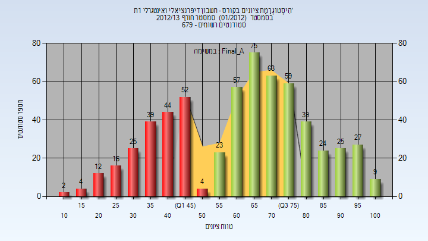

| סטודנטים | עברו/נכשלו | אחוז עוברים | ציון מינימלי | ציון מקסימלי | ממוצע | חציון |
| ---- | ---- | ---- | ---- | ---- | ---- | ---- |
| 599 | 401/198 | 67 | 10 | 100 | 62.689 | 66 |

<h3 id="201201-Final_B">סופי מועד ב'</h3>

| סטודנטים | עברו/נכשלו | אחוז עוברים | ציון מינימלי | ציון מקסימלי | ממוצע | חציון |
| ---- | ---- | ---- | ---- | ---- | ---- | ---- |
| 342 | 270/72 | 79 | 16 | 100 | 67.228 | 69 |

<h2 id="201103">קיץ 2012</h2>

| איש סגל | תפקיד |
| ---- | ---- |
| גורן אבי | מרצה - אחראי מקצוע |
| שמן ליטל | מתרגל |

<h3 id="201103-Final_A">סופי מועד א'</h3>

| סטודנטים | עברו/נכשלו | אחוז עוברים | ציון מינימלי | ציון מקסימלי | ממוצע | חציון |
| ---- | ---- | ---- | ---- | ---- | ---- | ---- |
| 23 | 19/4 | 83 | 21 | 97 | 62.478 | 61 |

<h3 id="201103-Final_B">סופי מועד ב'</h3>

| סטודנטים | עברו/נכשלו | אחוז עוברים | ציון מינימלי | ציון מקסימלי | ממוצע | חציון |
| ---- | ---- | ---- | ---- | ---- | ---- | ---- |
| 23 | 18/5 | 78 | 23 | 87 | 60.261 | 60 |

<h2 id="201102">אביב 2012</h2>

| איש סגל | תפקיד |
| ---- | ---- |
| פנחסי רום | מרצה - אחראי מקצוע |
| פרומקין ולרי | מתרגל |

<h3 id="201102-Final_A">סופי מועד א'</h3>

| סטודנטים | עברו/נכשלו | אחוז עוברים | ציון מינימלי | ציון מקסימלי | ממוצע | חציון |
| ---- | ---- | ---- | ---- | ---- | ---- | ---- |
| 179 | 95/84 | 53 | 4 | 100 | 55.899 | 60 |

<h3 id="201102-Final_B">סופי מועד ב'</h3>

| סטודנטים | עברו/נכשלו | אחוז עוברים | ציון מינימלי | ציון מקסימלי | ממוצע | חציון |
| ---- | ---- | ---- | ---- | ---- | ---- | ---- |
| 109 | 59/50 | 54 | 9 | 100 | 55.661 | 60 |

<h2 id="201101">חורף 2011-2012</h2>

| איש סגל | תפקיד |
| ---- | ---- |
| צנזור אביב | מרצה - אחראי מקצוע |
| פרומקין ולרי | מתרגל |

<h3 id="201101-Exam_A">מבחן מועד א'</h3>

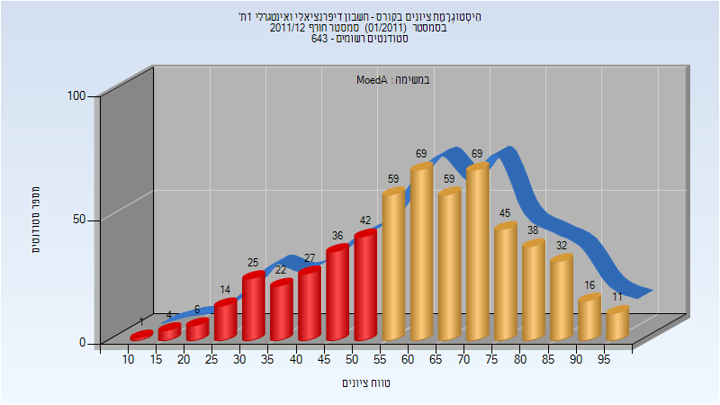

| סטודנטים | עברו/נכשלו | אחוז עוברים | ציון מינימלי | ציון מקסימלי | ממוצע | חציון |
| ---- | ---- | ---- | ---- | ---- | ---- | ---- |
| 575 | 398/177 | 69 | 14 | 99 | 62.057 | 63 |

<h3 id="201101-Final_A">סופי מועד א'</h3>

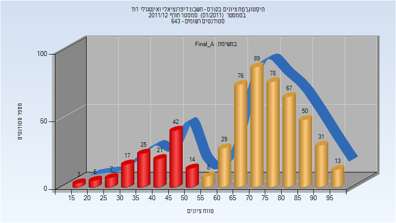

| סטודנטים | עברו/נכשלו | אחוז עוברים | ציון מינימלי | ציון מקסימלי | ממוצע | חציון |
| ---- | ---- | ---- | ---- | ---- | ---- | ---- |
| 575 | 441/134 | 77 | 17 | 99 | 68.016 | 72 |

<h3 id="201101-Final_B">סופי מועד ב'</h3>

| סטודנטים | עברו/נכשלו | אחוז עוברים | ציון מינימלי | ציון מקסימלי | ממוצע | חציון |
| ---- | ---- | ---- | ---- | ---- | ---- | ---- |
| 262 | 144/118 | 55 | 8 | 100 | 60.031 | 63 |

<h2 id="201002">אביב 2011</h2>

| איש סגל | תפקיד |
| ---- | ---- |
| רייך שמעון | מרצה - אחראי מקצוע |
| פרומקין ולרי | מתרגל |

<h3 id="201002-Final_A">סופי מועד א'</h3>

| סטודנטים | עברו/נכשלו | אחוז עוברים | ציון מינימלי | ציון מקסימלי | ממוצע | חציון |
| ---- | ---- | ---- | ---- | ---- | ---- | ---- |
| 240 | 196/44 | 82 | 20 | 100 | 65.567 | 64 |

<h3 id="201002-Final_B">סופי מועד ב'</h3>

| סטודנטים | עברו/נכשלו | אחוז עוברים | ציון מינימלי | ציון מקסימלי | ממוצע | חציון |
| ---- | ---- | ---- | ---- | ---- | ---- | ---- |
| 118 | 88/30 | 75 | 21 | 96 | 60.517 | 60 |

<h2 id="201001">חורף 2010-2011</h2>

| איש סגל | תפקיד |
| ---- | ---- |
| פנחסי רום | מרצה - אחראי מקצוע |
| פרומקין ולרי | מתרגל |

<h3 id="201001-Final_A">סופי מועד א'</h3>

| סטודנטים | עברו/נכשלו | אחוז עוברים | ציון מינימלי | ציון מקסימלי | ממוצע | חציון |
| ---- | ---- | ---- | ---- | ---- | ---- | ---- |
| 586 | 396/190 | 68 | 2 | 100 | 60.662 | 60 |

<h3 id="201001-Final_B">סופי מועד ב'</h3>

| סטודנטים | עברו/נכשלו | אחוז עוברים | ציון מינימלי | ציון מקסימלי | ממוצע | חציון |
| ---- | ---- | ---- | ---- | ---- | ---- | ---- |
| 331 | 233/98 | 70 | 8 | 100 | 60.686 | 61 |

<h2 id="200902">אביב 2010</h2>

| איש סגל | תפקיד |
| ---- | ---- |
| שפריר איתי | מרצה - אחראי מקצוע |
| פרומקין ולרי | מתרגל |

<h3 id="200902-Final_A">סופי מועד א'</h3>

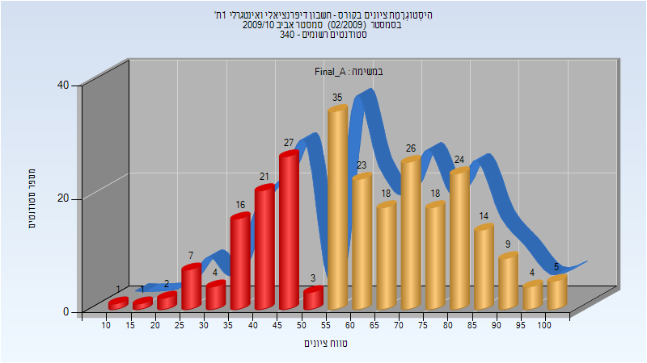

| סטודנטים | עברו/נכשלו | אחוז עוברים | ציון מינימלי | ציון מקסימלי | ממוצע | חציון |
| ---- | ---- | ---- | ---- | ---- | ---- | ---- |
| 258 | 176/82 | 68 | 14 | 100 | 62.167 | 62 |

<h3 id="200902-Final_B">סופי מועד ב'</h3>

| סטודנטים | עברו/נכשלו | אחוז עוברים | ציון מינימלי | ציון מקסימלי | ממוצע | חציון |
| ---- | ---- | ---- | ---- | ---- | ---- | ---- |
| 168 | 122/46 | 73 | 16 | 100 | 61.435 | 59 |

<h2 id="200901">חורף 2009-2010</h2>

| איש סגל | תפקיד |
| ---- | ---- |
| הרי אסף ז"ל | מרצה - אחראי מקצוע |
| פרומקין ולרי | מתרגל |

<h3 id="200901-Final_A">סופי מועד א'</h3>

| סטודנטים | עברו/נכשלו | אחוז עוברים | ציון מינימלי | ציון מקסימלי | ממוצע | חציון |
| ---- | ---- | ---- | ---- | ---- | ---- | ---- |
| 524 | 419/105 | 80 | 18 | 100 | 66.473 | 67 |

<h3 id="200901-Final_B">סופי מועד ב'</h3>

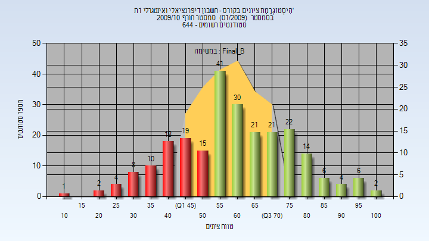

| סטודנטים | עברו/נכשלו | אחוז עוברים | ציון מינימלי | ציון מקסימלי | ממוצע | חציון |
| ---- | ---- | ---- | ---- | ---- | ---- | ---- |
| 244 | 167/77 | 68 | 11 | 100 | 60.762 | 60 |

<h2 id="200801">חורף 2008-2009</h2>

| איש סגל | תפקיד |
| ---- | ---- |
| בנימיני יואב | מרצה - אחראי מקצוע |
| הרי אסף ז"ל | מתרגל |
| אביטל רבקה | מתרגל |

<h3 id="200801-Final_A">סופי מועד א'</h3>

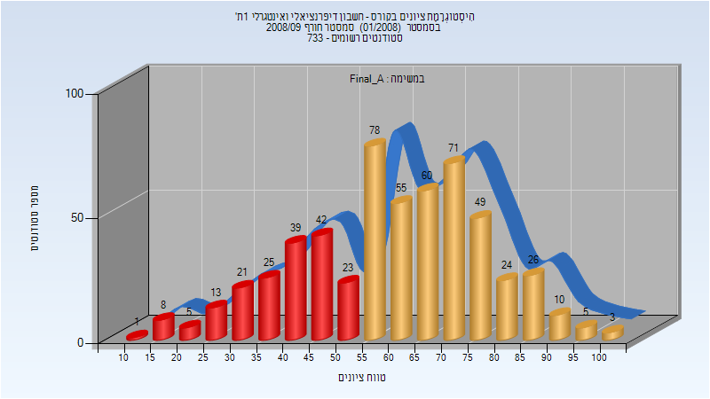

| סטודנטים | עברו/נכשלו | אחוז עוברים | ציון מינימלי | ציון מקסימלי | ממוצע | חציון |
| ---- | ---- | ---- | ---- | ---- | ---- | ---- |
| 558 | 381/177 | 68 | 13 | 100 | 60.333 | 62 |

<h3 id="200801-Final_B">סופי מועד ב'</h3>

| סטודנטים | עברו/נכשלו | אחוז עוברים | ציון מינימלי | ציון מקסימלי | ממוצע | חציון |
| ---- | ---- | ---- | ---- | ---- | ---- | ---- |
| 320 | 185/135 | 58 | 6 | 96 | 55.212 | 56 |

<h2 id="200702">אביב 2008</h2>

| איש סגל | תפקיד |
| ---- | ---- |
| הרי אסף ז"ל | מרצה - אחראי מקצוע |
| אביטל רבקה | מתרגל |

<h3 id="200702-Final_B">סופי מועד ב'</h3>

| סטודנטים | עברו/נכשלו | אחוז עוברים | ציון מינימלי | ציון מקסימלי | ממוצע | חציון |
| ---- | ---- | ---- | ---- | ---- | ---- | ---- |
| 92 | 36/56 | 39 | 19 | 100 | 51.293 | 47.5 |

<h2 id="200602">אביב 2007</h2>

| איש סגל | תפקיד |
| ---- | ---- |
| הרי אסף ז"ל | מרצה - אחראי מקצוע |
| פרלשטיין אמיתי | מתרגל |
| בית-אהרון אור | מתרגל |

<h3 id="200602-Final_A">סופי מועד א'</h3>

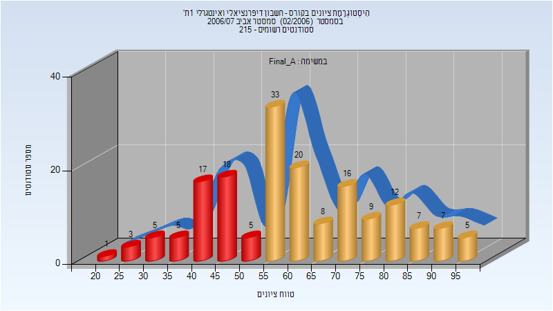

| סטודנטים | עברו/נכשלו | אחוז עוברים | ציון מינימלי | ציון מקסימלי | ממוצע | חציון |
| ---- | ---- | ---- | ---- | ---- | ---- | ---- |
| 171 | 117/54 | 68 | 22 | 99 | 61.041 | 59 |

<h3 id="200602-Final_B">סופי מועד ב'</h3>

| סטודנטים | עברו/נכשלו | אחוז עוברים | ציון מינימלי | ציון מקסימלי | ממוצע | חציון |
| ---- | ---- | ---- | ---- | ---- | ---- | ---- |
| 75 | 61/14 | 81 | 27 | 91 | 60.107 | 58 |

