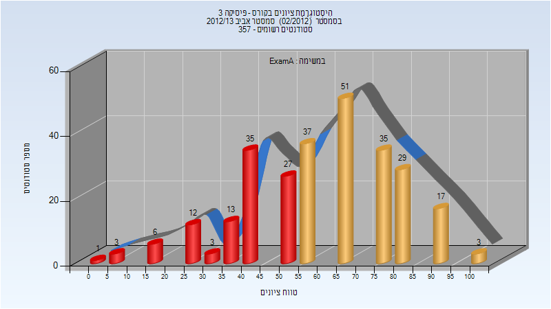
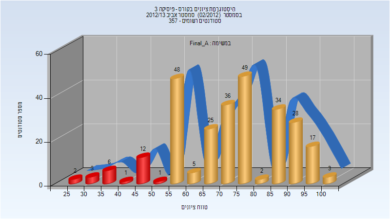
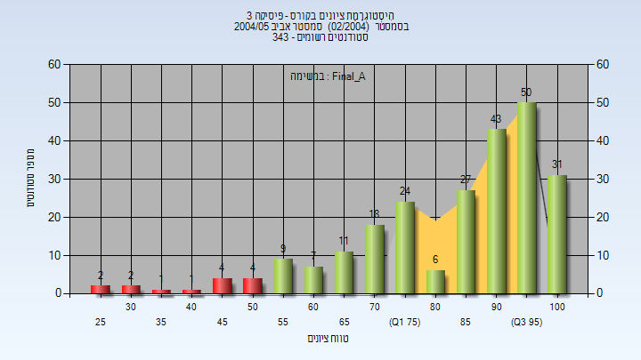
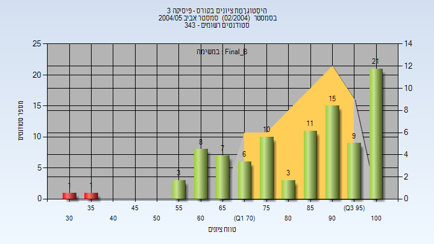

# 01140053 - פיסיקה 3

**הערה**: מאגר ההיסטוגרמות הוקם עבור [CheeseFork](https://cheesefork.cf/), כלי בניית מערכת שעות עבור סטודנטים בטכניון. באתר בו אתם גולשים ניתן לעיין בהיסטוגרמות, אך הדרך היותר נוחה היא לעיין בהיסטוגרמות, ובמידע נוסף כגון חוות דעת של סטודנטים, באתר CheeseFork.

* [אביב 2013](#201202)
  * [מבחן מועד א'](#201202-Exam_A)
  * [סופי מועד א'](#201202-Final_A)
* [אביב 2010](#200902)
* [אביב 2005](#200402)
  * [סופי מועד א'](#200402-Final_A)
  * [סופי מועד ב'](#200402-Final_B)

<h2 id="201202">אביב 2013</h2>

| איש סגל | תפקיד |
| ---- | ---- |
| עכאשה מוחמד | מרצה - אחראי מקצוע |
| דביר-וולפמן אילת השחר | מתרגל |

<h3 id="201202-Exam_A">מבחן מועד א'</h3>

| סטודנטים | עברו/נכשלו | אחוז עוברים | ציון מינימלי | ציון מקסימלי | ממוצע | חציון |
| ---- | ---- | ---- | ---- | ---- | ---- | ---- |
| 272 | 172/100 | 63 | 0 | 100 | 59.811 | 58.333 |

<h3 id="201202-Final_A">סופי מועד א'</h3>

| סטודנטים | עברו/נכשלו | אחוז עוברים | ציון מינימלי | ציון מקסימלי | ממוצע | חציון |
| ---- | ---- | ---- | ---- | ---- | ---- | ---- |
| 272 | 247/25 | 91 | 26 | 100 | 73.334 | 72.666 |

<h2 id="200902">אביב 2010</h2>

| איש סגל | תפקיד |
| ---- | ---- |
| אדלר גון אליזבט | מרצה - אחראי מקצוע |
| דביר-וולפמן אילת השחר | מתרגל |

<h2 id="200402">אביב 2005</h2>

| איש סגל | תפקיד |
| ---- | ---- |
| לאור ארי | מרצה - אחראי מקצוע |
| אקופיאן ניקולאי | מתרגל |

<h3 id="200402-Final_A">סופי מועד א'</h3>

| סטודנטים | עברו/נכשלו | אחוז עוברים | ציון מינימלי | ציון מקסימלי | ממוצע | חציון |
| ---- | ---- | ---- | ---- | ---- | ---- | ---- |
| 240 | 226/14 | 94 | 25 | 100 | 84.204 | 91.5 |

<h3 id="200402-Final_B">סופי מועד ב'</h3>

| סטודנטים | עברו/נכשלו | אחוז עוברים | ציון מינימלי | ציון מקסימלי | ממוצע | חציון |
| ---- | ---- | ---- | ---- | ---- | ---- | ---- |
| 95 | 93/2 | 98 | 31 | 100 | 83.716 | 86 |

