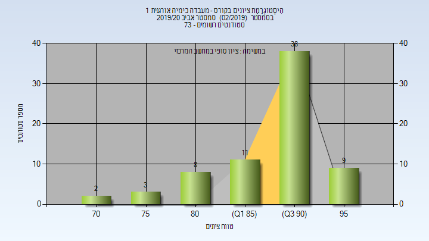
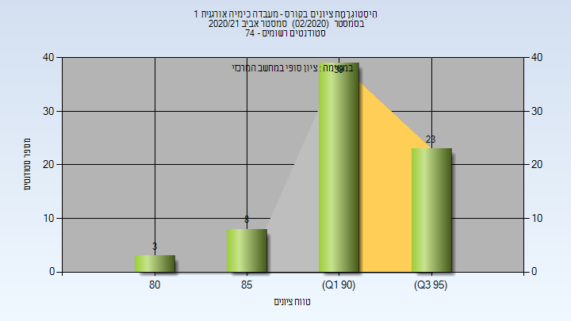

# 012409 - הנדסה סייסמולוג

**הערה**: מאגר ההיסטוגרמות הוקם עבור [CheeseFork](https://cheesefork.cf/), כלי בניית מערכת שעות עבור סטודנטים בטכניון. באתר בו אתם גולשים ניתן לעיין בהיסטוגרמות, אך הדרך היותר נוחה היא לעיין בהיסטוגרמות, ובמידע נוסף כגון חוות דעת של סטודנטים, באתר CheeseFork.

* [אביב 2020](#201902)
  * [סופי מועד א'](#201902-Final_A)
  * [סופי](#201902-Finals)
* [אביב 2021](#202002)
  * [סופי מועד א'](#202002-Final_A)
  * [סופי](#202002-Finals)

<h2 id="201902">אביב 2020</h2>

| איש סגל | תפקיד |
| ---- | ---- |
| דה-רויטר גראהם | מדריך מעבדה - עם הרשאות מרצה אחראי |
| מעין גליה |  |
| לוי רומי | מדריך מעבדה |
| מקרוב קונסטנטין | מדריך מעבדה |
| בשקורוב רומן | מדריך מעבדה |
| חסין אסף | מדריך מעבדה |
| ליבוביץ ליאב | מדריך מעבדה |
| אביגדורי עידן | מדריך מעבדה |
| עוזרי ענבל | מדריך מעבדה |
| לפס שי | מדריך מעבדה |
| זלמן בת-חן | מדריך מעבדה |
| בורג טליה | מדריך מעבדה |
| לוי והב חרות | מדריך מעבדה |
| גולדשטיין יוליה | מדריך מעבדה |
| עואד מוחמד | מדריך מעבדה |

<h3 id="201902-Final_A">סופי מועד א'</h3>

| סטודנטים | עברו/נכשלו | אחוז עוברים | ציון מינימלי | ציון מקסימלי | ממוצע | חציון |
| ---- | ---- | ---- | ---- | ---- | ---- | ---- |
| 71 | 71/0 | 100 | 72 | 98 | 89.592 | 91 |

<h3 id="201902-Finals">סופי</h3>

| סטודנטים | עברו/נכשלו | אחוז עוברים | ציון מינימלי | ציון מקסימלי | ממוצע | חציון |
| ---- | ---- | ---- | ---- | ---- | ---- | ---- |
| 71 | 71/0 | 100 | 72 | 98 | 89.592 | 91 |

<h2 id="202002">אביב 2021</h2>

| איש סגל | תפקיד |
| ---- | ---- |
| דיזנדרוק צ'רלס | מדריך מעבדה - עם הרשאות מרצה אחראי |
| באזוב טימור |  |
| ליובין אלכסנדרה | מדריך מעבדה |
| בורג טליה | מדריך מעבדה |
| בשקורוב רומן | מדריך מעבדה |
| בוקטוב אליסה | מדריך מעבדה |
| שורץ רוני | מדריך מעבדה |
| זלמן בת-חן | מדריך מעבדה |
| פירזון ורה | מדריך מעבדה |
| עואד מוחמד | מדריך מעבדה |
| אביגדורי עידן | מדריך מעבדה |
| גלגובסקי יורי | מדריך מעבדה |
| טבק שיר | מדריך מעבדה |
| חסין אסף | מדריך מעבדה |
| ליבוביץ ליאב | מדריך מעבדה |
| גולדשטיין יוליה | מדריך מעבדה |
| מג'דוב מחמוד | מדריך מעבדה |
| ניגל אטינגר איזנה | סגל מנהלי - עם הרשאות מרצה אחראי |

<h3 id="202002-Final_A">סופי מועד א'</h3>

| סטודנטים | עברו/נכשלו | אחוז עוברים | ציון מינימלי | ציון מקסימלי | ממוצע | חציון |
| ---- | ---- | ---- | ---- | ---- | ---- | ---- |
| 73 | 73/0 | 100 | 81 | 98 | 92.507 | 93 |

<h3 id="202002-Finals">סופי</h3>

| סטודנטים | עברו/נכשלו | אחוז עוברים | ציון מינימלי | ציון מקסימלי | ממוצע | חציון |
| ---- | ---- | ---- | ---- | ---- | ---- | ---- |
| 73 | 73/0 | 100 | 81 | 98 | 92.507 | 93 |

