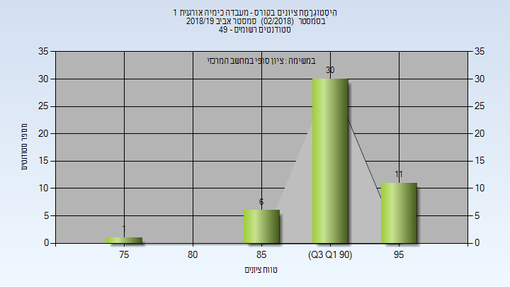

# 01240911 - מעבדה כימיה אורגנית 1

**הערה**: מאגר ההיסטוגרמות הוקם עבור [CheeseFork](https://cheesefork.cf/), כלי בניית מערכת שעות עבור סטודנטים בטכניון. באתר בו אתם גולשים ניתן לעיין בהיסטוגרמות, אך הדרך היותר נוחה היא לעיין בהיסטוגרמות, ובמידע נוסף כגון חוות דעת של סטודנטים, באתר CheeseFork.

* [אביב 2025](#202402)
  * [סופי מועד א'](#202402-Final_A)
  * [סופי](#202402-Finals)
* [אביב 2024](#202302)
  * [סופי מועד א'](#202302-Final_A)
  * [סופי](#202302-Finals)
* [אביב 2023](#202202)
  * [סופי מועד א'](#202202-Final_A)
  * [סופי](#202202-Finals)
* [אביב 2022](#202102)
  * [סופי מועד א'](#202102-Final_A)
  * [סופי](#202102-Finals)
* [אביב 2021](#202002)
  * [סופי מועד א'](#202002-Final_A)
  * [סופי](#202002-Finals)
* [חורף 2020-2021](#202001)
* [אביב 2020](#201902)
  * [סופי מועד א'](#201902-Final_A)
  * [סופי](#201902-Finals)
* [חורף 2019-2020](#201901)
  * [סופי](#201901-Finals)
* [אביב 2019](#201802)
  * [סופי מועד א'](#201802-Final_A)
  * [סופי](#201802-Finals)
* [חורף 2018-2019](#201801)
* [אביב 2018](#201702)
  * [סופי מועד א'](#201702-Final_A)
  * [סופי](#201702-Finals)
* [חורף 2017-2018](#201701)
  * [סופי](#201701-Finals)
* [אביב 2017](#201602)
  * [סופי מועד א'](#201602-Final_A)
  * [סופי](#201602-Finals)
* [אביב 2016](#201502)
  * [סופי מועד א'](#201502-Final_A)
  * [סופי](#201502-Finals)
* [אביב 2015](#201402)
  * [סופי מועד א'](#201402-Final_A)
  * [סופי](#201402-Finals)

<h2 id="202402">אביב 2025</h2>

| איש סגל | תפקיד |
| ---- | ---- |
| מעין גליה | מרצה - אחראי מקצוע |
| ניגל אטינגר איזנה | סגל מנהלי - עם הרשאות מרצה אחראי |

<h3 id="202402-Final_A">סופי מועד א'</h3>

| סטודנטים | עברו/נכשלו | אחוז עוברים | ציון מינימלי | ציון מקסימלי | ממוצע | חציון |
| ---- | ---- | ---- | ---- | ---- | ---- | ---- |
| 62 | 62/0 | 100 | 76 | 99 | 90.5 | 92 |

<h3 id="202402-Finals">סופי</h3>

| סטודנטים | עברו/נכשלו | אחוז עוברים | ציון מינימלי | ציון מקסימלי | ממוצע | חציון |
| ---- | ---- | ---- | ---- | ---- | ---- | ---- |
| 114 | 113/1 | 99 | 47 | 99 | 89.561 | 91 |

<h2 id="202302">אביב 2024</h2>

| איש סגל | תפקיד |
| ---- | ---- |
| מעין גליה | מרצה - אחראי מקצוע |
| בשקורוב רומן | מדריך מעבדה |
| גולדשטיין יוליה | מדריך מעבדה |
| בורג טליה | מדריך מעבדה |
| ליובין אלכסנדרה | מדריך מעבדה |
| שומסקי אולג אלי | מדריך מעבדה |
| סימוטקו אלכסנדרה | מדריך מעבדה |
| אלאלוף ים | מדריך מעבדה |
| ליבוביץ ליאב | מדריך מעבדה |
| שורץ רוני | מדריך מעבדה |
| ניגל אטינגר איזנה | סגל מנהלי - עם הרשאות מרצה אחראי |

<h3 id="202302-Final_A">סופי מועד א'</h3>

| סטודנטים | עברו/נכשלו | אחוז עוברים | ציון מינימלי | ציון מקסימלי | ממוצע | חציון |
| ---- | ---- | ---- | ---- | ---- | ---- | ---- |
| 34 | 34/0 | 100 | 82 | 97 | 90.794 | 91.5 |

<h3 id="202302-Finals">סופי</h3>

| סטודנטים | עברו/נכשלו | אחוז עוברים | ציון מינימלי | ציון מקסימלי | ממוצע | חציון |
| ---- | ---- | ---- | ---- | ---- | ---- | ---- |
| 34 | 34/0 | 100 | 82 | 97 | 90.794 | 91.5 |

<h2 id="202202">אביב 2023</h2>

| איש סגל | תפקיד |
| ---- | ---- |
| מעין גליה | מרצה - אחראי מקצוע |
| בוקטוב אליסה | מדריך מעבדה |
| אלאלוף ים | מדריך מעבדה |
| בורג טליה | מדריך מעבדה |
| ליובין אלכסנדרה | מדריך מעבדה |
| שומסקי אולג אלי | מדריך מעבדה |
| שורץ רוני | מדריך מעבדה |
| סימוטקו אלכסנדרה | מדריך מעבדה |
| ליבוביץ ליאב | מדריך מעבדה |
| בשקורוב רומן | מדריך מעבדה |
| גולדשטיין יוליה | מדריך מעבדה |
| לוי והב חרות | מדריך מעבדה |
| ניגל אטינגר איזנה | סגל מנהלי - עם הרשאות מרצה אחראי |

<h3 id="202202-Final_A">סופי מועד א'</h3>

| סטודנטים | עברו/נכשלו | אחוז עוברים | ציון מינימלי | ציון מקסימלי | ממוצע | חציון |
| ---- | ---- | ---- | ---- | ---- | ---- | ---- |
| 53 | 53/0 | 100 | 80 | 97 | 90.226 | 91 |

<h3 id="202202-Finals">סופי</h3>

| סטודנטים | עברו/נכשלו | אחוז עוברים | ציון מינימלי | ציון מקסימלי | ממוצע | חציון |
| ---- | ---- | ---- | ---- | ---- | ---- | ---- |
| 53 | 53/0 | 100 | 80 | 97 | 90.226 | 91 |

<h2 id="202102">אביב 2022</h2>

| איש סגל | תפקיד |
| ---- | ---- |
| אייזן מוריס | מדריך מעבדה - עם הרשאות מרצה אחראי |
| ניגל אטינגר איזנה | מדריך מעבדה |
| אישן יואב | מדריך מעבדה |
| עוזרי ענבל | מדריך מעבדה |
| שורץ רוני | מדריך מעבדה |
| ליבוביץ ליאב | מדריך מעבדה |
| בורג טליה | מדריך מעבדה |
| ליובין אלכסנדרה | מדריך מעבדה |
| בשקורוב רומן | מדריך מעבדה |
| גולדשטיין יוליה | מדריך מעבדה |
| לוי והב חרות | מדריך מעבדה |
| שומסקי אולג אלי | מדריך מעבדה |
| טבק שיר | מדריך מעבדה |
| גלגובסקי יורי | מדריך מעבדה |
| סימוטקו אלכסנדרה | מדריך מעבדה |
| וייסברוד טל | מדריך מעבדה |
| בוקטוב אליסה | מדריך מעבדה |

<h3 id="202102-Final_A">סופי מועד א'</h3>

| סטודנטים | עברו/נכשלו | אחוז עוברים | ציון מינימלי | ציון מקסימלי | ממוצע | חציון |
| ---- | ---- | ---- | ---- | ---- | ---- | ---- |
| 66 | 65/1 | 98 | 0 | 96 | 89.167 | 91 |

<h3 id="202102-Finals">סופי</h3>

| סטודנטים | עברו/נכשלו | אחוז עוברים | ציון מינימלי | ציון מקסימלי | ממוצע | חציון |
| ---- | ---- | ---- | ---- | ---- | ---- | ---- |
| 65 | 65/0 | 100 | 62 | 96 | 90.538 | 91 |

<h2 id="202002">אביב 2021</h2>

| איש סגל | תפקיד |
| ---- | ---- |
| דיזנדרוק צ'רלס | מדריך מעבדה - עם הרשאות מרצה אחראי |
| באזוב טימור | מדריך מעבדה |
| ליובין אלכסנדרה | מדריך מעבדה |
| בשקורוב רומן | מדריך מעבדה |
| שורץ רוני | מדריך מעבדה |
| בוקטוב אליסה | מדריך מעבדה |
| זלמן בת-חן | מדריך מעבדה |
| בורג טליה | מדריך מעבדה |
| מג'דוב מחמוד | מדריך מעבדה |
| פירזון ורה | מדריך מעבדה |
| עואד מוחמד | מדריך מעבדה |
| טבק שיר | מדריך מעבדה |
| חסין אסף | מדריך מעבדה |
| אביגדורי עידן | מדריך מעבדה |
| גלגובסקי יורי | מדריך מעבדה |
| ליבוביץ ליאב | מדריך מעבדה |
| גולדשטיין יוליה | מדריך מעבדה |
| ניגל אטינגר איזנה | סגל מנהלי - עם הרשאות מרצה אחראי |

<h3 id="202002-Final_A">סופי מועד א'</h3>

| סטודנטים | עברו/נכשלו | אחוז עוברים | ציון מינימלי | ציון מקסימלי | ממוצע | חציון |
| ---- | ---- | ---- | ---- | ---- | ---- | ---- |
| 73 | 73/0 | 100 | 81 | 98 | 92.507 | 93 |

<h3 id="202002-Finals">סופי</h3>

| סטודנטים | עברו/נכשלו | אחוז עוברים | ציון מינימלי | ציון מקסימלי | ממוצע | חציון |
| ---- | ---- | ---- | ---- | ---- | ---- | ---- |
| 73 | 73/0 | 100 | 81 | 98 | 92.507 | 93 |

<h2 id="202001">חורף 2020-2021</h2>

| איש סגל | תפקיד |
| ---- | ---- |
| דיזנדרוק צ'רלס | מדריך מעבדה - עם הרשאות מרצה אחראי |
| גולדשטיין יוליה | מדריך מעבדה |
| עוזרי ענבל | מדריך מעבדה |

<h2 id="201902">אביב 2020</h2>

| איש סגל | תפקיד |
| ---- | ---- |
| דה-רויטר גראהם | מדריך מעבדה - עם הרשאות מרצה אחראי |
| מעין גליה | מדריך מעבדה |
| לוי רומי | מדריך מעבדה |
| מקרוב קונסטנטין | מדריך מעבדה |
| חסין אסף | מדריך מעבדה |
| ליבוביץ ליאב | מדריך מעבדה |
| אביגדורי עידן | מדריך מעבדה |
| עוזרי ענבל | מדריך מעבדה |
| לפס שי | מדריך מעבדה |
| זלמן בת-חן | מדריך מעבדה |
| בורג טליה | מדריך מעבדה |
| לוי והב חרות | מדריך מעבדה |
| גולדשטיין יוליה | מדריך מעבדה |
| עואד מוחמד | מדריך מעבדה |
| בשקורוב רומן | מדריך מעבדה |

<h3 id="201902-Final_A">סופי מועד א'</h3>

| סטודנטים | עברו/נכשלו | אחוז עוברים | ציון מינימלי | ציון מקסימלי | ממוצע | חציון |
| ---- | ---- | ---- | ---- | ---- | ---- | ---- |
| 71 | 71/0 | 100 | 72 | 98 | 89.592 | 91 |

<h3 id="201902-Finals">סופי</h3>

| סטודנטים | עברו/נכשלו | אחוז עוברים | ציון מינימלי | ציון מקסימלי | ממוצע | חציון |
| ---- | ---- | ---- | ---- | ---- | ---- | ---- |
| 71 | 71/0 | 100 | 72 | 98 | 89.592 | 91 |

<h2 id="201901">חורף 2019-2020</h2>

| איש סגל | תפקיד |
| ---- | ---- |
| מעין גליה | מדריך מעבדה - עם הרשאות מרצה אחראי |
| פירזון ורה | מדריך מעבדה |
| גולדשטיין יוליה | מדריך מעבדה |

<h3 id="201901-Finals">סופי</h3>

| סטודנטים | עברו/נכשלו | אחוז עוברים | ציון מינימלי | ציון מקסימלי | ממוצע | חציון |
| ---- | ---- | ---- | ---- | ---- | ---- | ---- |
| 10 | 10/0 | 100 | 82 | 94 | 86.9 | 86 |

<h2 id="201802">אביב 2019</h2>

| איש סגל | תפקיד |
| ---- | ---- |
| מעין גליה | מדריך מעבדה - עם הרשאות מרצה אחראי |
| בשקורוב רומן | מדריך מעבדה |
| ג'בארה מחמד | מדריך מעבדה |
| פירזון ורה | מדריך מעבדה |
| חונונוב אלינה | מדריך מעבדה |
| חסין אסף | מדריך מעבדה |
| אביגדורי עידן | מדריך מעבדה |
| מינקוביץ בוריס | מדריך מעבדה |
| ערבה שלומי | מדריך מעבדה |
| עוזרי ענבל | מדריך מעבדה |

<h3 id="201802-Final_A">סופי מועד א'</h3>

| סטודנטים | עברו/נכשלו | אחוז עוברים | ציון מינימלי | ציון מקסימלי | ממוצע | חציון |
| ---- | ---- | ---- | ---- | ---- | ---- | ---- |
| 46 | 46/0 | 100 | 76 | 98 | 92 | 92.5 |

<h3 id="201802-Finals">סופי</h3>

| סטודנטים | עברו/נכשלו | אחוז עוברים | ציון מינימלי | ציון מקסימלי | ממוצע | חציון |
| ---- | ---- | ---- | ---- | ---- | ---- | ---- |
| 48 | 48/0 | 100 | 76 | 98 | 92.292 | 93 |

<h2 id="201801">חורף 2018-2019</h2>

| איש סגל | תפקיד |
| ---- | ---- |
| מעיין גליה | מדריך מעבדה - עם הרשאות מרצה אחראי |
| עוזרי ענבל | מדריך מעבדה |
| ג'בארה מחמד | מדריך מעבדה |

<h2 id="201702">אביב 2018</h2>

| איש סגל | תפקיד |
| ---- | ---- |
| מעין גליה | מדריך מעבדה - עם הרשאות מרצה אחראי |
| עוזרי ענבל |  |
| ערבה שלומי |  |
| חסין אסף |  |
| טולדו הילה |  |
| מינקוביץ בוריס |  |
| לוי והב חרות |  |
| כהן עירית |  |
| זלמן בת-חן |  |
| ג'בארה מחמד |  |
| שטנברג דגני ירדן |  |
| קאושנסקי אלכסנדר |  |
| אביגדורי עידן |  |
| שריץ רוזליה |  |
| פירזון ורה |  |

<h3 id="201702-Final_A">סופי מועד א'</h3>

| סטודנטים | עברו/נכשלו | אחוז עוברים | ציון מינימלי | ציון מקסימלי | ממוצע | חציון |
| ---- | ---- | ---- | ---- | ---- | ---- | ---- |
| 66 | 66/0 | 100 | 81 | 98 | 92.333 | 93 |

<h3 id="201702-Finals">סופי</h3>

| סטודנטים | עברו/נכשלו | אחוז עוברים | ציון מינימלי | ציון מקסימלי | ממוצע | חציון |
| ---- | ---- | ---- | ---- | ---- | ---- | ---- |
| 69 | 69/0 | 100 | 81 | 98 | 92.072 | 92 |

<h2 id="201701">חורף 2017-2018</h2>

| איש סגל | תפקיד |
| ---- | ---- |
| דיזנדרוק צ'רלס | מרצה - אחראי מקצוע |
| סמעאן מרואן |  |
| ג'בארה מחמד |  |

<h3 id="201701-Finals">סופי</h3>

| סטודנטים | עברו/נכשלו | אחוז עוברים | ציון מינימלי | ציון מקסימלי | ממוצע | חציון |
| ---- | ---- | ---- | ---- | ---- | ---- | ---- |
| 23 | 23/0 | 100 | 69 | 95 | 85.652 | 86 |

<h2 id="201602">אביב 2017</h2>

| איש סגל | תפקיד |
| ---- | ---- |
| מעין גליה | מרצה - אחראי מקצוע |
| סמעאן מרואן |  |
| גולדשטיין יוליה |  |
| פינצ'וק דניאל |  |
| זלמן בת-חן |  |
| לוי והב חרות |  |
| טולדו הילה |  |
| פירזון ורה |  |
| חסין אסף |  |
| ג'בארה מחמד |  |
| רוזנטל לינה |  |
| שריץ רוזליה |  |
| ערבה שלומי |  |
| מינקוביץ בוריס |  |
| חונונוב אלינה |  |
| אביגדורי עידן |  |

<h3 id="201602-Final_A">סופי מועד א'</h3>

| סטודנטים | עברו/נכשלו | אחוז עוברים | ציון מינימלי | ציון מקסימלי | ממוצע | חציון |
| ---- | ---- | ---- | ---- | ---- | ---- | ---- |
| 79 | 79/0 | 100 | 79 | 97 | 90.038 | 90 |

<h3 id="201602-Finals">סופי</h3>

| סטודנטים | עברו/נכשלו | אחוז עוברים | ציון מינימלי | ציון מקסימלי | ממוצע | חציון |
| ---- | ---- | ---- | ---- | ---- | ---- | ---- |
| 78 | 78/0 | 100 | 79 | 97 | 90.038 | 90.5 |

<h2 id="201502">אביב 2016</h2>

| איש סגל | תפקיד |
| ---- | ---- |
| גנדלמן מרק | מרצה - אחראי מקצוע |
| חסין אסף |  |
| כהן עירית |  |
| פירזון ורה | מדריך מעבדה |
| שריץ רוזליה | מדריך מעבדה |
| מינקוביץ בוריס | מדריך מעבדה |
| בלוך ויקטוריה | מדריך מעבדה |
| סמעאן מרואן | מדריך מעבדה |
| ברקוביץ טירן | מדריך מעבדה |
| עיד עימאד | מדריך מעבדה |
| ארטיאן אלכס | מדריך מעבדה |
| טולדו הילה | מדריך מעבדה |
| גולדשטיין יוליה | מדריך מעבדה |
| חייטמן אלנה | מדריך מעבדה |

<h3 id="201502-Final_A">סופי מועד א'</h3>

| סטודנטים | עברו/נכשלו | אחוז עוברים | ציון מינימלי | ציון מקסימלי | ממוצע | חציון |
| ---- | ---- | ---- | ---- | ---- | ---- | ---- |
| 91 | 91/0 | 100 | 73 | 98 | 90.857 | 91 |

<h3 id="201502-Finals">סופי</h3>

| סטודנטים | עברו/נכשלו | אחוז עוברים | ציון מינימלי | ציון מקסימלי | ממוצע | חציון |
| ---- | ---- | ---- | ---- | ---- | ---- | ---- |
| 91 | 91/0 | 100 | 73 | 98 | 90.857 | 91 |

<h2 id="201402">אביב 2015</h2>

| איש סגל | תפקיד |
| ---- | ---- |
| פוגורצלב אלה | מתרגל |
| ארטיאן אלכס | מתרגל |
| ג'בארה מחמד | מתרגל |
| גנדלמן מרק | מדריך מעבדה - עם הרשאות מרצה אחראי |
| סמולקין בוריס | מדריך מעבדה |
| סמעאן מרואן | מדריך מעבדה |
| קאושנסקי אלכסנדר | מדריך מעבדה |
| חסין אסף | מדריך מעבדה |
| קולביצקי קסניה | מדריך מעבדה |
| פירזון ורה | מדריך מעבדה |
| כרמל שרה | מדריך מעבדה |
| סולל אפרת | מדריך מעבדה |
| בלוך ויקטוריה | מדריך מעבדה |
| שריץ רוזליה | מדריך מעבדה |
| חייטמן אלנה | מדריך מעבדה |
| ברקוביץ טירן | מדריך מעבדה |
| סלם הילה | מדריך מעבדה |
| חיימוב אלוירה | מדריך מעבדה |

<h3 id="201402-Final_A">סופי מועד א'</h3>

| סטודנטים | עברו/נכשלו | אחוז עוברים | ציון מינימלי | ציון מקסימלי | ממוצע | חציון |
| ---- | ---- | ---- | ---- | ---- | ---- | ---- |
| 83 | 83/0 | 100 | 83 | 99 | 91.831 | 92 |

<h3 id="201402-Finals">סופי</h3>

| סטודנטים | עברו/נכשלו | אחוז עוברים | ציון מינימלי | ציון מקסימלי | ממוצע | חציון |
| ---- | ---- | ---- | ---- | ---- | ---- | ---- |
| 83 | 83/0 | 100 | 83 | 99 | 91.831 | 92 |

